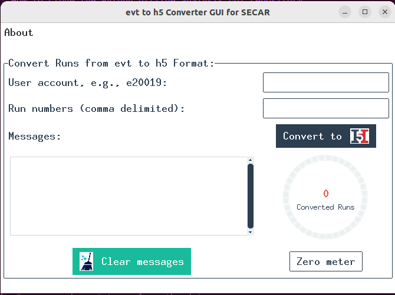
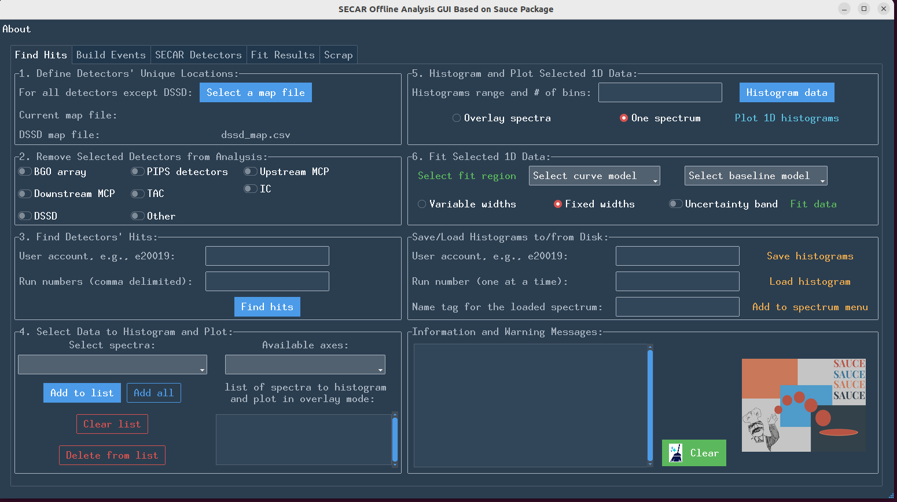

Python Offline Analysis GUI
===========================

This chapter presents the Python offline analysis GUI, which uses :code:`sauce` and :code:`h5_converter` packages. 

Introduction
------------

In 2022, Caleb Marshall developed :code:`sauce` and :code:`h5_converter` packages, which are both written in Python. The sauce logo is also developed by Caleb. The :code:`h5_converter` package converts the :code:`.evt` files produced by :code:`Readoutshell` (NSCL DAQ) into :code:`.h5` files, which are then used by the :code:`sauce` package to analyze the data. The latter package is extensive and contains everything one needs in order to analyze the data. It even enables the user to analyze the data regarding QDC and waveforms (traces).

In March of 2023, I developed a Tkinter GUI to enable the users to use :code:`sauce`. The GUI does not offer all that :code:`sauce` offers, for example, it does not have traces analysis, but this is because I did not have enough time to finish it. So, at the moment it only offers the basics to enable the users to do the preliminary analysis during the experiments and make sure the data are OK. I may decide to use my personal time and develop the GUI into a more advanced one, which would offer all that is offered by the :code:`sauce` package. 

.. note::

   Using the Python offline analysis GUIs requires the user to be logged into fishtank.

How to Install h5_converter Package
-----------------------------------

Log into fishtank using an experimental user account. Clone the repository to the experimental account:

.. code-block::
   :caption: How to clone h5_converter repository
        
        git clone https://git.frib.msu.edu/secar/h5_converter.git

After cloning is done, install the package on the same user account (on fishtank) by running:

.. code-block::
   :caption: How to install h5_converter package
        
        python3 setup.py install --user

This should install all the necessary packages.

How to Install sauce Package
----------------------------

Log into fishtank using an experimental user account. Clone the repository to the experimental account:

.. code-block::
   :caption: How to clone sauce repository
        
        git clone https://git.frib.msu.edu/secar/sauce.git

After cloning is done, install the package on the same user account (on fishtank) by running:

.. code-block::
   :caption: How to install sauce package
        
        python3 setup.py install --user

This should install all the necessary packages.

How to Install the Python Analysis GUI
--------------------------------------

Log into fishtank using an experimental user account. Clone the repository to the experimental account:

.. code-block::
   :caption: How to clone the Python offline analysis GUI repository
        
        git clone https://git.frib.msu.edu/secar/sauce_gui.git

After cloning is done, install the required side packages on the same user account (on fishtank) by running:

.. code-block::
   :caption: How to install the Python offline analysis GUI package
        
        pip install --upgrade pip
        pip3 install -r requirements.txt --user

This should install all the necessary packages.

How to Run the Python Analysis GUI
----------------------------------

There are two GUIs: 

- :code:`h5_gui.py`: converts the :code:`.evt` runs to :code:`.h5` files using the :code:`h5_converter` package.
- :code:`sauce_gui.py`: uses the :code:`.h5` file created by :code:`h5_gui.py` together with the :code:`sauce` package and enables the users to analyze the data. 
  
To run these GUI, do the following:

.. code-block::
   :caption: How to run the Python offline analysis GUIs 
        
        cd the-directory-in-which-the-gui-was-cloned/
        python3 h5_gui.py # to convert .evt runs to .h5 files
        python3 sauce_gui.py # to analyze the data

.. warning::

   Both GUIs interacts with the terminal (console), so please do not close the terminal from which you run the GUIs. Also, the progress of some of the calculations can be seen through the terminal, from which the GUI is running.

How to Use the h5_gui.py
------------------------

- Log into fishtank using an experimental user account (such as :code:`e20008`).
- Change to the directory where you have cloned the GUI.
- Run the :code:`h5_gui.py`. When it opens, you will see :numref:`h5_gui`. 

.. _h5_gui:

   The :code:`h5_gui` converts :code:`.evt` runs to :code:`.h5` files.

- Enter the desired experimental account and run number(s) into the :code:`h5_gui`, and click on the :code:`Convert to H5` button. The GUI becomes frozen but you can see the progress of run conversion in the terminal associated with the GUI. Once the run conversion is done, the GUI becomes responsive again and a message will appear in the message box telling you which runs are converted to :code:`h5` format and where the new files are saved. These messages can be cleared by clicking on the :code:`Clear messages` button. The meter on the GUI indicates how many runs have been converted to :code:`h5` format, and can be zeroed at any time by clicking on the :code:`Zero meter` button. If you hover the mouse on the meter, you will see a tip message about the meter.

.. note::

   You can convert multiple runs at the same time and these runs will be converted to :code:`h5` format using parallel processing. Just enter more that one run number (separated by a comma) into the designated entry of the :code:`h5_gui`.

How to Use the sauce_gui.py
---------------------------

To use this GUI, you first need to ensure the runs of interest are converted to the :code:`h5` format using the :code:`h5_gui`. 

.. tip::

   On various entries, buttons, etc. in the :code:`sauce gui`, you can see tip messages by hovering the mouse on those features. Use the tip messages to be able to correctly use the GUI.

- Log into fishtank using an experimental user account (such as :code:`e20008`).
- Change to the directory where you have cloned the GUI.
- Run the :code:`sauce_gui.py`. When it opens, you will see :numref:`sauce_gui`. 

.. _sauce_gui:

   The :code:`sauce_gui` enables the users to analyze the data using the :code:`sauce` package.

Find Hits Tab
~~~~~~~~~~~~~

- Use the first tab (:code:`Find Hits tab`) and click on :code:`Select a map file` button and select :code:`MapFile.txt`. This is a file, which has all the slots and channels information of the digitizer cards for both the focal plane 4 crate (:code:`spdaq57`), except the DSSD information, as well as the JENSA crate (:code:`spdaq58`). The :code:`dssd_map.csv` contains similar information for all the 64 channels of the DSSD detector. These "map" files are necessary for the :code:`sauce` package to be able to find detector hits and build detector events. 

.. note::

   #. Before using :code:`sauce_gui.py`, make sure :code:`MapFile.txt` and :code:`dssd_map.scv` files are updated and have the correct crate, slot, and channel numbers associated with each detector. Otherwise, you will not be able to use :code:`sauce` proporly.
   #. Crate 0 is the JENSA crate (:code:`spdaq58`). Please do not change crate 0 to another number. This is the crate ID dictated by the :code:`Readoutshell`.
   #. Crate 1 is the focal plane 4 crate (:code:`spdaq57`). Please do not change this crate's number to another number because crates 0 and 1 are IDs dictated by the NSCL DAQ.
   #. Slot #5 in the focal plane 4 Pixie-16 crate is broken. But the only place where you should avoid using 5 as the slot number is in :code:`spdaq57:~/readout/crate_2/cfgPixie16.txt` file. Once this is set, the NSCL DAQ automatically creates slots 2, 3, 4, 5 and 6 (per the actual slots 2, 3, 4, 6, and 7) for the 5 digitizers of focal plane 4 crate. Therefore, the DSSD slots in the abovementioned DSSD map file will be 3, 4, 5 and 6.

- If the run that is being analyzed does not use some of the detectors, one does not need to delete them or comment them out from the map files. Instead, one can use the checkbuttons found under "Remove Selected Detectors from the Analysis" section and remove those detectors from the analysis.
- Enter the desired experimental directory and the run number into "Find Detector's Hits" section and click on the :code:`Find hits` button. It may take a few minutes to find all the hits depending on the size of the run. If the DSSD is included in the analysis, you can take a look at the terminal, which started the GUI to see the progress. If DSSD is not included, you will not get any messages printed on the terminal. Once this action is done, messages will be printed out in the designated message box found under this tab. These messages can be cleared our using the :code:`Clear` button. 

.. note::

   - Hits are anything that has triggered a detector causing the ADC to save the data. Finding hits is similar to obtaining the singles spectrum of a detector. Finding hits is not going to give you only the data you are interested in. You may need to apply threshold afterwards. You will definitely not see only coincidence events by finding hits alone. Events are those hits that have been registered in coincidence by more than 1 detector within a small window of time from one another. These have to be built by :code:`sauce` looking at the timestamps of all hits from a series of user defined detectors.
   - **At the moment, the GUI cannot properly analyze data for more than 1 run at the time.** I would need to work on this and allow you to "add" data from multiple runs. Right now, even though the run entries seem to indicate that you can enter multiple comma delimited runs, you unfortunately can only look at the data from a single run each time you use the GUI. **So just enter one run, or I cannot guarantee what comes next.**

- Once hits are found, you can select spectra from the combobox in section 4 of this tab. These are essentally hits (singles spectra) of all detectors that were included in the analysis for that particular run that you have chosen. **You need to click on the "Select spectra" combobox at least once to activate the "Available axes" combobox. Without this action, all other steps will fail.** The "Available axes" combobox shows you what type of data is availble for you to plot. Initially, you may only see :code:`energy` (which is in channels - not in keV) for all detectors, in addition to :code:`strip` (strip number) for all DSSD channels. The :code:`dssd_front` spectrum contains all the hits from all the DSSD front strips, while the :code:`dssd_back` contains all the hits from all of the DSSD back strips. Therefore, not all these hits are of interest as they will have multiplicity more than 1. To be able to discard the junk and only look at the data of interest, one needs to build coincident events using the :code:`dssd_front` or the :code:`dssd_back` spectrum, which is explained later on.

.. _histogram:

How to Histogram Data
^^^^^^^^^^^^^^^^^^^^^
  
To plot the spectra shown in "Select spectra" combobox, you need to first histogram the data. To do this:

- Click on the "Select spectra" combobox and select the desired spectrum. Using the :code:`Add to list` button, add the desired spectrum into "List of spectra to histogram and plot in overlay mode" listbox. If you make a mistake, you can select the wrong spectrum from the listbox (by clicking on it) and use the :code:`Delete from list` button to delete it. You can do this for multiple entries in the listbox at once. :code:`Clear list` will delete all entries from the listbox, while :code:`Add all` will add all of the spectra shown in "Select spectra" combobox to the listbox.
- Make sure the "Available axes" combobox is activated before doing the next step.
- In "Histogram range and # of bins" entry, enter 3 comma dilimited integers corresponding to the minimum and maximum range of interest and the number of bins to histogram the data.
- Click on the "Histogram data" button. Soon after, you will see a message in the designated message box of this tab, indicating the data are histogrammed. If there are errors, you have most likely forgotten to add the desired spectrum/spectra into the listbox, or you have not selected any spectrum, and therefore the "Available axes" combobox is still inactive and the GUI does not know what type of data (channel, time, strip, etc.) to histogram.

How to Plot Data
^^^^^^^^^^^^^^^^

To plot the data, you first need to histogram the data (see :numref:`histogram`). Once that is done, you can either overlay multiple spectra or plot a single spectrum. By selecting the correct radiobutton, choose what you desire: overlay spectra, or one spectrum.

- If "Overlay spectra" is chosen, you should have more than one spectrum eneterd into the listbox (see section 4 of this tab in the GUI). If this is the case, clicking on the :code:`Plot 1D histograms` button will display the overlaid spectra. If "One spectrum" is selected, clicking on the :code:`Plot 1D histograms` button will display only the spectrum that is currently selected in the "Select spectra" combobox located in section 4 of this tab. Note that to overlay multi spectra, they should all have the same available axes. If one of them is missing that axis, obviously the plotting fails because the histograms will have different ranges depending on the axes.
- You can use the buttons available from the usual :code:`matplotlib` toolbar found at the bottom of the plot to zoom in/out on the plot, save the plot, etc.

How to Fit Data
^^^^^^^^^^^^^^^

To fit the peaks, do the following:

- By clicking on the :code:`Select fit region` button, a plot opens, which is associated with the currently selected spectrum from the "Select spectra" combobox of section 4 of this tab. This is only true if those data are already histogrammed. If this is not the case, first histogram the data of interest and then click on the :code:`Select fit region` button. Once this button is clicked and a plot opens, click on the minimum point of interest (in channels, ns, mm, keV or whatever the x-axis may be), then maximum point of interest on the x-axis and then on the centroids of all peaks within this range of interest that you would like to fit. You will see an orange x associated with any point you have clicked. Once you are done, close the plot. If you make a mistake, close the plot and click on the button again to reopen it. Once this action is done properly, you will see a message that pops up in the designated message box of this tab.
- Next, choose the desired curve and background functions for fitting using the associated comboboxes in section 6 of this tab. 
- If you have chosen multiple peaks to fit, you can choose to keep the widths fixed, or variable using the radiobuttons provided in section 6 of this tab.
- Keep "Uncertainty band" checkbutton OFF initially. This features only works if your fitting model describes the data very well (for example for a Gaussian fitting) and will display the :math:`3{\sigma}` uncertainty band of the fit. If the fitting model does not describe the data well, turning this feature ON will cause the fitting routine to fail, so keep it OFF initially and then play with it later after the fitting is executed successfully.
- Click on the :code:`Fit data` button. If the fit is successfully done, a message will be printed in the designated message box of this tab. If the fit fails, you will get the error printed in the message box.   
- To get the fitting results, go to the 4th tab (:code:`Fit Results`) and do the following:

  - Click on the :code:`Do not clear table` button.
    - Click on the :code:`Fit report` button. It may take some time for the fit results to appear in a tabular format. A table shows up and displays the fit results. Right clicking on this table presents various options. You can also grab each column and expand them if you desire. Errors and messages will be printed on the designated message box of the :code:`Fit Results` tab. If you perform the fit more than once, make sure you click on the :code:`Clear table` button before displaying the fit results; otherwise, all previous fit results will also be redisplayed.

.. note::    
   
   - I must warn you that the lognormal and exponential Gaussian functions are the hardest to deal with and these functions usually fail to fit the data. Also, choosing no background for  multipeak fitting fails most of the time.
   - On the "Available axes" combobox, energy actually means channel! That is the x-axis is in units of channel. This is because the :code:`sauce` package mostly deals with raw (uncalibrated) data and Caleb has chosen energy for channels. So, I kept it that way. If a spectrum is calibrated, the "Available axes" combobox will present :code:`kev` as an option. Only then, the x-axis is in units of keV.

How to Save/Load Histograms
^^^^^^^^^^^^^^^^^^^^^^^^^^^

You can save the histograms to disk and load previously saved histograms from disk using the section "Save/Load Histograms to/from Disk" of this tab. To do this:

- Enter the desired experimental user account and run number into the associated entries. If you want to save histograms, you need to ensure the spectra you would like to save are added to the listbox of section 4 of this tab and are histogrammed following the instructions presented above. Then, click on the :code:`Save histograms` button. You will see messages in the designated message box of this section, which inform you where the data are saved: data are saved based on the experiment number and run number. 
- If you want to load the previously saved histograms, enter the desired experimental account and run number and click on the :code:`Load histogram` button. On the pop up window, select the desired data and load. Then, a plot shows up and displays the histogram you loaded.
- If you like to add these loaded data into the "Select spectra" combobox of section 4 of this tab for further analysis such as fitting, enter a name tag for the loaded spectrum followed by a dash followed by the x-axis type of the data (all in one word with no spaces). For example: :code:`run1028_dssd_front-energy`. This is used if the loaded histogram was for a previously saved :code:`dssd_front` spectrum with an x-axis in units of channels. Use one dash only so that the GUI can distinguish the x-axis type from the name tag. Then click on the :code:`Add to spectrum menu` button. At this point, you should see your input in the "Select spectra" and "Available axes" comboboxes of section 4 of this tab. A message is also printed in the designated message box of this tab.
 
Build Events Tab
~~~~~~~~~~~~~~~~

This tab allows you to build coincident events and analyze those data. To use this tab, you need to first select a map file and find hits for the desired run: you need to first build the singles spectra before building coincident events. **You do not need to histogram the spectra to be able to use this tab.**

To use this tab:

- Start with section 7: "Select Detectors to Build Coincidet Events". First, choose all detectors that are going to be in coincidence with a reference detector starting the coincidence clock. These detectors can be chosen from the combobox in section 7. You need to add them one by one into the listbox of section 7 using the available buttons to add/delete detectors into/from the listbox. Once these are done, select from the combobox, the reference detector that starts the coincidence clock. For example, if I am interested to build coincident events between the front strips of DSSD, and upstream and downstream MCP timing signals and I want to keep the upstream MCP timing signal as the reference clock signal, then I would need to add :code:`dssd_front` and :code:`dmcp_t` into the listbox of section 7, and choose :code:`umcp_t` in the combobox of section 7. 
- Choose whether or not you would like to apply threshold to a detector by selecting the appropriate radiobutton on section 8. Applying threshold will discard the data below the threshold that you set (which should be given in channel number). This is used for noisy spectra and allow you to cut the noisy part of the data out. I recommend to apply thresholds to MCP data. If you choose to apply threshold, you need to enter thresholds (integers in units of channel number) for **ALL** detectors with which you are building coincident events. For example, in the example mentioned above, I will have to enter 95, 0, 98. This means I have applied threshold of 95 to :code:`umcp_t`, not applied any threshold to :code:`dssd_front` and have applied threshold of 98 to :code:`dmcp_t`. The first number always refers to the reference detector and what follows apply to the rest of the detectors in the listbox from top to bottom. **Please make sure the number of entries as thresholds are the same as the number of all detectors for which you are building a coincidence, including the reference detector.** If you do not want to apply threshold to a particular detector, just enter 0 as its threshold. 
- Input time interval (in ns) to build events and click on the :code:`Build coincident events` button. The time interval could be something like -1000, 1000: the time interval to build coincident events is a range between :math:`1{\mu}s` before the clock's start and :math:`1{\mu}s` after the clock's start. Once you click on the :code:`Build coincident events` button, the :code:`sauce` package builds these events and once it is done, messages are printed into the designated message box of this tab. :code:`Livetime` should be a number near 1 and indicates the number of hits that were dropped from the reference detector because there are overlapping intervals. If it is bigger than :math:`3\%`, it means that you are missing :math:`3\%` of hits in the reference detector. To increase the :code:`Livetime`, you would need to decrease the build window so that it is a shorter time window and/or apply thresholds and cuts. Once the action is done, you will also see:
    
    - New detector objects appear under the "Select spectra" combobox on section 4 under :code:`Find Hits` tab. The name is reference_detector:other_detector (if other detector contains more than one detector, then there are more colons and more detectors in the name). If a :code:`_nt` is added to the end of the name, this indicates that there was no threshold applied to any of the detectors when coincident events were built. 
    - Select this detector object and take a look at the new axes that are available to you, using the "Available axes" combobox, to histogram, plot, fit and save these new data. Note that those axes that contain :code:`dt_` show you the time difference between the reference detector and another detector, which is in coincidence with the reference detector. By fitting these spectra, you can examine the timing resolution between different detector systems.
    - Same new detector objects appear in the "Select a coincidence dataframe" combobox in section 10 of this tab. Select the desired detector object from this combobox and take a look at the available axes. Using these x- and y-axes, one can plot 2D data and apply gates to produce gated spectra.

1D Plotting and Applying 1D Cuts
^^^^^^^^^^^^^^^^^^^^^^^^^^^^^^^^
 
To quickly display the 1D plots of the newly constructed coincidence data, do the following:

- In section 11 of this tab, enter 3 comma delimited integers indicating range of interest as well as number of bins.
- Pick the desired coincidence dataframe from section 10. Also pick the desired x-axis from section 10.
- Click on the :code:`Plot 1D histogram` to see the results.
- If you are interested to make a 1D cut, input two comma delimited integers corresponding to the desired lower and upper limits of the spectrum and then click on the :code:`Apply 1D cut` button. A plot will be displayed which shows you only the range in between the two numbers that you have entered as the "Desired range for the 1D cut". Everything below the minimum and above the maximum range you entered is cut out. The new spectrum is added to the comboboxes of section 4 of the :code:`Fint Hits` tab, and section 10 of this tab. The name of this spectrum has a :code:`_c` at the end indicating that it is a 1D cut on an original data. I have not added these 1D cuts into the combobox in section 7 of this tab, because you can sort of mimic the same action by applying the threshold, which will cut the data only below the threshold.

Displaying 2D Plots
^^^^^^^^^^^^^^^^^^^

To display 2D plots:

- In section 12 of this tab, enter 6 comma delimited integers indicating range of interest for x-axis (2 numbers), range of interest for y-axis (2 numbers), as well as 2 numbers indicating number of bins for x-axis and number of bins for y-axis.
- Pick the desired coincidence dataframe from section 10. Also pick the desired x-axis and y-axis from section 10.
- Click on the :code:`Plot 2D histogram` button and a 2D plot with the desired data will be displayed.

Applying 2D Gates and Creating Gated Spectra
^^^^^^^^^^^^^^^^^^^^^^^^^^^^^^^^^^^^^^^^^^^^
    
To apply 2D gates and creat gated spectra:

- In section 12 of this tab, enter 6 comma delimited integers indicating range of interest for x-axis (2 numbers), range of interest for y-axis (2 numbers), as well as 2 numbers indicating number of bins for x-axis and number of bins for y-axis.
- Pick the desired coincidence dataframe from section 10. Also pick the desired x-axis and y-axis from section 10.
- Enter a name for the 2D gate that will be created.
- Click on the :code:`Apply 2D gate` button and a 2D plot with the desired data will be displayed. 
- On the plot which is displayed, left click on the areas of interest around the region you would like to draw the gate on. If you make a mistake, right click and the last point will be deleted. Everytime, you right click, the last selected point will be deleted. Once you are done, press Enter (carriage return) button to close the polygon gate. Close the window. A new window will pop up and show you the data that has gone through the gate you just created. On the terminal, you can see the coordinates of the gate you created. 
- The gated coincidence object will appear in the comboboxes of section 4 of :code:`Find Hits` tab and section 10 of this tab. A :code:`_g:gatename` is added to the original coincidence object on which a 2D gate was created. 
- In section 12, the "Select a 2D gate" will show you the gate you created. This 2D gate can be saved and loaded in the future. To do so:

    - Enter the desired experimental account and run number. Select the desired 2D gate from the "Select a 2D gate" combobox and click on the :code:`Save 2D gate` button. The gate will be saved as a :code:`.json` file and a message will be printed in the designated message box of this tab telling you where these data are saved.
    - To load a previously saved 2D gate, enter its existing name tag from the desired, already saved 2D gate (the path where 2D gates are saved is: :code:`/mnt/analysis/user_account/2d_gate_files/runxxx/`, where run number is added to the end of the path: find which one you like to load and enter its name into the associated entry) in the "Desired name for the 2D gate" entry. Enter the desired experimental account and run number and click on the :code:`Load 2D gate` button. The newly loaded gate will be added to the "Select a 2D gate" combobox.
- To apply an alread existing gate onto a 2D plot:
 
    - Pick the desired coincidence dataframe from section 10. Also pick the desired x-axis and y-axis from section 10.
    - In section 12 of this tab, enter 6 comma delimited integers indicating range of interest for x-axis (2 numbers), range of interest for y-axis (2 numbers), as well as 2 numbers indicating number of bins for x-axis and number of bins for y-axis.
    - Pick the desired gate that you want to apply from "Select a 2D gate" combobox.
    - Turn ON the :code:`Apply an existing gate` checkbox.
    - Click on the :code:`Apply 2D gate` button. A plot shows up and show you the newly gated spectrum. This spectrum will also be added to the comboboxes of section 4 of the :code:`Find Hits` tab and that of section 10 of this tab.

SECAR Detectors Tab
~~~~~~~~~~~~~~~~~~~

This tab provides a few functionalities for the BGO array, DSSD detector, and MCP detectors.

BGO Array Analysis
^^^^^^^^^^^^^^^^^^

- The spectra of the entire 26 BGO detectors constructing the BGO array can be displayed all at once. To do this:

    - Select the correct map file (using the first tab of the GUI)
    - Enter the desired experimental user account and run number in the first tab (:code:`Find Hits`). Make sure the BGO detectors are not removed from the analysis.
    - Find hits for this run.
    - Once the singles spectra of all detectors are found, add all 26 BGO detectors into the listbox of the first tab. You can simply remove all detectors except the BGO array from the analysis prior to finding hits, find the hits, and then use the :code:`Add all` button to add all BGO detectors into the listbox. 
    - Make sure the "Available axes" combobox is activated and shows :code:`energy` axis.
    - Histogram the data for all BGO detectors.
    - Click on the :code:`Display BGO spectra` button. A plot shows up displaying all BGO spectra.

- These spectra can then be fitted, calibrated, and therefore gain matched. **Currently, I have only set this up such that only one peak can be used to fit, gain match and calibrate each BGO detector**. To do this, follow the steps given below:
    
    - Pick the fitting function from the associated combobox. 
    - Enter the energy (in keV) corresponding to the one peak you are going to use to calibrate the detectors. For example, if you have used a mono-energetic source such as :math:`^{137}Cs`, you can use this peak to calibrate the BGO array's spectra.
    - In the "Range of interest" entry, enter the range of interest and number of bins (3 comma delimited integers in total) associated with fitting the region of interest (for the one peak used to calibrate the spectra).
    - Click on the :code:`Fit BGO array` button. 3 plots will be displayed: the first one shows you the fit for the region of interest in each of the BGO detector; the second plot displays resolution (in %) as a function of BGO detector; and the final plot shows the centroid of the peak of interest as a function of BGO detector.
    - Click on the :code:`Calibrate BGO array` button. This action causes: 
    
        - A new file to be produced, in the same directory where the GUI exists, called :code:`bgos_cal_file.csv`. This file contains keV/channel factor with which each BGO detector is calibrated.
        - In addition, if you now go back to the :code:`Find Hits` tab and select a BGO spectrum from the "Select spectra" combobox in section 4, you will notice that there is a new axis under "Available axes" combobox called :code:`kev`. If you pick this axis and histogram and plot the data, you will see a gain-matched calibrated BGO spectrum with x-axis in unit of keV.

MCP Analysis
^^^^^^^^^^^^

With the features of this section, you can build a unique position for each MCP detector out of the 4 position signals that each MCP detector outputs. With these unique positions, one can build more coincident events among the MCP unique positions and other detectors. To build the MCP unique positions, we would need to first build coincident events between all 4 corner signals of each MCP detector. This is done using a separate class of coincidence analysis that has been developed as part of the :code:`sauce` package and can provide us with the ability to choose multiplicity of 4 to ensure we pick only those events that have been registered by all 4 corners of an MCP. To do this analysis: 

- Enter 500 ns as the time to build MCP events (unique positions). You can pick a different time such as :math:`1{\mu}s` but I recommend 500 ns.
- Enter 4 numbers in unit of channel number to be used as thresholds for each individual MCP corner signal.
- Enter two numbers (if you desire) to be used to rotate x- and y-axes (:math:`{\theta}` and :math:`{\phi}`). This entry can be left blank. It is used to enable the user to rotate the spectra of MCP detectors in case there is angle misalignment of these detectors.
- Click on the :code:`MCPs positions` button.
- shortly after the abovementioned button is clicked, some messages will appear in the designated message box of this tab indicating thresholds are applied, and a ratio of good/total coincidences for each MCP detector. The latter refers to coincident events with multiplicity of 4 (those events registered by all 4 corners of an MCP) as "good", while "total" coincident events contain coincident events with multiplicity of 2, 3, and 4 (two, three and all 4 corners). In addition, two new detector objects called :code:`umpc_pos` and :code:`dmcp_pos` (the unique position for the upstream MCP and that of the downstream MCP, respectively) are added to the comboboxes of section 4 of the :code:`Find Hits` and section 7 of the :code:`Build Events` tabs. These have new raw and rotated (only if the user inpus MCP rotations prior to building MCPs positions) position axes (in mm) available to be histogrammed and plotted. Therefore, these new detector objects can be used to analyze the data further and build even more coincident events with other detectors.

DSSD Calibration and Gain Matching using an Alpha Source
^^^^^^^^^^^^^^^^^^^^^^^^^^^^^^^^^^^^^^^^^^^^^^^^^^^^^^^^

Using the permanent :math:`{\alpha}` source holder that I have asked Peadar Richards to build for SECAR, one can calibrate and gain match the DSSD detector. This section of the GUI helps the user achieve that. To do this:

- Enter the calibration energy (in keV) of the source. For example, if you are using an :math:`^{241}Am` source, enter 5486 keV.
- In the "Range of interest" entry, enter 3 comma delimited integers indicating the range of interest (2 numbers) and the number of bins. This is the range of interest and number of bins for fiting the source spectrum.
- Enter the desired experimental user account. This is so that the SpecTcl defintion file in use for the experimental user account can be corrected with the information required to calibrate and gain match the DSSD spectra displayed by SpecTcl.
- Enter the name of the SpecTcl definition file in use. This file is then used by the GUI to generate a new file including the required slopes and offsets to calibrate each strip of the DSSD detector. If you desire, the GUI can replace this file with the file produced by this part of the GUI.
- Select the desired fit function from the associated combobox.
- Click on the :code:`Fit front DSSD` button. This will generate 3 plots: the first one displays the fit to the source spectra for all the DSSD front strips, the second plots displays resolution (in %) for each DSSD front strips, and the final plot shows the centroid of the source peak for all DSSD front strips.
- Click on the :code:`Fit back DSSD` button. This will also generate 3 plots: the first one displays the fit to the source spectra for all the DSSD back strips, the second plots displays resolution (in %) for each DSSD back strips, and the final plot shows the centroid of the source peak for all DSSD back strips.
- Click on the :code:`Calibrate DSSD` button. At this point: 
    
    - A new file will be produced, in the same directory where the GUI exists, called :code:`dssd_cal_file.csv`. This file contains keV/channel factors with which each front and back strip of the DSSD is calibrated.
    - Another new file will be produced, in the same directory where the GUI exists, called :code:`defs.tcl`. This is the same as the currently used SpecTcl definiton file whose name you inputed into the GUI but it has the correct calibration and gain matching information for all strips of the DSSD. If you would like the GUI to overwrite the currently used SpecTcl definition file with this newly produced file, click on the :code:`Overwrite SpecTcl definition file?` button.
    - In addition, if you now go back to the :code:`Find Hits` tab and select a DSSD related spectrum from the "Select spectra" combobox in section 4, you will notice that there is a new axis under "Available axes" combobox called :code:`kev`. If you pick this axis and histogram and plot the data, you will see a gain-matched calibrated DSSD spectrum with x-axis in unit of keV.

.. note::

   Developing this GUI became an enjoyable hobby for me. So most likely, I will continue working on it even after I leave FRIB to add more of the features provided by the :code:`sauce` package to the SECAR users.
