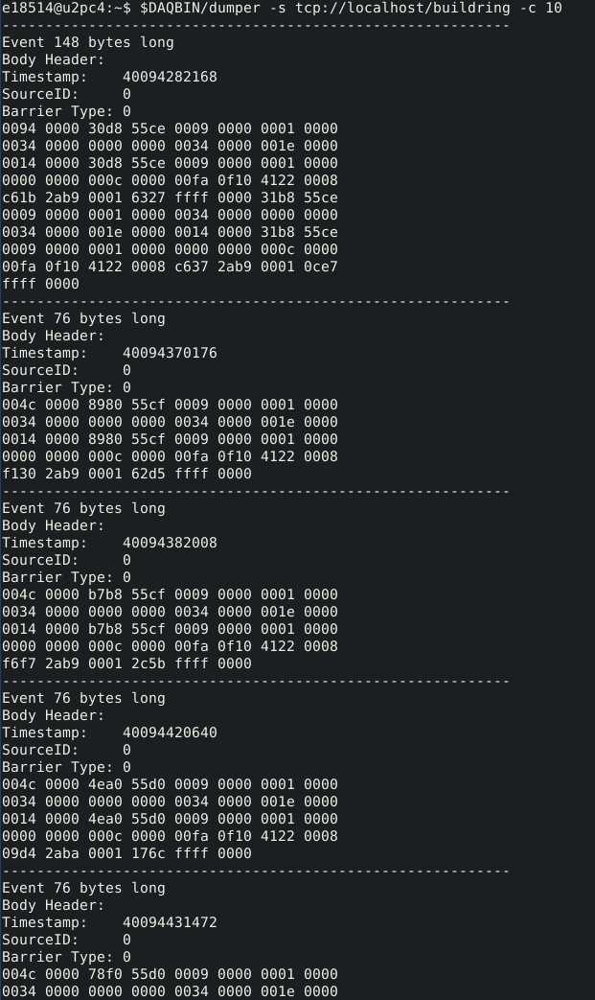

 
Data Acquisition
================

Instructions for Users
----------------------

General Layout
~~~~~~~~~~~~~~

SECAR has two data acquisition systems that are connected with each other to create a common data stream, one for the focal plane and one for the target. Each system consists of an spdaq machine (:code:`spdaq57`for the focal plane and `spdaq58` for the target), which is located in the vault and directly connected to Pixie-16 crates. The creates include digiztizer cards with typically 16 channels each where detector and other signals are plugged into. A channel map file :code:`/daq/daq_map_file.csv` lists crates, modules, channels, and what is connected to them. 

.. warning::

  Do not run anything unnecessary on the spdaq machines. Unless indicated otherwise, everything discussed in this section should be run on any data U machine connected to the DAQ network. 

After logging in on the experiment account on a DAQ neytwork machine (see label on monitor) and opening a terminal you can start the readout code, which can be used to start data taking and writing data to disk, the scale code which starts the scalers for each channel that are also added to the data stream, and SpecTcl, which is used for online monitoring of either incoming data, or data that have already been written to disk and allows you to look at various spectra. 

If you need to setup data acqusition parameters or trouble shoot the data acquisition you can use nscope. This needs to be run on the respective spdaq machine. 

Start Readout
~~~~~~~~~~~~~

#. Logon to the experiment account on a computer connected to the DAQ network (label on monitor says DAQ)
#. Open a terminal
#. Enter :code:`goReadout.sh`
#. Click on :code:`Start` button to initialize. Two tabs appear for the two spdaq machines - wait until you see "Scalers know crate ID=0" messages - 2 for spdaq 58 and 5 for spdaq 57
#. You can now start a run by entering a title and clicking on :code:`Begin`. You should start the scalers first - see next section. You need to select :code:`Record` to write data to disk. 

Start Scalers
~~~~~~~~~~~~~
#. Open a terminal
#. Enter :code:`goscalers.sh`
#. Note for experiments with SiLi detector: it is plugged into Si1 (the first of the two scattering monitor silicon channels

Start SpecTcl
~~~~~~~~~~~~~
#. Open a terminal
#. Enter :code:`goSpecTcl.sh`
#. Load the standard Definitions file basics_definitions.tcl
#. Load the desired windows configuration
#. Note for experiments with SiLi detector: parameter is SiAScat0 and spectrum SiLi.energy

Start nscope
~~~~~~~~~~~~
#. Open a terminal
#. ssh to the respective spdaq machine: :code:`ssh -Y spdaq57' for focal plane system, and :code:`ssh -Y spdaq58' for target system.
#. start nscope by entering :code:`sgonscope_FP.sh` or :code:`sgonscope_TAR.sh` for focal plane or target system, respectively
#. click on :code:`Boot`

.. warning::

  The following are notes for experts that are not up to date

Digitizers
----------

SECAR has two Pixie-16 electronics crates:

- :code:`spdaq57` is the Pixie-16 crate for focal plane 4 of SECAR, where the end detectors are connected to.
- :code:`spdaq58` is the Pixie-16 crate located near the target area of SECAR, where the JENSA detectors are connected to. 

The JENSA crate (:code:`spdaq58`) has two digitizer cards with 16 channels each. 26 BGO detectors, two PIPS detectors, a pulser, EBIT and an RF signal are connected to these cards. Focal plane crate (:code:`spdaq57`) has 5 digitizer cards with 16 channels each. Two MCP detectors (5 signals per each MCP), ionization chamber, DSSD detector, and a pulser are connected to these cards. 

I have set up two map files, one for the JENSA crate and one for the focal plane crate, in which the channels and slots of SECAR degitizers are assigned to all SECAR's detectors' signals. These files are automatically accessed by the DAQ and scalers to keep track of where each signal was acquired from when we save runs. The DAQ saves a master map file in the elog when a run is taken. This way, for each test or experiment, one can keep track of where each detector signal was connected to. 

.. tip::

        **Please make sure you go through the master map file (a csv file) prior to each experiment and ensure the maps of each digitizer channel and slot corresponds to where each signal is connected to on the digitizer cards.** 
        
The map files are part of the DAQ and scalers git repository, as well as the Python offline analysis package that Caleb Marshall and I have developed for SECAR.

.. warning::
   
   Slot #5 in the focal plane 4 Pixie-16 crate is broken. It has some weird issues and causes warning messages about the detectors that are in that slot when NSCL DAQ is running. After taling to Giordiano and Aaron, we could not really find out what exactly is wrong with this slot. So, they recommended that this slot be skipped. This is why no card is attached to this slot. Please avoid using this slot. 

Readout Shell (NSCL DAQ)
------------------------

To be able to successfully run NSCL DAQ (readoutshell), log into your desired active user account from a computer on the DAQ network. Only those active user accounts to which an stagearea is assigned by the business IT department can run the DAQ. If this is not the case, and the user account is too old and/or for some reason the stagearea is not assigned to it anymore, one cannot save new runs and run the DAQ using those accounts.

Assuming you have an active user account with a valid stagearea, open a terminal on a computer connected to the DAQ network. Follow the instructions below to set up the DAQ for the first time:

.. code-block::
   :caption: How to set up Readoutshell (NSCL DAQ) for the first time
        
        cd ~
        # If the DAQ repository does not exist:
                git clone --recursive https://git.frib.msu.edu/secar/daq.git (--recursive is due to the fact that elog repository is also inside the DAQ repository)
        # If the DAQ repository already exists:
                cd ~/daq
                git pull
                # Follow the prompt
        emacs ~/stagearea/.settings.tcl
        # Make sure DAQ version in this file (the number that comes after nscldaq) is the same as the one in ~/daq/goReadout.sh. 
        # If not, change the DAQ versions in ~/stagearea/.settings.tcl file to match those of the ~/daq/goReadout.sh file.
        cd ~/daq
        # Make sure RunMeFirst.sh and RunMeNext.sh have executable permissions (chmod +x RunMeFirst.sh) and (chmod +x RunMeNext.sh)
        ./RunMeFirst.sh
        # Input your desired user account on the prompt
        ./RunMeNext.sh

At this point the DAQ window opens. Click on "Start" and monitor the two windows that show :file:`SSHPipe@spdaq57:1` and :file:`SSHPipespdaq58:0`. They should run free of errors. :file:`SSHPipe@spdaq57:1` should restart 5 digitizers and by the end of this process, you should see 5 lines that read :code:`date/time : output : SSHPipespdaq57:1: Scalers know crate ID = 1`. Similarly, :file:`SSHPipe@spdaq58:0` should restart 2 digitizers and by the end of this process, you should see 2 lines that read :code:`date/time : output : SSHPipespdaq58:0: Scalers know crate ID = 0`. The :file:`main` window should also indicate no errors. If this is the case, then make sure "Record" is selected and if you like to time the run, select "Timed Run" and choose how long you want the run to be. Pick a good title for the run and click on "Begin". Now, the DAQ window turns green and data are being saved into the disk.
        
The DAQ master ring, which builds the main ring from proxy rings (produced by individual spdaq machines: crate_1 and crate_2) should be running from a reliable computer (:code:`secar-daq1` which is the linux computer in ReA3 high bay is not reliable, please do not use that as the localhost). Therefore, if you choose "localhost" as the host to build the master ring, make sure the localhost is a computer that has no issues and remains ON all the time. It is generally recommended that instead of "localhost", one should use one of the DAQ computers in DataU, for example :code:`u2pc4`. If you choose to do this, please remember to change the buildring host machine for SpecTcl when you run the latter. To change the buildring host machine, run the DAQ and go to "Settings" menu tab on top, and then click on "Event Recording..." tab and change "Data Source Ring URI" from :code:`tcp://localhost/buildring` to for example :code:`tcp://u2pc4/buildring`.

If you get any error, please refer to the troubleshooting subsection. In general, most of the times, you unfortunately end up fixing DAQ issues by restarting the crates multiple times. In order to restart the crates, turn JENSA crate OFF first, then turn OFF focal plane 4 crate and restart the JENSA crate first followed by the crate at focal plane 4.

To make sure everything looks good, run the DAQ and then open a terminal and type:

.. code-block::
   :caption: Ensuring Readoutshell (NSCL DAQ) is running fine
        
        cd ~
        startev
        $DAQBIN/dumper -s tcp://localhost/buildring -c 10
        $DAQBIN/ringbuffer status

The output should look like :numref:`dumper` and :numref:`status` screenshots. Once the DAQ is up and running, you can ensure the master ring is alive and well by typing in the terminal:

.. code-block::
   :caption: Ensuring Readoutshell (NSCL DAQ) master ring is running fine
        
        startev
        telnet u2pc4 30000 # (where u2pc4 is the localhost where the master ring is being built from)

If the DAQ is already set up and you just want to run it, do the following:

.. code-block::
   :caption: How to run Readoutshell (NSCL DAQ)
        
        cd ~
        startev
        ./goReadout.sh
        
Once you clone the DAQ repository, you will also have access to nscope and a few other scripts which set up bashrc and the correct Debian environment. Also, the automatic elogs that are generated with each run saved by the DAQ and the files that get attached to the elog entries are already set up once you follow the steps above. You do not need to copy/paste anything or change the paths manually. 

If you would like to change the version of the NSCL DAQ you are running, you need to do the following: clone the DAQ directory (see the beginning of this section). Then, do the following:

.. code-block::
   :caption: How to update Readoutshell (NSCL DAQ) version
        
        startev
        emacs stagearea/.setting.tcl
        # Find and replace all instances of 11.3-029 to the newer version
        # Save the changes
        emacs ~/goReadout.sh
        # Change all instances of 6.1-001 (for ddas) to the desired new version of ddas firmware
        # Change all instances of 11.3-029 to the desired new version of DAQ
        # Save the changes
        cd ~/scalers/fp
        emacs goscaler_fp
        # Change all instances of 11.3-029 to the desired new DAQ version
        # Save changes
        cd ../jensa/
        emacs goscaler_jensa
        # Change all instances of 11.3-029 to the desired new DAQ version
        # Save changes

.. _dumper:

   Once DAQ is running, run the :code:`$DAQBIN/dumper -s tcp://localhost/buildring -c 10` command to ensure that everything is OK. The output of this command should be like the image above.

.. _status:
.. figure:: Figures/status.jpeg
   :scale: 70%

   Once DAQ is running, run the :code:`$DAQBIN/ringbuffer status` command to ensure that everything is OK. The output of this command should be like the image above.
  
Setting Up Required Files for DAQ
~~~~~~~~~~~~~~~~~~~~~~~~~~~~~~~~~

I am assuming you have the required knowledge about the necessary DAQ files such as :code:`cfgPixie16.txt` and :code:`modevtlen.txt`. If you get errors while running the NSCL DAQ, it may be because you have not set these files correctly. The content of the :code:`cfgPixie16.txt` file depends on which crate this file belongs to. For :code:`spdaq57` crate (located at focal plane 4), you will find the correct file under :code:`~/readout/crate_2/` directory and its content looks like:

.. code-block::
   :caption: The content of :code:`spdaq57:~/readout/crate_2/cfgPixie16.txt` file
        
        1  #Crate ID
        5  #number of modules
        2  #slot for mod 0 
        3
        4
        6
        7
        /user/e20008/readout/crate_2/crate_2.set

**Here, slot number 5 is skipped because it is broken. Please keep this file as is.** The last line shows which binary set file should be used by DAQ: :code:`crate_2.set`. This is a file that is saved via :code:`nscope` when energy and timing filters, etc. are being set by the user. If you desire to use another set file for the focal plane 4 crate, you need to ensure its :code:`cfgPixie.16.txt` file is using the correct set file is in the path mentioned above.

Similarly, for :code:`spdaq58` crate (located near the SECAR's target area), you will find the correct file under :code:`~/readout/crate_1/` directory and its content looks like:

.. code-block::
   :caption: The content of :code:`spdaq58:~/readout/crate_1/cfgPixie16.txt` file
        
        0  #Crate ID
        2  #number of modules
        2  #slot for mod 0 
        3
        /user/e20008/readout/crate_1/crate_1.set

Same information given before applies to the above file.

The content of the :code:`spdaq58:~/readout/crate_1/modevtlen.txt` and :code:`spdaq57:~/readout/crate_2/modevtlen.txt` files depends on two factors:

- How many digitizer cards are in each of these crates.
- Whether or not traces and QDCs are turned ON.

We typically use 5 digitizer cards in the :code:`spdaq57` crate (4 for DSSD, 1 for IC, MCPs, etc.); and 2 digitizer cards in the :code:`spdaq58` crate. Therefore, when traces are OFF, you should see:

.. code-block::
   :caption: The content of :code:`spdaq58:~/readout/crate_1/modevtlen.txt` file when traces are OFF
        
        4
        4

.. code-block::
   :caption: The content of :code:`spdaq57:~/readout/crate_2/modevtlen.txt` file when traces are OFF
        
        4
        4
        4
        4
        4

When the traces are turned ON, you need to change the abovementioned :code:`4` values to a different number **only for the digitizer card for which traces are turned ON**. The new value is calculated from this formula: :math:`Trace\,length / 8 + 4`, where trace length is in :math:`{\mu}s` and can be changed using the :code:`Pulse shape` feature provided by :code:`nscope`, and :math:`Trace\,length / 8` should be an integer number. 

.. code-block::
   :caption: The content of :code:`spdaq57:~/readout/crate_2/modevtlen.txt` file when traces are ON for the first digitizer card containing MCPs
        
        129
        4
        4
        4
        4

where :code:`129` is calculated based on a trace length of :math:`1\,{\mu}s`: :math:`1000 / 8 + 4 = 129`. In this example, the traces are only ON for the first digitizer card containing MCPs.

If QDCs are turned ON, you will need to add 8 to the result and **only for those cards for which the QDC features are turned ON**. There are 8 QDCs in total. So, if you decide to turn them ON for the same card that contains the MCPs, instead of 129, you need to enter :math:`129 + 8 = 137`. If traces are turned OFF for this card and only QDCs are turned ON, the correct number that should be entered to the first line of the :code:`spdaq57:~/readout/crate_2/modevtlen.txt` file would be :math:`4 + 8 = 12`.

Troubleshooting DAQ
~~~~~~~~~~~~~~~~~~~

If the DAQ crashes and when you try to run it again, you get an error complaining about ringbuffer (the error indicates that another active ringbuffer already exists), do the following:

.. code-block::
   :caption: Troubleshooting Readoutshell (NSCL DAQ)
        
        cd ~
        startev
        cd /usr/opt/nscldaq/11.3-029/bin
        ./ringbuffer list # (This will list the active ringbuffers)
        ./ringbuffer delete full-name-of-whatever-ring-buffer(s)-you-want-to-delete

I am actually not sure if you should do this from the DAQ computer which is the host matchine building the buildring, or if you need to ssh to the :code:`spdaq57` or :code:`spdaq87` (whichever is complaining about an existing ringbuffer) and then delete that ringbuffer. In any case, try to ssh to the problematic :file:`spdaq` first, and follow the instructions given above to see if you have the permission to get to the :code:`/usr/opt/nscldaq/11.3-029/bin/` directory. If you do, then viola! If not, try this on the DAQ computer building the master ring without sshing to any of the :code:`spdaq` machines.

If these steps failed to solve the problem, try to reboot, the Pixie crates (both JENSA and focal plane 4 crates). You may need to reboot them more than once, and hopefully that will solve the problem.

nscope
------

nscope is a program developed in Root, with which one can communicate with the Pixie digitizers, see live spectra from various detectors, and set up the energy and timing filters, waveforms and traces, and all other required electronics setup for signal processing via the Pixie-16 digitizers.

To run nscope, make sure the DAQ is closed first and that there is no instance of Readout shell open anywhere. Then, from a computer that is connected to the DAQ network, run the following commands:

.. code-block::
   :caption: How to run nscope for JENSA detectors at the target location
        
        ssh -XY spdaq58
        startev
        cd ~/readout/crate_1
        nscope

.. code-block::
   :caption: How to run nscope for focal plane 4 detectors at the end of SECAR
        
        ssh -XY spdaq57
        startev
        cd ~/readout/crate_2
        nscope

Once nscope opens, one can change energy and timing filters, add or remove good channels, turn ON/OFF traces, change decay time, change the polarity of the signal, etc.

Scalers
-------

To set up the scalers for the first time, do the following:

.. code-block::
   :caption: How to set up Scalers for the first time
        
        cd ~
        git clone https://git.frib.msu.edu/secar/scalers.git
        startev
        cd ~/scalers
        python3 generate_scalers.py
        ./goscaler_all

Make sure the scaler code is running before you run Readoutshell (DAQ). If you start the DAQ prior to the scalers, you will not be able to save the scalers for that run.

To run the scalers if they are already set up, do the following:

.. code-block::
   :caption: How to run Scalers
        
        cd ~/scalers
        startev
        ./goscaler_all

If you change the DAQ version, the change has to be reflected on the scaler files as well. This is explained in the DAQ section above.

.. warning::

   Each time the scalers for a DAQ run are saved, the plots of a few selected scalers are also saved as .ps files. These files are saved under the :code:`scalers/` directory inside the home directory of the user account. The plotting files are usually quite large in the amount of disk space and may cause the home directory to be filled quickly. If that happens, the scalers program will quite and will give you an error saying it has run out of space to write files. At that point, you cannot run the scalers code anymore and will lose access to the scalers information for the future DAQ runs. 
   
To fix the abovementioned issue, do the following:

.. code-block::
   :caption: How to stop Scalers to fill the home directory
           
      cd ~/scalers
      emacs generate_scalers.py
      # Comment out lines 67, 79, and 80 (lines starting with plot_scalers ...)
      # Save the changes
      startev
      python3 generate_scalers.py
      ./goscaler_all
        
SpecTcl
-------

I never bothered to update and organize SpecTcl. To run it, do the following from a terminal on a computer connected to the DAQ network:

.. code-block::
   :caption: How to run SpecTcl
        
        startev
        cd ~/SpecTcl
        ./SpecTcl
