Detectors
=========

.. _PIPS_operation:

Passivated Implanted Planar Silicon Detectros (PIPS)
----------------------------------------------------

Two PIPS detectors (see :numref:`PIPS_dets`) are used inside the JENSA jet target, as well as the extended gas target. Inside the JENSA chamber, these detectors can be mounted on detector holders shown in :numref:`PIPS_holders`. With these holders, the PIPS detectors can be placed at:

- Both at :math:`30^{\circ}`.
- Both at :math:`40^{\circ}`.
- One at :math:`30^{\circ}` while the other at :math:`50^{\circ}`.
- One at :math:`40^{\circ}` while the other at :math:`50^{\circ}`.

The PIPS detectors mounted in the JENSA target are not collimated. 

Inside the extended gas target, the two PIPS detectors are mounted in their designated holders (see :numref:`PIPS_extended`) that are part of the target chamber's assembly. In this target configuration, the detectors can only be places at :math:`30^{\circ}` and :math:`45^{\circ}` and are both collimated.

.. _PIPS_dets:
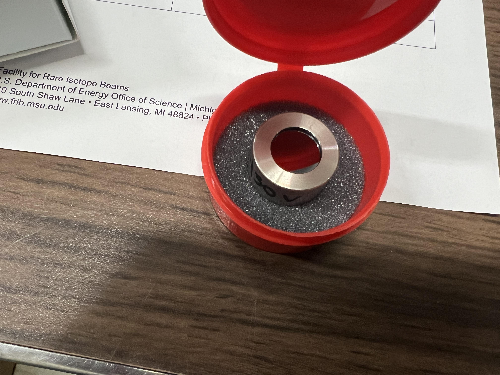

   The PIPS detectors look like this.

.. _PIPS_holders:
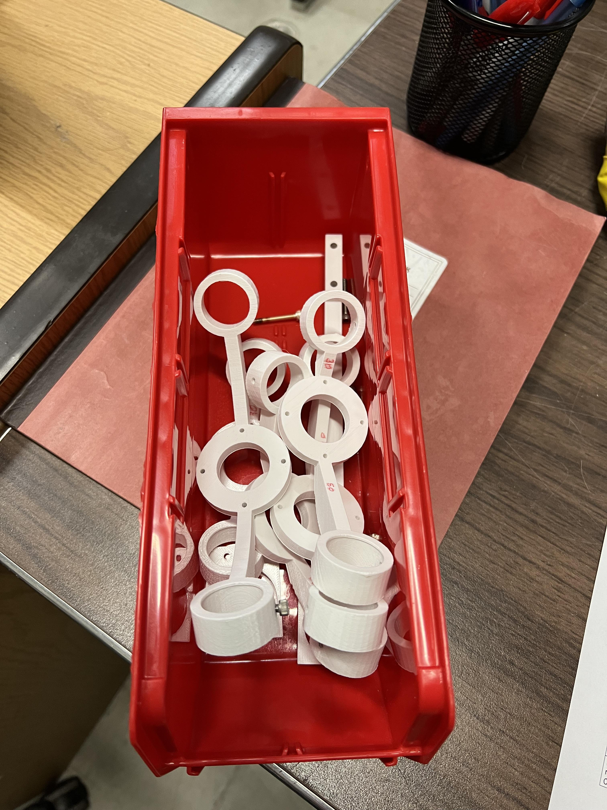

   The holders for the PIPS detectors when used inside the jet target are shown here.

.. _PIPS_extended:
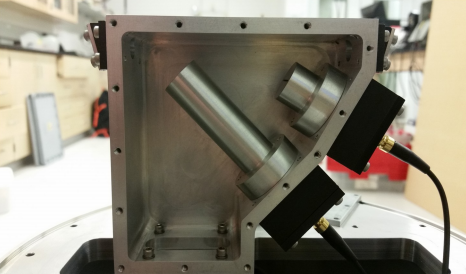

   The holders used for the PIPS detectors mounted inside the extended gas target. The snouts are collimators for the extended gas target's PIPS detectors.

PIPS Bias
~~~~~~~~~

Please use the JENSA CAEN power supply (see :numref:`CAEN_ON`) to bias these detectors.

.. attention::

   The PIPS detectors used with the JENSA target are biased to :math:`+130` V each, while those inside the extended gas target are only biased to :math:`+40` V each.

PIPS Electronics
~~~~~~~~~~~~~~~~

The electronics for the PIPS detectors is quite simple:

- You will need to supply the bias to the preamplifiers. Designated holders for these preamplifiers are fabricated upon my request and are attached to the beamline stand near the gas target (see :numref:`PIPS_preamps`). The SHV cables for the preamplifier biases are already placed into the cable tray above the gas target. These are attached to the preamplifiers bias inputs on one side and to the positive HV card of the JENSA CAEN power supply on the other side.
- The DB-9 power cables for the preamplifiers are already laid into the cable tray above the gas target. One side goes to each preamp and the other side goes into a back of a spectroscopy amplifier module in a NIM crate shown in :numref:`specamp`. The preamplifiers thus get their power from the NIM crate through the shaping amplifiers without actually using these units for signal processing.
- The input signals are carried from the PIPS detectors into the preamplifiers using short BNC cables. **These are Amphenol RF noise reducing cables that I have bought. They are special and stiff and are noticeable. Please do not lose them.**
- The output signals from the preamplifiers are carried into the second digitizer card in the :code:`spdaq58` Pixie-16 crate through long BNC cables, which are also already placed in the cable tray above the gas target. The sides that are coming towards the digitizers are attached to a BNC patch panel, from which they are then connected to the digitizer crate via BNC to SMB cables (see :numref:`digitizer_crate_cables`).

.. attention::

   I spent a lot of time getting rid of 75 and 93 Ohm BNC cables that were being used with the detectors specially at the focal plane 4 of SECAR when 50 Ohm impedence cables should have been used. Please pay attention to what you are doing and ask experts if you are not familiar with signal processing. 

.. _PIPS_preamps:
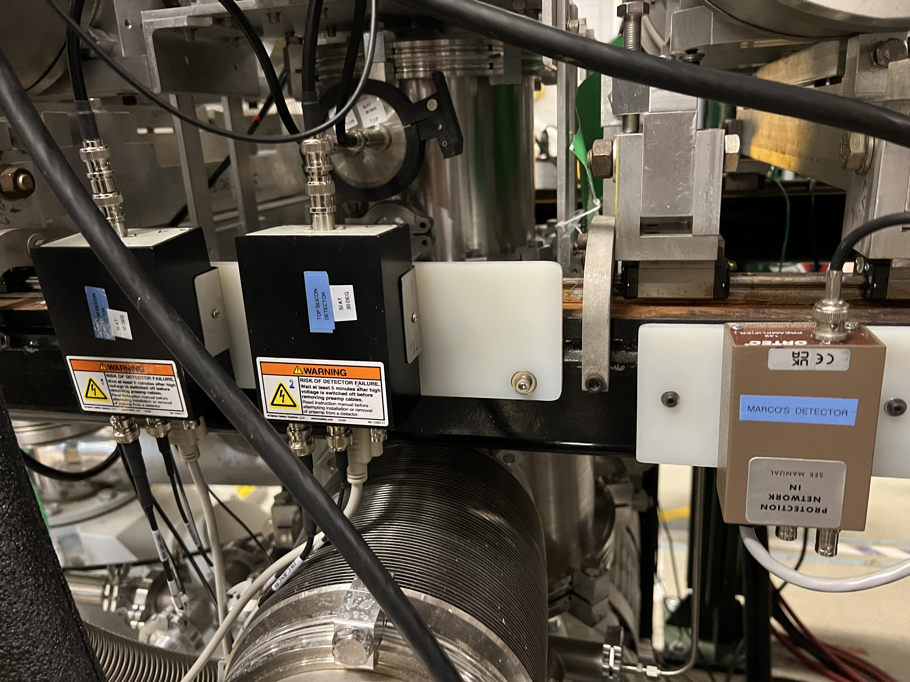

   The preamplifiers for the PIPS detectors are mounted to the beamline stand on the beam right side of the SECAR target. The ORTEC preamplifier is used with a silicon surface barrier detector that I borrowed from Marco Cortesi to measure transmission through the JENSA target.

.. _specamp:
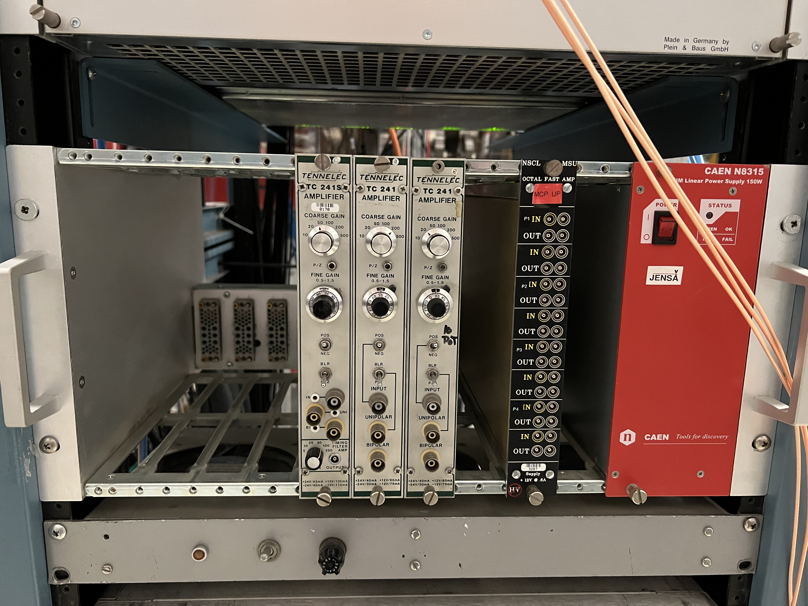

   The preamplifiers for the PIPS detectors get their power from these spectroscopy amplifiers attached to a NIM crate, which are not used for signal processing.

.. _digitizer_crate_cables:
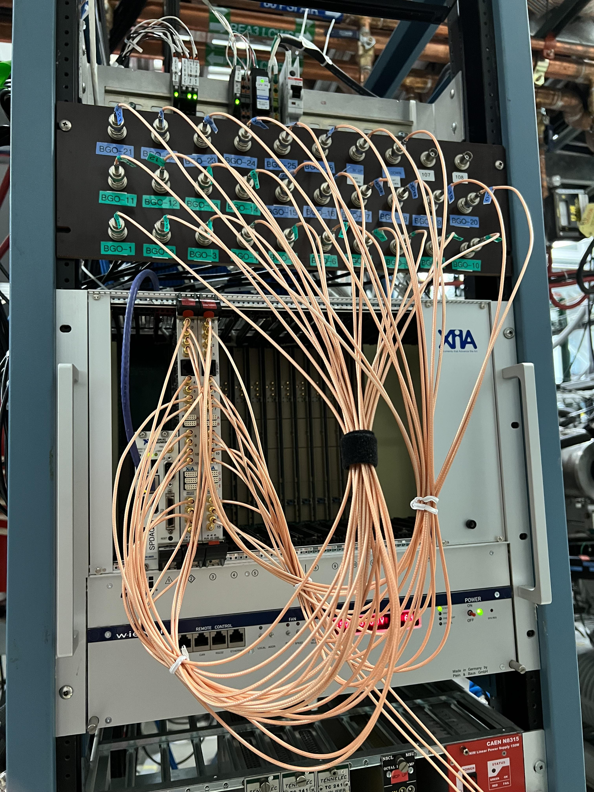

   The output signals of all BGO detectors and those of the PIPS detectors (from their preamplifiers) come into a patch panel and are then attached to the :code:`spdaq58` digitizer crate, which is used for signal processing of the PIPs detectors and the BGO array detectors.

The BGO Array
-------------

The BGO detectors that are used for the jet target have a designated holder that can be mounted only on one side of this target (see :numref:`BGO_jet_holder` and :numref:`BGO_jet`). I was not at MSU when an experiment was performed with the jet target, where BGO detectors were used. I think only 14 detectors were used.

The extended gas target has two nice BGO detector mounts, designed and fabricated by Prof. Uwe Greife from Colorado School of Mines. These holders are shown in :numref:`BGO_extended_holders`. In total, 26 BGO detectors are mounted on these holders (13 on each side) and surround the extended gas target (see :numref:`BGOs`) accoring to the configuration shown below.

+----------------+--------------+--------+---------------+---------------------------+
| Beam Direction | Cable Number | Name   | Serial Number | Digitizer Channel         |
+----------------+--------------+--------+---------------+---------------------------+
|         Lower 4 Detectors from right to left:                                      |
+----------------+--------------+--------+---------------+---------------------------+
| Beam Left      | 1            | BGO-1  | SFP244        | 0 – left card             |
+----------------+--------------+--------+---------------+---------------------------+
| Beam Left      | 2            | BGO-2  | S1AA3651      | 1 – left card             |
+----------------+--------------+--------+---------------+---------------------------+
| Beam Left      | 3            | BGO-3  | S1AA3660      | 2 – left card             | 
+----------------+--------------+--------+---------------+---------------------------+
| Beam Left      | 4            | BGO-4  | SFP248        | 3 – left card             |
+----------------+--------------+--------+---------------+---------------------------+
|         Middle 5 Detectors from right to left:                                     |
+----------------+--------------+--------+---------------+---------------------------+
| Beam Left      | 5            | BGO-5  | S1AA3655      | 4 – left card             |
+----------------+--------------+--------+---------------+---------------------------+
| Beam Left      | 6            | BGO-6  | S1AA3650      | 5 – left card             |
+----------------+--------------+--------+---------------+---------------------------+
| Beam Left      | 7            | BGO-7  | S1AA3657      | 6 – left card             |
+----------------+--------------+--------+---------------+---------------------------+
| Beam Left      | 8            | BGO-8  | S1AA3645      | 7 – left card             |
+----------------+--------------+--------+---------------+---------------------------+
| Beam Left      | 9            | BGO-9  | SFP249        | 8 – left card             |
+----------------+--------------+--------+---------------+---------------------------+
|        Upper 4 Detectors from right to left:                                       |
+----------------+--------------+--------+---------------+---------------------------+
| Beam Left      | 10           | BGO-10 | S1AA3653      | 9 – left card             |
+----------------+--------------+--------+---------------+---------------------------+
| Beam Left      | 11           | BGO-11 | S1AA3647      | 10 – left card            |
+----------------+--------------+--------+---------------+---------------------------+
| Beam Left      | 12           | BGO-12 | S1AA3656      | 11 – left card            |
+----------------+--------------+--------+---------------+---------------------------+
| Beam Left      | 13           | BGO-13 | S1AA3652      | 12 – left card            |
+----------------+--------------+--------+---------------+---------------------------+
|        Lower 4 Detectors from right to left:                                       |
+----------------+--------------+--------+---------------+---------------------------+
| Beam Right     | 14           | BGO-14 | SFP243        | 13 – left card            |
+----------------+--------------+--------+---------------+---------------------------+
| Beam Right     | 15           | BGO-15 | S1AA3664      | 14 – left card            |
+----------------+--------------+--------+---------------+---------------------------+
| Beam Right     | 16           | BGO-16 | S1AA3654      | 15 – left card            |
+----------------+--------------+--------+---------------+---------------------------+
| Beam Right     | 17           | BGO-17 | SFP250        | 16 – Right card channel 0 |
+----------------+--------------+--------+---------------+---------------------------+
|        Middle 5 Detectors from right to left:                                      | 
+----------------+--------------+--------+---------------+---------------------------+
| Beam Right     | 18           | BGO-18 | S1AA3659      | 17 – Right card channel 1 |
+----------------+--------------+--------+---------------+---------------------------+
| Beam Right     | 19           | BGO-19 | S1AA3649      | 18 – Right card channel 2 |
+----------------+--------------+--------+---------------+---------------------------+
| Beam Right     | 20           | BGO-20 | S1AA3663      | 19 – Right card channel 3 |
+----------------+--------------+--------+---------------+---------------------------+
| Beam Right     | 21           | BGO-21 | S1AA3648      | 20 – Right card channel 4 |
+----------------+--------------+--------+---------------+---------------------------+
| Beam Right     | 22           | BGO-22 | SFP245        | 21 – Right card channel 5 |
+----------------+--------------+--------+---------------+---------------------------+
|        Upper 4 Detectors from right to left:                                       |
+----------------+--------------+--------+---------------+---------------------------+
| Beam Right     | 23           | BGO-23 | S1AA3658      | 22 – Right card channel 6 |
+----------------+--------------+--------+---------------+---------------------------+
| Beam Right     | 24           | BGO-24 | S1AA3661      | 23 – Right card channel 7 |
+----------------+--------------+--------+---------------+---------------------------+
| Beam Right     | 25           | BGO-25 | S1AA3646      | 24 – Right card channel 8 |
+----------------+--------------+--------+---------------+---------------------------+
| Beam Right     | 26           | BGO-26 | S1AA3662      | 25 – Right card channel 9 |
+----------------+--------------+--------+---------------+---------------------------+

There are 10 BGO detectors that belong to Oak Ridge and the rest of the detectors belong to MSU. The serial numbers of the Oak Ridge detectors start with :code:`SPF`, while those that belong to MSU have their serial numbers starting with :code:`S1AA`. In general, the performance of the Oak Ridge detectors is worse than that of the MSU detectors. The data of all the tests that were performed with these detectors can be found in the SECAR elog.

There is a box shown in :numref:`BGO_LOTO`, which should be used with the BGO array to LOTO the radioactive source that is used to test these detectors every time the source has to be left unattended.

.. _BGO_jet_holder:
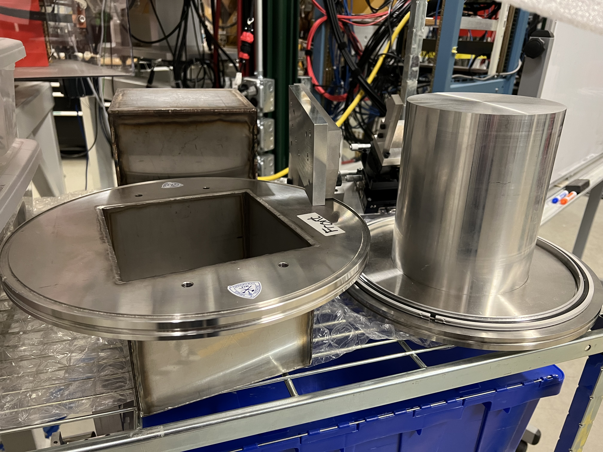

   The 14 BGO detectors used with the jet target are mounted in these holders, which are used on one side of the jet target (see :numref:`BGO_jet`).

.. _BGO_jet:
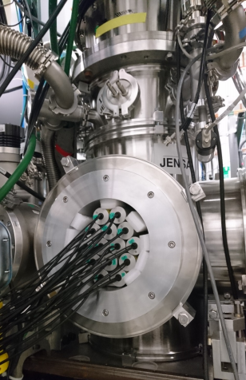

   The BGo detectors used with the jet target in an experiment performed in August of 2021.

.. _BGO_extended_holders:
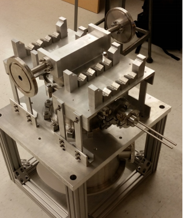
   
   The 26 BGO array surrounding the extended gas target are mounted into these holders attached on the sides of the gas target.

.. _BGOs:
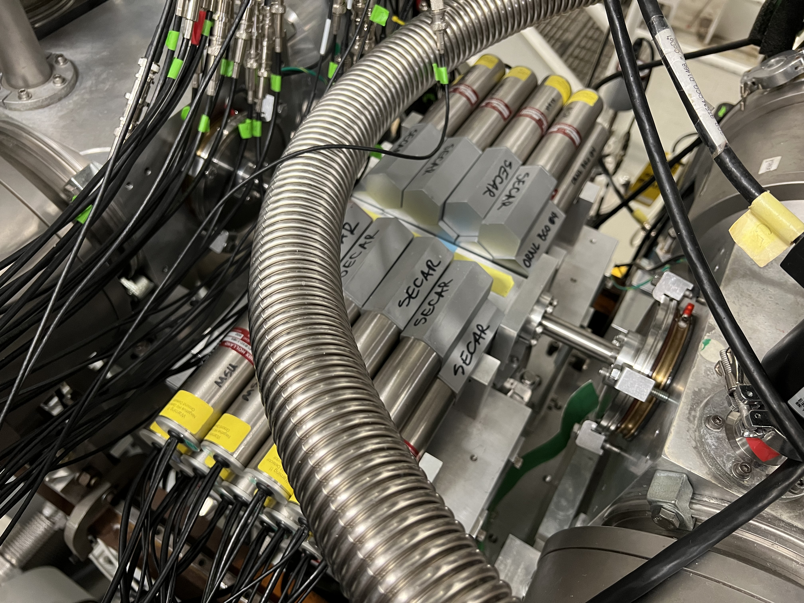

   There are 26 BGO detectors constructing the BGO array that surrounds the extended gas target.

.. _BGO_LOTO:
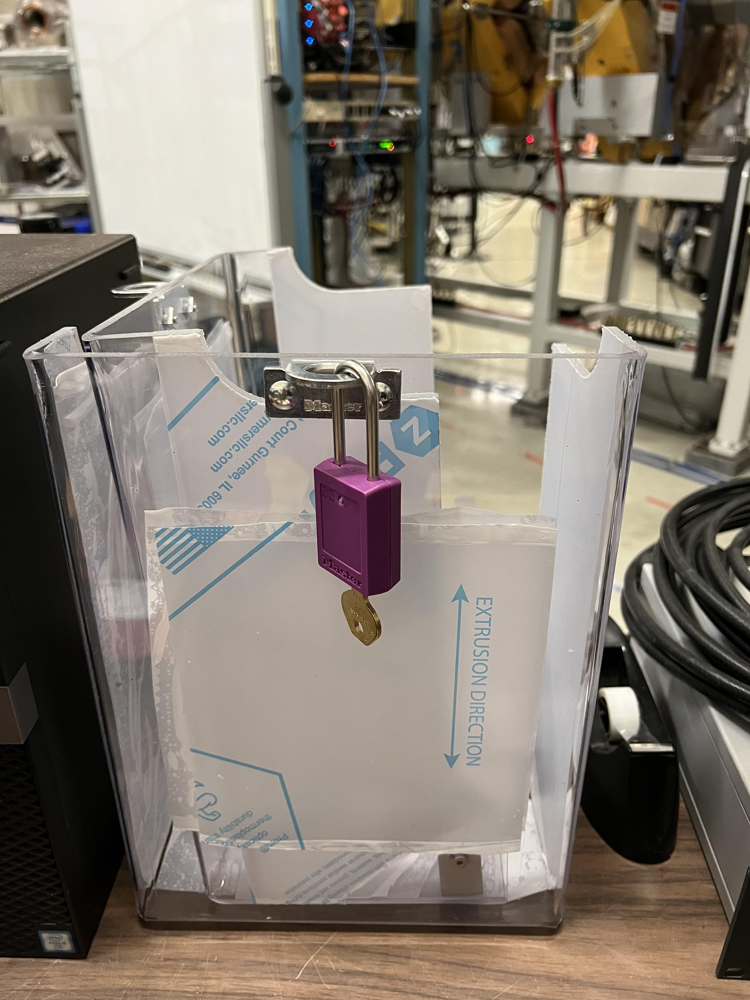

   This box provides a LOTO lock on the radioactive source used to test and characterize the BGO array. Every time the source has to be left unattended, this box needs to be placed on the array containing the source.

BGO Bias
~~~~~~~~

These detectors take a negative bias voltage, which is somewhere in the range of about 1.1 - 1.2 kV (see the SECAR elog for specific detector voltages). They are biased through 3 negative HV cards that are inside the JENSA CAEN power supply (see :numref:`CAEN_ON`). The SHV cables are all already laid inside the cable tray above the gas target. 

BGO Electronics
~~~~~~~~~~~~~~~

The BGO detectors do not really have any electronics associated with them. The BGO signals are simply transferred by long BNC cables, that are also laid in the cable tray above the gas target, into the same pach panel used by the PIPs detectors (see :numref:`digitizer_crate_cables`) and from there, they are attached to BNC to SMB cables, which are then fed into the :code:`spdaq58` digitizer crate. The first digitizer card in this crate takes 16 BGO detectors and the other 10 detectors are connected to the second digitizer card in the :code:`spdaq58` Pixie-16 crate.  

Micro Channel Plates (MCP Detectors)
------------------------------------

There are currently 3 MCP detectors in the end of SECAR in the section before the last beamline gate valve. One of these detectors, which is the largest one that does not have a magnet (see :numref:`MCP`), is disconnected and is just attached to the beamline to be able to keep it under good vacuum.

The other two detectors utilize a 1.5 T permanent magnet. Each of these MCPs has a mask and a gridded foil, which are attached to a separate motorized drive shown in :numref:`MCP_foil`. The foil and the grid are biased using another more moden CAEN power supply (see :numref:`fp_caen`).

.. attention::

   The MCP detectors should be kept under good vacuum (at least 1 :math:`{\mu}Torr`) at all times.

.. _MCP:
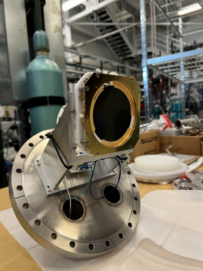

   The large MCP detector used to be the downstream MCP. This detector showed some issues so it was disconnected and just attached to the beamline to keep it safe under high vacuum.

.. _MCP_foil:
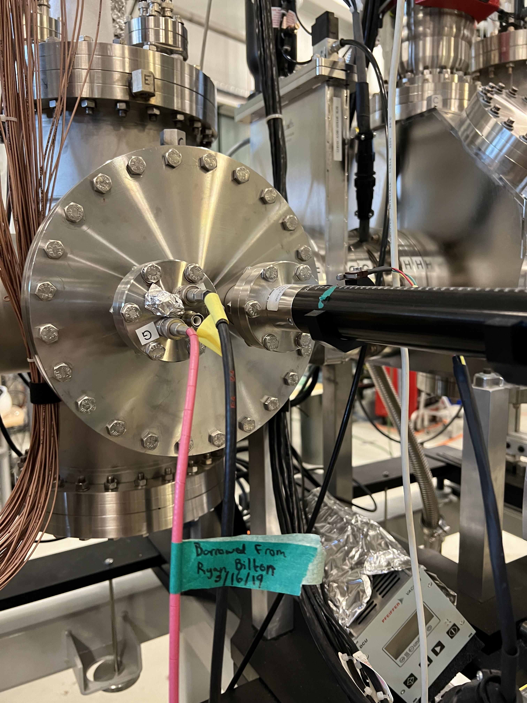

   To operate, each MCP detector uses a biased gridded foil and a mask, which are loaded onto a motorized drive.

.. _fp_caen:
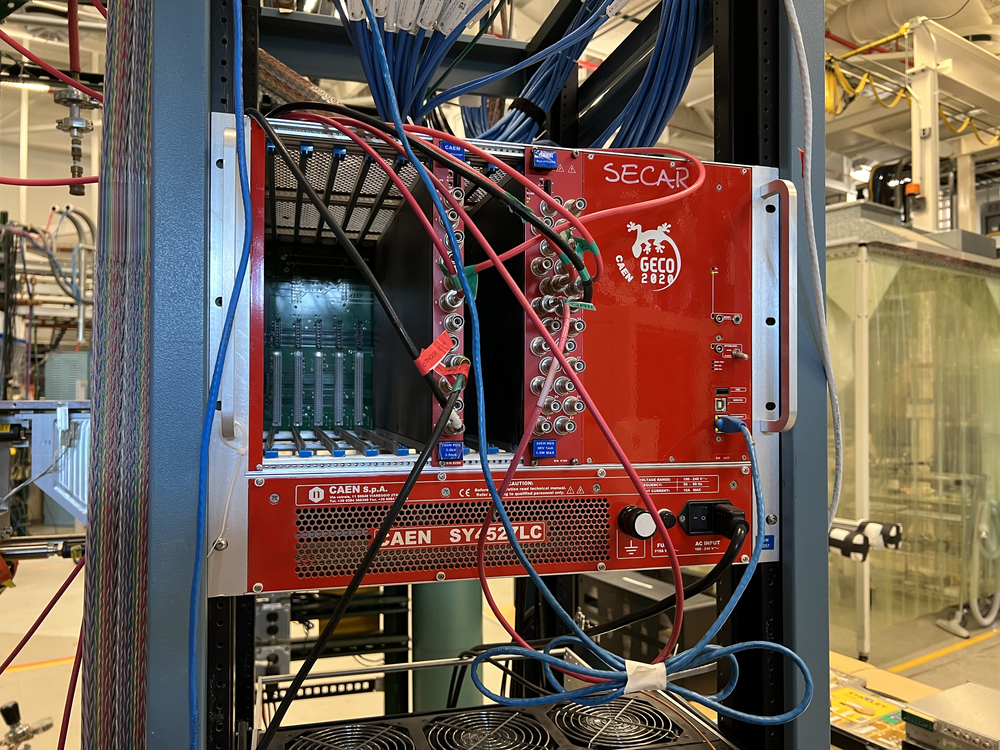

   There is another more modern CAEN power supply near the focal plane 4 of SECAR, which is used to bias the SECAR end detectors, including the MCP detectors and their gridded foils.

MCPs Bias
~~~~~~~~~

The MCP detectors are biased using the CAEN power supply shown in :numref:`fp_caen` (also see :numref:`operate_fp_caen`). Each MCP detector assembly has 3 bias inputs:

- One for the detector.
- One for the foil, which is separate.
- One for the grid on the foil, which is separate.

The SHV cables are connected to the top of the MCP flange (for the detector bias) and to the foil assembly flange for the grid and foil (see :numref:`MCP_foil`). The other sides of the SHV cables that are connected to the power supply get attached to the following channels on the focal plane CAEN power supply:

+-------------------+--------------------+--------------------+--------------+---------------+
| Upstream Device   | FP4 CAEN 24 CH NEG | FP4 CAEN 12 CH POS | Bias Voltage | Channel Label |
|                   | Input Channel      | Input Channel      |              |               |
+-------------------+--------------------+--------------------+--------------+---------------+
| MCP Detector      |                    | 4                  | +1875 V      | UMCP          |
+-------------------+--------------------+--------------------+--------------+---------------+
| Foil              | 9                  |                    | -550 V       | UFoil         |
+-------------------+--------------------+--------------------+--------------+---------------+
| Grid              | 8                  |                    | -50 V        | UGrid         |
+-------------------+--------------------+--------------------+--------------+---------------+
| Downstream Device | FP4 CAEN 24 CH NEG | FP4 CAEN 12 CH POS | Bias Voltage | Channel Label |
|                   | Input Channel      | Input Channel      |              |               |
+-------------------+--------------------+--------------------+--------------+---------------+
| MCP Detector      |                    | 5                  | +1900 V      | DMCP          |
+-------------------+--------------------+--------------------+--------------+---------------+
| Foil              | 11                 |                    | -550 V       | DFoil         |
+-------------------+--------------------+--------------------+--------------+---------------+
| Grid              | 10                 |                    | -50 V        | DGrid         |
+-------------------+--------------------+--------------------+--------------+---------------+

On the top of the MCP flange, there is also a ground connection, labelled as "GND" that has to be terminated using a 50 Ohm BNC terminator (see :numref:`MCP_bias`). 

.. _MCP_bias:
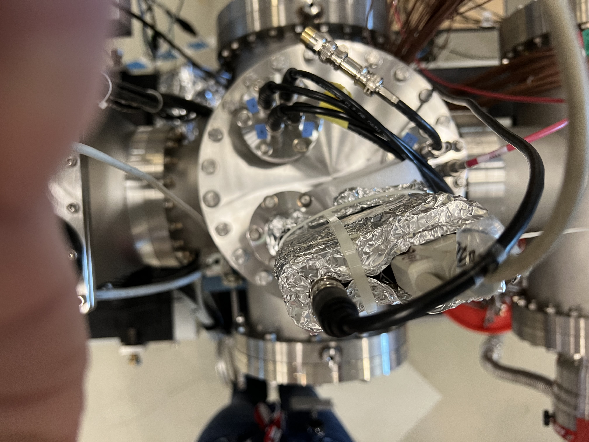

   Make sure each MCP detector's in-vacuum electronics is properly grounded by a 50 Ohm BNC terminator connected to the "GND" input on the top flange.

The MCP detectors have positive bias voltages, while both grids and foils take negative bias voltages. Prof. Jeff Blackmon has sent two instruction manuals for the MCP detectors. These can be found under :code:`MCP_Instructions` directory inside the same repository that contains all these instructions.

MCPs Electronics
~~~~~~~~~~~~~~~~

Each MCP detector has:

- 4 position signals labelled on the top flange as "A", "B", "C" and "D", which are amplified by the preamplifier shown in :numref:`mcp_preamp`.
- 1 timing signal labelled as "timing" on the top flange, which is amplified by the preamplifier shown in :numref:`mcp_timing`. Immediately on the input of the timing preamplifiers, there is an IT100 ORTEC inverter, which is attached to the top of the MCP flanges, where the timing input is located. 

These 4 preamplifiers get their power from the two golden modules shown in :numref:`mcp_power`. The timing signals outputted by the timing preamplifiers, are fed into a "Quad Fast Amplifier" (only two inputs are used, the inputs and outputs are LEMO connections). The output of the fast amplifier together with all 4 position signals outputted from the position preamplifiers go directly into the first digitizer card inside the :code:`spdaq57` Pixie-16 crate after being converted to SMB outputs. 

.. _mcp_preamp:
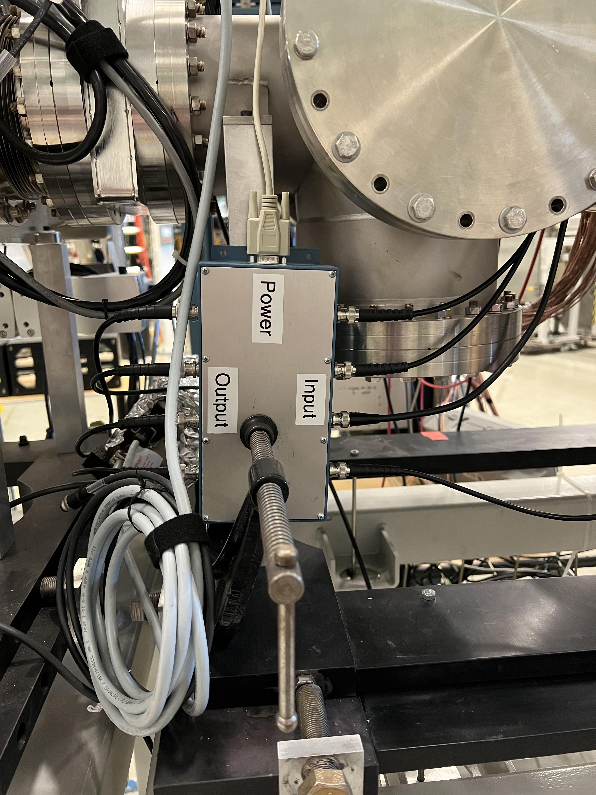

   This preamplifier amplifies 4 position (corner) signals of each MCP.

.. _mcp_timing:
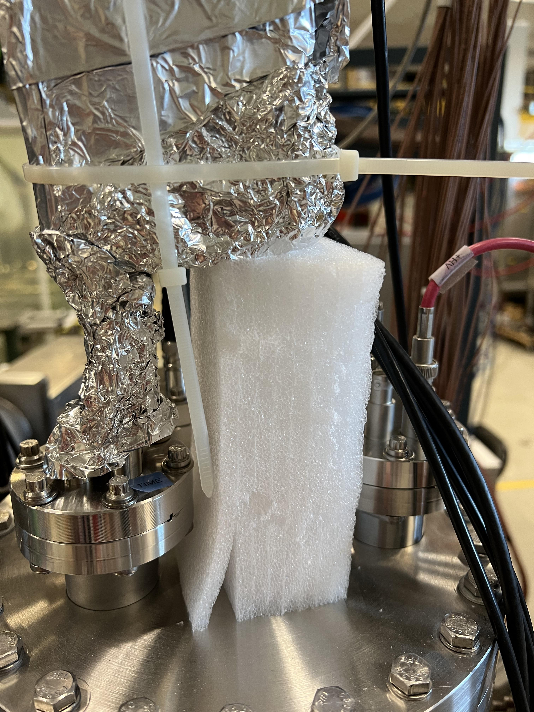

   The ORTEC timing preamplifier together with an IT100 ORTEC inverter on the input amplifies the timing signal of each MCP.

.. _mcp_power:
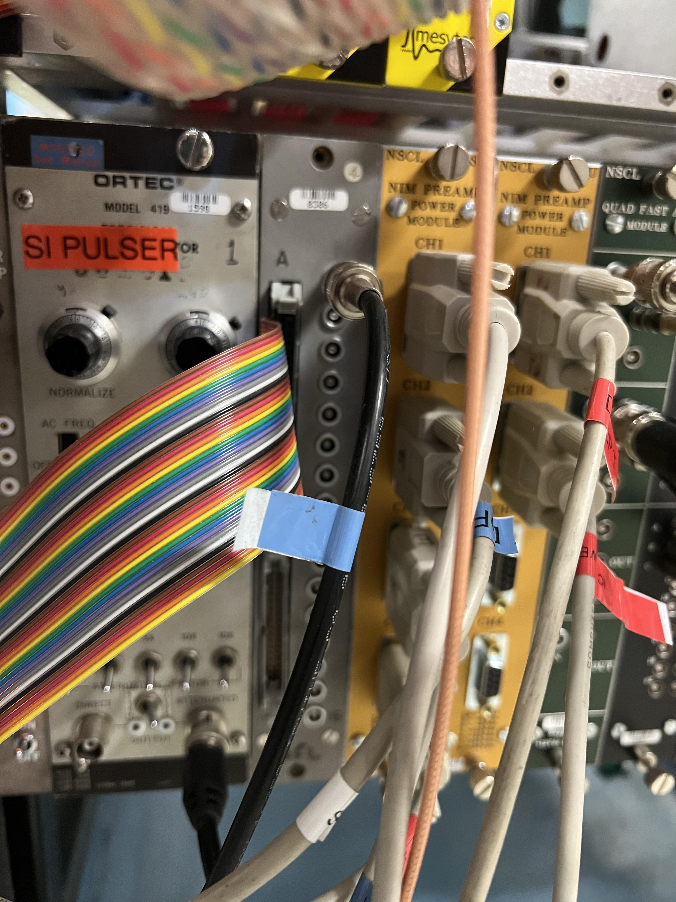

   Each MCP has 2 preamplifier. These together with the preamplifier box of the DSSD and that of the ionization chamber are powered by the two golden modules shown here.

Hybrid Ionization Chamber (IC)
------------------------------

To flow isobutane gas into this detector:

- Set the desired pressure by pressing the :code:`System Setup` button. A menu opens on the display. Using the arrow keys, select :code:`PID Recipe`. Press :code:`Enter`. At this point, the cursor will be on :code:`B1` under :code:`R1`. Press :code:`Enter` again. Using the arrow key, come down and to the right until you find the set pressure menu. Press :code:`Enter` again and using the arrow keys, go up or down until your desired pressure is reached. Press :code:`Enter` again to set the pressure. Press :code:`ESC` a few times to go back to the main display.
- Close the manual valve which isolates the detector from the beamline (see :numref:`figure5`).
- The gas supply and return valves located near the beamline (not on the gas handling system) but near the previous valve (these are two manual green valves shown on :numref:`figure6`) should already be open. 
- Close the bypass valve on the gas handling system. This valve connects the gas inlet and outlet to the roughing pump.
- Open the isobutane gas bottle.
- Open the small black valve on the bottle passed the bottle regulator.
- Open the green valves labelled as To/From IC on the gas handling system all the way.
- Open gas IN valve on the gas handling system.
- Press pressure control button twice. You should see a small menu on the display with a bunch of choices, including :code:`PID Control`. Using the arrow keys, select this menu and press :code:`Enter`. Using the arrow keys, turn it ON and then press :code:`ESC`.
- Close the micrometer at 100. 
- After about 30 minutes, close the needle valve (micrometer) at:
 
   - 15 if the pressure set value is below 60 Torr.
   - 20 if the pressure set value is at 60 Torr.
   - In both cases, you should only see the first black line.

.. _figure5:
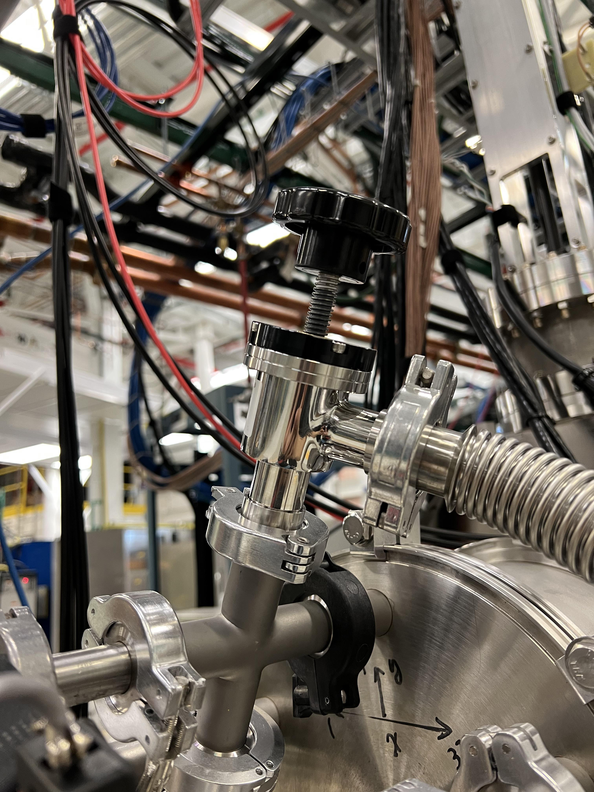

   This valve isolates the detector from the beamline. It needs to be closed when there is gas flowing in and out of the detector.

.. _figure6:
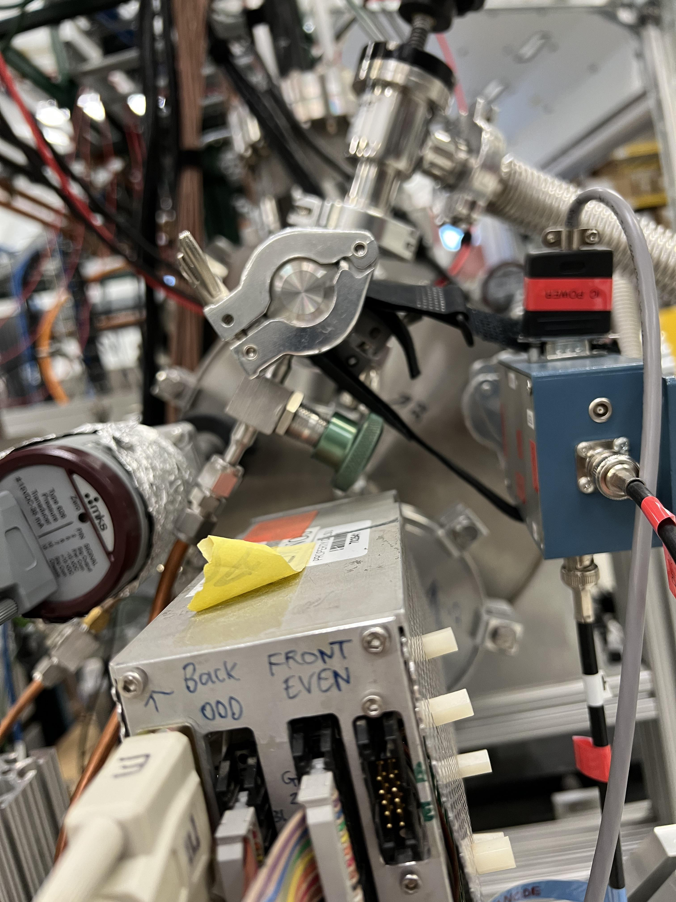

   The valve with a green handle is one of the two valves that supplies to and removes the gas from the detector. 

To remove the gas out of the detector:
  
- Make sure the IC, DSSD and the back plane are all debised.
- Close the last beamline gate valve of SECAR (:code:`SCR_BTS35:BGV_D1877`).
- Close the gas bottle and the small black valve on the gas bottle passed the regulator.
- Close gas IN valve on the gas handling system.
- Open bypass valve.
- Open the needle valve (micrometer) all the way.
- Turn OFF :code:`PID Control` by pressing pressure control button twice. You should see a small menu on the display with a bunch of choices, including :code:`PID Control`. Using the arrow keys, select this menu and press :code:`Enter`. Using the arrow keys, turn it OFF and then press :code:`ESC`.
- Wait for some time until the gas is slowly pumped out. Once the pressure gauge on the gas handling system shows a rough value (:math:`10^{-1}` Torr):
    
    - Close the green valves labelled as To/From IC on the gas handling system.
    - Leave the other two valves with green handles near the beamline open. 
    - Slowly open the valve to the chamber (see :numref:`figure5`). This may trip the last cold cathode gauge (:code:`SCR_BST35:CCG_D1878`). If that was the case, wait for the gas to be pumped out and then turn ON this gauge again using the CS-Studio control page.

Hybrid Ionization Detector Bias
~~~~~~~~~~~~~~~~~~~~~~~~~~~~~~~
   
To bias the detector:

- Make sure there is gas in the detector. Bias the ionization chamber to positive 450 V using the focal plane 4 CAEN power supply (see :numref:`operate_fp_caen`). The ionization chamber gets attached to channel 11 (labelled in the power supply GUI as dE) of the focal plane 4 CAEN 12 CH POS card.
- Bias the DSSSD to plus 50 V using the same power supply. DSSD is on channel 8 of the the focal plane 4 CAEN 12 CH POS card, which is labelled as Si in the power supply GUI.
- Turn ON the back plane voltage. To do this, please turn ON the power supply shown in :numref:`figure3`. Check to see the bias output is negative (:file:`NEG` LED should be ON). Turn the dial to 300. This setting corresponds to approximately -26 V, which is required to remove the edge effect.

.. _figure3:
.. figure:: Figures/IMG_2501.jpg
   :width: 50 %

   The power supply for the back grounding plane of the hybrid ionization chamber is the light grey module. When the dial shows 300, the output voltage corresponds to -26 V.

.. warning::

   The DSSD should either be biased when there is gas inside the IC and the valve shown in :numref:`figure5` closed, or when there is no gas in the IC and the aforementioned valve is fully open and the detector's chamber is at high vacuum. 
   Never close the valve shown in :numref:`figure5` and bias the DSSD without the gas when the detector is at rough vacuum.

Ionization Chamber Electronics
~~~~~~~~~~~~~~~~~~~~~~~~~~~~~~

The IC signal should be connected to the preamplifier shown in :numref:`IC_preamp`, which should be powered by one of the golden modules shown in :numref:`mcp_power`. The HV cable should be attached to this preamplifier and to the channel 11 of the focal plane 4 CAEN 12 CH POS card. The output of the preamplifier goes to the LEMO output #1 of the grey module shown in :numref:`ribon`, which is also attached via a ribon cable to :code:`MDU-0` amplifier module. Channel 0 on the latter, is directly plugged into channel 13 of the first digitizer card on the :code:`spdaq-57` Pixie-16 digitizer crate.

.. _IC_preamp:
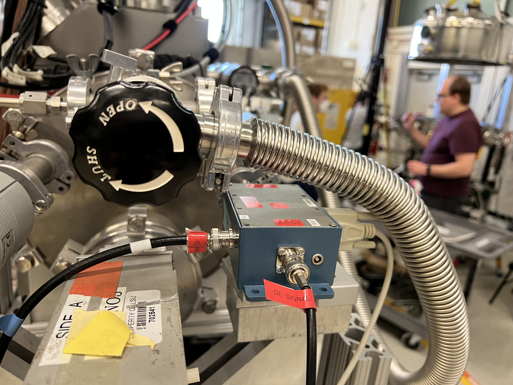

   The preamplifier for the IC detector.

.. _ribon:

   The IC preamplifier output is attached to the channel #1 of the grey module shown here, which is attached to the :code:`MDU-0` module via a ribbon cable.

.. _MDU-0:
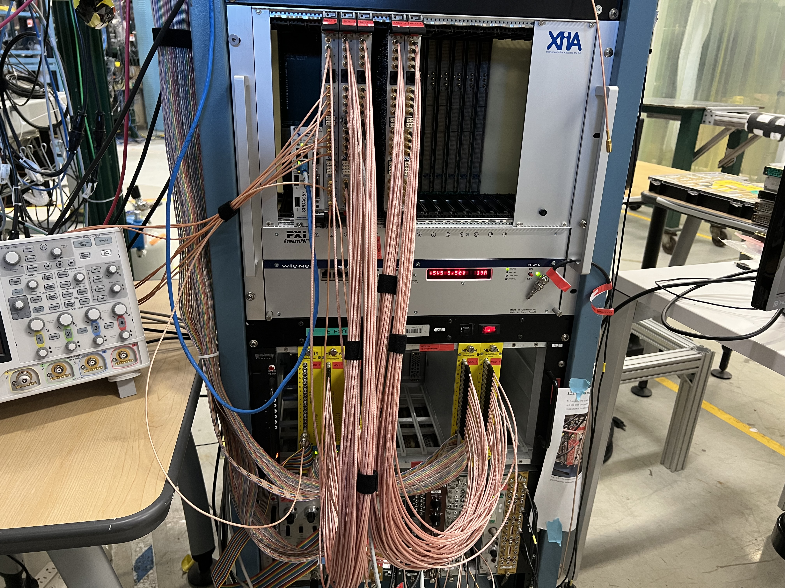

   The :code:`MDU` modules are used to amplify the IC and DSSD signals. :code:`MDU-0` module is used for the IC detector. This image also shows the electronics rack for the SECAR end detectors together with :code:`spdaq57` digitizer crate.

Double Sided Silicon Strip Detector
-----------------------------------

The hybrid ionization chamber detector has a DSSD attached, shown in :numref:`hybrid_photo`. This detector has 64 channels: 32 front strips and 32 back strips. Each channel has a preamplifier (we have 2 sets of preamplifiers with 2 different gains: 27 and 60 mV/keV), all of which are gathered into a preamplifier box shown in :numref:`DSSD_preamp`, whose power comes from one of the golden modules shown in :numref:`mcp_power`. There are 4 sets of ribon cables that need to be attached to this box on one side and to the rest of the :code:`MDU` modules on the other end. The outputs from the :code:`MDU-1` to :code:`MDU-4` modules (the first two for front strips and the last two for back strips) get connected via SMB cables to the rest of the digitizer cards of the :code:`spdaq57` crate. On the DSSD preamplifier box, there are two more BNC connections labelled as "A" and "B". These are: DSSD HV input (connected to "A"), and the negative voltage for the backplane (connected to "B"). 

.. attention::

   The ribon cables have a small triangle marker, which should be aligned with a black triangle marker on where they get attached to the DSSD preamplifier box. Make sure you get these triangles aligned properly; or else, the connections of the pins will not be correct.

.. _hybrid_photo:
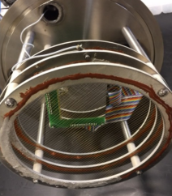

   The hybrid IC and DSSD detectors.

.. _DSSD_preamp:
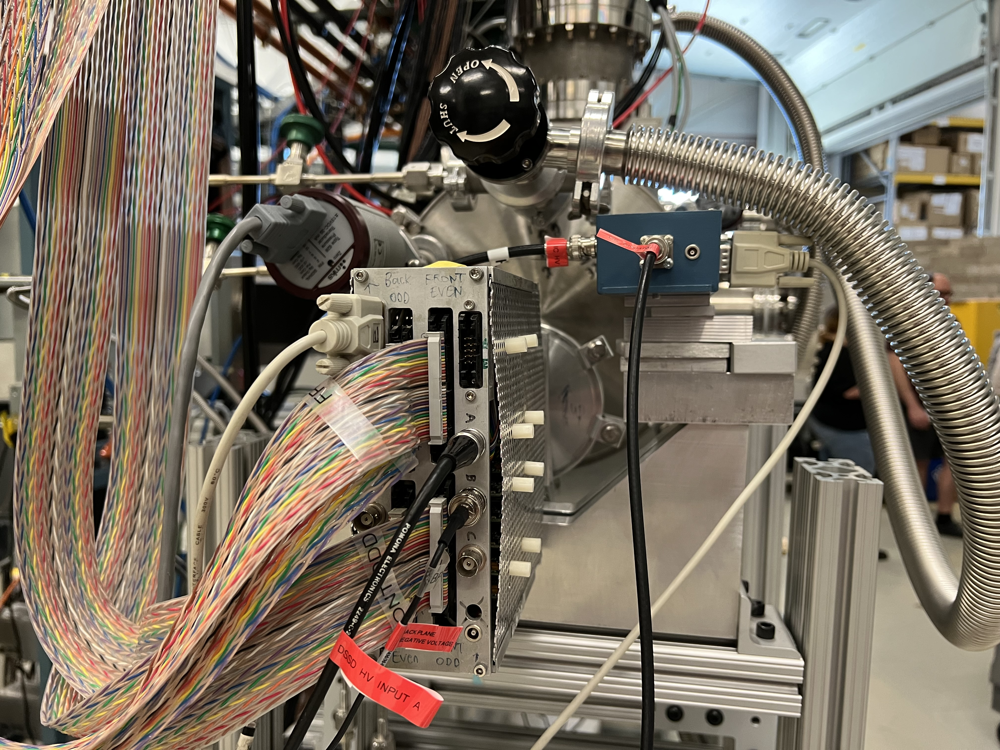

   The DSSD preamplifier box.

.. _operate_fp_caen:

Focal Plane 4 CAEN Power Supply
-------------------------------

The CAEN power supply used for biasing the end detectors of SECAR is CAEN-SY4527LC model.

To operate this power supply:

- Use a linux computer, which is connected to the DAQ network. Open a terminal and run the following commands:

.. code-block::
   :caption: How to operate the focal plane 4 CAEN power supply
        
        cd ~
        startev
        geco # this is an alias for /user/opt/geco/bin/CAENGEC02020
        # The IP address for this power supply is 10.65.50.44

Then, a window pops up. Use the correct credentials to log into the GUI for this CAEN power supply shown in :numref:`geco`. Once the GUI opens, you can see MCP, IC and DSSD channels. To input a new value. You can click on the desired input and type the desired value. To set a new channel, please make sure you input the voltage setpoint, current setpoint, ramp up/down rates and maximum allowed voltage and current, whose nomenclature is similar to the ones from JENSA crate (see :numref:`caen_section`). To turn a channel ON/OFF, please use the :code:`spacebar` or right click and select ON/OFF.

.. _geco:
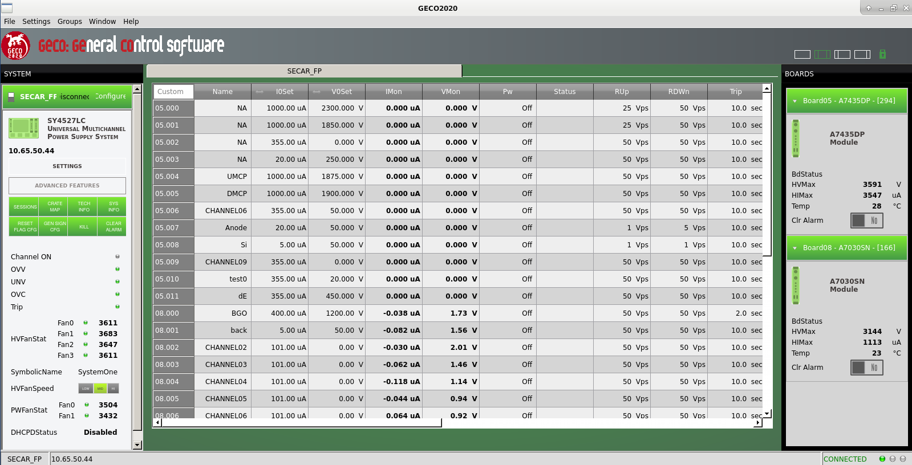

   The GUI for the focal plane 4 CEAN power supply.

.. note::

   Make sure the allowed leakage currents (:code:`I0Set`) for both MCP detector biases (:code:`UMCP` and :code:`DMCP`) is set to 1 mA in the GUI shown in :numref:`geco`.
