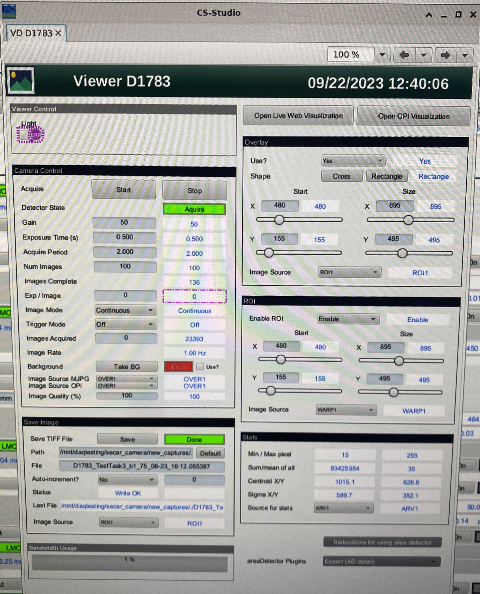
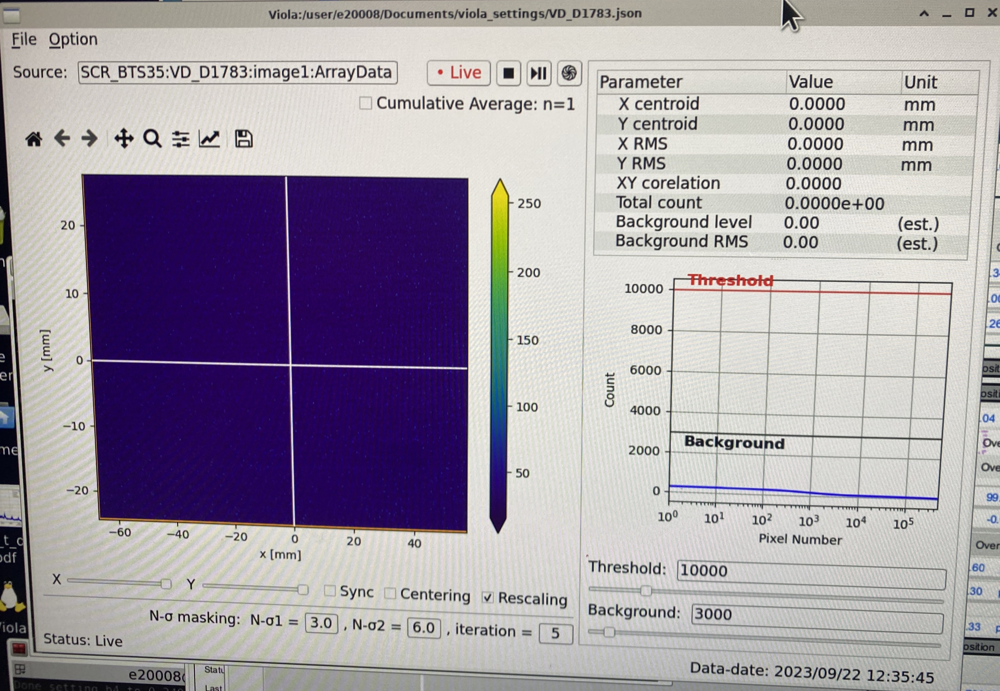
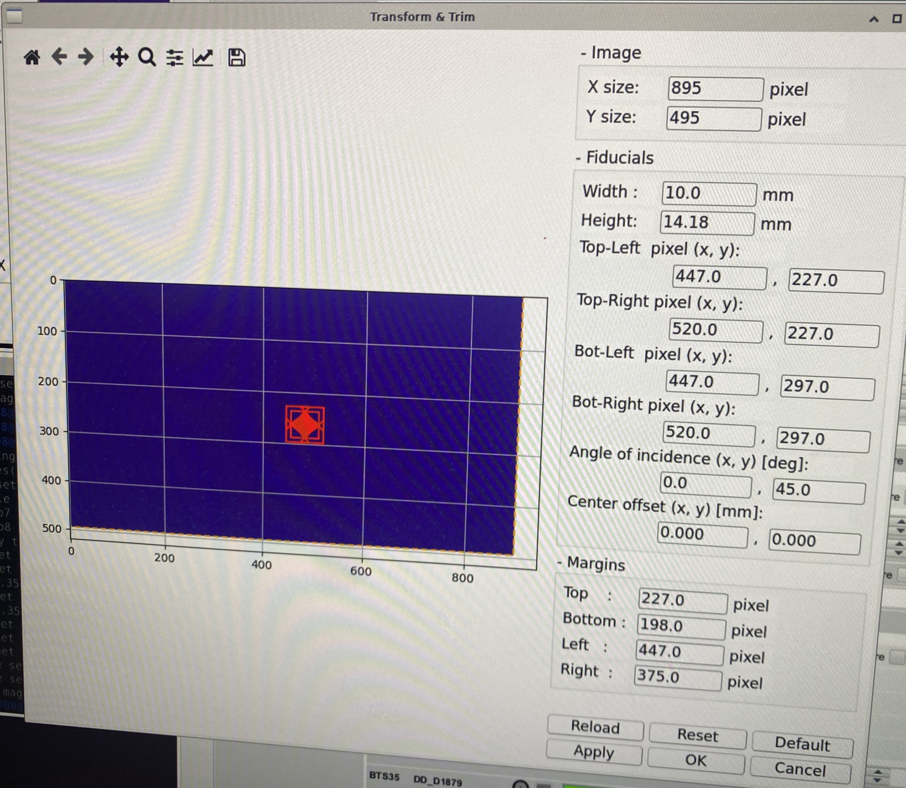
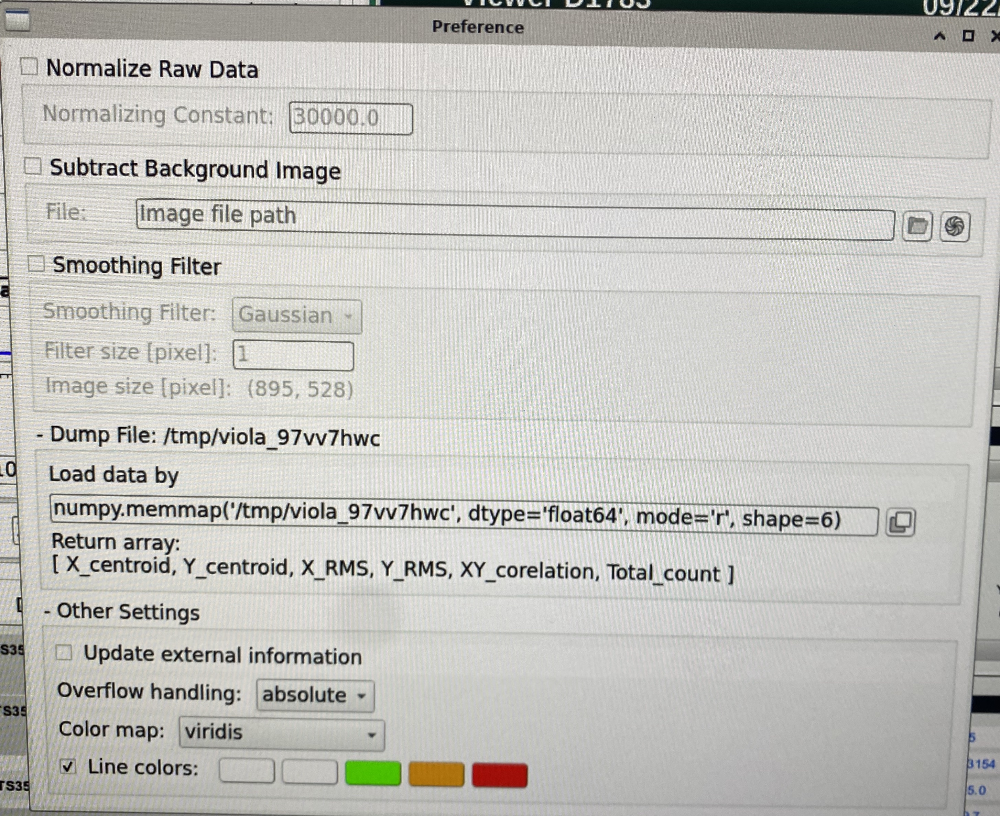

 
Diagnostics
=========== 

This chapter presents a few instructions on how to operate SECAR diagnostics.

.. note:: 

   Jorge/Fernando - the following probably needs updating for new interface

The CS-Studio page for SECAR diagnostics is found under SECAR Global Controls, "Diag. by Type" tab. Faraday cups, viewers and BCM can be inserted (In) or removed (Out) by pressing the corresponding button (left columns in the following figure). When the device is In, the LED light in the second button column (like FC_D1568 in the following figure) turns to   . For the slits, set the Gap to 0mm to close them (preventing beam transmission).

The new :code:`SECAR_layout.opi` page in CS-Studio enables the users to insert Faraday cups and viewers IN/OUT from this page and presents Faraday cups' current readbacks as well.

Viewers
-------
.. warning::

   Prior to using viewers ensure beam intensities are adjusted according to the limits in the `SECAR Operations Procedure <https://portal.frib.msu.edu/sites/dcc/pages/dcclink.aspx?WBS=M41600&Sub=PR&SN=001200>`_.

Viewers are controlled from the Diagnostics tab and can be moved in and out using the corresponding buttons. They are named with a "VD" in it, for example :code:`SCR_BTS34:VD_D1783`. To move the viewers in and out, you may need to click on "Ignore" or "Override" check buttons before being able to move the viewers.

To turn ON/OFF the cameras, click on the associated "Settings" button. Then, click on the "Start" button to start acquisition. The red indicator should then turn green. The "Details Menu" brings up a new page where many viewer settings can be adjusted (see :numref:`Viewer_Details`). The important parameters to set properly are gain, exposure time, and acquire period. Good choices are 30-50, 

.. _Viewer_Details:

   "Viewer Details" page

The light can be turned ON/OFF using another process variable that has "LT" in it, for example: :code:`SCR_BTS34:LT_D1457`. This allows to see the viewer markings, but should otherwise be turned off to use the viewer for beam measurements. 

Images are viewed by using Viola. To start up Viola:

- Start the viola shell script from the command line in the experiment account (the terminal must be running on a computer on the controls network, e.g. U5PC1, U5PC5, U5PC8, or U5PC9): :code:`start_viola.sh --setting ~/Documents/viola_settings/VD_D1783.json`. There should be a json file for each SECAR viewer that contains the specific viewer settings. 
- The viewers and their standard file names are: 
    - Viewer 1457: VD_D1457.json
    - Viewer 1515: VD_D1515.json
    - Viewer 1542: VD_D1542.json
    - Viewer 1638: VD_D1638.json
    - Viewer 1688: VD_D1688.json
    - Viewer 1783: VD_D1783.json
    - Viewer 1836: VD_D1836.json
    - Viewer 1879: VD_D1879.json
- If Viola is already running you can select a new json file for a new viewer in File -> Open Settings.

  - NOTE: you may have to enter viewer name ":image1:ArrayData" by hand into the "Source" field in the viola main window, for example :code:`SCRBTS35:VD_D15125:image1:ArrayData` - then just click "Live"

- This should bring up a new window (see :numref:`Viewer_Viola1`). 
- Click "Live" to enable live viewing of the viewer. The text "Live" should turn red. 
- Adjust Threshold and Background sliders to enable the software to find intensity peak position, width, etc
- To read x and y positions make sure the viewer is calibrated (see below - calibration should be checked prior to each experiment). Viewers are usally calibrated so that the center of the viewer is X=0 and Y=0. However, the SECAR viewers are not perfectly aligned. Refer to the run plan or Portal (or Fernando) to get the current alignment information that relates X=0 and Y=0 on the viewer to the nominal beam axis of SECAR.  

.. _Viewer_Viola1:

   Viola viewer main window.

**Save a Viewer Image**

Viewer images can be saved, for example for placement in the ELOG. To save a viewer image

- Press stop button (next to Live) to pause live view
- Goto File and "Save Results" - this is recommended as it saves all settings that go along with the image. It will create a png, a tiff, and a json file with the viewer settings. 
- Alternatively you can just save the image by clicking the button with the floppy disk icon  – a typical path and file name (adapt to the viewer in use) is Documents/Pictures/D1836_year_month_day_hour_minute_viola.png

**Calibration**

The viewers need to be calibrated so Viola can display x and y coordinates with real distances. Viewers are usually calibrated such that X=0 and Y=0 corresponds to the center of the viewer (not necessarily the nominal beam axis). Calibration should be checked prior to each experiment. If a viewer is not calibrated yet, you can calibrate it with the following steps

- Insert the viewer and start the live display as described above
- Turn on the light on the Phoebus diagnostics tab (LT ON OFF - see above). You should now see markings on the viewer that are used to determine the center. The nominal dimensions of these markings can be taken from the mechanical drawings on the viewers, which can be found on portal.frib.msu.edu under Projects -> SECAR -> Documentation -> Viewers.
- Select menu items Option -> Transform and Trim in the Viola window. This opens a new window (see :numref:`Viewer_Viola2`). 
- Verify in that new window that image size is set correctly – it needs to match the "Details Menu" information for the respective viewer (in the right column)
- Drag the red rectangle corners with mouse to align with the viewer rectangular frame lines at the edge of the viewer that have known dimensions. Those dimensions are entered in “Fiducials” and can be obtained from the viewer machine drawings located on the Portal under SECAR -> Documentation -> Diagnostics -> Viewer. These are the actual dimensions, viola takes the viewing angle into account, which is set as an additional parameter.
- Press Apply

.. _Viewer_Viola2:

   Viola viewer calibration window.

**Background subtraction**

Viola can subtract background from the viewer image to have a clearer display of the beam. You can set up background subtraction with the following steps. This has to be redone each time viewer settings are changed (or any other effects change the background). 

- Make sure camera settings are final, turn light off
- In Viola menu select Option -> Preference
- In the new window check the box “Subtract Background image” (see :numref:`Viewer_Viola3`)
- Press the button with the “shutter” symbol on the far right 
- A pop up window will come up (can be behind the window!) – select ok – saves background automatically in a predefined path
- Check the box “Normalize Raw Data”
- Close window 

.. _Viewer_Viola3:

   Viola viewer background subtraction window.

JENSA Viewer
~~~~~~~~~~~~

The JNESA viewer at :code:`SCR_BTS35:VD_D1457` is a new viewer upstream of the extended gas target. The indicator for viewer IN may still be ON even if the viewer is taken out. To fix this, please ask Dan Crisp or Francisco Pereira de Figueiredo to correct it in CS-Studio. 

Faraday Cups
------------
.. warning::

   Prior to using Faraday Cups ensure biasing and vacuum procedures in the `SECAR Operations Procedure <https://portal.frib.msu.edu/sites/dcc/pages/dcclink.aspx?WBS=M41600&Sub=PR&SN=001200>`_. are followed

:code:`ReA_BTS34:FC_D1448` is controlled by ReA operators.

:code:`SCR_BTS35:FC_D1485` and :code:`SCR_BTS35:FC_D1568` are pnuematic. All other SECAR Faraday cups are controlled by motorized drives. The actual positons (in mm) of the cups can be seen from the "Drives" section of the "Diag. by Type" page. The Faraday cups can be biased by clicking on "Settings" buttons found under cups section of the Diag. by Type page. Please enter :math:`-200` V in "Bias Voltage SP" field and then turn ON the bias power supply ("Bias PS") and "START" the acquisition of the cup.

.. warning::

   If the vacuum in the chamber where the Faraday cups are is not high vacuum (if the high vacuum pump is OFF), the cups biases are disabled, and one annot bias the Faraday cups. This is visible from the :code:`FC ILKS` page in CS-Studio "SECAR Global Controls" page. 

Slits
-----

SECAR has 5 slits, two of which are in focal plane 1. The other 3 are at each remaining focal plane. The slits at focal plane 1 are two separate slit systems, while the other 3 slits are assembled in one system each.

The slits are all operated via motorized drives seen in the "Slits" section of the Diag. by Type page. You can either move each slit (beam left and beam right) separately using "Left Setpoint" and "Right Setpoint", or you can move them together using "Center Setpoint" and "Gap Setpoint". 

.. note::

   The left slit in focal plane 4 has hysteresis. If you move it from one location to another, there will be a high chance that its actual position will differ from what its position readback indicates. To avoid this, fully retract it each time it needs to move into a new position first and then move it to the new position. Only then, the new position's readback accurately indicates its actual position.
   The position commands of all SECAR slits are accurate to within :math:`200 - 500 {\mu}m`.

Collimators
-----------

There are two collimators monted on a separate motorized drive: :code:`SCR_BTS35:DD_D1457` and :code:`SCR_BTS35:DD_D1568`. The former has 4 circular apertures with diameters of 1.5 mm, 2 mm, 4 mm, and 8 mm. The latter only has one aperture with diameter of 5 mm. These apertures can be put in by clicking on the appropriate button corresponding to each aperture. Each of these apertures can be retracted fully by clicking on the "Retract Drive" buttons.

Automated Aperture Scans
~~~~~~~~~~~~~~~~~~~~~~~~

Software is available to automate aperture scans. You can select the aperture to be moved and the quanity that should be monitored as a function of position, typically a Faraday cup downstream of the aperture. You can also select range, steps, and how many data points should be taken per step to get a reliable average. 

- In home directory, type “run_phyapps” and wait for a GUI app launcher to pop up
- Select the “Correlation Viewer” application.
- In the top left corner, there are buttons that read “Load Lattice”, “Save As”,”Open”, “High Dimensional”, and “Exit”
- To open an existing configuration, select “Open” and navigate to “~/Documents/device_scan/xxxx.json”
- If you create a new configuration, you can save it as a .json file for future use.
- “High Dimensional” allows you to see multiple PVs at the same time.
- The device you want to change should be in the “Alter Element”. The device you want to observe can be selected in “Monitor”.
    - If you have Phoebus open, you can simply copy and paste a PV name over to this window.
- If you wish to alter the range of the scan, it can be changed in the “Alter Range” section.
- The number of steps and wait time at each step can be altered at the bottom of the left sidebar. You can also adjust the number of measurements (Shot Number) during the measurement time (Alter Timeout) per step over which the results are averaged. 
- To operate the scan, simply click the blue play button with the text “Start” at the very bottom of the sidebar.
- After the scan is complete, do not forget to save the results!
    - To do this, select the floppy disc icon in the toolbar directly above the displayed graph.
    - Please save results in the “~/Documents/device_scan_results/” folder with the format “yearmonthday_hourminute_{devicename}scan.csv”, i.e. “20240602_2311_1477scan.csv” for a scan performed at 11:11pm on June 02, 2024 with the 1477 drive.
    - NOTE: Please change file format to .csv for easy analysis. The application saves files as .h5 format by default. 
    - It also may be a good idea to save an image. This can be done with the picture button to the left of the save key.

JENSA Collimator
~~~~~~~~~~~~~~~~

This is currently packed in a box, which is with the vacuum group. Once you need to install the jet target chamber, you would need to also install this aperture.

MCP Foil and Mask Drives
------------------------

The upstream and downstream MCP detectors' foil and mask can be controlled by :code:`SCR_BTS35:DD_D1857` and :code:`SCR_BTS35:DD_D1871`, respectively. The "Foil in" button puts the foil in and the "Mask in" button puts the mask in. To retract the drive, click on "Retract foil" button.
