.. raw:: html

    
    

.. role:: orange
.. role:: green   

Windowless Extended Gas Target
==============================

This chapter presents a summary of the setup and operation of SECAR's extended gas target. 

Introduction
------------

SECAR has two gas targets:

- The Jet Experiments in Nuclear Astrophysics (JENSA)
- The windowless extended gas target

Each of these targets has its own configuration, and the target chambers and associated hardware are very different from one another. However, they both use the same Gas Handling System (GHS). Currently, the windowless extended gas target is the only SECAR's target whose operation is fully automatic except the operation of the high vacuum pumps. This target typically runs the gas in recirculating mode (see :numref:`run_mode`). 

This chapter presents the windowless extended gas target.

.. note::

   **Hydrogen operation is currently not authorized and is in the near future only forseen with the extended gas target.**

Emergency response
------------------

If in an emergency situation (such as a building evacuation or a shelter in place order) the gas target needs to be left anattended for an extended period of time, use the following procedures to bring it into a safe state: 

For He operation follow: `Emergency Response Procedxure for SECAR
Extended and Jet Gas Targets During Helium Operation <https://portal.frib.msu.edu/sites/dcc/pages/dcclink.aspx?WBS=M41600&Sub=PR&SN=001537>`_.

.. _CSS:

Accessing CS-Studio Control Page for Both SECAR's Gas Targets
-------------------------------------------------------------

The SECAR's gas targets controls can be found here:

- On a computer connected to the NSCL (CTL) controls network, open CS-Studio. Go to File, Top Files, NSCL, and open SECAR tab. Then, a window opens which is called SECAR Global Controls. From the top of that page, click on "JENSA ..." button and then click on Target GHS. A new window opens called :code:`Main.opi`. This is where the controls of the SECAR's gas targets can be found (see :numref:`CSS_Screen`).

.. _CSS_Screen:
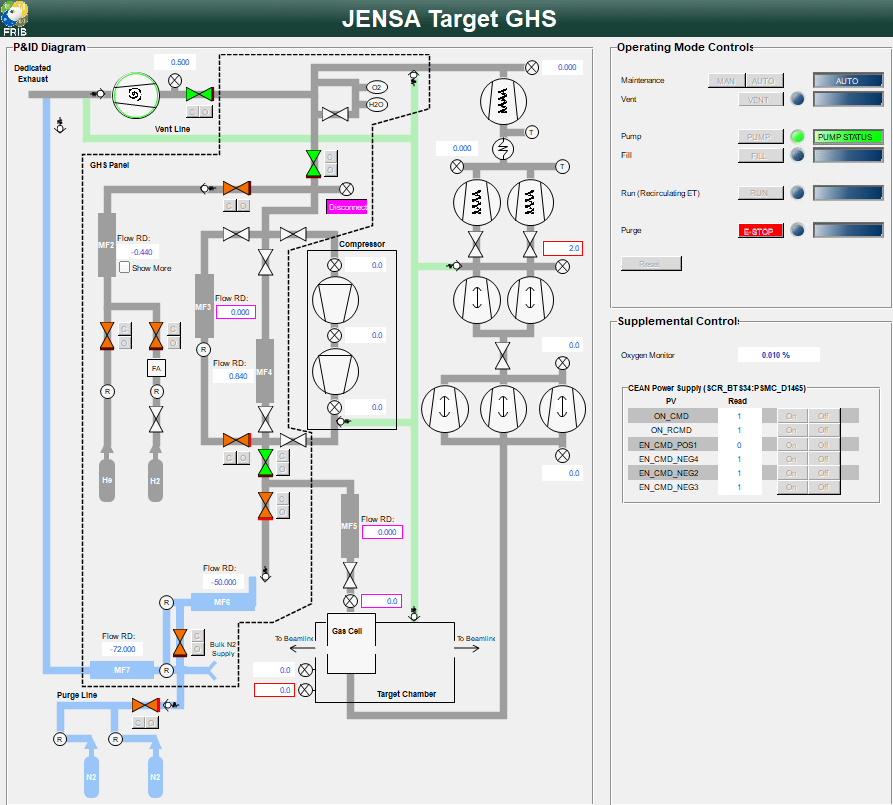

   The CS-Studio control page for both SECAR's gas targets. :code:`MF5` is **only** used for the jet target's operation.

The symbols on this page are shown in the table below:

.. _symbols_table:
.. table:: The symbols of the CS-Studio control page for SECAR's gas target's gas handling system are shown here.
 
 ================   ===========================================================
 Symbol             Meaning                                                    
 |valveopen|        Valve is open                                              
 |valveclose|       Valve is closed                                             
 |valvecontrols|    Controls for opening (o) and closing (c) valves  
 |manualvalve|      Manual valve (locked in its state until manually changed    
 |scrolpumpon|      Scroll pump in ON                                               
 |scrolpumpoff|     Scroll pump is OFF                                          
 |gauge|            Capacitance manometer gauge and its readback value in Torr  
 |pressurerelief|   Pressure reliefe valve                                      
 |oxygensensor|     Oxygen sensor                                               
 |humiditysensor|   Humidity sensor (not used)                                  
 |massflowmeter|    Mass flow meter                                             
 |flowreadback|     Flow readback in sccm (standard cubic centimeter per minute 
 |regulator|        Pressure regulator                                                                                        
 |screwpump|        DV650 Screw pump                                            
 |rootsblower|      Roots blower pump              
 |turbopump|        Turbo pump                                                  
 |heatexchanger|    Heat exchanger                                              
 |thermometer|      Thermometer                                                 
 |gasbottle|        Gas supply - This one contains hydrogen                     
 |compressor|       JENSA Compressor head                                       
 |flasharrestor|    Flash arrestor                                              
 |operatingmode|    Selected operating mode                                     
 |emergencystop|    Emergency stop                                              
 |reset|            Reset button                
 |pson|             ON/OFF control buttons for the main CAEN power supply          
 |HVpospower|       ON/OFF control buttons for the positive HV card  
 |HVnegpower|       ON/OFF control buttons for the negative HV cards                 
 ================   ===========================================================
                        

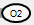
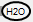

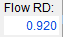

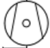

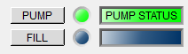

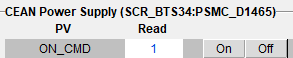

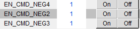

P&ID Diagram
~~~~~~~~~~~~

The left side of the :code:`Main.opi` page in CS-Studio (see :numref:`CSS_Screen`) contains the schematics of all the hardware controls located on the gas handling system of the extended gas target. These can be commanded either manually (when switched to :code:`MAN` operating mode control) or automatically (when switched to any other operating mode control).

Figure below shows the extended gas target’s gas handling system more clearly. 

.. _Extended_GHS:
.. list-table::
   
   * - .. figure:: Figures/Extended_Gas_Target2.png
   
   * - .. figure:: Figures/Extended_Gas_Target3.png

          The extended target’s gas handling system’s P&ID. NO and NC indicate normally open and normally closed, respectively. This target is only operated in recirculating mode.

On :numref:`CSS_Screen`, an :orange:`orange` valve (|valveclose|) indicates it is closed, and a :green:`green` valve (|valveopen|) indicates it is open. Those valves which can only be operated fully manually are shown in :numref:`CSS_Screen` by a white color (|manualvalve|). 

How to Operate the Manual Valves on the GHS
^^^^^^^^^^^^^^^^^^^^^^^^^^^^^^^^^^^^^^^^^^^

These valves are locked into their state and have to first be unlocked before changing their state. There is a metallic padlock visible on the body of these valves. To unlock the valve, push that padlock down (if it is on the top of the valve) or up (if it is on the bottom of the valve) and then rotate the valve (can only rotate in one direction) while you are pressing the metallic padlock to change the valve’s state. It will be locked again once you release the padlock. These valves allow easy switch between extended gas target and jet target configurations. Their status (open vs. closed) is locked during operation.

How to Operate the Mass Flow Meters of the GHS
^^^^^^^^^^^^^^^^^^^^^^^^^^^^^^^^^^^^^^^^^^^^^^

MFs are Mass Flow meters, also called Mass Flow Controllers (MFCs), which are devices to control the flow rate of the process gas. The MF have three modes: :code:`OPEN`, :code:`CLOSE`, and :code:`SETPOINT`: 

- :code:`OPEN` creates a maximum opening without any defined flow, for example for pumping the system out
- :code:`CLOSE` closes the MF so no gas can flow through
- :code:`SETPOINT` allows the user to set a flow rate that is then maintained (if possible). There is a maximum setpoint defined that may have been set based on safety or engineering considerations. Note that setting the MF to the maximum flow rate in SETPOINT mode is NOT the same as setting it to OPEN mode. 

To operate the MFs

- To view and set the mode of a MF one currently needs to use the PV Probe functionality: Right click on the flow display field (not the MF), select "Probe", and in the window that is popping up enter the PV for setting the mode - replace the text after the ":" (usually F_RD) with :code:`MODE_CSET_MFC`. You may need to wait a bit for the current mode to be displayed as value. You can then change the mode by entering either OPEN, CLOSE, or SETPOINT. 
- To view and adjust the flow, right click on the MF symbol on the controls page and select "Open Mass Flow Controller Details". A small window pops up that allows to view and set the current flow. Note that this only makes sense in :code:`SETPOINT` mode, however, currently this window also displays something in the other modes, with no indication that its not meaningful. 

.. warning::

   It is highly recommended to not set the gas supply mass flow meter (:code:`MF2`) to :code:`Set to OPEN` because it might fill the system with a lot of gas too quickly and the fill volume will not be integrated accurately in that case. Setting :code:`MF2` to :code:`Set to OPEN` is not the same as setting its set point to 100 sccm, which is the maximum flow delivered by :code:`MF2`. The orifice of the mass flow meter will be fully opened if it is set to :code:`OPEN` and the flow rate will not be known precisely. It may flood the system with gas so please avoid setting it to :code:`Set to OPEN`. 

The default state of valves and MFs are shown in the :numref:`state_table`. The state of the manual valves during operation of the extended gas target is also shown in this table.

.. _state_table:
.. table:: The default state of all devices in the SECAR's targets' gas handling system. The state of the manual valve are only shown for the extended target's operation

 ======   ==================  ======  ==================  
 Device   Default State       Device  Default State
 V1       NO                  V15     NO                
 V2       NO                  V16     NO                
 V3       NC                  V17     NO                
 V4       Manual and closed   V18     Manual and open   
 V5       Manual and closed   V19     Manual (see text)
 V6       NC                  V20     Manual and open   
 V7       NC                  V21     NC                
 V8       Manual and open     MF2     NC                
 V9       Manual and open     MF3     NC                
 V10      NO                  MF4     NO                
 V11      Manual and closed   MF5     NO                
 V12      NO                  MF6     NO                
 V13      NO                  MF7     NO   
 V14      Manual (see text)   
 ======   ==================  ======  ==================

.. note::

   - :code:`V4`, :code:`V5` and :code:`V11` valves should remain closed during the operation of the extended gas target. These valves are only used when the jet taret is in use. :code:`V5` is the valve that allows the supply gas to flow from the gas handling system to the inlet of the JENSA compressor. :code:`V11` is the valve that allows the high pressure processed gas to flow from the outlet of the JENSA compressor to the gas handling system. :code:`V4` is the valve that needs to be opened for the gas to flow in the jet bypass loop. :code:`V14`, which is currently not installed, is the valve that allows the jet to flow into the jet gas target's chamber.
   - :code:`V8` and :code:`V9` valves should remain open during the operation of the extended gas target.
   - :code:`V14` is currently not installed. This is a manual valve with a green handle that was previously labelled as :math:`V_{in}`. This valve is only used with the jet target and will be only opened during the last steps of turning ON the jet to allow the jet to flow inside the jet target chamber.
   - :code:`V18` is a manual gate valve shown in :numref:`V18`. This valve should always be open unless in special circumstances such as leak checking to isolate the target section from the pumps underneath the JENSA noise enclosure.
   - :code:`V19` is the Parker excess flow valve shown in :numref:`excess_flow_valve`. It should be closed when hydrogen bottle is not installed or when an empty hydrogen bottle is being exchanged with a new filled bottle. All other times, this valve should be open.
   - :code:`V20` is a manual valve shown in :numref:`V20`. This valve should remain open during the operation of the extended gas target.

.. _V18:
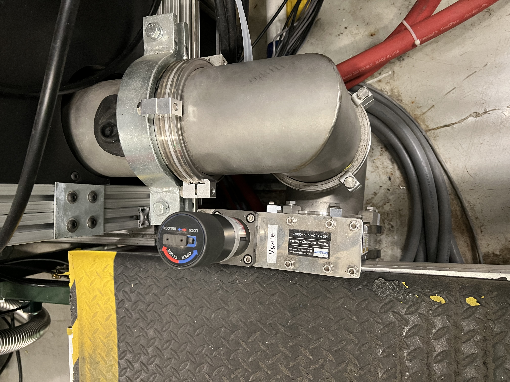
       
   The manual gate valve :code:`V18` that separates the target area from the DV650 pumps underneath the JENSA compressor's noise enclosure.

.. _excess_flow_valve:
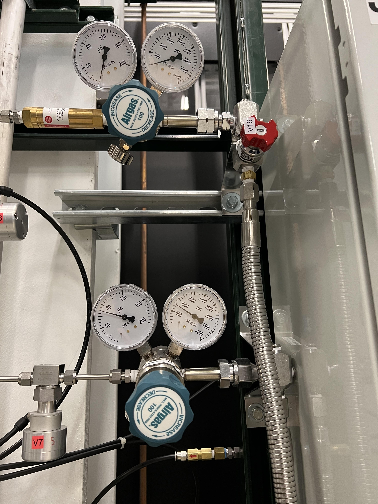
       
   The Parker excess flow valve (:code:`V19`) automatically stops the flow if it is above 40 standard liters per minute.

.. _V20:
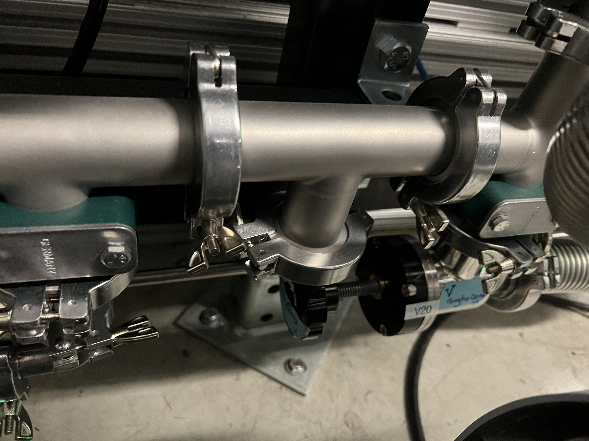
       
   This manual valve :code:`V20` is near the ground behind the roughing pump on the gas handling system's panel. It is also called :code:`Vrough+copmin`

Operating Mode Controls
~~~~~~~~~~~~~~~~~~~~~~~

This section presents a summary of the operating modes of the SECAR's targets' GHS. A more detailed section on each operating mode will follow later.

The right side of the :code:`Main.opi` page in CS-Studio (see :numref:`CSS_Screen`) contains the operating mode controls. These are various available modes of operation described below:

#. :code:`MAN` mode of operation: this mode is activated when clicking on the :code:`MAN` button seen on the top left hand side of :numref:`CSS_Screen`. This mode of operation is used for maintenance, operation of JENSA jet target, gas bottle exchange, and long term system idle. This is the only mode of operation in which valves are commanded manually by the operator via the control software so it requires expert knowledge of the system. The valves can be opened in this mode of operation by clicking on the "o" button near a valve to open that valve, or by clicking on the "c" button near a valve to close it (|valvecontrols|). Manual mode of operation needs to be "turned off" (by switching to :code:`Auto` mode, see below) before switching into any other mode of operation. 

2. Turning off the :code:`MAN` mode is performed by clicking on the :code:`Auto` button seen on the top left hand side of :numref:`CSS_Screen`. The :code:`Auto` mode contains all other operating modes where the control is all automatic, and the change in the states of valves is performed by the control software depending on which mode of operation is chosen. When :code:`Auto` button is clicked, all valves switch to their default states (see :numref:`state_table`): all valves except :code:`V3`, :code:`V6`, :code:`V7`, and :code:`V21` are normally open. :code:`V3`, :code:`V6`, :code:`V7` and :code:`V21` are normally closed. All MFs are normally open except :code:`MF2` and :code:`MF3`, which are normally closed. This means that after clicking on the :code:`Auto` button, every valve will be opened except :code:`V3`, :code:`V6`, :code:`V7`, and :code:`V21`, which will be closed. Therefore, when the system is under high vacuum with the high vacuum pumps running, if you have to switch to manual mode of operation for some reason, make sure you quickly click on pump mode of operation very soon after clicking on the :code:`Auto` button to avoid filling the system with nitrogen that will enter the system through :code:`MF6` and valves :code:`V12` and :code:`V13`, which will be open when you switch to :code:`Auto` mode.

.. danger::

   There is a needle valve associated with mass flow meter :code:`MF6`. This needle valve is shown in :numref:`MF6_needle`. It is upstream :code:`MF6` (on the path of :math:`N_{2}` gas for purging) and is already set to only allow a nitrogen flow of 1000 sccm through the :code:`MF6` flow meter for purging the system. **Please do not touch this valve to avoid changing the flow that is set. This specific flow is set to a low rate to avoid loading and harming the turbo pumps during the operation of the gas target in purge mode. For the same reason, please esnure that MF6 is set to have 1000 sccm flow set point unless when you are venting the system.**

.. _MF6_needle:
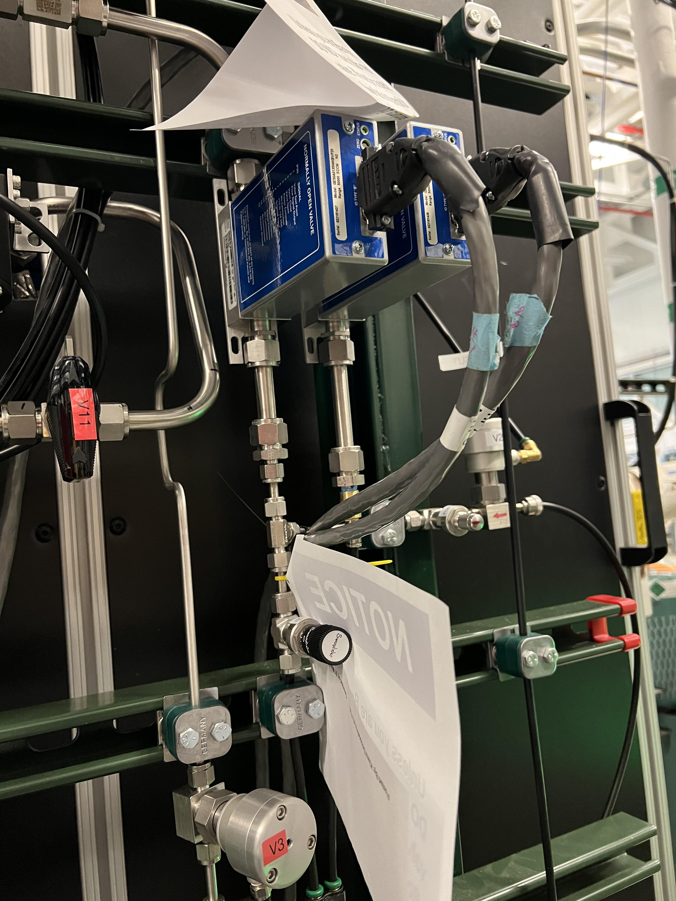
       
   The needle valve underneath the two mass flow meters shown in the photo is labelled as "For MF6". It is upstream :code:`MF6` (on the path of :math:`N_{2}` gas for purging) and is already set to only allow a nitrogen flow of 1000 sccm through the :code:`MF6` flow meter for purging the system. **Please do not touch this valve to avoid changing the flow that is set. This specific flow is set to a low rate to avoid loading and harming the turbo pumps during the operation of the gas target in purge mode. For the same reason, please esnure that MF6 is set to have 1000 sccm flow set point unless when you are venting the system.**

3. :code:`Vent` mode of operation: this is used for venting the system. Once vent mode is initiated, the system is fully remote controllable and the control software will close :code:`V1` and opens :code:`V13`. Valves :code:`V3`, :code:`V6`, :code:`V7`, and :code:`V10` remain closed, while valve :code:`V12` remains open. The operator can open valve :code:`V21` if she/he desires only while the system is in :code:`vent` or :code:`MAN` mode of operation. This mode automatically turns OFF the scroll pump (see :numref:`Vent_Mode`).  

.. _Vent_mode:
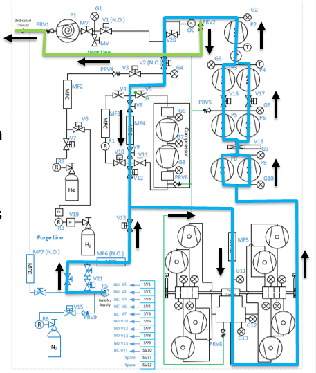
   
   The schematics of :code:`vent` mode of operation. Image courtesy of Brandon Ewert.

.. warning::   
        
   If the high vacuum pumps (turbo pumps, Roots blowers, and DV650 pumps) are running, the operator has to make sure all these pumps and all 8 cold cathode gauges are turned off before switching to the vent mode. These pumps are all manually controlled via their associated controllers inside the ReA3 vault, so the operator has to ensure it is safe to re-enter the vault (:numref:`reentry`) if the gas target is running hydrogen. 

.. attention::
      
   - While in vent mode of operation, when the capacitance manometers of the system show around 730 – 760 torr, the operator should switch to the :code:`MAN` mode of operation and close :code:`V13` and :code:`V21` valves. The pressure relief valves (see :numref:`pressure_relief`) in the system will avoid over pressurizing the system (see the vent line in :numref:`Vent_mode`). But both :code:`V13` and :code:`V21` valves should be closed manually (by switching to the :code:`MAN` mode of operation and commanding the valves closed) when the system is fully vented. 
   - Also, the operator should close the manual roughing valve (labelled as :code:`VROUGH`, see :numref:`VROUGH`) located on the JENSA scroll pump for the safety of the scroll pump in case the target chamber is opened to air and there may be a large leak the next time the system is put in pump mode. 
   - Note that when the system is fully vented, the pressure inside the gas target read by capacitance manometer G11 (:code:`SCR_BTS34:CMG_D1465K`) reaches 100 Torr maximum because this manometer is only capable of reading maximum of 100 Torr. The minimum is 1 Torr. Similarly, the pressure read by capacitance monometer G13 (:code:`SCR_BTS34:CMG_D1465M`) only reads 1 Torr maximum and 10 mTorr minimum. 

.. _pressure_relief:
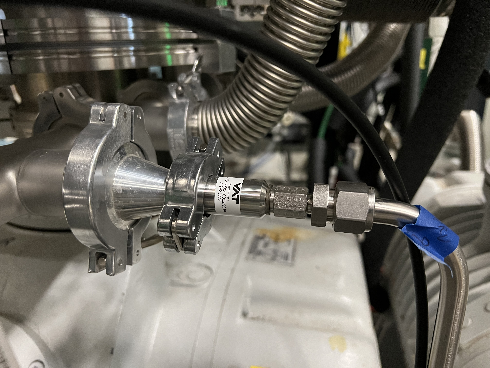
   
   The pressure reliefe valve is the tiny device seen on the right side of the KF-16 clamp. There are many such devices implemented in the gas handling system of SECAR targets and they are all tied to the flammable gas exhaust. Once the pressure at the foreline of the scroll pump reaches 1 atm., the pressure relief valve called :code:`PRV2` (see :numref:`Vent_mode`) opens to vent the overpressure to the flammable exhaust.

.. _VROUGH:
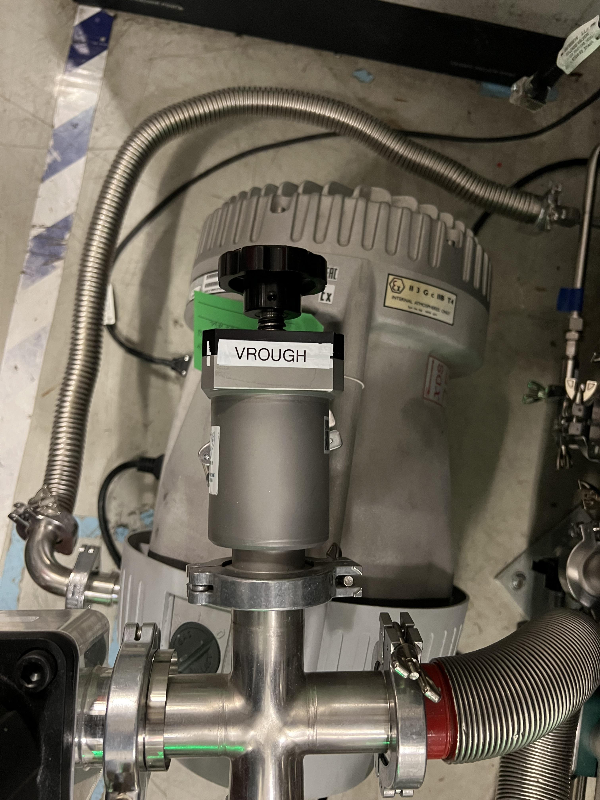
   
   The manual roughing valve on the JENSA scroll pump is labelled as :code:`VROUGH`.
   
.. danger::

   Note that the only times when the system automatically switches to the vent mode of operation is when the system is in either in pump or in purge mode and the scroll pump loses power or fails for some other reason. In these cases, the control system automatically switches the operating mode to vent mode. In this case, it is crucial to ensure the high vacuum pumps are turned OFF manually and safely before the pressure rises above 55 – 60 Torr in the gas target. Vent mode is automatically triggered if:
       - Laboratory power is lost.
       - The scroll pump loses power while the system is in pump or purge mode of operation.
        
4. :code:`Pump` mode of operation: this is used for pumping down the system from atmosphere, or when the system is running under high or low vacuum idly and without any gas in the target system. While the system is in :code:`pump` mode, the system will be pumped at full speed via the scroll pump (and all other pumps if they are running). The scroll pump has a manual roughing valve labelled as :code:`VROUGH` (:numref:`VROUGH`). This valve should be fully opened. The operator can turn ON all the other pumps manually (requires presence in the ReA3 vault) when the system is in this mode of operation. :numref:`Pump_mode` shows the schematics of the gas target while in :code:`pump` mode. In this mode, the control software turns the scroll pump ON, opens :code:`V1` and closes :code:`V13`. Valves :code:`V2` and :code:`V12` remain open, while valves :code:`V3`, :code:`V6`, :code:`V7`, and :code:`V10` remain closed.

.. _Pump_mode:
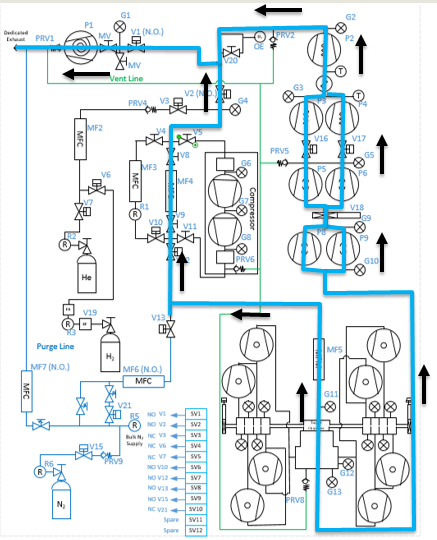
   
   The schematics of :code:`pump` mode of operation. Image courtesy of Brandon Ewert.

5. :code:`Fill` mode of operation: this is used when filling the gas target with a gas before recirculation of the gas is applied. :numref:`Fill_mode` shows the schematics of this mode of operation. In this mode of operation, the control software closes :code:`V1` and opens :code:`V3` and :code:`V6` or :code:`V7`. Valves :code:`V2`, and :code:`V12` remain open, while :code:`V10` and :code:`V13` remain closed. All the high vacuum recirculating pumps should be fully running in this mode. The operator opens :code:`MF2` to regulate and charge the system with the supplied gas (:code:`V6` is open in case of a hydrogen fill, :code:`V7` is open in case of a fill with He or another type of a non-explosive gas). Once the desired pressure in the gas chamber is reached as read by G11 capacitance manometer (:code:`SCR_BTS34:CMG_D1465K`), the operator has to switch to the :code:`run` mode.

.. _Fill_mode:
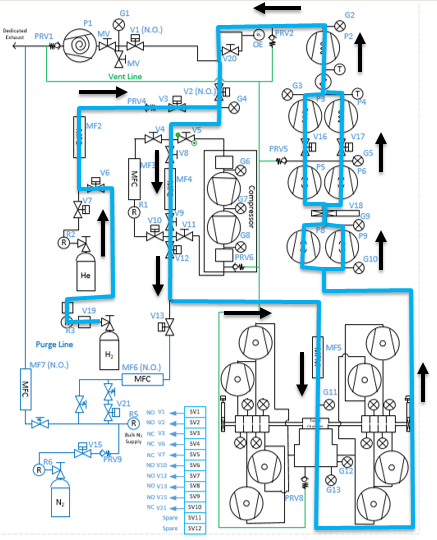
   
   The schematics of :code:`fill` mode of operation. Image courtesy of Brandon Ewert.

6. :code:`Run` mode of operation: in this mode of operation, the control software closes :code:`V3` and :code:`V6` or :code:`V7`, whichever was being used. All other valves have the same state as they had in the :code:`fill` mode. :code:`V2` and :code:`V12` valves remain open to establish flow (see :numref:`Run_mode`). :code:`MF4` should be adjusted to deliver the desired flow to the gas target and to keep the gas target pressure steady. Gas is recirculating through the system. Only in this mode of operation, the PIPS detectors inside the extended gas target can be biased only after the :code:`reset` button on the operation mode section of the control page is clicked and if the oxygen level is below :math:`0.4 \%`, and :code:`SCR_BTS34:CMG_D1465K` (G11) and :code:`SCR_BTS34:CMG_D1465M` (G13) capacitance manometer gauges are reading below 25 Torr and 10 mTorr, respectively. 

.. warning::   

   Make sure the pressure read by G3 capacitance manometer (:code:`SCR_BTS34:CMG_D1465C`) does not exceed 210 Torr while the system is in :code:`run` mode, or else the last DV650 pump will shut itself down. In reality, this pressure cannot be reached because there is an interlock on :code:`SCR_BTS34:CMG_D1465C` (G3 gauge), which would switch the system into purge mode if this gauge reading reaches 20 Torr.

.. _Run_mode:
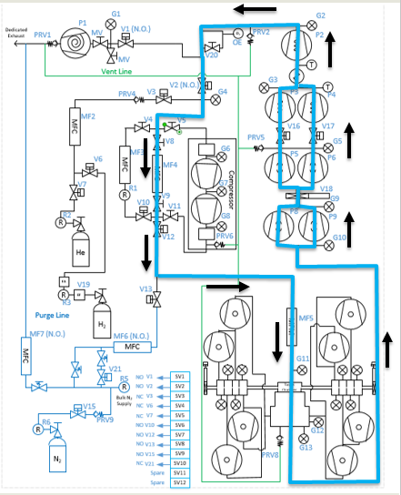
   
   The schematics of :code:`run` mode of operation. Image courtesy of Brandon Ewert.

7. :code:`Purge` mode of operation: This mode of operation (see :numref:`Purge_mode`) is triggered by software control if any of the interlocks are reached, or by the operator if he/she clicks on the emergency stop button on the control page (|emergencystop|). The latter action is accessible from any mode of operation. In :code:`purge` mode of operation, if hydrogen is the fill gas, :code:`MF7` supplies a constant flow of dry nitrogen (with a rate of 1000 sccm preset by a needle valve upstream :code:`MF7`, see :numref:`MF7_needle`) to dilute the exhaust in case of an overpressure condition during the fill. :code:`MF6` is opened to a safe (for high vacuum pumps that are running) flow rate of 1000 sccm preset by another needle valve upstream :code:`MF6` and :code:`V21` (see :numref:`MF6_needle`) to purge the system with dry nitrogen from the lab supply of dry nitrogen. If the flow of dry nitrogen through :code:`MF6` drops below :math:`70\%` of its set value (for example due to a failure of the laboratory dry nitrogen supply), :code:`V15` opens automatically by the control software, and a dry nitrogen backup bottle kicks in to supply :math:`N_{2}` and to continue purging the system with dry nitrogen. The JENSA scroll pump pumps the mixture of gas out, and hydrogen-nitrogen mixture is directed into the exhaust and is further diluted. In this mode of operation, the control system opens :code:`V13` and :code:`V1`. Valves :code:`V2` and :code:`V12` remain open, while valves :code:`V3`, :code:`V6`, :code:`V7`, and :code:`V10` remain closed. 

.. _MF7_needle:
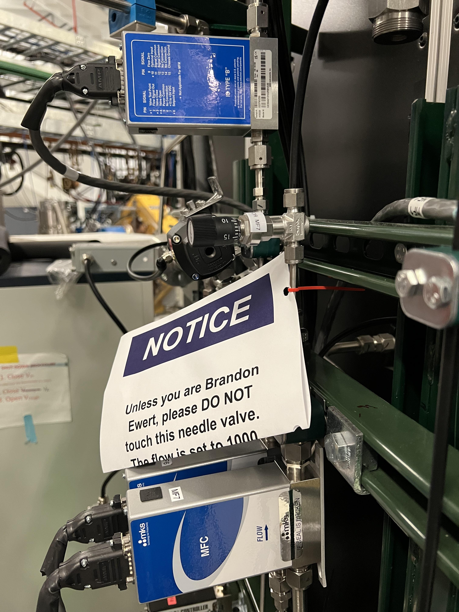
   
   The needle valve upstream of :code:`MF7`, labelled as "For MF7", is already set to only allow a dry nitrogen flow rate of 1000 sccm through :code:`MF7`. **Please do not touch this needle valve to avoid changing the preset flow through MF7. If you change the position of this needle valve, there will be too much dry nitrogen going in the exhaust, which will waste the nitrogen. Please also do not change the flow setpoint of MF7, which is set to 1000 sccm. The maximum flow rate for this mass flow meter is 50000 sccm, which is too much.**
   
.. note::

   After 10 minutes of purging, the operator has to click on |reset| button first and then change the mode of operation to :code:`vent` mode. If you do not want to actually vent the system, immediately switch to :code:`pump` mode. If you intend to vent the system, the operator has to enter the vault after it is safe to do so (only applies to hydrogen operation) and quickly turns off all high vacuum pumps before the target chamber pressure reaches 50 – 60 Torr.

:code:`Purge` mode of operation is automatically triggered if any of the following events occur while the system is in :code:`run` or :code:`fill` mode:

- The oxygen sensor reads greater than :math:`0.4\%`.
- If the pressure in the gas target, read by G11 capacitance manometer (:code:`SCR_BTS34:CMG_D1465K`), reaches 25 Torr.
- If the pressure read by capacitance manometer G2 (:code:`SCR_BTS34:CMG_D1465B`: foreline pressure) reaches 500 Torr.
- If the pressure read by capacitance manometer G3 (:code:`SCR_BTS34:CMG_D1465C`: pressure in the last DV650 pump) reaches 20 Torr.
- If the pressure anywhere else in the system (read by any of the capacitance manometers G5, G9, and G10: :code:`SCR_BTS34:CMG_D1465E`, :code:`SCR_BTS34:CMG_D1465I`, and :code:`SCR_BTS34:CMG_D1465J`) reaches 10 Torr.

.. note::

   - When purge mode is initiated, the voltages to both the in-vacuum PIPS detectors are cut off and are immediately reduced to 0V. The positive HV card of the CAEN power supply will also be disabled. 
   - While in :code:`run` mode of operation, the positive HV card supplying the high voltage to the PIPS detectors will be disabled if any of the following occurs:
        
        - The pressure inside the gas target (read by G11 capacitance manometer: :code:`SCR_BTS34_CMG_D1465K`) is above 25 Torr.
        - The pressure read by capacitance manometer G13 (:code:`SCR_BTS34:CMG_D1465M`: pressure in the gas chamber below the target) reaches 10 mTorr.
        - The oxygen sensor reads an oxygen content which is higher than :math:`0.4\%`.

.. _Purge_mode:
.. figure:: Figures/Purge_mode.PNG
   :width: 50 %
   
   The schematics of :code:`purge` mode of operation. Image courtesy of Brandon Ewert. 

8. |reset| button: Click on this button once when the system is in run mode of operation (especially after and if purge mode was triggered beforehand) to allow the in-vacuum PIPS detectors to be biased.

9. |emergencystop|: In case of an emergency, this button can be pushed. After pressing this button, the system will be switched to the :code:`purge` mode and flushes the gas out of the system. It will also disable the HV card and will cut off power to the silicon detectors. **It is therefore, advisable to debias these detectors before pressing the emergency stop button if time allows.** To switch the system from this mode to another, click on the |reset| button and then switch to :code:`vent` mode. If you do not intend to vent the system, immediately switch to :code:`pump` mode.

The modes of operation of the extended gas target can be switched as follows:

- From the manual mode of operation (:code:`MAN`), the system can only be switched to :code:`Auto` mode, where the control system becomes automatic and takes care of opening/closing various valves depending on the selected mode of operation. The action of switching to :code:`Auto` mode from the :code:`MAN` mode forces all the valves to be in their default state (the state they are in when they are not powered). Therefore, if the high vacuum pumps are ON while the system is switched to :code:`Auto`, try to immediately switch to pump mode or you will run the risk of exposing the turbo pumps to nitrogen flowing into the system via :code:`V13`. The fact that :code:`V13` will be opened and nitrogen comes into the system is not an immediate danger to the turbo pumps because we have set :code:`MF6` to have a flow of 1000 sccm and even if this is not the case, a needle valve upstream of :code:`MF6` (see :numref:`MF6_needle`) is also set to only allow a small flow through :code:`MF6` to avoid loading/harming the turbo pumps. **It is for this reason that it is crucial to not touch that needle valve to keep the flow as is.** If the high vacuum pumps are not running, one can also switch to :code:`vent` mode from :code:`Auto` mode.
- From :code:`pump` mode, one can switch to :code:`vent` mode, :code:`fill` mode, and :code:`MAN` mode.
- From :code:`vent` mode, the system can be switched to :code:`pump` mode and :code:`MAN` mode. If the system is in :code:`purge` or :code:`pump` mode and the scroll pump loses power or fails, the system will automatically switch to :code:`vent` mode. **It is crucial to enter the ReA3 vault soon after this happens to turn the high vacuum pumps OFF. However, due to the very low flow of dry nitrogen set by the needle valve upstream MF6, you do have some time before you run into the risk of harming the turbo pumps.**
- From :code:`fill` mode, one can switch to :code:`pump` mode, :code:`run` mode and :code:`MAN` mode.
- From :code:`run` mode, one can switch to :code:`fill` mode and :code:`MAN` mode only.
- :code:`Purge` mode is only accessible via pressing the emergency stop button while in any mode of operation, or via the control software automatically and while the system is in :code:`run` mode or :code:`fill` mode and some interlock(s) have been met (see :numref:`interlocks`).
- E-stop (Emergency stop: |emergencystop|): this is accessible from any mode of operation. Operator can initiate a purge in case of an emergency using this button.
- When the system is in :code:`purge` mode regardless of what causes the system to be in this mode, one has to click on the |reset| button and then switch to :code:`vent` mode. If you do not intend to vent the system, immediately switch to :code:`pump` mode after the system has been switched to :code:`vent` mode.

:numref:`interlock_image` and :numref:`operation_state` summarize the discussions above.

.. _interlock_image:
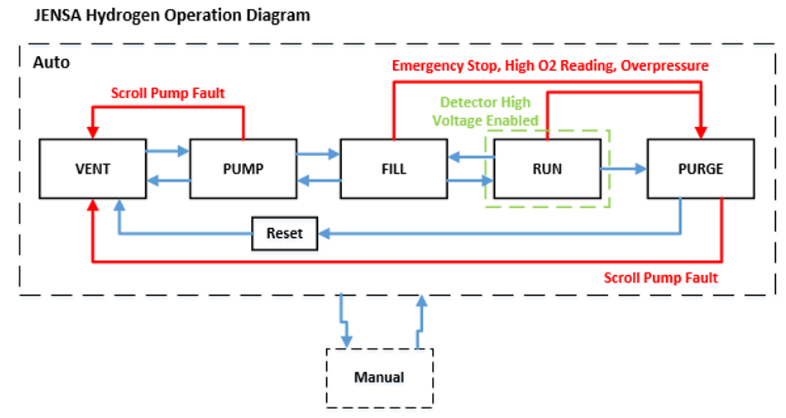
   
   The schematics of SECAR's extended gas target's operation. The blue arrows show you which modes can be switched to one another. The red arrows indicate interlocks. The rectangles are operation modes, all of which have automatic control except the manual mode of operation. The PIPS detectors can only be biased in the :code:`run` mode of operation. Image courtesy of Brandon Ewert.

.. _operation_state:
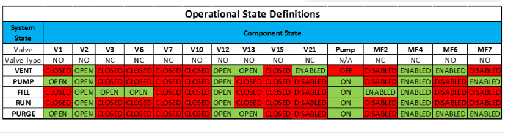
   
   This schematics displays all the automatically controlled devices of the SECAR's extended gas target's GHS. Image courtesy of Brandon Ewert.

Supplemental Controls
~~~~~~~~~~~~~~~~~~~~~

The main CAEN power supply for the two in-vacuum PIPS detectors of the extended gas target can be turned ON/OFF from the controls located in this section via the :code:`ON_CMD` button. The power status of this power supply can be known by looking at the :code:`ON_RCMD` readback indicator (1 or green means ON, 0 or red means OFF). The two in-vacuum PIPS detectors can only be biased when:

- The reset button (|reset|) found under operating mode controls section of the CS-Studio control page is pressed AND 
- If the oxygen level is below :math:`0.4\%` AND 
- The system is in the :code:`run` mode of operation AND 
- The pressures read by the :code:`SCR_BTS34:CMG_D1465K` and :code:`SCR_BTS34:CMG_D1465M` gauges are below 25 Torr and 10 mTorr, respectively. 
  
Only then, these detectors can be biased by first turning ON their positive HV card via the :code:`EN_CMD_POS1` button located in the "Supplemental Controls". The :code:`EN_CMD_NEG2` to :code:`EN_CMD_NEG4` buttons located in the "Supplemental Controls" turn ON the three negative HV cards used to bias the BGO array detectors. Therefore, these cards should be turned ON before biasing the individual BGO array detectors.

For more information about the power supply, please see :numref:`caen_section`.

Extended Gas Target Vacuum System
---------------------------------

This section describes how to turn ON/OFF the high vacuum pumps and the scroll pump of the extended gas target.

.. _setting_up_high_vacuum:

How to Turn Pumps ON
~~~~~~~~~~~~~~~~~~~~

After the extended gas target is vented and fully closed up:

- Ensure that all flanges are closed and all bolts are tightened.
- Check to ensure the first beamline gate valve of SECAR (:code:`SCR_BTS35:BGV_D1483`) and the last ReA beamline gate valve (:code:`ReA_BTS34:BGV_D1450`) are closed.
- Make sure :code:`V4` and :code:`V5` are closed and :code:`V8` and :code:`V9` are both open. These are manual valves on the gas handling system.
- Make sure the scroll pump's power switch is in OFF state (only then it will be remotely controlled). The pump will be turned ON by the control software when you switch to the :code:`pump` mode of operation. It will be turned OFF again by the control software when you switch to the :code:`vent` mode of operation.
- Make sure the manual :code:`AIR VENT` valve located on the scroll pump is fully closed.
- Make sure the :code:`V21` vent valve is closed (this valve can only be controlled using :code:`MAN` mode or :code:`vent` mode).
- Make sure the intentional air leak valve and its associated needle valve are closed (see :numref:`air_leak_valve`).
- Close the manual valve on the roughing pump (:code:`VROUGH`).
- Make sure the scroll pump's control cable, as well as all the control cables for all valves of the gas handling system are in place (see :numref:`solenoids`), properly connected (see :numref:`solenoid_table`), and secured.
- Make sure mass flow meters :code:`MF2`, :code:`MF4`, :code:`MF6` and :code:`MF7` are properly connected and the needle valves for :code:`MF6` and :code:`MF7` are in the locations they should be: flow rates should be 1000 sccm.

.. _scroll_power:

.. list-table::
   
   * - .. figure:: Figures/IMG_3294.jpg
   
   * - .. figure:: Figures/IMG_3295.jpg

          The JENSA scroll pump should be left at the OFF state and the interlock cable should be connnected to it. Only then, it can be remotely controlled.

.. _air_leak_valve:
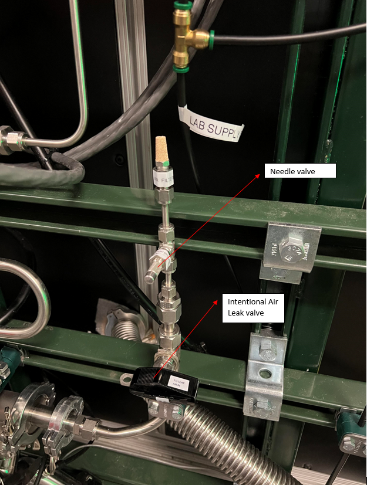
   
   This valve should always be closed unless one wants to test the integrity of the oxygen sensor via creating an intentional air leak, which can be done by the needle valve shown in the photo. The yellow metallic cone is an air filter.

.. _solenoids:
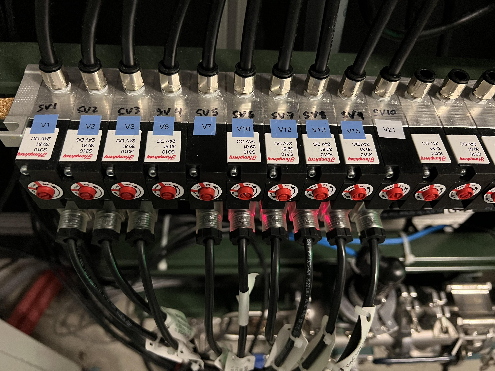
   
   The valves of the gas handling system need to be properly (see :numref:`solenoid_table`) connected to these solenoid valves before the system can be operated.

.. _solenoid_table:
.. table:: All the automatically controlled valves of the GHS should be properly connected to a solenoid valve according to this table. Those valves not listed here are manually controlled and are not connected to any solenoid valve.

 =========  ==============
 GHS Valve  Solenoid Valve
 V1         SV1
 V2         SV2
 V3         SV3
 V6         SV4
 V7         SV5
 V10        SV6
 V12        SV7
 V13        SV8
 V15        SV9
 V21        SV10
 =========  ==============

.. important::

   At the moment, :code:`V7` is connected to :code:`SV4` and :code:`V6` is not connected to any solenoid valve. This is how we have so far run the gas target with helium. Once you purchase hydrogen and get all the necessary approval for hydrogen operation, please connect :code:`V7` properly to :code:`SV5` and :code:`V6` to :code:`SV4`. Then, please talk to Brandon Ewert and ask him to test the system once more with :code:`V7` properly connected to its solenoid valve.

- Make sure the water valves to the turbo pumps are all ON located on the manifold near SECAR's first quadrupole (see :numref:`water_manifold`). One of these valves is closed and shall remain closed as it was for the Monster turbo pump, which is not used with the extended gas target.
- Turn ON main laboratory supply of water flow (see :numref:`main_water`) by first turning OFF the bypass valve, then turning ON the water return valve and finally turning ON the water supply valve. The supply line has a high pressure and should be closed first and opened last.
- Open the CS-Studio control page of the gas target (see :numref:`CSS_Screen`).
- Click on :code:`Pump` button under operating mode controls found on the control page.
- Open the valve with black handle labelled as "To Leak Air In" but leave the needle valve labelled as "For Intentional Leak" fully closed (see :numref:`air_leak_valve`).
- Slowly open the manual valve on the scroll pump (:code:`VROUGH`) and listen carefully for large leaks and abnormal sounds. If the pump sounds normal, fully open the manual roughing valve.
- Check the capacitance manometers to ensure the pressure is decreasing at a good speed.
- Once the pressure inside the gas target reaches 0.5 - 1 Torr:
    
    - Close the valve with black handle labelled as "To Leak Air In" (see :numref:`air_leak_valve`).
    - Turn ON the DV650 screw pumps and wait till all three of them reach full speed (120 Hz). Make sure the pumps' indicators are all green and are running at full speed. To turn these pumps ON, you need to go to the ReA3 high bay. Find their control panel (see :numref:`DV650_panel`).
        
        - Make sure water is flowing (one of the above-mentioned steps).
        - The panel is a touch panel. Touch the "GRAPHIC" on the bottom of the panel. A schematics diagram shows up, and you will see a red pump and two yellow pumps.
        - On top of the diagram, find "System #1 Control Panel" button and touch it.
        - A new window pops up. Touch "System Run".
        - At this point two of the pumps turn green and start increasing their speed but one still remains red. To reset the pump that has not turned ON, immediately after touching "System Run", touch the "Fault Reset" button (at the bottom of the page) and keep pressing it for a few seconds until the red pump also turns green and starts increasing its speed. Release the button at that point. 
        - Wait till all three pumps reach 120 Hz (full speed). They will accelerate above 60 Hz and you will hear a different frequency after 60 Hz. 
        - Once they reach 120 Hz, you will hear some high pitched noise and they may turn yellow momentarily and go down in frequency by a few Hz but they will ramp up and turn green soon again.
        - If at any point, you hear a valve going, it is because the pumps fail due to not having a good water flow. Check their water flow if they fail.
        - Make sure all three pumps are ON, green and are running at 120 Hz before moving on to the next step.

.. _DV650_panel:
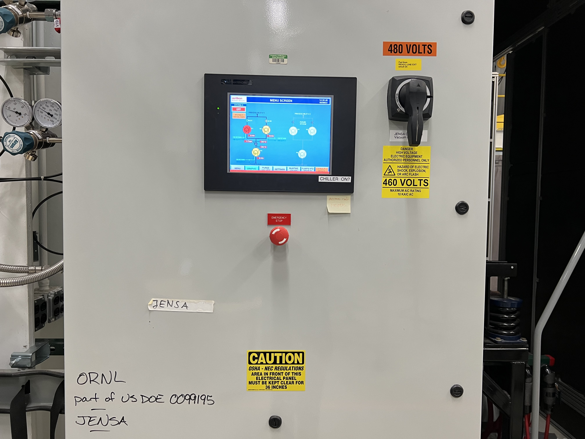
   
   The touchable control panel for the DV650 screw pumps.
    
- Make sure both fans on the side of the JENSA compressor noise enclosure (see :numref:`fans`) are ON and running.
- Make sure the main 208 V power for the Roots blower pumps is ON (the handle should point up, see :numref:`Rootspump_rack`). Turn ON the Roots blower pumps sequentially from pump 1 to pump 6 skipping pump 4, which is disconnected for the extended gas target. Wait 10 seconds between turning each pump ON to avoid overwhelming the circuit breaker. The first two Roots blower pumps are underneath the noise reducing enclosure around the JENSA compressor.
- Turn ON the turbo pumps with the following sequence:
        
   - Upstream 1 and downstream 1. From this step onwards, wait 10 seconds between each step to avoid overwhelming the circuit breakers.
   - Upstream 2 and downstream 2.
   - Upstream 3 and downstream 3.
   - Upstream 4 and downstream 4.
- Turn ON all 8 cold cathode gauges. These gauges have protection circuits and will turn themselves OFF if the pressure is too high. They may show :math:`10^{-11}` Torr or read "WAIT", both of which indicate the gauge is not ON. Wait for a while and they will turn ON. The better the vacuum, the more time it takes for them to come ON. These gauges can be read remotely via the :code:`JENSA` CS-Studio page, located under "SECAR Global Controls" (see :numref:`jensa_css`). However, Dan Crisp is in the process of changing this page, so by the time you read this manual, this page may not exist anymore and it may look a whole lot more awesome than the clutter you see in :numref:`jensa_css`.
- Wait till all turbos reach their full speed: their LED lights shown as load will sequentially go all the way up and come all the way down. Once at full speed, there should be no load on them and only 1 LED light should be ON. The Varian turbo pump (used as the upstream 3 pump and labelled as "Temp UP 3") does not have any load LEDs. It should be rotating at 42k RPM when at full speed.
- The last ReA beamline gate valve has an interlock with the :code:`SCR_BTS34:CCG_D1456` gauge, which is set to math:`5\times10^{-7}` Torr. If the pressure read by this gauge is above this limit, the gate valve cannot be opened. Once the pressure reaches below the aforementioned set point, one would need to reset this PV: :code:`SCR_BTS34:CCG_D1456:VAC_RST_CMD` and only then, the gate valve can be opened.
- The first SECAR beamline gate valve (:code:`SCR_BTS35:BGV_D1483`) has an interlock with the :code:`SCR_BTS34:CCG_D1471` gauge, which is set to :math:`1\times10^{-6}` Torr. If the pressure read by this gauge is above this limit, the gate valve cannot be opened. Once the pressure reaches below the aforementioned set point, one would need to reset this PV: :code:`SCR_BTS34:CCG_D1471:VAC_RST_CMD` and only then, the gate valve can be opened.

.. _water_manifold:
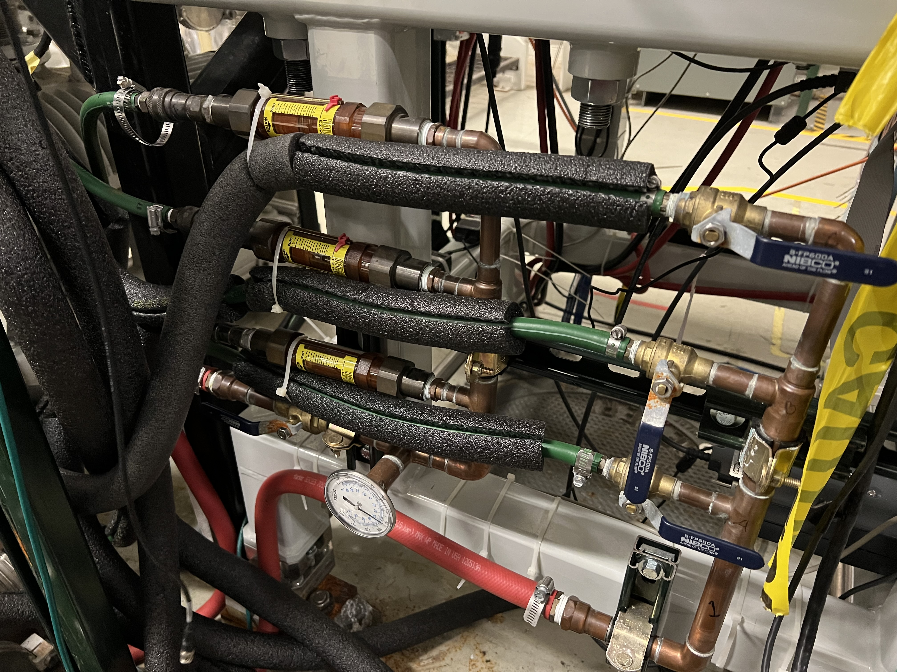
   
   This water manifold can be found near the first quadrupole magnet of SECAR near the ground and supplies the water to the JENSA turbo pumps. There is only one return valve with a thermometer on it. There are 3 supply valves, one of which is for the Monster turbopump and should remain closed for the extended gas target configuration.

.. _main_water:
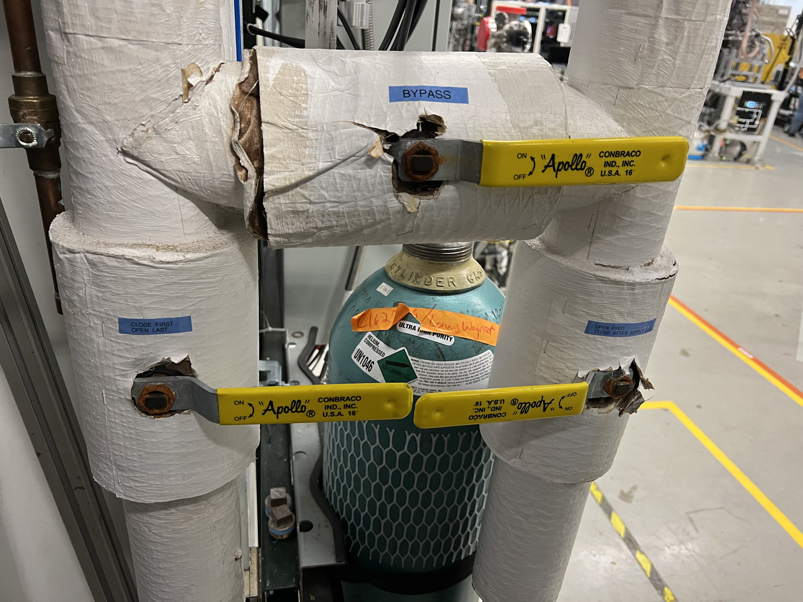
   
   The main water supply lines for the JENSA turbo pumps.

.. _fans:
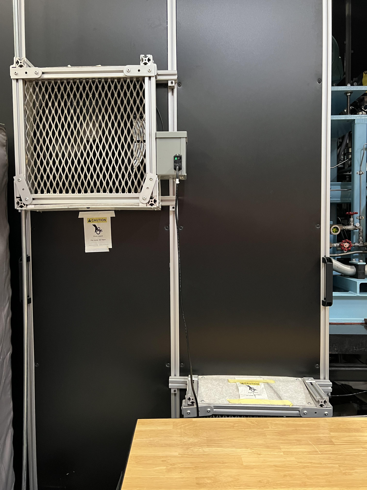
   
   These two fans (one hidden behind the toolbox) should be ON whenever the pumps underneath the JENSA compressor's noise enclosure are running.

.. _jensa_css:
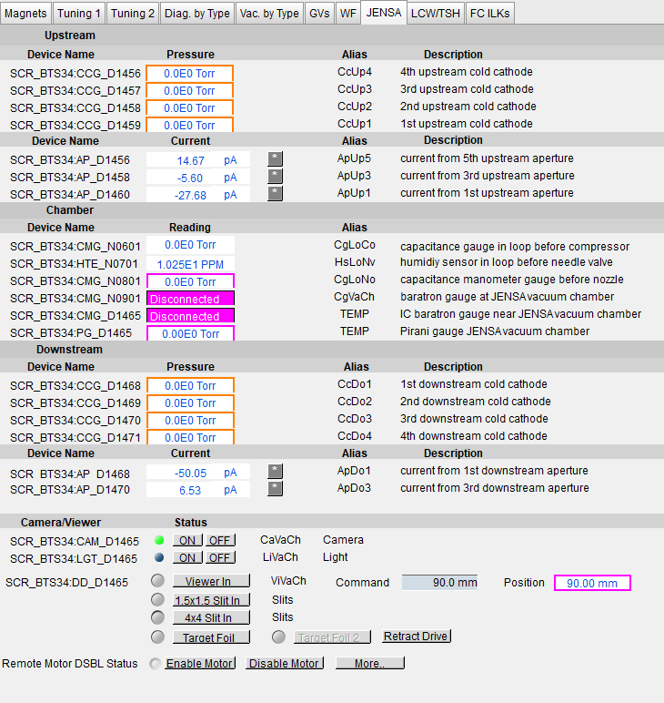
   
   This CS-Studio page can be used to remotely access the readback of the 8 cold cathode gauges of the gas target.

.. _pumps_off:

How to Turn Pumps OFF
~~~~~~~~~~~~~~~~~~~~~

This section should be executed ideally prior to venting or very soon after venting starts (which occurs either via commanding to vent by clicking on :code:`vent` mode or after an emergency when the control software automatically switches to :code:`vent` mode).

To turn the high vacuum pumps OFF, follow these steps:

- Make sure the first SECAR beamline gate valve (:code:`SCR_BTS35:BGV_D1483`) and the last ReA beamline gate valve (:code:`ReA_BTS34:BGV_D1450`) are both closed.
- Make sure it is safe to re-enter the ReA3 vault if the gas target was running hydrogen. If so, follow the procedure in :numref:`reentry` to re-enter the ReA3 vault.
- In ReA3 high bay, find the JENSA turbo pump rack near the target area shown below (see :numref:`pump_rack`).

.. _pump_rack:
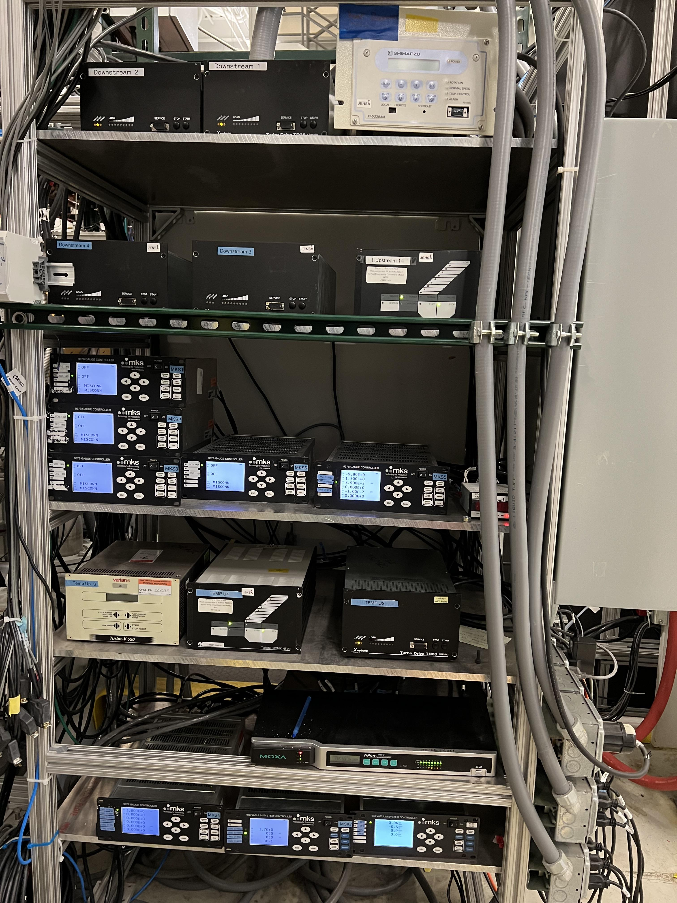
   
   This rack contains all the controllers for JENSA and extended gas target's turbo pumps, cold cathode gauges, the controllers for the mass flow meters of the gas handling system, and the controllers for the capacitance manometer gauges of the gas handling system. The white controller on the top right is for the Monster turbo pump used only with the jet target.
        
.. _Rootspump_rack:
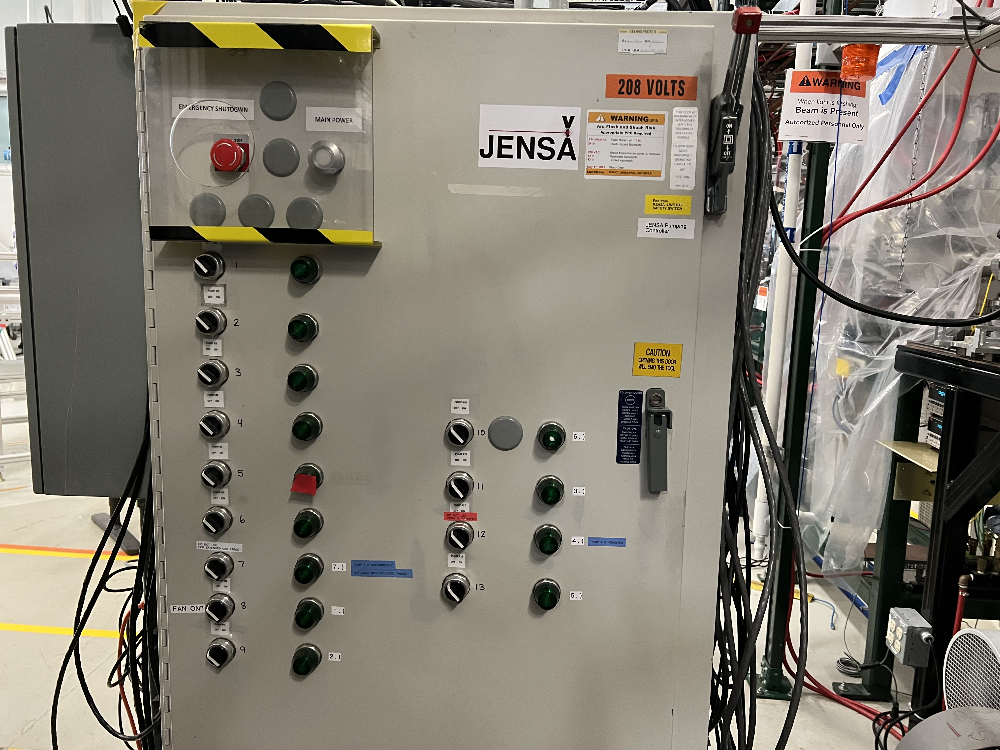
   
   This rack is located at the back of the rack shown in :numref:`pump_rack` and contains the controllers for all Roots blower pumps. The main power button on the top does not show any light when it is ON. 
   
- Turn OFF all 8 cold cathode gauges using the gauge controllers.
- Turn OFF turbo pumps following the sequence below. Wait 10 seconds after each step to avoid overwhelming the circuit breaker:
    
    - Upstream 4 and downstream 4.
    - Upstream 3 and downstream 3.
    - Upstream 2 and downstream 2.
    - Upstream 1 and downstream 1.
- Turn OFF the Roots blower pumps from pump 6 to pump 1 (i.e., in reverse order) while waiting 10 seconds after each step before switching the next pump OFF. Roots blower pump #4 (and also Roots blower #7) is disconnected for the extended gas target cofiguration.
- Turn OFF the DV650 pumps.
    
    - Go to their control panel (see :numref:`DV650_panel`).
    - Touch the "GRAPHIC" on the bottom of the panel. A schematics diagram shows up, and you will see 3 green pumps running at 120 Hz.
    - Touch "System #1 Control Panel" button. A window pops up.
    - Touch "SYSTEM STOP" to stop all pumps. You will hear a valve going and one of the pumps turns red, and all of them start slowing down. The other two pumps turn yellow at some point. When they reach 0 Hz, they are fully OFF.
    - Close the "System #1 Control Panel" window.
- Make sure all of the turbo pumps have spun down and there is no load on any of them. All LEDs except those indicating power will be OFF when the turbos have spun down all way to 0 Hz. The Varian pump (labelled as "Temp UP 3") shows "Start pump" when the turbo pump is OFF. However, this pump keeps spinning for a long time (up to 2 hours sometimes) so to ensure it stops spinning, turn its controller's power OFF and wait for it to spin down.
- Turn OFF the main water supply lines shown in :numref:`main_water` (do not touch the small manifold near the first quadrupole magnet shown :numref:`water_manifold`) by first closing the supply valve, then the bypass, and finally the return valve.
- Turn OFF the big fan found in the walkway near the south wall facing the target chamber.
- If you want to vent the system, see :numref:`vent_non_explosive_gas` if the system was running a non-explosive gas such as helium, and see :numref:`vent_hydrogen` if the system was running hydrogen. Otherwise, stop here.

.. _zero_gauges:

How to Zero the Capacitance Manometer Gauges
~~~~~~~~~~~~~~~~~~~~~~~~~~~~~~~~~~~~~~~~~~~~

Every time the gas target needs to be operated, make sure you follow the instructions given here to zero the capaciatance manometer gauge :code:`SCR_BTS34:CMG_D1465K`, which reads the pressure in the gas cell. **You can do the same for all other gauges but before that, you need to ensure the pressure is lower than a threshold (indicated by the controller for each of these gauges) before you zero the gauge. Or else, you risk making the gauge inaccurate by introducing an offset in its reading.**

To zero the capacitance manometer :code:`SCR_BTS34:CGM_D1465K`:, which reads the gas cell pressure:

- Make sure the system is under high vacuum with all pumps up and running.
- **Make sure the pressure is below 1 mTorr. If not, do not continue with the next steps.**
- Go to the pumps controller rack (see :numref:`pump_rack`) and find the :code:`MKS5` controller unit.
- Using the up/down arrow buttons, select the :code:`CMG D1465K` gauge. When this is selected, a green LED indicator will be lit beside this label.
- Press on the :code:`Channel Setup` button.
- Using the up/down and left/right arrow buttons, select the :code:`No` entry (it will be highlighted blue) to the right of :code:`Manual Zero`.
- Press :code:`Enter`. At this point the highlight color turns black.
- Press on the up or down button once. The :code:`No` changes to :code:`Yes`. Once this is the case, press :code:`Enter` again to make the change.
- Press on the :code:`ESC` button.

Operation of the Extended Gas Target with a Non-Explosive Gas
-------------------------------------------------------------

When the gas target needs to be operated with a non-explosive gas such as helium, do the following:

Filling the pumped down system with target gas
~~~~~~~~~~~~~~~~~~~~~~~~~~~~~~~~~~~~~~~~~~~~~~

- Make sure the gas target is under high vacuum (see :numref:`setting_up_high_vacuum`) and that the mode of operation is set to :code:`pump` mode.
- Zero the :code:`SCR_BTS34:CMG_D1465K`, :code:`SCR_BTS34:CMG_D1465M` and :code:`SCR_BTS34:CMG_D1465E` capacitance manometer gauges (:numref:`zero_gauges`) if they show an offset.
- Using the probe functionality in CS-Studio, verify that :code:`MF7` is CLOSED: open the probe window and search this PV: :code:`SCR_BTS34:MFC_D1465A:MODE_CSET_MFC`. Then, enter :file:`CLOSE` under new value and hit :code:`Enter`. :code:`MF7` is used to dilute the exhaust during hydrogen operation. When the gas target is running any other gas, this mass flow meter should be closed to avoid wasting the dry nitrogen.
- Using the probe functionality in CS-Studio, verify that :code:`MF2` is CLOSED: open the probe window and search this PV: :code:`SCR_BTS34:MFC_D1465B:MODE_CSET_MFC`. Then, enter :file:`CLOSE` under new value and hit :code:`Enter`. :code:`MF2` is used to control the filling rate. One should start with the closed valve to make sure the target is only filled when its ready. 
- Using the probe functionality in CS-Studio, verify that :code:`MF4` is OPEN: open the probe window and search this PV: :code:`SCR_BTS34:MFC_D1465D:MODE_CSET_MFC`. Then, enter :file:`OPEN` under new value and hit :code:`Enter`.
- Click on :code:`MF4` indicator on the CS-Studio control page. A small window pops up. Make sure the flow set point is set to fully open (flow = 500 sccm).
- Switch the operating mode from :code:`pump` mode to :code:`fill` mode.
- Click on :code:`MF2` indicator on the CS-Studio control page. A small window pops up. Set the flow to 100 sccm.
- Watch the gas pressures inside the gas target and the foreline. Once the desired gas pressure inside the gas target, read by capacitance manometer G11 (:code:`SCR_BTS34:CMG_D1465K`), is reached, set :code:`MF2` flow set point back to 0 sccm.
- Switch to :code:`run` mode of operation to recirculate the gas. To operate the detectors, see :numref:`PIPS_operation`.
- Once in :code:`run` mode, set :code:`MF4` to SETPOINT mode using the Probe functionality (see above)
- Adjust :code:`MF4` (by clicking on :code:`MF4` indicator on the CS-Studio control page) set point for regulating the flow to the gas target. **It is recommended to set the flow setpoint of MF4 to the actual flow readback that it is reading.** This action ensures better stability of the pressure inside the gas target, as opposed to leaving :code:`MF4` fully open (flow = 500 sccm).
- While in :code:`run` mode, if the gas pressure has to be increased, you may be able to adjust :code:`MF4` and get the desired new pressure. If the desired pressure is higher than what is available in the system, the system can be switched back to :code:`fill` mode until the desired pressure is reached in the gas target. In that case, before switching to :code:`fill` mode:
    
    - Stop the DAQ and scalers if they are running.
    - Debias the PIPS detectors safely (see :numref:`PIPS_operation`).
    - Fully open :code:`MF4` to have a flow of 500 sccm. 
    - Then, switch to :code:`fill` mode.
    - Open :code:`MF2` to 100 and allow the gas target's pressure to reach the desired value. 
    - Then, set :code:`MF2` flow setpoint to 0 sccm. 
    - Finally, switch back to :code:`run` mode and readjust :code:`MF4` flow to its actual readback flow.
    - Bias the PIPS detectors again.
- If the system is in :code:`run` mode, and the system has to be switched to :code:`pump` mode:
    
    - First make sure DAQ and scalers are stopped.
    - Then, the in-vacuum detectors should be safely de-biased (see :numref:`PIPS_operation`).
    - Switch to :code:`fill` mode without changing the flow rate of :code:`MF2` (leave it at 0 sccm). Immediately after that, switch to :code:`pump` mode.
- While in :code:`run` or :code:`fill` mode, carefully monitor the oxygen content indicated by the oxygen sensor readback located on the supplement controls section of the gas handling system's control page. Make sure it does not rise. If it is rising, you have a leak in the system. Depending on how fast it is rising, you may need to interrupt the operation and either purge the system manually (see :numref:`manual_purge_non_explosive_system`) or stop and leak check the gas target.

.. warning::

   The system will automatically be switched to :code:`purge` mode if the oxygen level in the system, detected by the oxygen sensor, reaches :math:`0.4\%` while the system is in :code:`fill` or :code:`run` mode.

- If you need to leave the system under high vacuum, switch to :code:`pump` mode (if in :code:`run` mode, stop DAQ and turn off the in-vacuum detectors, then you need to first go to :code:`fill` mode, and immediately switch to :code:`pump` mode).
- If you need to change to :code:`MAN` mode, you can do so from any operating mode. Just remember to press on :code:`Auto` when you want to switch to another mode from the :code:`MAN` mode. After pressing on Auto, all normally open valves will be opened. So, if the high vacuum pumps are ON:
    
    - Make sure :code:`MF6` is set to 1000 sccm and :code:`V21` is closed before going to :code:`Auto` mode.
    - Once in :code:`Auto` mode, switch immediately to :code:`pump` mode.
    - If high vacuum pumps are OFF and you switch to :code:`Auto` mode, you can go to :code:`vent` mode or :code:`pump` mode from the :code:`Auto` mode.
- To vent the system, see :numref:`vent_non_explosive_gas`.

.. _manual_purge_non_explosive_system:

Purging System Manually in case of a Slow Rising Oxygen
~~~~~~~~~~~~~~~~~~~~~~~~~~~~~~~~~~~~~~~~~~~~~~~~~~~~~~~

If oxygen is rising when the system is being filled with a gas, it could be the case that the oxygen is coming into the system because of some previously trapped oxygen in the gas supply line. In that case, a thorough purging of the system helps getting rid of this trapped oxygen. To do this:

- While the high vacuum pumps are ON, switch to :code:`pump` mode (if the system is in :code:`run` mode initially, stop DAQ and turn off the in-vacuum detectors. You then have to switch to :code:`fill` and then immediately switch to :code:`pump` mode).
- Switch to the :code:`MAN` mode of operation and make sure the roughing pump is ON and :code:`V1` is open. Make sure :code:`V13` is closed.
- Set the flow of :code:`MF4` to 500 sccm. 
- Set the flow of :code:`MF2` to 100 sccm. Open :code:`V3` and :code:`V7`. Let the system be filled with helium for at least 1 hour.
- After an hour of purging the system, set the flow of :code:`MF2` to 0 sccm. Close :code:`V3` and :code:`V7`.
- Keep the scroll pump ON and leave :code:`V1` open and let the system run like this (pumping the gas out in non-recirculating state) for at least another 1 hour or more. 
- These actions will hopefully flow the trapped air out of the system and may help stopping the oxygen content from rising.

Removing Non Explosive Target Gas and Leave System Pumped Down
~~~~~~~~~~~~~~~~~~~~~~~~~~~~~~~~~~~~~~~~~~~~~~~~~~~~~~~~~~~~~~
If the system is in :code:`run` mode:
    
- Stop DAQ and scalers.
- Safely debias the PIPS detectors.
- Verify :code:`MF6` is set to 0 sccm - for non explosive gas we do not need to purge with nitrogen
- Press on the |emergencystop| button to initiate a purge.
- Press on the |reset| button.
- Switch to :code:`vent` mode.
- Switch to :code:`pump` mode.
- The gas will then be pumped out and the system will go to high vacuum

.. _vent_non_explosive_gas:

Venting the System after Running with a Non Explosive Gas
~~~~~~~~~~~~~~~~~~~~~~~~~~~~~~~~~~~~~~~~~~~~~~~~~~~~~~~~~

To vent the system after running the gas target with a non-explosive gas, do the following:

- If the system is in :code:`run` mode when it is decided to vent the system:
    
    - Stop the DAQ and scalers if they are running.
    - Safely shut down the in-vacuum detectors (see :numref:`PIPS_operation`). 
    - Ensure :code:`MF2` is set to 0 sccm. Then, switch to :code:`fill` mode and immediately after switch to :code:`pump` mode.
- Make sure the first beamline gate valve of SECAR (:code:`SCR_BTS35:BGV_D1483`) is closed.
- Make sure ReA's last beamline gate valve (:code:`REA_BTS34:BGV_D1450`) is closed.
- While in :code:`pump` mode, turn all the high vacuum pumps OFF (see :numref:`pumps_off`).
- Wait until all the turbo pumps fully spin down to zero.
- Put your hands on each of the turbo pumps and make sure you do not feel any vibration. Only then, you can safely say the turbo pumps are OFF.
- Turn OFF the main water supply lines shown in :numref:`main_water` by first closing the supply valve, then the bypass, and finally the return valve.
- Turn OFF the big fan found in the walkway near the south wall facing the target chamber.
- You can now have the option to vent with air or with dry nitrogen. The latter is a safer option because it keeps the system dry and dust free.

To quickly vent the system with air **(this action should only be allowed if the system has not been operated with hydrogen recently)**:

- Switch to :code:`MAN` mode of operation.
- Close the manual roughing valve (:code:`VROUGH`) on the scroll pump.
- Open the manual :code:`Air Vent` valve (see :numref:`air_vent`) on the scroll pump slowly. Once the pressure gauges in the gas handling system read 730 – 760 Torr, the system is vented. Note that :code:`SCR_BTS34:CMG_D1465K` and :code:`SCR_BTS34:CMG_D1465M` will only read 100 Torr and 1 Torr, respectively, since these are the maximum pressures reached by these two gauges.

.. _air_vent:
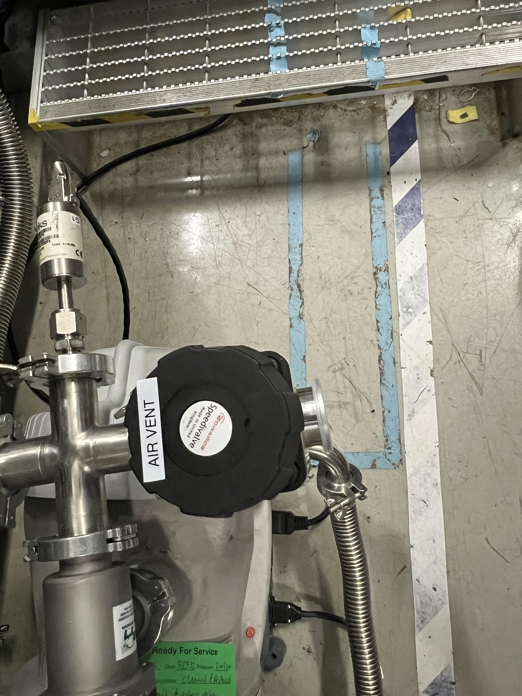
   
   This vent valve attached to the JENSA scroll pump vents the system with air without any filteration. 

To vent with dry nitrogen:

- Open the CS-Studio control page of the gas target (see :numref:`CSS_Screen`).
- Using the probe feature of CS-Studio, make sure :code:`MF4` is open: :code:`SCR_BTS34:MFC_D1465D:MODE_CSET_MFC` should have :file:`OPEN` in its "Value". If "Value" is :file:`CLOSE`, enter :file:`OPEN` under "New Value" and hit :code:`Enter`. Make sure Value changes to :file:`OPEN`.
- Using the probe feature of CS-Studio, make sure :code:`MF6` is also open: :code:`SCR_BTS34:MFC_D1465F:MODE_CSET_MFC` should have :file:`OPEN` in its "Value".
- Set :code:`MF6` to 10000 sccm.
- Switch to :code:`vent` mode of operation. This will turn the scroll pump OFF.
- Check the nitrogen regulator of the lab nitrogen supply line shown in :numref:`nitrogen_regulator` and make sure it is locked on 5 psi.

.. _nitrogen_regulator:
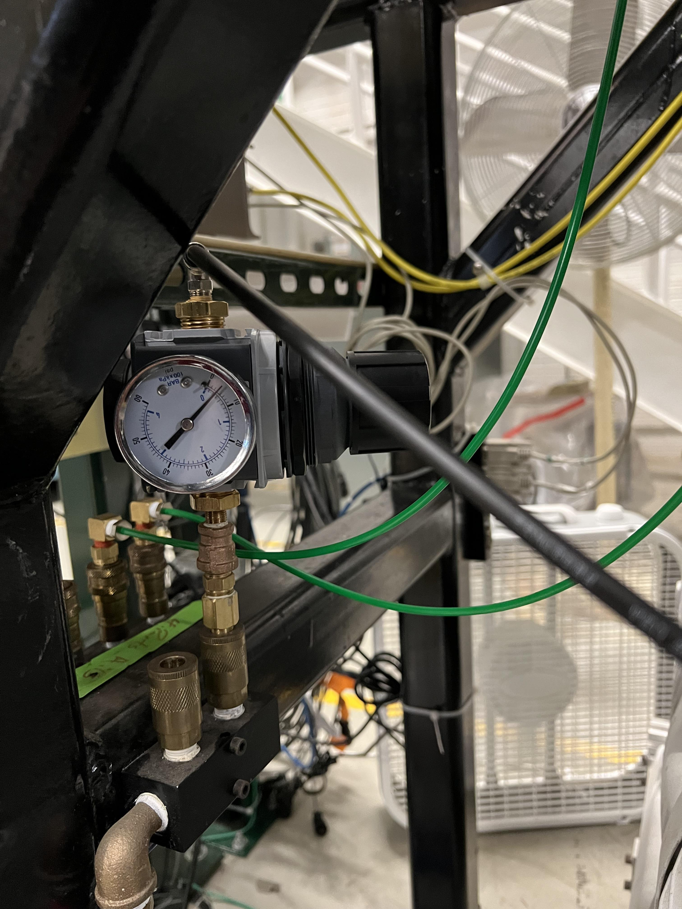
   
   This regulator, located below the SECAR Keithley modules, is locked to flow 5 psi of dry nitrogen from the laboratory nitrogen supply line into the SECAR's gas handling system for the targets. 

- Open :code:`V21` by clicking on the :code:`o` button underneath the valve on the CS-Studio control page.
- Monitor the pressure gauges. If they are coming up too slowly, open the metallic needle valve shown in :numref:`vent_nitrogen` all the way. If the system is venting too quickly, reduce the flow rate of :code:`MF6` to 5000 sccm and/or adjust the metallic needle valve shown in :numref:`vent_nitrogen`. **Please avoid changing the regulator to speed up venting process or else you need to change it back to where it was to have a safe flow of dry nitrogen for purging.** Once the pressure gauges read 730 – 760 Torr, the system is fully vented. Note that :code:`SCR_BTS34:CMG_D1465K` and :code:`SCR_BTS34:CMG_D1465M` will only read 100 Torr and 1 Torr, respectively, because these gauges reach a maximum of 100 Torr and 1 Torr, respectively. With the nitrogen regulator locked at 5 psi, the dry nitrogen flow rate through :code:`MF6` is about 7.4 standard liters per minute. The total volume of the system is about 421 liters so it takes a bit more than 1 hour to vent the system.
- Close :code:`V21` and its needle valve (see :numref:`vent_nitrogen`).

.. _vent_nitrogen:
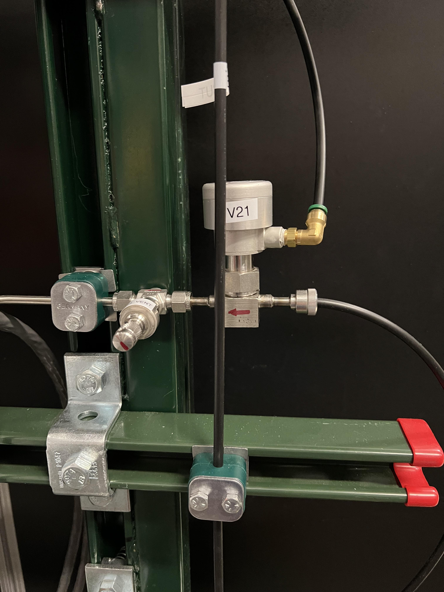
   
   This needle valve, labelled "For Vent" should only be opened when one wants to speed up the venting (with dry nitrogen) process by openning :code:`V21` valve, which can only be opened if the system is in :code:`MAN` or :code:`vent` mode of operation. Please close the needle valve when the system is fully vented.

- Set :code:`MF6` flow rate to 1000 sccm to make it safe again for purging in case the system switches to :code:`purge` mode automatically the next time the system is running.
- Switch to :code:`MAN` mode of operation and close :code:`V13` valve.
- Close the manual valve (:code:`VROUGH`) on the roughing pump.
- If the system has to be opened to air (for example, something in the chamber needs to be taken off the beamline) or if the system is not going to be used for a long time, close :code:`MF6` via :code:`SCR_BTS34:MFC_D1465F:MODE_CSET_MFC` PV name that can be accessed using probe functionality of CS-Studio: under "New Value", send :file:`CLOSE` command and verify that "Value" :math:`=` :file:`OPEN` changes to "Value" :math:`=` :file:`CLOSE`.
- If you have to open the gas target's chamber:
    
    - Please ware gloves.
    - Please clean the gloves with rubbing alcohol.
    - Using alcohol or acetone and lint free Kim wipes, please clean all sealing surfaces, o-rings and all other surfaces that are to be inserted into the vacuum chamber.
    - Please try to avoid using vacuum incompatible material.
    - If required to use tools, please clean them before using them on or around the vacuum chamber.
    - Please try to limit the time of exposure of the vacuum chamber to air.
    - Please close all flanges properly if the chamber has to be vented for an extended period of time to avoid accumulation of dust and moisture.
    - When you are ready to close the system and pump down, use Apiezon L or M grease on the o-rings.

If for some weird reason, :code:`vent` mode has some issue and you cannot use it, venting the system can be achieved using the :code:`MAN` mode of operation. To do this:

- Set :code:`MF4` to :file:`OPEN` and a flow setpoint of 500 sccm.
- Set :code:`MF6` to :file:`OPEN` and a flow setpoint of 10000 sccm.
- Switch to :code:`MAN` mode of operation.
- Close the manual roughing valve (:code:`VROUGH`) on the JENSA scroll pump.
- Check the nitrogen regulator of the lab nitrogen supply line shown in :numref:`nitrogen_regulator` and make sure it is locked on 5 psi.
- Open :code:`V21` by clicking on the :code:`o` button underneath the valve on the CS-Studio control page.
- Open the metallic needle valve shown in :numref:`vent_nitrogen` all the way. If the system is venting too quickly, reduce the flow rate of :code:`MF6` to 5000 sccm and/or adjust the metallic needle valve shown in :numref:`vent_nitrogen`. **Please avoid changing the regulator to speed up venting process or else you need to change it back to where it was to have a safe flow of dry nitrogen for purging.** Once the pressure gauges read 730 – 760 Torr, the system is fully vented. 
- Close :code:`V21` and its needle valve (see :numref:`vent_nitrogen`).
- Set :code:`MF6` flow rate to 1000 sccm to make it safe again for purging in case the system switches to :code:`purge` mode automatically the next time the system is running.
- Close :code:`V13` valve.
- If the system has to be opened to air (for example, something in the chamber needs to be taken off the beamline) or if the system is not going to be used for a long time, close :code:`MF6` via :code:`SCR_BTS34:MFC_D1465F:MODE_CSET_MFC` PV name that can be access using probe functionality of CS-Studio: under "New Value", send :file:`CLOSE` command and verify that "Value" :math:`=` :file:`OPEN` changes to "Value" :math:`=` :file:`CLOSE`.

Emergency Shutdown Procedure for Non-Explosive Gas
~~~~~~~~~~~~~~~~~~~~~~~~~~~~~~~~~~~~~~~~~~~~~~~~~~~

see `Emergency Response Procedure for SECAR Extended and Jet Gas Targets During Helium Operation <https://portal.frib.msu.edu/sites/dcc/pages/dcclink.aspx?WBS=M41600&Sub=PR&SN=001537>`_.

How to Change the Non-Explosive Gas Bottle
~~~~~~~~~~~~~~~~~~~~~~~~~~~~~~~~~~~~~~~~~~

If at any time, the non-explosive gas bottle runs out of the supply gas and needs to be changed, follow the procedure below:

- If the system is running with a non-explosive gas and the system is in :code:`run` mode when the gas bottle runs out of the supplied gas:
    
    - Stop the DAQ and scalers if they are running.
    - Safely de-bias the in-vacuum silicon detectors (see :numref:`PIPS_operation`).
- Switch to :code:`pump` mode and pump on the system for at least 15 minutes.
- Verify :code:`V7`, :code:`V6` and :code:`V3` are closed.
- Make sure the pressure gauges in the system read good vacuum (:math:`< 1` Torr) in the system. Note that :code:`SCR_BTS34:CMG_D1465M` should read below 20 mTorr. 
- Enter ReA3 vault. 
- Make sure you already have a cart to move gas bottles with, and you have snoop (a soapy mixture) ready.
- Make sure you have a new full gas bottle on the cart.
- Once in the vault, switch to the maintenance operation mode (:code:`MAN` mode).
- Verify :code:`V1` is open and the scroll pump is ON and all high vacuum pumps are still running.
- Close the small metallic valve after the non-explosive gas regulator (see :numref:`helium_valve`).

.. _helium_valve:
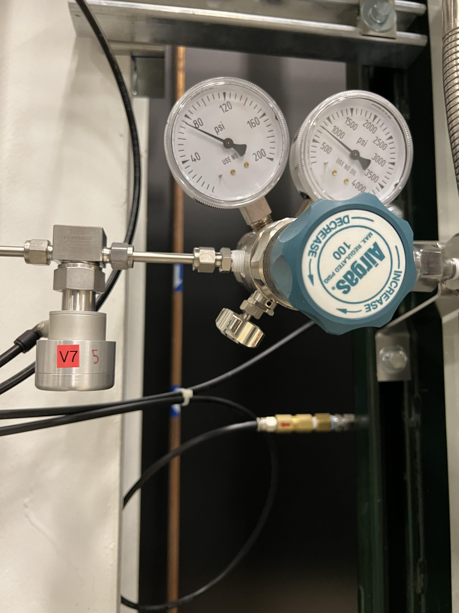
   
   Close the small mettalic valve attached to the regulator of the helium bottle before changing the gas bottle.

- Disconnect the gas bottle from the GHS. 
- Remove the empty non-explosive gas bottle and move the full new gas bottle into its place.
- Secure the new gas bottle by the belt which was around the empty gas bottle.
- Connect the new gas bottle to the GHS pipes and tighten the pipe fittings.
- Once the bottle is fully and securely attached to the GHS, open the main bottle's valve.
- Open the small metallic manual valve passed the regulator upstream of valve :code:`V7` (see :numref:`helium_valve`).
- Pour snoop on the new gas bottle's top area and the pipe fittings you just tightened and verify no bubbles are coming out.
- Make sure the bottle's regulator is set to 40 psi.
- Ask the OIC to perform sweep and lock of ReA3 high bay.
- Once you are back to the DataU, access the CS-Studio control page.
- Switch to :code:`Auto` mode, and immediately without any delay switch to :code:`pump` mode.
- Manually purge the system with the gas whose bottle was changed to remove any air bobbles. To do this, follow the procedure provided in :numref:`manual_purge_non_explosive_system`.
- Purge for at least 10 – 15 minutes.
- Switch to :code:`vent` mode and then immediately switch to :code:`pump` mode, and pump for at least another 15 minutes.
- Fill the system again with the desired gas to the desired pressure, and then switch to :code:`run` mode and carry out the rest of the experiment.

.. _interlocks:

Trouble Shooting
~~~~~~~~~~~~~~~~

If the GHS is unresponsive or multiple modes are indicated, for example, in case you forgot the reset after emergency stop the system can be recovered by: 

- Switch to manual mode
- Set by hand all valves to an appropriate mode configuration
- Switch to Auto mode

Interlocks and Alarms of the Extended Gas Target
------------------------------------------------

Interlocks and alarms that are put in place for operation of the extended gas target are summarized below. Almost all of these interlocks are related to hydrogen operation but all these interlocks occur regardless of which gas is in use. 

Interlocks:
~~~~~~~~~~~

The current interlocks are referenced in the DCC document  `N3010221-RC-008874<https://portal.frib.msu.edu/sites/dcc/pages/dcclink.aspx?WBS=N3010221&Sub=RC&SN=008874>`_

In the following the triggered event, and the conditions to trigger it are summarized for each interlock. The set points are set through the MKS controllers of the respective gauges. Interlock settings can be read off the MKS controllers by selecting the channel of interest using :code:`Channel Setup` (see Fig. :numref:`MKS5_channel_setup` for an example display). 
Each channel can trigger 2 interlocks indicated at the bottom of the screen. A pressure maximum is implemented as "ENABLE" below a maximum pressure. Unused interlocks are sending a CLEAR. 

- **Vent mode triggered** in :code:`purge` or :code:`pump` modes if:

    - **Scroll pump off**. For hydrogen operation it is critical that hydrogen can be removed when needed. This is usually done in the purge or pump modes. If the scroll pump fails, the vent mode will dilute the target gas with nitrogen, and eventually push gas into the exhaust via the overpressure valves. Once the hydrogen is removed the operatures need to address the root cause of the scroll pump failure, and then click on the |reset| button found under operating mode controls of the control page before the control software allows switching to another mode of operation. 

- **Purge mode triggered** during :code:`fill` or :code:`run` modes if:

    - **>:math:`0.4\%` oxygen**. This setpoint value is required to operate with hydrogen. Dry nitrogen is used to flush the system with capability to drive hydrogen out and to reduce hydrogen content in the system to low explosive levels. This triggers automatic removal of hydrogen in the event of a leak to atmosphere. The operators have to remember to click on the |reset| button found under operating mode controls of the control page before the control software allows switching to another mode of operation. From the :code:`purge` mode, you can only switch to :code:`vent` mode. If the high vacuum pumps are ON and you do not intend to vent the system, after the system is switched to :code:`vent` mode, immediately switch to :code:`pump` mode.
    - **Target pressure exceeds setpoint**. Target pressure is read by capacitance manometer G11 (:code:`SCR_BTS34:CMG_D1465K`). This setpoint should be adjusted to experiment requirements to be above planned max operating pressure to ensure there is no unexpected pressure increase that may indicate a leak to atmosphere or some other malfunction. 
    - **Foreline pressure exceeds 500 Torr**. The foreline pressure is read by capacitance manometer G2 (:code:`SCR_BTS34:CMG_D1465B`). This setpoint is required for hydrogen operation and ensures the amount of target gas is within the envelope for hydrogen operation. 
    - **Additional system pressures exceed setpoints**. These interlocks provide additional safeguards against leaks to atmosphere or other malfunctions. Setpoints can be adjusted as needed to be above the operating values for a particular experiment. The interlocks are: 

        - G3 (:code:`SCR_BTS34:CMG_D1465C`) > 20 Torr. This is the inlet pressure of the last DV650 pump.
        - G5 (:code:`SCR_BTS34:CMG_D1465E`) > 10 Torr. This is the pressure at the DV650 stage inlet/Roots blower stage exit.
        - G9 (:code:`SCR_BTS34:CMG_D1465I`) > 10 Torr. This is the pressure inbetween the Roots blower stages. 
        - G10 (:code:`SCR_BTS34:CMG_D1465J) > 10 Torr. This is the Roots blower stage inlet pressure. 

- ** Positive HV card is disabled** in :code:`fill` or :code:`run` modes if: (The positive HV supply card used for the in-gas detectors will be disabled and voltages from all the channels of this card are reduced to 0V with a ramp down rate of :math:`=` 50 V/s. The negative polarity cards used for the BGO array are unaffected.)

    - ** :math:`0.4\%` oxygen**. This setpoint value is required to operate with hydrogen.
    - ** Target cell pressure exceeds set point** (see above) Target pressure is read by capacitance manometer G11 (:code:`SCR_BTS34:CMG_D1465K`). This setpoint should be adjusted to experiment requirements to be above planned max operating pressure to ensure there is no unexpected pressure increase that may indicate a leak to atmosphere or some other malfunction. 
    - ** Target chamber pressure exeeds 0.01 Torr**. This is measured by G13 (:code:`SCR_BTS34:CMG_D1465M`)

- ** Open V15 for reserve nitrogen bottle** in :code:`vent` or :code:`purge` modes if:

    - **:code:`MF6` nitrogen flow :math:`<\,70\%` of setpoint** after 10 seconds. This ensures a constant source of dry nitrogen to vent or purge the system in case of a failure of the lab nitrogen supply system. 

- ** Enable opening of code:`V21` valve by operator**

    - **if system is in :code:`vent` or :code:`MAN` modes of operation. Only in these two modes of operation, :code:`V21` control is enabled and it can be opened by the operator if she/he desires to vent the system faster. This ensures the system can only be vented to atmosphere after purging the hydroge out of the system.

Alarms
~~~~~~
- Alarms are specified in the Alarm Change Request system under "Overpressure alarms for JENSA Target GHS" - for example request `ACR23-224<https://portal.frib.msu.edu/sites/engineering/Lists/Alarm%20Change%20Request/Item/displayifs.aspx?List=491f79dc-271a-4918-a164-7f85fbc1dfda&ID=270&Source=https%3a//portal.frib.msu.edu/sites/engineering/Lists/Alarm%2520Change%2520Request/AllRequests.aspx%23InplviewHash267afa80-5559-4303-9e5a-d7031424550a%3D&ContentTypeId=0x0100D709E523E131A14B9A5CE9D80DA591E7>`_

[These are from Kiana]
- A voice alarm will be triggered in the FRIB control room if the oxygen level in the system reaches :math:`0.4\%`.
- A standard Phoebus alarm will be triggered if the oxygen level in the system reaches :math:`0.04\%`.

[Add list of Alarms and instructions for setting values]
[Add description of what happens when an alarim is triggered - red edge around displayed value in GHS; when is controlroom voice alarm enabled? procedure?]

Operation of the Extended Gas Target with Hydrogen
--------------------------------------------------

This section describes the specifics of the extended gas target while it is operated with hydrogen. 

.. warning::

    Operation with hydrogen is currently not permitted. This section is still in draft stage. 

.. warning::

   Hydrogen is highly explosive and dangerous. Therefore, only expert(s) and hydrogen lead operator(s) shall operate the extended gas target when the gas in use is hydrogen.

Subsection below explains the roles and responsibilities of personnel involved with hydrogen operation.

Roles and Responsibilities of Hydrogen Operation of the Extended Gas Target
~~~~~~~~~~~~~~~~~~~~~~~~~~~~~~~~~~~~~~~~~~~~~~~~~~~~~~~~~~~~~~~~~~~~~~~~~~~

The SECAR extended gas target can be operated with hydrogen only by expert(s) and hydrogen lead operator(s). The experts are Kiana Setoodehnia (SECAR device scientist) and Brandon Ewert (vacuum group leader). Only these personnel can train those who later become hydrogen lead operator(s). The latter can train other personnel who need to operate the extended gas target using a non-explosive gas, the hydrogen users, as well as non-explosive gas users of the system. Training checklist can be found in the DCC document FRIB-M41600-PR-001528-R001. 

Hydrogen lead operator(s) should already be non-explosive gas operators of the extended gas target prior to becoming hydrogen lead operator(s). Non-explosive gas operators of the extended gas target are those personnel who have been trained (using the training checklist document mentioned above but specific to non-explosive gas operators) either by an expert or by a hydrogen lead operator. The non-explosive gas operators of the extended gas target can only operate the gas target using non-explosive gases such as helium. They are not allowed to operate the system using hydrogen. Thus, they are not required to know the details of the hydrogen operation. However, they are expected to know:

- What to do in case of an emergency whether the system is running with non-explosive gas or with hydrogen.
- How to contact operator in charge (OIC) in case of emergencies.

Those senior (in rank) non-explosive gas operators who have accomplished a very good experience operating the extended gas target with non-explosive gasses can further be trained by the experts to become hydrogen lead operators using the specific training mentioned before. The hydrogen lead operators need to know all the details of the system when being operated with hydrogen and all other gases.

Users of the extended gas target are categorized into two groups: non-explosive gas users, and hydrogen users. The former are group of people who will participate in experiments using a non-explosive gas in the extended gas target. Such users should be trained to:

- Know what to do in case of an emergency.
- How to contact the OIC.
- What to monitor during operation of the gas target.
- How to access process variables being monitored.
- How to operate the gas target's controls via the software control system but without knowing how to operate the hardware (such as pumps) manually.

The hydrogen users are not allowed to actually operate the system. But they should be trained to be able to:

- Know what to do in case of an emergency.
- How to contact the OIC.
- What to monitor during operation of the gas target.
- How to access process variables being monitored.

The write access restrictions are described in Channel Access DCC document (FRIB-M41600-RC-008517-R001). 

.. attention::

   Every time the system should operate He, a configuration change request should be submitted to change the write access to EPICS channels so that non-explosive gas operators can run the system. If the gas to be used is hydrogen, only the device scientist and hydrogen lead operator(s) can run the system. Only these personnel together with the OIC will have write access to EPICS channels to be able to operate the extended gas target with hydrogen.

Hardware Specific to Hydrogen Operation
~~~~~~~~~~~~~~~~~~~~~~~~~~~~~~~~~~~~~~~

These are listed below:

- Two flammable gas detectors (see :numref:`flammable_gas_detector`) calibrated for hydrogen are installed near the gas target's GHS and inside the JENSA compressor noise reducing enclosure. They detect hydrogen leak from the gas bottle (or the high pressure line) to air.

.. _flammable_gas_detector:
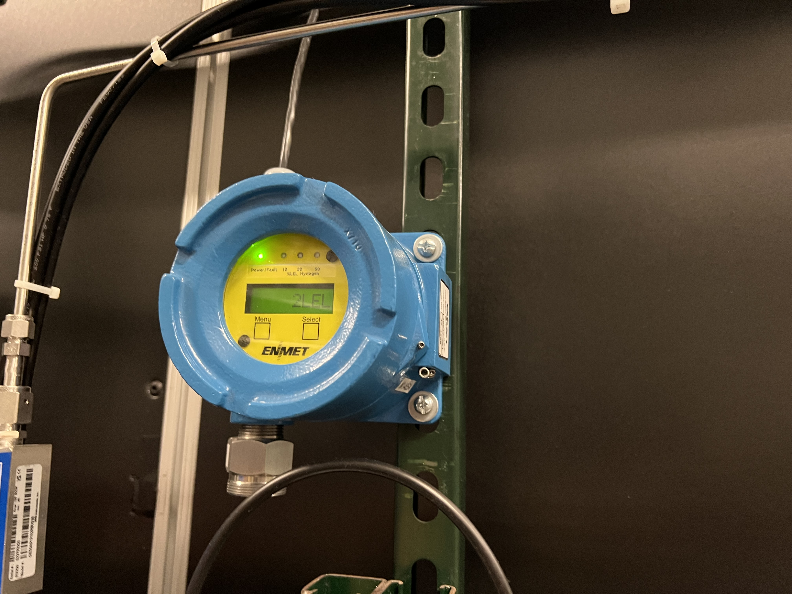
   
   There are two flammable gas detectors installed near SECAR's gas target: one is installed on the gas handling system, and one is installed inside the noise reducing enclosure around the JENSA compressor. If these detectors detect hydrogen, an alarm will go off inside the ReA3 vault, which is controlled by the device shown in :numref:`alarm`.

.. _alarm:
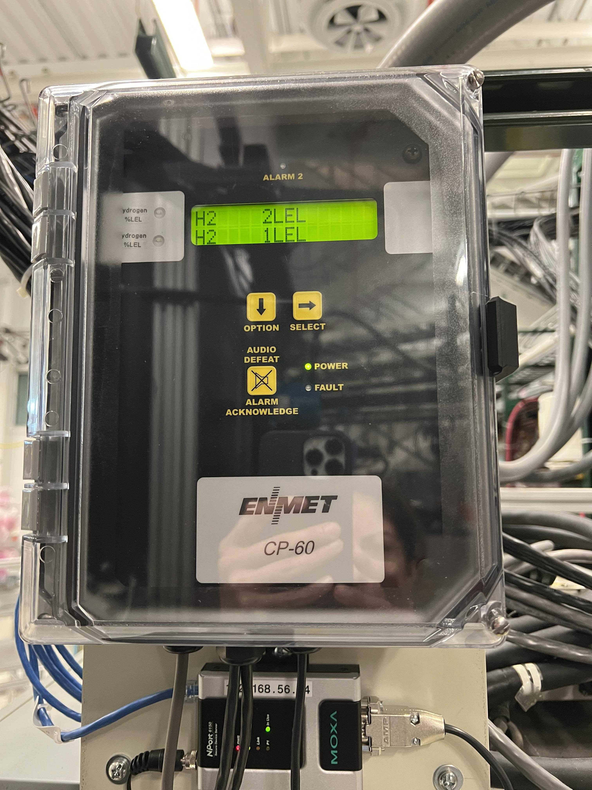
   
   If hydrogen is leaking into the air in ReA3 high bay, this device will sound an alarm inside the ReA3 vault. It is attached to the top of the panel that controls the Roots blower pumps.

- There is a dry nitrogen bottle that acts as a backup in case of a failure of the laboratory dry nitrogen supply. This bottle is installed behind the touch panel for control of the DV650 pumps. **Make sure its regulator is set to 15 psi at all times.** If the system is in :code:`vent` or :code:`purge` mode, and :code:`MF6` flow rate reads :math:`<\,70\%` of its set value, :code:`V15` valve will be automatically opened after 10 seconds to ensure constant source of dry nitrogen by opening the valve to the reserved dry nitrogen bottle. :code:`V15` is the only valve in the GHS that cannot be commanded manually even via using the :code:`MAN` mode of operation.
- A flash arrestor (see :numref:`flash_arrestor`) is installed on the hydrogen bottle to extinguish the flames and prevent the bottle from explosion.

.. _flash_arrestor:
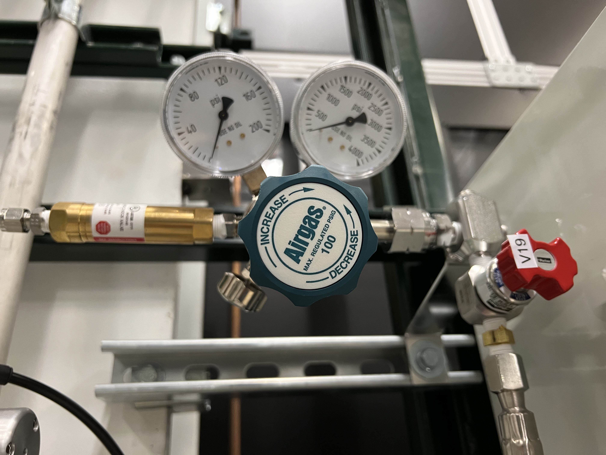
   
   The flash arrestor is the golden device that is attached to the hydrogen regulator.

- Flow switches will be added in future to the fans in the noise enclosure of JENSA compressor. These are not installed yet and will only be installed if the JENSA compressor gets the approval to run hydrogen.
- Lighting above the system are removed to have no potential ignition sources.
- An in situ Oxygen sensor inside the vacuum system (see :numref:`oxygen_sensor`) allows early detection of oxygen ingress at :math:`< 1\%` and :math:`10\%` of hydrogen Low Explosive Level (LEL). At :math:`1\%` of LEL (sensor readback :math:`= 0.04\%`), a standard Pheobus alarm will be triggered. At :math:`10\%` of LEL (sensor readback :math:`= 0.4\%`), a voice alarm is activated in the FRIB control room and the system will automatically be switched to :code:`purge` mode.

.. _oxygen_sensor:
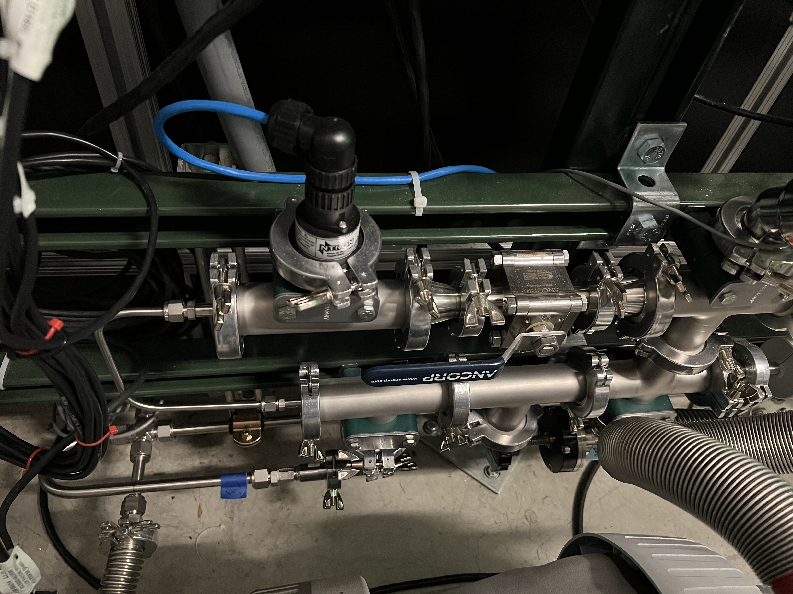
   
   The oxygen sensor is attached to the gas handling system near the scroll pump. Its controller is shown in :numref:`oxygen_controller`.

.. _oxygen_controller:
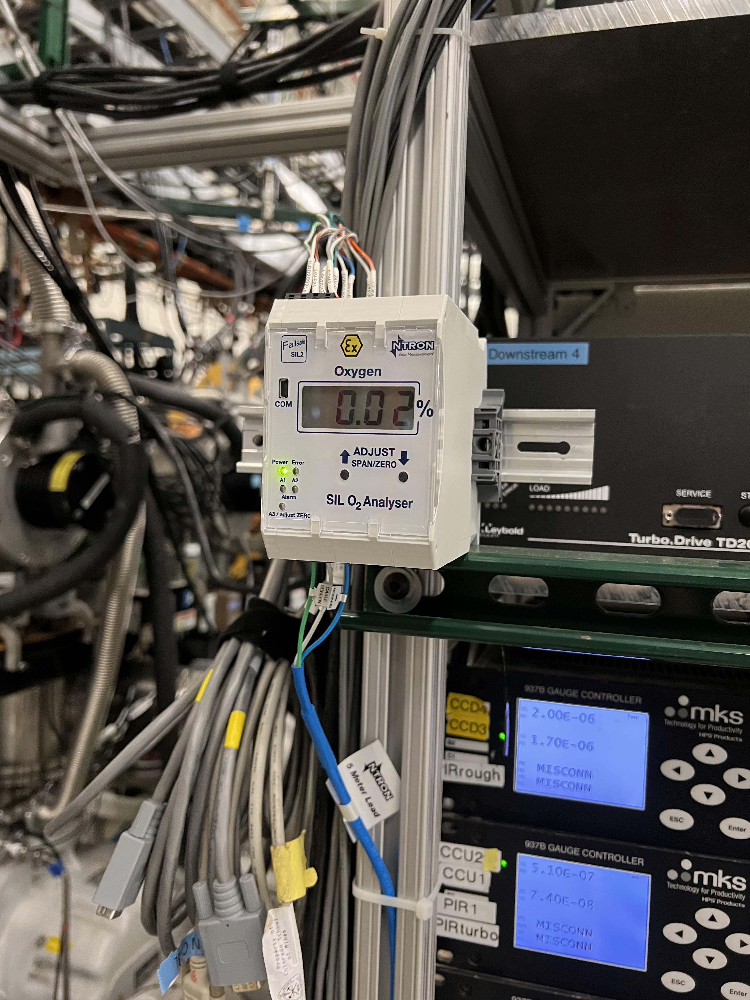
   
   The oxygen sensor's controller is attached to the turbo pump controller panel (see :numref:`pump_rack`)

- A Parker excess flow valve (:code:`V19`: up to 3500 psi) with latching shutoff is installed on the hydrogen bottle (see :numref:`excess_flow_valve`) to mitigate bottle leak inside and outside vacuum. This valve is located between the hydrogen bottle valve and the pressure regulator installed on the hydrogen bottle. It automatically stops flow above 40 standard liters per minute, and is manually resettable.
- There are overpressure relief valves (see :numref:`pressure_relief`) implemented in the system and tied to the common vent, which is connected to the dedicated flammable gas exhaust of system, which is made of stainless steel and is grounded.
- An emergency stop button (|emergencystop|) is implemented in the software and can be activated from any mode of operation to purge the system with dry nitrogen.
- :code:`MF7` dilutes the exhaust with dry nitrogen with a ratio of 1:7 (:math:`H_{2}:N_{2}`), limiting oxygen concentration at all times in all modes of operation. :code:`MF7` uses laboratory supply of dry nitrogen and is constantly ON and has no interlocks on it for now. To avoid using too much of nitrogen, the plan is to install a valve downstream :code:`MF7` on the path to the exhaust and to have interlock on this valve such that it is only opened when the system is in :code:`vent` or :code:`purge` mode but these are not implemented yet. **When the system is running a non-explosive gas, close MF7 to avoid wasting dry nitrogen.** To do this:

    - Using the probe functionality in CS-Studio, verify that :code:`MF7` is CLOSED: open the probe window and search this PV: :code:`SCR_BTS34:MFC_D1465A:MODE_CSET_MFC`. Then, enter :file:`CLOSE` under new value and hit :code:`Enter`. **Make sure MF7 is open during hydrogen operation.**

.. warning::
   
   There is a needle valve upstream :code:`MF7` (see :numref:`MF7_needle`), which is set to a specific flow to avoid allowing too much dry nitrogen to be flushed down the exhaust through :code:`MF7`. **Please do not touch this needle valve to avoid changing its setpoint.** It is set to allow 1000 sccm when :code:`MF7` flow setpoint is also set to 1000 sccm. Chaging this needle valve's setpoint will cause too much usage of the dry nitrogen particularly if the :code:`MF7` flow setpoint is set to its maximum level, which is 50000 sccm. **Please do not alter the flow setpoint of MF7 and leave it to be set to 1000 sccm all the times.**

.. _bottle_exchange:

How to Change Hydrogen Bottle
~~~~~~~~~~~~~~~~~~~~~~~~~~~~~

If at any time, the hydrogen bottle runs out of the supply gas and needs to be changed, follow the procedure below:

- If the system is running with hydrogen and the system is in :code:`run` mode when the hydrogen bottle runs out:
    
    - Stop the DAQ and scalers if they are running.
    - Safely de-bias the in-vacuum silicon detectors (see :numref:`PIPS_operation`).
    - Verify :code:`MF6` is :file:`OPEN` and its flow rate is set to 1000 sccm.
    
        - Using the probe functionality of CS-Studio, set the value of this PV: :code:`SCR_BTS34:MFC_D1465F:MODE_CSET_MFC` to :code:`OPEN`.
        - Click on the :code:`MF6` indicator on the main control page (:numref:`CSS_Screen`) and set the flow setpoint to 1000 sccm.
    - Click on E-stop button (|emergencystop|) to initiate a purge.
    - Purge the system for 10 minutes.
    - After 10 minutes, click on the |reset| button.
- Switch to :code:`vent` mode and then immediately switch to :code:`pump` mode and pump on the system for at least 15 minutes.
- Verify :code:`V6` is closed.
- Verify :code:`V7` and :code:`V3` are also closed.
- Make sure the pressure gauges in the system read good vacuum (:math:`< 1` Torr) in the system. Note that :code:`SCR_BTS34:CMG_D1465M` should read below 20 mTorr. 
- Only then, it is safe to re-enter ReA3 vault (see :numref:`reentry`). 
- Make sure you already have a cart to move gas bottles with, and you have snoop (a soapy mixture) ready.
- Make sure you have a new full hydrogen bottle on the cart.
- Follow the procedure to re-enter the ReA3 vault (see :numref:`reentry`).
- Once in the vault:
 
    - Make sure that the hydrogen bottle's main valve on the empty bottle in the vault is fully closed before locking the gas bottle. 
    - Switch to the maintenance operation mode (:code:`MAN` mode).
    - Verify :code:`V1` is open and the scroll pump is ON and all high vacuum pumps are still running.
    - Close the small metallic valve after the hydrogen regulator near the flash arrestor (see :numref:`flash_arrestor`).
    - Close the red excess flow valve labelled by :code:`V19` (see :numref:`excess_flow_valve`).
    - Disconnect the gas bottle from the GHS. The explosive bottles are left handed. Use left handed rules to untighten the pipe fittings.
    - On the hose, there is a check valve that does not allow air to leak into the hose too much (see :numref:`check_valve`). So, the amount of oxygen that gets into the hose is very small and insignificant: nothing to worry about.
    - Remove the empty hydrogen bottle and move the full hydrogen bottle into its place.
    - Secure the new gas bottle by the belt which was around the empty gas bottle.
    - Connect the new gas bottle to the GHS pipes using left hand rules to tighten the pipe fittings.
    - Once the bottle is fully and securely attached to the GHS, open the red excess flow valve labelled as :code:`V19`.
    - Open the small metallic manual valve passed the regulator upstream :code:`V6` and near the flash arrestor (see :numref:`flash_arrestor`).
    - Open the padlock on the hydrogen bottle.
    - Open the main bottle's valve.
    - Pour snoop on the new gas bottle's top area and the pipe fittings you just tightened and verify no bubbles are coming out.
    - Make sure the hydrogen regulator is set to 40 psi.
    - Immediately after, ask the OIC to perform sweep and lock of ReA3 high bay.
    - Follow the procedures found in DCC (Procedure to Secure ReA3 Hall for JENSA Extended Target Hydrogen Operation – Credited Administrative Control with ESH Impact; and FRIB-S30205-PR-001363-R001) to secure and exit the ReA3 vault.

.. _check_valve:
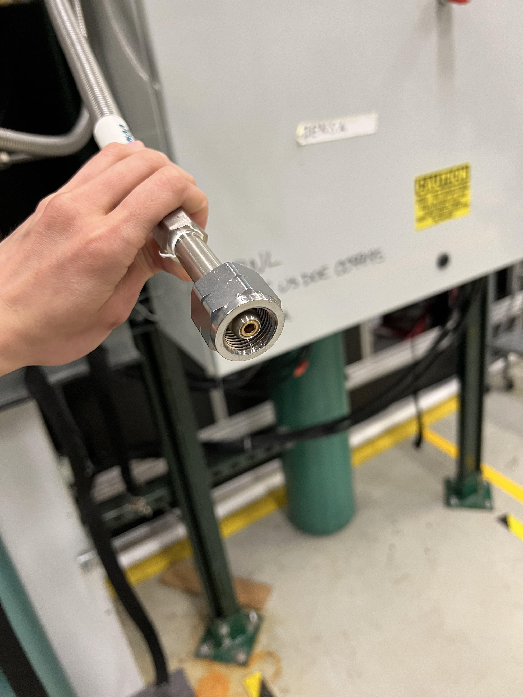
   
   The check valve is the conical device at the end of the hose.

- Once you are back to the DataU, access the CS-Studio control page.
- Ideally, one would purge the system with the gas whose bottle was changed to remove any air bobbles but since the gas is hydrogen, we cannot purge the system with hydrogen, so we will fill the system with 10 Torr of hydrogen and then flush it out. This should remove the very small amount (about 1 – 2 cc) of air that is introduced into the system by the gas bottle exchange. To do this:
    
    - Switch to :code:`Auto` mode, and immediately without any delay switch to :code:`pump` mode.
    - Pump on the system for 5 minutes.
    - Then, fill the system with 10 Torr of hydrogen.
    - Switch to :code:`run` mode and run for 10 minutes.
    - Press on the |emergencystop| to initiate a purge.
    - Purge for 10 – 15 minutes.
    - Switch to :code:`vent` mode and then immediately switch to :code:`pump` mode, and pump for 15 minutes.
    - Switch to :code:`fill` mode and fill the system again with the desired pressure, and then go to :code:`run` mode, and carry out the rest of the experiment.

What to Do prior to and during Hydrogen Operation?
~~~~~~~~~~~~~~~~~~~~~~~~~~~~~~~~~~~~~~~~~~~~~~~~~~

The hydrogen lead operator(s) and experts shall make sure that:

- Prior to running the system with hydrogen, the prestart checklist (DCC Document FRIB-M41600-TD-001693-R001) is followed in full (see also :numref:`intentional_leak_section`).
- Make sure the reserved nitrogen bottle has enough nitrogen, and that both its manual valves (one on the bottle and one metallic one near the bottle on the regulator) are open. The regulator should be set to 15 psi and the bottle should be at least half full.
- After the prestart checklist is performed, the ReA3 high bay has to be swept and locked properly following the procedures found in DCC (FRIB-S30205-PR-001363-R001; and Procedure to Secure ReA3 Hall for JENSA Extended Target Hydrogen Operation – Credited Administrative Control with ESH Impact).
- No personnel will be allowed to be present in the ReA3 high bay while the system is operating with hydrogen.

During hydrogen operation:

- While running with hydrogen, monitor the oxygen content in the system. Oxygen sensor is sensitive down to :math:`0.01\%`. A standard Phoebus alarm will be triggered if the oxygen level in the system reaches :math:`0.04\%`.
- If the oxygen level reaches :math:`0.4\%`, a voice alarm is activated in FRIB control room and the system will be automatically switched to :code:`purge` mode.
- In case of an emergency and if you are in :code:`run` mode, click on the emergency stop button found on the operating mode controls section of the control page (|emergencystop|) to initiate a purge of the system with dry nitrogen.

.. _intentional_leak_section:

How to Test the Oxygen Sensor's Integrity
~~~~~~~~~~~~~~~~~~~~~~~~~~~~~~~~~~~~~~~~~

To ensure the oxygen sensor is calibrated correctly:

- Everytime the system is fully vented and the chamber is open to air, check the oxygen monitor on the control page (see :numref:`CSS_Screen`) . It should be reading around 19 - 20 percent. If the system was fully vented with dry nitrogen but not opened to air and then you open the air vent valve (labelled as :code:`AIR VENT` found on the JENSA scroll pump), the oxygen monitor shows something around 12 - 14 percent, depending on how much oxygen is in the system.
- There is a vent valve and its associated needle valve (see :numref:`air_leak_valve`) for intentionally introducing air into the system when the system is fully ON and running and prior to hydrogen operation. These valves are used so that the hydrogen lead operator can check the interlocks that are set on the system regarding oxygen content of the gas target, while it is running hydrogen, to ensure those interlocks are working properly. To do this, prior to the hydrogen operation and as part of the prestart checklist, perform the following:

    - Notify the FRIB control room that they will hear a voice alarm related to oxygen content of the SECAR gas target.
    - Start operation of the gas target following :numref:`hydrogen_operation`.
    - Fill the system using helium or another non-explosive gas with the desired pressure.
    - Switch to :code:`run` mode.
    - Then, open the valve with a black handle shown in :numref:`air_leak_valve`.
    - **Very slowly** open the needle valve shown in :numref:`air_leak_valve` and carefully monitor:

        - The load on all turbo pumps (from their associated controllers found in :numref:`pump_rack`.
        - The pressure gauges of the system.
        - The oxygen monitor.
    - Allow the oxygen content of the system to reach to :math:`0.4\%` if the loads on the turbo pumps are managable.

        - When the oxygen content reaches :math:`0.04\%`, you should hear a standard Phoebus alarm. Verify that this happens.
        - When the oxygen content reaches :math:`0.4\%`, the operators in the FRIB control room should hear a voice alarm. Verify that this too takes place.
        - When the oxygen content reaches :math:`0.4\%`, the system should also go into :code:`purge` mode. Verify that this occurs as well.
        - Once the system goes into :code:`purge` mode:

            - Close the needle valve and the valve with a black handle shown in :numref:`air_leak_valve`.
            - Click on the |reset| button found in "Operating Mode Controls" of the control page.
            - Switch to :code:`vent` mode and then immediately switch to :code:`pump` mode.

.. _reentry:

Locking and Re-entering into ReA3 Vault
~~~~~~~~~~~~~~~~~~~~~~~~~~~~~~~~~~~~~~~

Procedure to Secure ReA3 Hall for JENSA Extended Target Hydrogen Operation – Credited Administrative Control with ESH Impact; and the procedure with DCC code FRIB-S30205-PR-001363-R001 explain what to do to lock and re-enter to the ReA3 vault. Please refer to those documents. Please also ensure that before re-entry to the ReA3 vault and prior to purging the system with dry nitrogen, the DAQ and scalers are safely stopped and the silicon detectors are safely debiased (see :numref:`PIPS_operation`). Only then, follow the aforementioned procedures to re-enter the ReA3 vault.

.. _hydrogen_operation:

How to Operate the System with Hydrogen
~~~~~~~~~~~~~~~~~~~~~~~~~~~~~~~~~~~~~~~

Since a pre-start checklist (DCC Document FRIB-M41600-TD-001693-R001) should be followed prior to operation with hydrogen, this subsection assumes that the system is in :code:`pump` mode to begin with and that all high vacuum pumps are ON. To do that, see :numref:`setting_up_high_vacuum`. Zero the :code:`SCR_BTS34:CMG_D1465K`, :code:`SCR_BTS34:CMG_D1465M` and :code:`SCR_BTS34:CMG_D1465E` capacitance manometer gauges (:numref:`zero_gauges`) if they show an offset and before you leave the ReA3 vault. Also, it is assumed that the ReA3 vault is fully secured and locked.

Once you are ready to fill the system with hydrogen:

- Using the probe functionality in CS-Studio, verify that :code:`MF7` is OPEN: open the probe window and search this PV: :code:`SCR_BTS34:MFC_D1465A:MODE_CSET_MFC`. Then, enter :file:`OPEN` under new value and hit :code:`Enter`. 
- Verify that :code:`MF4` flow rate is set to 500 sccm.
- Verify that :code:`MF2` flow rate is set to 0 sccm.
- Switch to :code:`fill` mode.
- Set :code:`MF2` flow rate to :math:`100` sccm.
- Monitor the pressures in various locations shown on the control page, as well as the oxygen level.
- Note that the capacitance manometer :code:`SCR_BTS34:CMG_D1465B` (foreline), :code:`SCR_BTS34:CMG_D1465C` (at the last DV650 pump), :code:`SCR_BTS34:CMG_D1465E`, :code:`SCR_BTS34:CMG_D1465I`, :code:`SCR_BTS34:CMG_D1465J`, :code:`SCR_BTS34:CMG_D1465K` (gas target), and :code:`SCR_BTS34:CMG_D1465M` (below the gas target) all have interlocks on them (see :numref:`interlocks`), so pay a close attention to these pressures to avoid unnecessary purging later on.
- Once the pressure in the gas target (indicated by :code:`SCR_BTS34:CMG_D1465K`) reaches the desired value, set the :code:`MF2` flow rate to 0 sccm.
- Switch to :code:`run` mode.
- Bias the silicon detectors (see :numref:`PIPS_operation`) and keep monitoring the oxygen level properly via the CS-Studio archiver.
- Adjust :code:`MF4` flow rate (it is recommended to set the :code:`MF4` flow to its actual readback flow) to have a stable pressure within the gas target. Lowering the flow rate will reduce the pressure in the gas target and increasing the flow rate will increase the pressure in the gas target. Keep an eye on the foreline pressure and ensure it does not get near 500 Torr, which is the set point for an interlock, which causes the system to automatically switch to the :code:`purge` mode of operation.
- Monitor the pressures read by all cold cathode gauges, and all capacitance manometers.
- The last ReA3 beamline gate valve (:code:`ReA_BTS34:BGV_D1450`) has an interlock with the :code:`SCR_BTS34:CCG_D1456` cold cathode gauge, which is set to :math:`5\times10^{-7}` Torr. If the pressure read by this gauge is above this limit, the beamline gate valve closes and cannot be opened until the pressure goes below the set point and after you reset this PV: :code:`SCR_BTS34:CCG_D1456:VAC_RST_CMD`.
- The first SECAR beamline gate valve (:code:`SCR_BTS35:BGV_D1483`) has an interlock with the :code:`SCR_BTS34:CCG_D1471` cold cathode gauge, which is set to :math:`1\times10^{-6}` Torr. If the pressure read by this gauge is above this limit, the beamline gate valve closes and cannot be opened until the pressure goes below the set point and after you reset this PV: :code:`SCR_BTS34:CCG_D1471:VAC_RST_CMD`.
- If you have to increase the pressure in the gas target:
    
    - If the pressure has to be increased just a bit, this may be achieved by adjusting :code:`MF4`. Keep in mind that the positive HV card supplying bias voltage to the in-vacuum PIPS detectors will shut down automatically if the pressure in the gas target goes above 25 Torr, or if the pressure read by the capacitance manometer :code:`SCR_BTS34:CGM_D1465M` (pressure below the gas cell) reaches 10 mTorr while in :code:`run` mode of operation. Debias the silicon detectors safely (see :numref:`PIPS_operation`) before these pressures are reached while the system is in :code:`run` mode.
    - If the pressure increase is more than a few Torr:
    
        - Stop the DAQ and scalers first.
        - Debias the silicon detectors safely (see :numref:`PIPS_operation`) before switching to :code:`fill` mode.
        - Set :code:`MF4` flow rate to 500 sccm.
        - Switch to :code:`fill` mode.
        - Set :code:`MF2` flow rate to 100 sccm or lower to fill the gas target more slowly.
        - Once desired pressure is reached in the gas target, set :code:`MF2` flow rate to 0 sccm.
        - Switch back to :code:`run` mode and bias the PIPS detectors again.
- If you have to pump the system while you are in the :code:`run` mode:
    
    - Stop the DAQ and scalers.
    - Debias the silicon detectors safely (see :numref:`PIPS_operation`).
    - Set :code:`MF4` flow rate to 500 sccm (fully open).
    - Verify :code:`MF2` is set to 0 sccm.
    - Switch to :code:`fill` mode, and immediately after, switch to :code:`pump` mode.
- If a purge occurs while you are in :code:`run` mode because some interlock is triggered:
    
    - Let the purge continues for 10 minutes.
    - Click on |reset| button.
    - If you do not have to go to the ReA3 vault:
        
        - Verify that :code:`V21` is closed.
        - Switch to :code:`vent` mode of operation.
        - Switch to :code:`pump` mode.
        - Switch to :code:`fill` mode and fill the system again.
        - Then switch back to :code:`run` mode and bias the PIPS detectors.
    - If you have to go enter the ReA3 vault, follow :numref:`reentry`.
- In case of an emergency:
    
    - Verify that :code:`MF6` is set to 1000 sccm.
    - Click on |emergencystop| button, which will switch the system to :code:`purge` mode. It is safe to keep purging the system for a long time assuming that :code:`MF6` is set to have a flow of 1000 sccm and that its upstream needle valve (see :numref:`MF6_needle`) was not touched.
- If you need to go into the ReA3 vault and the system is in :code:`run` mode:
    
    - Stop the DAQ and scalers.
    - Safely debias the silicon detectors (see :numref:`PIPS_operation`).
    - Verify that :code:`MF6` is set to 1000 sccm.
    - While in :code:`run` mode, click on the |emergencystop| button, which will switch the system to the :code:`purge` mode.
    - Let the system purge for 10 minutes.
    - Verify that :code:`V21` is closed.
    - Click on the |reset| button.
    - Switch to :code:`vent` mode.
    - Switch to :code:`pump` mode.
    - Pump the system for at least 15 minutes.
    - Verify that the hydrogen is safely evacuated from the system by verifying the pressures read from capacitance manometer gauges at various locations. They should be below 1 Torr. :code:`SCR_BTS34:CMG_D1465M` should read below 20 mTorr.
    - Now it is safe to follow the procedures discussed in :numref:`reentry` to enter the ReA3 vault.

.. _vent_hydrogen:

Venting the System after Running with Hydrogen
~~~~~~~~~~~~~~~~~~~~~~~~~~~~~~~~~~~~~~~~~~~~~~

:code:`MF6` is used to fill the system slowly with dry nitrogen while the system is in :code:`vent` mode or :code:`purge` mode. However, :code:`MF6` is typically set to have a flow rate of 1000 sccm, which is safe to purge the system while the turbo pumps are running but too slow for venting the system. The flow rate of 1000 sccm used for purging the system with dry nitrogen is set to achieve purging in a controlled manner; and therefore, the flow rate has to be small during the purge to avoid overwhelming the turbo pumps during this process. 

Venting the system without changing :code:`MF6` flow rate may take many hours. As a result, :code:`V21` has been introduced into the system as of 4/9/2023 to enable venting the system with dry nitrogen in a faster and more efficient way. :code:`V21` valve is located on the path of the laboratory dry nitrogen supply line and downstream the needle valve **(which should not be touched except by Brandon Ewert)** that controls the flow of dry nitrogen into :code:`MF6` during a purge (see :numref:`MF6_needle`). :code:`V21` has its associated needle valve (see :numref:`vent_nitrogen`) attached to the dry nitrogen line downstream the :code:`V21` valve. This valve, in turn, is located downstream the purge needle valve (see :numref:`MF6_needle`). This allows the operator to avoid touching the needle valve upstream of :code:`MF6` used to set the dry nitrogen flow for purging, and therefore, keeping the purge flow at a low rate. But with the other needle valve near :code:`V21` and downstream of the purge needle valve, the operator can increase the flow of dry nitrogen through :code:`MF6` during venting via adjusting the correct needle valve (the one downstream :code:`V21`, see :numref:`vent_nitrogen`) and by setting :code:`MF6` flow rate to 10000 sccm instead of 1000 sccm (used for purging) to allow a faster venting procedure. With this procedure, it still takes about 1 hour to vent the system! With the nitrogen regulator locked at 5 psi, the dry nitrogen flow rate through :code:`MF6` is about 7.4 standard liters per minute. The total volume of the system is about 421 liters. To speed up the process, one has to adjust the nitrogen regulator shown in :numref:`nitrogen_regulator` to allow a higher pressure of nitrogen to be reached. **However, if you change this regulator, please remember to set it back to 5 psi and lock it towards the end of venting process and before the system is fully vented.** 

:code:`V21` valve can only be operated by switching into :code:`vent` or :code:`MAN` mode of operation. Its operation is manually commanded by the operator via the control software while the system is in :code:`vent` or :code:`MAN` mode: only in these two modes of operation, operator can choose to open/close :code:`V21` valve.

To vent the system, do the following:

#. If the system is in :code:`run` mode:
    
    - Stop DAQ and scalers.
    - Safely debias the PIPS detectors.
    - Verify :code:`MF6` is set to have a 1000 sccm flow rate.
    - Press on the |emergencystop| button to initiate a purge.
    - Keep purging for 10 minutes.
    - Press on the |reset| button.
    - Switch to :code:`vent` mode.
    - Switch to :code:`pump` mode.
    - Pump the system for at least 15 minutes.
    - Follow the procedures presented on point 3 below.
#. If the system is in :code:`fill` mode when it is decided to vent the system:
    
    - Set :code:`MF2` to 0 sccm.
    - Switch to :code:`pump` mode.
    - Follow the procedures presented on point 3 below.
#. If the system is in :code:`pump` mode and would like to vent the system:
    
    - Verify that the hydrogen is safely evacuated from the system by verifying the pressures read from capacitance manometer gauges at various locations. They should be below 1 Torr. :code:`SCR_BTS34:CMG_D1465M` should read below 20 mTorr
    - Now it is safe to follow the procedures discussed in :numref:`reentry` to enter the ReA3 vault.
    - While in the vault, and while the system is still in the :code:`pump` mode, turn OFF all the high vacuum pumps (see :numref:`Pumps_off`).
    - Wait till all turbo pumps spin down to zero. Put your hands on each turbo pump and ensure they are not vibrating (indicating they are still spinning). Turn OFF the water lines and fans.
    - Switch to :code:`vent` mode.
    - Verify that the dry nitrogen regulator (see :numref:`nitrogen_regulator`) is locked on 5 psi.
    - Verify :code:`MF4` is open and its flow rate is set to 500 sccm. If not, set it to 500 sccm.
    - Open :code:`V21`.
    - Verify :code:`MF6` is open.
    - Set :code:`MF6` to 10000 sccm.
    - Monitor the pressure gauges. If they are coming up too slowly, open all the way the metallic needle valve that is associated with :code:`V21` (see :numref:`vent_nitrogen`). If the system is venting too quickly, reduce the flow rate of :code:`MF6` to 5000 sccm and/or adjust the metallic needle valve that is associated with :code:`V21`. Once the pressure gauges read 730 – 760 Torr, the system is fully vented. Note that :code:`SCR_BTS34:CMG_D1465K` and :code:`SCR_BTS34:CMG_D1465M` will only read 100 Torr and 1 Torr, respectively. With the nitrogen regulator locked at 5 psi, the dry nitrogen flow rate through :code:`MF6` is about 7.4 standard liters per minute. The total volume of the system is about 421 liters so it takes a bit more than 1 hour to vent the system.
    - Close :code:`V21`.
    - Close the needle valve downstream :code:`V21` used for venting (see :numref:`vent_nitrogen`).
    - Set :code:`MF6` flow rate back to 1000 sccm.
    - Switch to :code:`MAN` mode and close :code:`V13`.
#. If the system is in :code:`MAN` mode prior to venting:
    
    - With the system under configuration to run hydrogen, this item should only happen when you re-enter the ReA3 vault to exchange the hydrogen bottle. Only in this case, follow this instruction as it is safe to assume that the gas handling system and the gas chamber are already safely evacuated from hydrogen prior to getting to this step.
        - Verify :code:`MF6` is set to 1000 sccm and is open.
        - Verify :code:`V6` and :code:`V3` are closed.
        - Verify the JENSA scroll pump is ON and :code:`V1` is open.
        - Turn OFF all high vacuum pumps (see :numref:`Pumps_off`).
        - Wait till all turbo pumps spin down to zero. Put your hands on each turbo pump and ensure they are not vibrating (indicating they are still spinning). Turn OFF the water lines and fans.
        - Verify that the dry nitrogen regulator (see :numref:`nitrogen_regulator`) is locked on 5 psi.
        - Verify :code:`MF4` is open and its flow rate is set to 500 sccm. If not, set it to 500 sccm.
        - Close the manual roughing valve on the JENSA scroll pump (:code:`VROUGH`)
        - Open :code:`V13` and :code:`V21`.
        - Set MF6 to 10000 sccm.
        - Monitor the pressure gauges. If they are coming up too slowly, open all the way the metallic needle valve that is associated with :code:`V21` (see :numref:`vent_nitrogen`). If the system is venting too quickly, reduce the flow rate of :code:`MF6` to 5000 sccm and/or adjust the metallic needle valve that is associated with :code:`V21`. Once the pressure gauges read 730 – 760 Torr, the system is vented. Note that :code:`SCR_BTS34:CMG_D1465K` and :code:`SCR_BTS34:CMG_D1465M` will only read 100 Torr and 1 Torr, respectively. With the nitrogen regulator locked at 5 psi, the dry nitrogen flow rate through :code:`MF6` is about 7.4 standard liters per minute. The total volume of the system is about 421 liters so it takes a bit more than 1 hour to vent the system.
        - Close :code:`V21` and :code:`V13`.
        - Close the needle valve downstream :code:`V21` used for venting (see :numref:`vent_nitrogen`).
        - Set :code:`MF6` flow rate back to 1000 sccm.
#. If the system automatically switched to :code:`vent` mode due to a fault (such as failure of the JENSA scroll pump):
    
    - This could happen while the system was in :code:`pump` mode or :code:`purge` mode prior to switching to :code:`vent` mode. Either way, most of the hydrogen should have been removed from the system. To ensure this is the case:
    - Monitor the capacitance manometer pressure gauges and when the gas target pressure is about 20 Torr, follow instructions given in :numref:`reentry` and re-enter the ReA3 vault. Here, we are assuming that there is enough dry nitrogen in the system that hydrogen is diluted below its lower explosive limit.
    - Turn OFF all high vacuum pumps per instructions given in :numref:`Pumps_off`.
    - Wait till all turbo pumps spin down to zero. Put your hands on each turbo pump and ensure they are not vibrating (indicating they are still spinning). Turn OFF the water lines and fans.
    - Verify that the dry nitrogen regulator (see :numref:`nitrogen_regulator`) is locked on 5 psi.
    - Verify :code:`MF4` is open and its flow rate is set to 500 sccm. If not, set it to 500 sccm.
    - Open :code:`V21`.
    - Set :code:`MF6` to 10000 sccm.
    - Monitor the pressure gauges. If they are coming up too slowly, open the metallic needle valve that is associated with :code:`V21` (see :numref:`vent_nitrogen`). If the system is venting too quickly, reduce the flow rate of :code:`MF6` to 5000 sccm and/or adjust the metallic needle valve that is associated with :code:`V21`. Once the pressure gauges read 730 – 760 Torr, the system is vented. Note that :code:`SCR_BTS34:CMG_D1465K` and :code:`SCR_BTS34:CMG_D1465M` will only read 100 Torr and 1 Torr, respectively. With the nitrogen regulator locked at 5 psi, the dry nitrogen flow rate through :code:`MF6` is about 7.4 standard liters per minute. The total volume of the system is about 421 liters so it takes a bit more than 1 hour to vent the system.
    - Close :code:`V21` and its needle valve.
    - Set :code:`MF6` flow rate back to 1000 sccm.
    - Switch to :code:`MAN` mode and close :code:`V13`.

Changing to Manual Mode during Hydrogen Operation
~~~~~~~~~~~~~~~~~~~~~~~~~~~~~~~~~~~~~~~~~~~~~~~~~

This mode of operation is where the operator is able to command all valves (except :code:`V15`, which is interlocked with the flow rate of :code:`MF6`, see :numref:`interlocks`) manually via the software control. I would recommend that this mode is not operated during hydrogen operation at all unless the hydrogen bottle has to be exchanged (see :numref:`bottle_exchange`). Operating this mode for any other reason during hydrogen operation is a dangerous action and shall be avoided if hydrogen is in the system unless the operator is a system expert. The instructions below should only be followed if the automatic purging has failed for some reason. 

.. warning::

   Following this instruction requires expert knowledge of the system. If you are not a system expert, STOP right now!

If for whatever weird reason, the automatic purging failed and/or something weird is happening with the software control in the operating mode you are running the system with:

- Stop the DAQ and scalers.
- Safely debias the PIPS detectors if they are still ON.
- Switch to :code:`MAN` mode.
- Verify :code:`V6`, :code:`V7`, :code:`V3`, and :code:`V10` are all closed. If not, close them all (:code:`V6` first).
- Verify :code:`V12` and :code:`V2` are open.
- Verify scroll pump is ON. It should be green.
- Verify :code:`MF6` is set to 1000 sccm.
- Open :code:`V1` and :code:`V13`.
- Verify :code:`MF4` is open and its flow rate is set to 500 sccm. If not, set it to 500 sccm.
- Now, you should be purging the system with dry nitrogen. Keep purging for 10 minutes.
- After 10 minutes, close :code:`V13`. Now, the system is being pumped on. Keep pumping for at least 15 minutes until all capacitance manometer pressure gauges of the system read 1 Torr or below.

Emergency Shutdown Procedure while Running with Hydrogen
~~~~~~~~~~~~~~~~~~~~~~~~~~~~~~~~~~~~~~~~~~~~~~~~~~~~~~~~

- In case of an emergency:
    
    - Verify that :code:`MF6` is set to 1000 sccm.
    - Click on |emergencystop| button, which will switch the system to :code:`purge` mode. It is safe to keep purging the system for a long time assuming that :code:`MF6` is set to have a flow of 1000 sccm and that its upstream needle valve was not touched.
- After the emergency situation is over and things are back to normal, you need to:
    
    - Click on the |reset| button.
    - Switch to :code:`vent` mode.
    - Switch to :code:`pump` mode.
    - If the experiment is still going on, swicth to :code:`fill` mode. Fill the system again and switch to :code:`run` mode and carry on with the rest of the experiment. 
- In a rare case of a total loss of network access that lasts for more than a few minutes, the hydrogen lead operator or system expert will have to re-enter the ReA3 vault and stop the hydrogen operation by forcing the system to go to :code:`purge` mode. In this case, the system is still filled with hydrogen when the expert enters the ReA3 vault. The system will maintain its current state in case of network loss, so the system expert or a hydrogen lead operator has to force it to go into :code:`purge` mode to remove hydrogen from the system. **To stop the hydrogen operation, do the following only if you are the system expert (or hydrogen lead operator):**
 
- Follow the procedures given in :numref:`reentry` and enter the ReA3 vault.
- Go to the panel, where all the gauge controllers are (see :numref:`pump_rack`). Find :code:`MKS5` controller (see :numref:`MKS5`).
- Using the up/down arrow buttons, select :code:`CMG D1465K`. Once it is seleceted, you will see a green LED light next to this label.

    - Push on the :code:`System Setup` button. The display should now look like :numref:`MKS5_system_setup`.
    - Keep pressing the down arrow button until the :code:`Set Param` is highlighted with a blue color.
    - Press on the :code:`Enter` button. The highlight will become black. Press on the up arrow button once. The highlighted text should now be changed to :code:`Enable`.
    - Press on the :code:`Enter` button again. Then press on :code:`ESC` button.
    - Press on the :code:`Channel Setup` button. Now, the dispay should look like :numref:`MKS5_channel_setup`.
    - Use the up/down and left/right arrow buttons and select the :code:`Enable` text to the right of :code:`Relay 09`.
    - Press on the :code:`Enter` button. The :code:`Enable` text will become black.
    - Press the up or down arrow button until :code:`Enable` changes to :code:`Set`. 
    - Once the entry reads :code:`Set`, press on the :code:`Enter` button again.
    - Press the :code:`ESC` button.
    - Now, the interlock on the pressure of the gas cell will force the system to go into :code:`purge` mode. It is safe to leave the system in :code:`purge` mode until the emergency situation is dealth with. 
    - Leave ReA3 vault according to the procedures mentioned in :numref:`reentry`.

.. _MKS5:
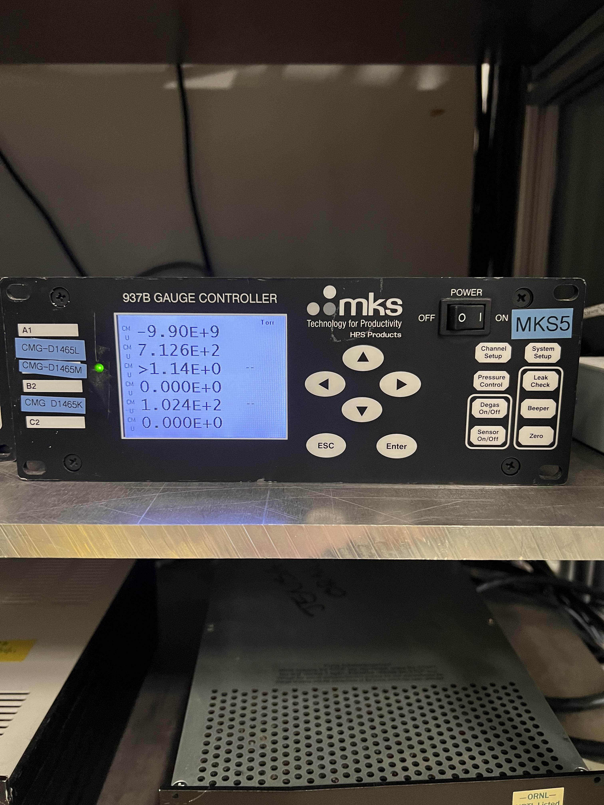
   
   The :code:`MKS5` unit controls the capacitance manometers :code:`SCR_BTS34:CGM_D1465K` (reads the pressure in the gas cell), :code:`SCR_BTS34:CGM_D1465L`, and :code:`SCR_BTS34:CGM_D1465M`.

.. _MKS5_system_setup:
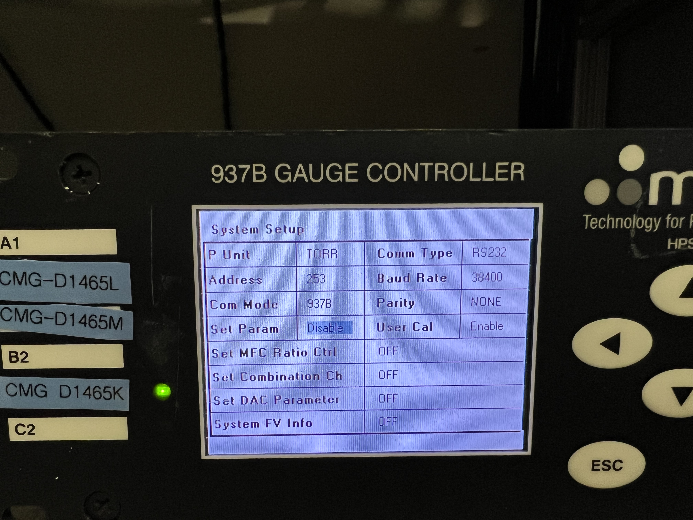
   
   The :code:`Set Param` setting lets you enable or disable setting the parameters manually using the controller. **Please make sure that this setting is set by default to be Disabled for all capacitance manometer gauge controllers of the GHS so that non-experts cannot change system interlocks.**

.. _MKS5_channel_setup:
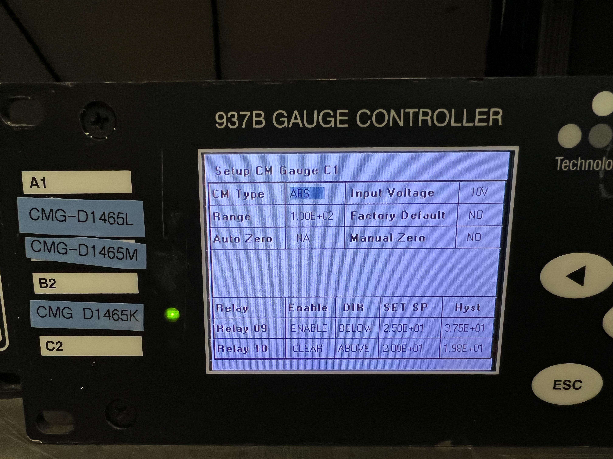
   
   Using :code:`Channel Setup`, you can set the interlock. **Please avoid changing the interlocks if you are not a system expert.**

.. important::

   After it is safe to go back to the ReA3 vault, please go back and undo what you did before by doing the following steps:
 
   - Reset the interlock for the gas cell's pressure on :code:`MKS5` controller unit:
    
       - Press on the :code:`Channel Setup` button. Now, the dispay should look like :numref:`MKS5_channel_setup`.
       - Use the up/down and left/right arrow buttons and select the :code:`Set` text to the right of :code:`Relay 09`.
       - Press on the :code:`Enter` button. The :code:`Set` text will become black.
       - Press the up or down arrow button until :code:`Set` changes to :code:`Enable`. 
       - Once the entry reads :code:`Enable`, press on the :code:`Enter` button again.
       - Press the :code:`ESC` button.
   - Disable the :code:`Set Param` of the :code:`MKS5` unit again by following the procedures below:

       - Push on the :code:`System Setup` button. The display should now look like :numref:`MKS5_system_setup`.
       - Keep pressing the down arrow button until the :code:`Set Param` is highlighted with a blue color.
       - Press on the :code:`Enter` button. The highlight will become black. Press on the up arrow button once. The highlighted text should now be changed to :code:`Disable`.
       - Press on the :code:`Enter` button again. Then press on :code:`ESC` button.
   - Click on the |reset| button found under "Operating Mode Controls" part shown in :numref:`CSS_Screen`. Switch to :code:`vent` mode, and immediately after, switch to :code:`pump` mode. If you need to carry on with the experiment:

       - Swicth to :code:`fill` mode, fill the system with the desired pressure and then switch to the :code:`run` mode and bias the PIPS detectors.

Operation of the Target Detectors
---------------------------------

This section desribes all you need to know to be able to operate the detectors that are used in and out of vacuum together with the extended gas target, as well as the jet target.

.. _caen_section:

The JENSA CAEN Power Supply for the Silicon and BGO Detectors
~~~~~~~~~~~~~~~~~~~~~~~~~~~~~~~~~~~~~~~~~~~~~~~~~~~~~~~~~~~~~

The power supply for silicon and BGO detectors is a CAEN SY 2527 LC Universal multichannel power supply system. There are currently 4 HV cards in this power supply: 

- One positive HV card, which is used to bias the PIPS detectors used inside the vacuum chamber.
- Three negative HV card to bias the BGO detectors used outside the vacuum chamber surrounding it. 
  
The power supply can be operated in local or remote control, which are accessible by turning the key (see :numref:`CAEN`) into each position (as well as the OFF position, which turns the power supply entirely OFF) from the front face of the power supply.

- Local mode of operation: this mode of operation should not be used unless a system expert desires to test something.
- Remote mode of operation: this mode of operation is what should be used with both SECAR's gas targets. Make sure the key (see :numref:`CAEN`) is always in this position unless for some reason the power supply has to be unplugged, in which case, after turning the power supply OFF (see :numref:`CAEN_off`), you should move the key into OFF position.

There is a small power supply that is attached to the top of the JENSA electronics rack (:code:`SECAR R1421 CAB N0303`) visible in :numref:`PLC_supply`, which changes the 24V signal outputted by the PLC to a 12V signal and vice versa to enable the communication between the PLC and the JENSA CAEN power supply (:numref:`CAEN`).

.. _CAEN:
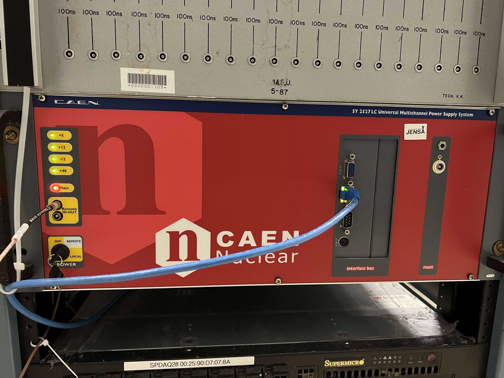
   
   This CAEN power supply is located at the bottom of the JENSA electronics rack (:code:`SECAR R1421 CAB N0303`) found near SECAR's target. There are 3 operation modes defined by the location of the black key: local, remote and OFF. **Make sure the key is always in the remote position unless the power supply has to be unplugged, in which case, the key needs to be shifted into OFF position.** The red main LED indicates the power to the power supply is ON.

.. _PLC_supply:
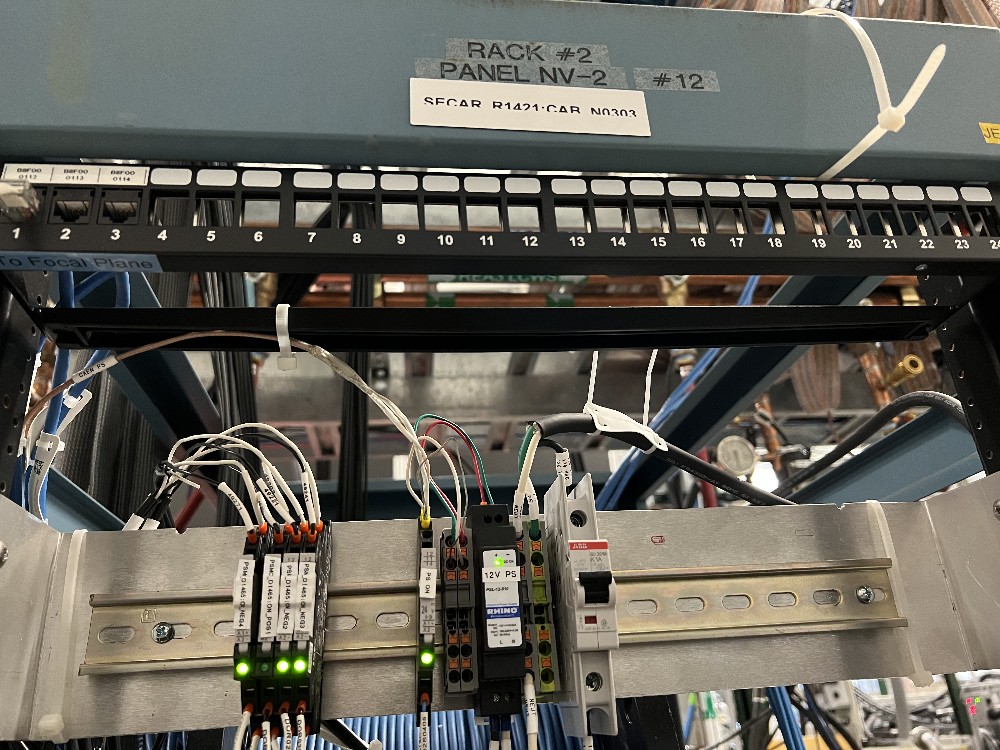

   The power supply labelled as "12V PS" changes the 24V signal used by the PLC to a 12V signal used by the JENSA CAEN power supply to enable the communication between the PLC and the CAEN power supply. The other units on the left side of the image are the relays for the HV cards (see :numref:`HV_cards_section`).

.. _HV_cards_section:

High Voltage Cards
~~~~~~~~~~~~~~~~~~

The HV cards providing bias to any detector that is powered by the JENSA CAEN power supply are found inserted (:numref:`insert_cards`) to the back of the main power supply (see :numref:`HV_Cards`). At the moment, there are 4 of these cards inside the JENSA CAEN power supply: 

- One provides positive voltage (up to 1.5 kV) and has an interlock set on it. This card is used for the two PIPS detectors used inside the vacuum chamber.
- Three cards provide negative voltage (up to 1.5 kV) and have no interlock set on them. These cards are used with the 26 BGO detectors that surround the extended gas cell. 

At the right top side of each of these cards, you will see a LEMO input called "HVEN", where there is a LEMO cable connected labelled as:

- :code:`POS1` for the HV card with positive voltage output.
- :code:`NEG4`, :code:`NEG2`, and :code:`NEG3` (from top to bottom) for the HV cards with negative voltage output.

All these cables are going into separate relays (see the devices on the left side of :numref:`PLC_supply`) labelled as :code:`PSMC_D1645:ON_POS1`, :code:`PSMC_D1645:ON_NEG4`, :code:`PSMC_D1645:ON_NEG2`, and :code:`PSMC_D1645:ON_NEG3`. All these relays are normally open (in the case of no actuation and/or no power, the relay is OFF and the circuit is open). The last 3 relays (for negative HV cards) currently do not have any interlock set on them but the relay labelled as :code:`PSMC_D1645:ON_POS1` (used with the positive HV card supplying bias to the PIPS detectors) has an interlock set on it. If any of these relays is energized, it will allow a 50 Ohm resistor to be attached accross the "HVEN" input of the HV card, to which the relay is connected. The presence of this 50 Ohm resistor on the "HVEN" input of each of the HV card is necessary for all the 12 bias outputs of the HV card to be enabled. Since the BGO detectors are outside the vacuum and are not under hydrogen atmosphere, they are not considered sources of ignition. Therefore, the 3 relays connected to the three negative HV cards are always ON (as long as they have power) and the 50 Ohm resistors are always attached across the "HVEN" inputs of these cards. So, all those 36 bias channels are always enabled as long as those relays are energized. The PIPS detectors, on the other hand, are being operated inside the vacuum chamber where hydrogen could be flowing. To rule out the PIPS detectors as a source of ignition during hydrogen operation, we have set an interlock on the relay for the positive HV card such that it can only be energized when:

- The system is in :code:`run` mode of operation AND
- **After** the |reset| button found under "Operating Mode Controls" of the control page (see :numref:`CSS_Screen`) is clicked once when the system is in :code:`run` mode AND
- The gas cell has a pressure that is below 25 Torr AND
- The chamber underneath the gas cell has a pressure below 10 mTorr AND
- The oxygen cotent of the system is below :math:`0.4\%`.

If any of these conditions is not met, the relay will be de-energized and the 50 Ohm resistor accross the "HVEN" input of the positive HV card will disappear. This then immediately disables all the 12 bias output channels of this HV card and the PIPS detectors will be immediately debiased as a result.

.. _HV_Cards:
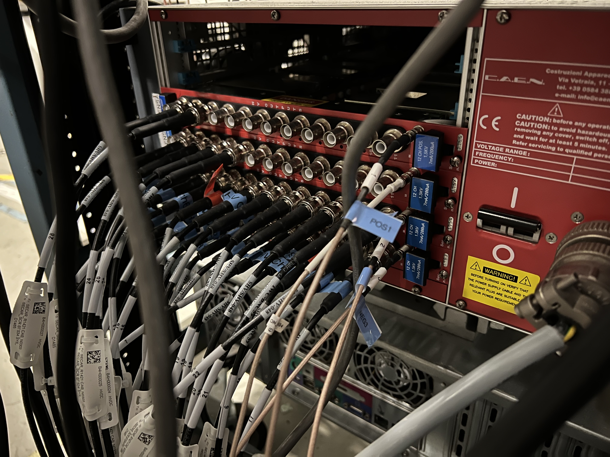

   There are 4 HV cards inserted to the back of the JENSA CAEN power supply. Each of them has 12 bias output channels. One of these cards provides positive HV up to 1.5 kV, while the other 3 provide negative HV up to 1.5 kV. The two PIPS detectors are connected to the positive HV card. The negative HV cards provide bias to all 26 BGO detectors that surround the extended gas target.

.. _CAEN_ON:

How to Operate the JENSA CAEN Power Supply
~~~~~~~~~~~~~~~~~~~~~~~~~~~~~~~~~~~~~~~~~~

To operate the JENSA CAEN power supply:

- Make sure the black key found on the front face of the power supply is pointing towards remote.
- Look at the |pson| section of the GHS control page (see :numref:`CSS_Screen`):
 
    - If the value under "Read" column and along the :code:`ON_CMD` row is 0: click on the :code:`On` button.
    - If this value is 1, the JENSA CAEN power supply is already ON.
- Look at the |HVpospower| section of the GHS control page (see :numref:`CSS_Screen`):
 
    - If the value under "Read" column and along the :code:`EN_CMD_POS1` row is 0: click on the :code:`On` button. You can only turn this ON if:
    
        - The mode of operation currently selected is :code:`run` mode AND
        - The |reset| button found under "Operation Mode Controls" of the control page is pressed AND 
        - The pressures in the gas cell and immediately below the gas cell are below 25 Torr and 10 mTorr, respectively, AND
        - The oxygen content of the system is below :math:`0.4\%`.
    - If this value is 1, the positive HV card of the JENSA CAEN power supply is already ON.
- Look at the |HVnegpower| section of the GHS control page (see :numref:`CSS_Screen`):
 
    - If the values under "Read" column and along the :code:`EN_CMD_NEG2` (and :code:`EN_CMD_NEG3` and :code:`EN_CMD_NEG4`) rows are 0: click on the :code:`On` buttons.
    - If these values are 1, the negative HV cards of the JENSA CAEN power supply are already ON.
- On a linux computer that is connected to the DAQ network, open a terminal and do the following:

.. code-block::
   :caption: How to operate the JENSA CAEN power supply
        
        cd ~
        startev
        caen_supply
        # the above command is an alias for: telnet 10.65.50.95 1527
        # The IP address of the power supply is 10.65.50.95
        # The port used is 1527 

- A new window pops up (see :numref:`caen_gui_startup`).
- Press any key to be able to enter the login credentials (:numref:`login`).
- Enter the login credentials. If you make a mistake, you cannot use backspace and correct the typo. Just hit :code:`Enter` twice. You will be redirected to the same login page. Enter your credentials correctly again.
- Press :code:`Enter`.
- Using the down arrow button on the keyboard, select :code:`Channels` and press :code:`Enter`.
- Now, the display looks like :numref:`jensa_caen_gui`.
- Click anywhere on the GUI and use the up/down and left/right arrows to move to any of the inputs.
- The nomenclature is as follows:

    - Every 12 channels (12 rows) correspond to one HV card, which is shown by :code:`Ch#`.

        - :code:`Ch# 00` refers to the negative HV card labelled as :code:`PSMC_D1465:ON_NEG3`. This section has 12 subsections labelled as :code:`00.0000` to :code:`00.0011`. These are the 12 bias output channels of this HV card.
        - :code:`Ch# 01` refers to the negative HV card labelled as :code:`PSMC_D1465:ON_NEG2`. Subsections are same as above,
        - :code:`Ch# 02` refers to the negative HV card labelled as :code:`PSMC_D1465:ON_NEG4`. Subsections are same as above.
        - :code:`Ch# 03` refers to the positive HV card labelled as :code:`PSMC_D1465:ON_POS1`. All 12 channels of this section are disablled initially until the gas target is switched to :code:`run` mode of operation and the |reset| button is clicked AND only if the pressures of the gas target and below the gas cell are lower than 25 torr and 10 mTorr, respectively AND the oxygen content of the system is below :math:`0.4\%`.
    - :code:`Channel Name` is a given name for a bias channel output of the HV card. Usually, we use the detector names as channel names.
    - :code:`V0Set` is the voltage setpoint for a particular channel.
    - :code:`I0Set` is the allowed leakage current set point for a particular channel.
    - :code:`VMon` is the live readback of the voltage applied to a particular channel.
    - :code:`IMon` is the live readback of the leakage current of a particular channel.
    - :code:`Pw Status` displays the power state of a particular channel (ON or OFF).
    - :code:`Trip` is always set to 1 seconds and shows how soon a channel should trip if the actual leakage current (:code:`IMon`) goes above the set point (:code:`I0Set`).
    - :code:`SVMax` is the maximum voltage that can be applied to a channel and this should be set to 1500 V because none of the HV cards of this power supply can provide more than 1.5 kV.
    - Set :code:`V1Set` to 0V. I do not know what this is!
    - :code:`I1Set` is the maximum leakage current that is allowed. Leave it at 500 :math:`{\mu}A` unless you want to set to a lower current for a particular sensitive detecor.
    - :code:`RDWn` is the voltage ramp down rate in (V/s).
    - Set :code:`TripInt` to 0. This is internal trip and I am not sure why it has to be set to 0.
    - Set :code:`TripExt BdStatus` to 16. This is external trip and I do not know why it has to be set to 16.
    - Leave :code:`HVMax` alone. I do not know why they are all around 2 kV. This is not an editable field anyway.
    - :code:`Temp` shows you temperature in Celsius.
    - :code:`RU` is the voltage ramp up rate (in V/s).
    - Set :code:`POn` to :code:`Dis`. I do not remember what this refers to.
    - :code:`PDwn` can be either :code:`Kill` or :code:`Ramp`. It supposedly either ramps down a channel's HV or kills the HV (ramps down immediately to 0 V) in case of a trip. But what I have observed with this power supply is that even if you choose :code:`Kill`, it seems to always ramps down a channel, which is not a bad thing.
- If the desired :code:`Channel Name`, its :code:`VOSet` and :code:`I0Set` (voltage and leakage current set points) are already set and you are only interested to turn that channel ON/OFF:

    - Use the arrow keys on the keyboard, go to the desired channel. 
    - Select the text under :code:`Pw` (power) column.
    - Hit the :code:`spacebar` on the keyboard to switch the channel ON/OFF. If the bias was ON, it will be turned OFF and vice versa. 
- If you would like to set some or all of the aforementioned inputs:
    
    - **If the channels are flashing, they are disabled. This could be the case for the positive HV card that has an interlock on it for hydrogen operation.**
    - Use the arrow keys on the keyboard, go to the desired input.
    - Start typing the desired values. If at any point, you made a mistake, there is no way you can use backspace to correct the typo. Just hit the :code:`tab` button on the keyboard. This will undo what you did. Then hit :code:`Enter` twice and you will get back to where you were.  
    - Hit the :code:`spacebar` on the keyboard to toggle through the available inputs such as ON/OFF, Ramp/Kill etc. 
    - Make sure you set the channel name (to something easily recognizable), voltage and current set points, ramp down/up rates, and maximum allowed voltage and current for any new detector setup.
- Once you are done, hit the :code:`tab` button on the keyboard. Press :code:`Enter`. Use the down arrow button of the keyboard and select :code:`Logout`. Press :code:`Enter`.
- Exit from the terminal and log out of the experimental account.

.. warning::

   After turning the JENSA power supply to local mode of operation if it was in remote mode, or vice versa, you will need to wait for about 50 seconds before the power supply resets itself and becomes available for communication through telnet. During this more or less 50 seconds, you will not be able to ping the power supply or communicate with it using its GUI. 

.. note::

   Operation of the JENSA CAEN power supply in the local mode is identical to that in remote mode; however, you would need to replace all the relay cables with 50 Ohm LEMO terminators that are plugged directly into the "HVEN" inputs of all the HV cards to enable the HV outputs. This means that you will lose the ability to have any interlock on any of the HV output channels. So, it is crucial that the power supply is operated in remote control during hydrogen operation to be able to have an interlock on the PIPS detectors.
   
.. _caen_gui_startup:
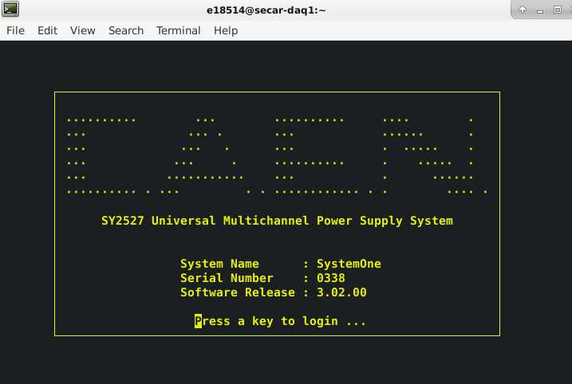

   The login page of the JENSA CAEN power supply GUI.

.. _login:
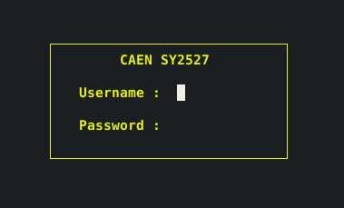

   Enter the credential to be able to access the JENSA CAEN power supply's GUI.

.. _jensa_caen_gui:
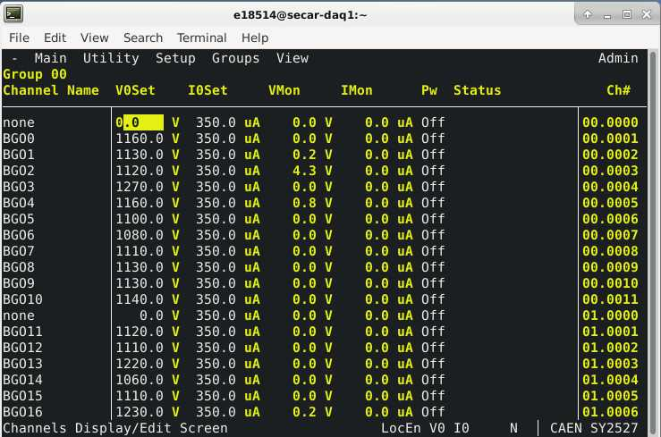
 
   The JENSA CAEN power supply's GUI.

.. _CAEN_off:

How to Turn the CAEN Power Supply OFF
~~~~~~~~~~~~~~~~~~~~~~~~~~~~~~~~~~~~~

If the power supply has to be unplugged, or if a new HV card is to be inserted into the JENSA CAEN power supply, you need to first turn it OFF. To do so:

- Make sure all the detectors that are connected to this power supply through its HV cards are safely debiased (see :numref:`CAEN_ON`).
- Close the GUI used for operation of the power supply (see :numref:`CAEN_ON`)
- Look at the |pson| section of the GHS control page (see :numref:`CSS_Screen`):
 
    - If the value under "Read" column and along the :code:`ON_CMD` row is 1: click on the :code:`Off` button.
    - If this value is 0, the JENSA CAEN power supply is already OFF.
- Look at the |HVpospower| section of the GHS control page (see :numref:`CSS_Screen`):
 
    - If the value under "Read" column and along the :code:`EN_CMD_POS1` row is 1: click on the :code:`Off` button. You can only turn this OFF if:
    
        - The mode of operation currently selected is :code:`run` mode AND
        - The |reset| button found under "Operation Mode Controls" of the control page is pressed AND 
        - The pressures in the gas cell and immediately below the gas cell are below 25 Torr and 10 mTorr, respectively, AND
        - The oxygen content of the system is below :math:`0.4\%`.
    - If this value is 0, the positive HV card of the JENSA CAEN power supply is already OFF or disabled (because the conditions mentioned above are not met).
- Look at the |HVnegpower| section of the GHS control page (see :numref:`CSS_Screen`):
 
    - If the values under "Read" column and along the :code:`EN_CMD_NEG2` (and :code:`EN_CMD_NEG3` and :code:`EN_CMD_NEG4`) rows are 1: click on the :code:`Off` buttons.
    - If these values are 0, the negative HV cards of the JENSA CAEN power supply are already OFF.
- Turn the black key found on the front face of the power supply to OFF position.
- Turn the power button, found at the back of the power supply (where the HV cards can be seen, see :numref:`caen_power`) downward to 0.

.. _caen_power:
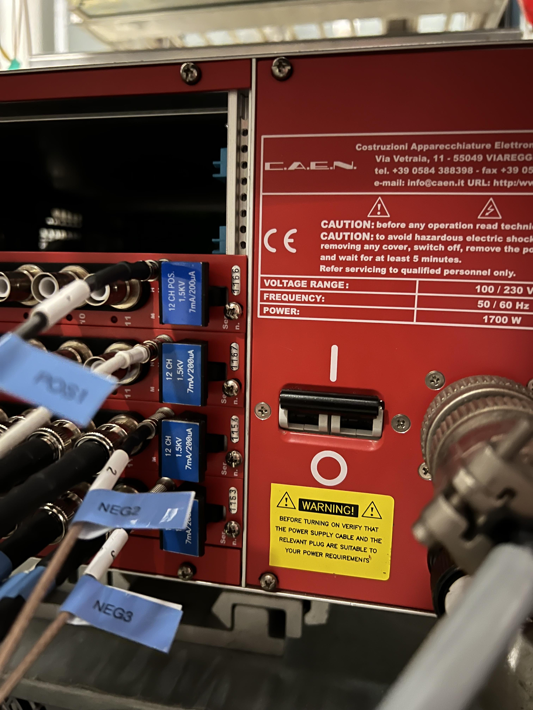

   This main power button for the JENSA CAEN power supply is found at its back, where the HV cards can be inserted.

.. _insert_cards:

How to Insert a New HV Card into the JENSA CAEN Power Supply
~~~~~~~~~~~~~~~~~~~~~~~~~~~~~~~~~~~~~~~~~~~~~~~~~~~~~~~~~~~~

Prior to inserting a new HV card to the back of the JENSA CAEN power supply:

- Make sure the new card has a 50 Ohm LEMO termintor connected to its "HVEN" input. Without this 50 Ohm LEMO terminator, the HV will be disabled and you will not be able to use that card. 

    - If you are interested to provide an interlock on this new HV card, you need to talk to Ghulam Mujtaba and tell him to make a new relay connection (similar to the 4 HV cards we are already using) to where the 50 Ohm LEMO terminator is attached to.
- There is a DIP switch on the HV card, which needs to be set properly before inserting the card into the power supply. The position of the keys in this DIP switch depends on the amount of the leakage currents from the detectors attached to the card. This, in turn, depends on the type of detectors whose bias is going to be provided by the new HV card.
 
    - If the detector's maximum voltage is 1.5 kV and its leakage current is expected to be maximum of 1 mA: change the DIP switch on the card according to what is shown on the top of the image shown in :numref:`HV_card_DIP`.
    - If the detector's maximum voltage is 1.5 kV and its leakage current is expected to be maximum of 200 :math:`{\mu}A`: change the DIP switch on the card according to what is shown on the bottom of the image shown in :numref:`HV_card_DIP`.
    - **When a key on the DIP switch is down, that switch in ON. If the key is up, the switch is OFF.**

- **Make sure the main CAEN power supply is fully OFF (explained in subsection above) before inserting a new card.**
- With the power supply fully OFF, insert the card fully in and make sure it is correctly attached and secured.
- Now, turn ON the power supply (:numref:`CAEN_ON`).

.. _HV_card_DIP:
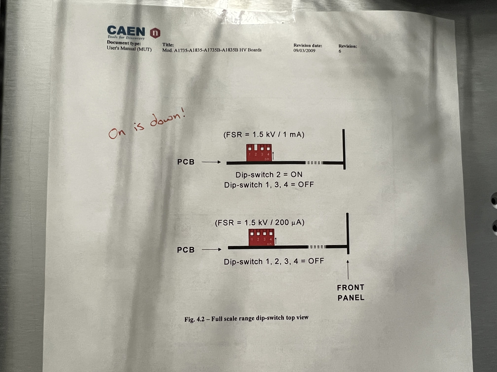

   The DIP switch on a HV card depends on the amount of the leakage currents drawn by any of the detectors attached to the card. If any of the detectors connected to the HV card is drawing too much leakage current (above what is permitted by the position of the DIP switch), the entire card will trip and all 12 channels will be disabled. Make sure these switches are set properly. 

Long Term Shut Down Procedure
-----------------------------

For a long-term shutdown, all valves are kept closed and all pumps are turned OFF (scroll pump will be turn OFF when switching to :code:`vent` mode). The system should be vented but not open to the air (with all vent valves should be fully closed). The system should be left in the :code:`MAN` mode of operation. 

If the system owner/expert chooses to not leave the system vented, he/she can leave all high vacuum pumps OFF, switch to :code:`pump` mode of operation, and keep the system under rough vacuum.
