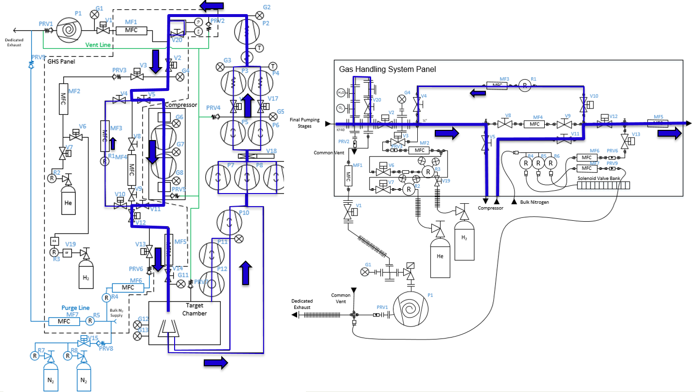
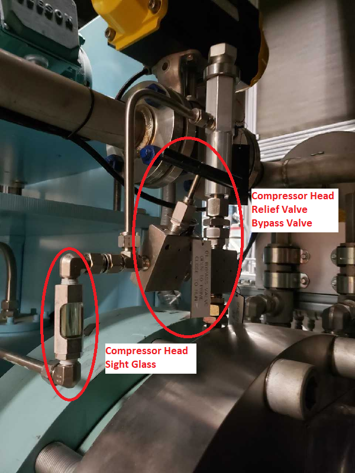
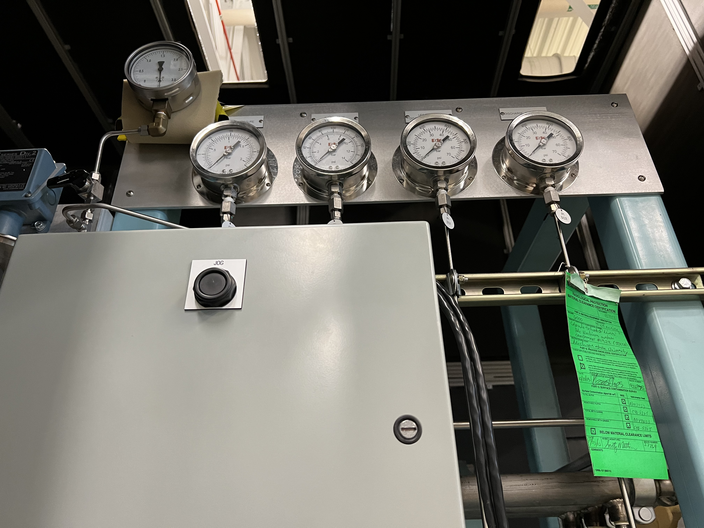
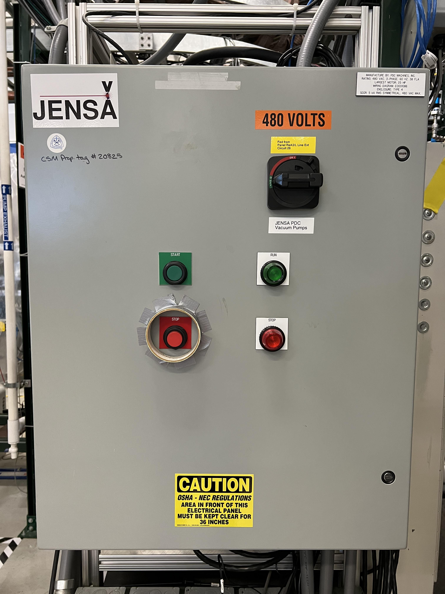
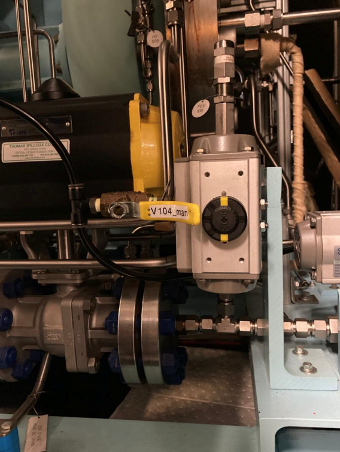
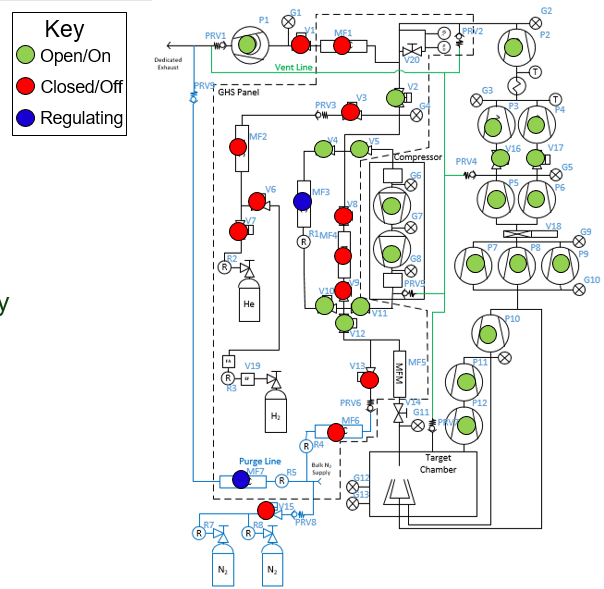
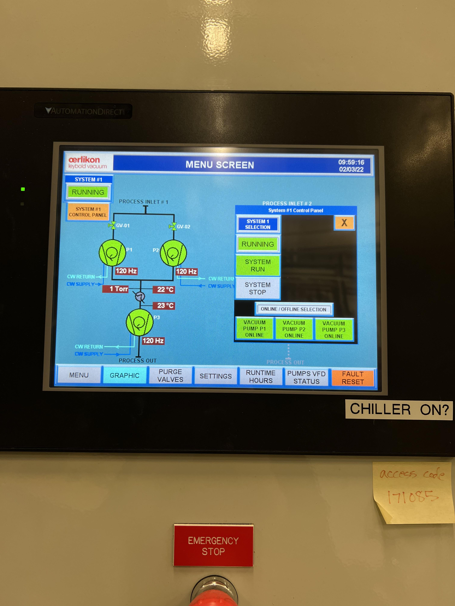
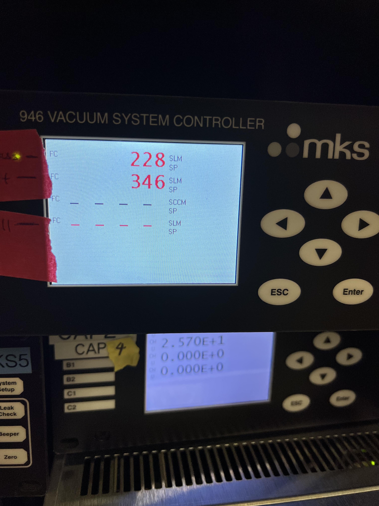
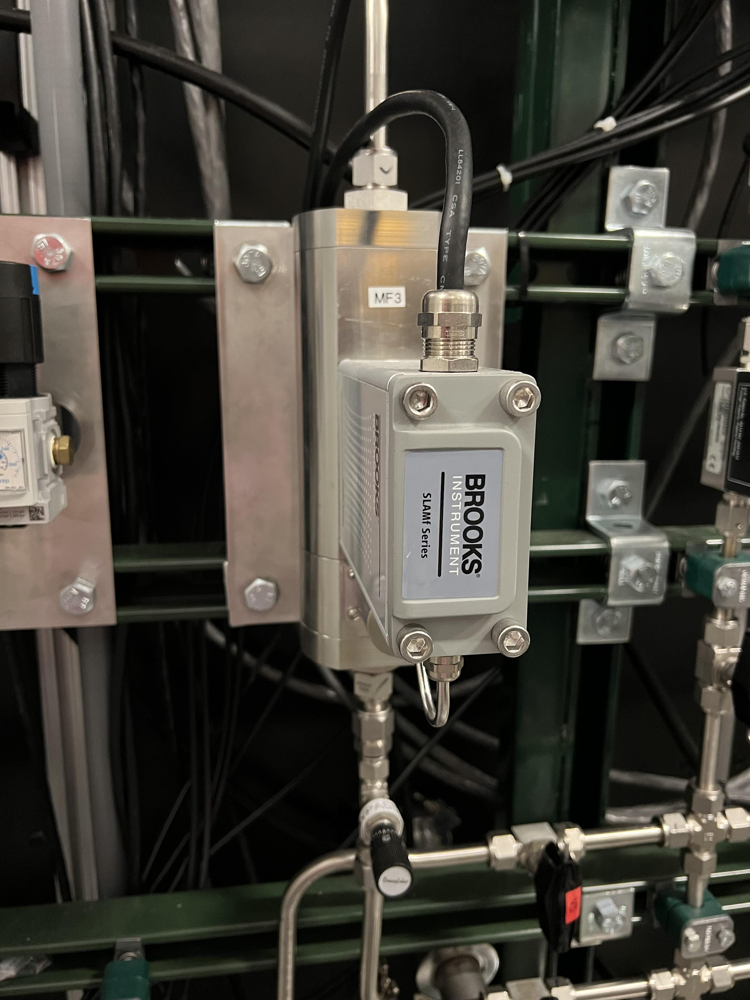

 
The Jet Target
==============

Introduction
------------

In addition to the windowless extended gas target, SECAR has a jet target known as:

- The Jet Experiments in Nuclear Astrophysics (JENSA).

Poeple use the term JENSA for the extended gas target as well even though they have no relationship with one another except using the same gas handling system.

Currently, JENSA's controls are partly automatic, and partly still manual. This chapter presents the jet target as well as its associated JENSA compressor.

.. warning::

   **Hydrogen operation is currently not authorized.**

The JENSA target's controls can be found in :numref:`CSS`. The symbols on this page are shown in :numref:`symbols_table`. This target utilizes a PDC Machines, Inc. PDC-4-100-500 (15096) diaphragm compressor for the JENSA helium jet target. This compressor outputs a maximum 400-psi discharge pressure to maintain the jet target at a high pressure. :numref:`GHS` shows the jet target's GHS.

.. _GHS:

   The schematic of the jet target's gas handling system. Image courtesy of Brandon Ewert. **This schematics is unfortunately not the most updated one and is missing a few valves, turbo pumps, etc.**

Pumping Down JENSA
------------------

To pump down JENSA from atmospheric pressures:

- Make sure all flanges are proeprly closed and their bolts are tightened. On the ISO-320 flanges, one needs up to 8 claw flange clamps to properly compress the o-rings.
- Make sure :code:`V4` is open and :code:`V8` and :code:`V9` are both closed. These are manual valves on the gas handling system. :code:`V4` is the valve that needs to be opened for the gas to flow in the jet bypass loop. :code:`V8` and :code:`V9` are valves that should be opened during the operation of the extended gas target but should remain closed during the operation of the jet target.
- Make sure the manual air vent valve located on the scroll pump (:numref:`air_vent`) is fully closed.
- Open the intentional air leak valve with a black handle (see :numref:`air_leak_valve`) but keep its needle valve (see :numref:`air_leak_valve`) fully closed.
- Make sure :code:`V21` valve and its associated needle valve (:numref:`vent_nitrogen`) are both closed. If :code:`V21` is open, open the CS-Studio page (see :ref:`CSS`). This valve can only be controlled when the system is in either :code:`vent` mode or :code:`MAN` mode. Switch to :code:`MAN` mode of operation. :code:`V21` can be closed by clicking on the "c" button next to :code:`V21` and opened by clicking on the "o" button next to the valve and only if the system is in :code:`vent` or :code:`MAN` mode of operation. When the valve is closed, the valve indicator on CS-Studio turns orange. If the valve is open, the valve indicator on CS-Studio is green.
- Make sure the first beamline gate valve of SECAR (:code:`SCR_BTS35:BGV_D1483`) and the last ReA beamline gate valve (:code:`ReA_BTS34:BGV_D1450`) are closed.
- Make sure the JENSA scroll pump's control cable, as well as all the control cables for all solenoid valves are in place (see :numref:`air_leak_valve`), properly connected, and secured.
- Make sure the JENSA scroll pump's power switch is in OFF state (only then it will be remotely controlled).
- Make sure mass flow meters :code:`MF2`, :code:`MF4`, :code:`MF6`, and :code:`MF7` are properly connected, and the needle valves for :code:`MF6` and :code:`MF7` are in the locations they should be: flow rates through :code:`MF6` and :code:`MF7` should be 1000 sccm.
- Press on :code:`Auto` button on the control page and then immediately switch the gas handling system to :code:`pump` mode by clicking on :code:`pump` button under operating mode controls found on the control page in CS-Studio.    
- **Slowly** open the manual valve (labelled as :code:`VROUGH`) of the roughing pump. Check the capacitance manometer gauges of the gas handling system to ensure the pressure is dropping slowly. It should go down to 0.5 - 1 Torr in about an hour or so if there is no leak and if the chamber was not exposed to air over a long period of time.
- Close the valve with the black handle shown in :numref:`air_leak_valve`.
- Make sure the water valves of the small manifold near the first quadrupole of SECAR (:numref:`water_manifold`) are all open.
- Wait until the pressure in the gas target (read by :code:`SCR_BTS34:CGM_D1465K` gauge) gets to 0.5 - 1 Torr or lower. Then, turn ON the main water line (:numref:`main_water`) by first turning OFF the bypass valve, then turning ON the return valve and finally turning ON the supply valve. The supply line has a high pressure and should be closed first and opened last.
- Turn ON the DV650 pumps following the instructions below:
    
    - To turn these pumps ON, you need to go to the ReA3 high bay. Find their control panel (see :numref:`DV650_panel`).
    - Make sure water is flowing.
    - The control panel of these pumps is a touch panel. Touch the "GRAPHIC" on the bottom of the panel. A schematics diagram shows up, and you will see a red pump and two yellow pumps.
    - On top of the diagram, find "System #1 Control Panel" button and touch it.
    - A new window pops up. Touch "System Run".
    - At this point two of the pumps turn green and start increasing their speed but one still remains red. To reset the pump that has not turned ON, immediately after touching "System Run", touch the "Fault Reset" button (at the bottom of the page) and keep pressing it for a few seconds until the red pump also turns green and starts increasing its speed. Release the button only at that point. 
    - Wait till all three pumps reach 120 Hz (full speed). They will accelerate above 60 Hz and you will hear a different frequency after 60 Hz. 
    - Close the "System #1 Control Panel" window by touching the close button.
    - Once they reach 120 Hz, you will hear some high pitched noise and they may turn yellow momentarily and go down in frequency by a few Hz but they will ramp up and turn green soon again.
    - If at any point, you hear a valve going, it is because the pumps fail due to not having a good water flow. Check their water flow if they fail.
- Make sure all three DV650 pumps are ON, green and are running at 120 Hz before moving on to the next step.
- Make sure both fans on the side of the JENSA compressor noise enclosure (see :numref:`fans`) are ON and running.
- Turn ON the Roots blower pumps (see :numref:`Rootspump_rack`) sequentially from pump 1 to pump 7 (pumps #4 and #7 are currently disconnected), waiting 10 seconds between each step to avoid overwhelming the circuit breaker. At the end of this step, the pressure shown by the capacitance manometer gauges should be :math:`10^{-3}` Torr or lower. Most likely, you will only see this on :code:`SCR_BTS34:CGM_D1465M`.
- Turn ON the turbo pumps with the following sequence:

    1. Monster - wait till the speed gets to :math:`10\%` before going to the next step.
    2. Upstream 1 and downstream 1. From this step onwards, wait 10 seconds between each step to avoid overwhelming the circuit breakers.
    3. Upstream 2 and downstream 2.
    4. Upstream 3 and downstream 3.
    5. Upstream 4 and downstream 4.
- Turn ON all 8 cold cathode gauges. These have protection circuits and will remain OFF if the vacuum is not better than :math:`10^{-4}` Torr. They may take a few minutes to turn ON if the vacuum is good when you turn them ON. The better the vacuum, the more time it takes for them to come online.
- Make sure all turbo pumps reach their full speed: their load LED indicators will sequentially go all the way up and come all the way down. Once at full speed, there should be no load on them and just the lowest LED light should be ON. The Varian turbo pump (labelled as "Temp Up 3") does not have this feature and once at full speed, it will only display a 42k RPM rate.
- The last ReA beamline gate valve has an interlock with the :code:`SCR_BTS34:CCG_D1456` gauge, which is set to :math:`5\times10^{-7}` Torr. If the pressure read by this gauge is above this limit, the gate valve cannot be opened. Once the pressure reaches below the aforementioned set point, one would need to reset this PV: :code:`SCR_BTS34:CCG_D1456:VAC_RST_CMD` and only then, the last ReA beamline gate valve can be opened.
- The first SECAR beamline gate valve (:code:`SCR_BTS35:BGV_D1483`) has an interlock with the :code:`SCR_BTS34:CCG_D1471` gauge, which is set to :math:`1\times10^{-6}` Torr. If the pressure read by this gauge is above this limit, the gate valve cannot be opened. Once the pressure reaches below the aforementioned set point, one would need to reset this PV: :code:`SCR_BTS34:CCG_D1471:VAC_RST_CMD` and only then, the first SECAR beamline gate valve can be opened.

.. _priming:

Priming the JENSA Compressor
----------------------------

If the JENSA compressor has not been used for more than a week, it should first be primed to make sure the air bubbles are removed. To prime the compressor follow the instructions below:

- Make sure both inlet and outlet of the compressor are at atmosphere and are not under vacuum. To be sure of this, do the priming when JENSA gas target is fully vented. Since the pressure control system is bypassed during priming, if the compressor inlet or outlet are under vacuum, it is difficult for the oil system to overcome this load, therefore, making priming difficult.
- Make sure the compressor is cold. Priming should be done before running the compressor and every time the compressor has been OFF for a week or longer.
- To prime the compressor, open the relief valve bypass valves (see :numref:`bypass_valves`) on the hydraulic system of both stages (2 valves in total, one on each compressor head).

.. _bypass_valves:

   The relief valve bypass valve on JENSA compressor head. There are 2 of these valves (1 on each head). Open them prior to priming the JENSA compressor.

- Jog **(not run)** the compressor using the JOG button in front of the compressor near the large circular gauges in the front of the compressor (see :numref:`jog`) and listen for any abnormal noises and vibrations. Make sure the sight glass of crankcase (see :numref:`sight_glass`) is maximum 3/4 and minimum 1/2 full while the compressor is jogging. If the oil level drops below 1/2, stop jogging and refill the oil (see :numref:`refill_oil`). This process may take up to 1 hour.

.. _jog:

   Only the jog button should be used when priming the JENSA compressor. DO NOT use the run button (see :numref:`run_button`). I asked the PDC Machines expert and they confirmed that using the run button will cause damages since some check valves that should remain closed during priming will open if you use the run button.

.. _run_button:

   The run button should only be used to start the JENSA compressor during its routine operation and NOT while priming the compressor.

- Look at all the sight glasses on each head. When the compressor heads are filled with oil, oil should begin to flow through the compressor head sight glasses back to the crankcase.
- Initially oil with be foamy and frothy as it is mixed with air displaced from the compressor heads. Keep jogging the compressor.
- Oil will clear up as the compressor heads are filled with oil, and should become clear once heads are filled. Continue jogging until the oil becomes very clear and the air is removed through the breathers (see :numref:`breather`). If there are tiny bubbles in the oil, that is fine but continue jogging non-stop until the oil in all sight glasses of both heads and crankcase are clear and the level of oil in the crankcase while jogging is 1/2 to 3/4 full. Then, **while jogging**:
   
    - Close the oil relief valve bypass valve on the first head first and then close the oil relief valve bypass valve on the second head.
    - Keep jogging for a few minutes more (the compressor may get really loud as if a pressure cooker is about to explode but this is fine. The hydraulic system is loaded and that is why it gets loud).
    - Oil pressure will rise, after which oil will flow through sight glasses again. 
    - Oil will be initially foamy due to residual trapped air, but should clear up after a few minutes. Making sure oil flows well in all sight glasses of each head.
    - Compressor is primed after clear oil flows for several minutes. If that is the case, stop jogging. Compressor is now primed.
  
.. note::
   
   - Do not use the run button of the compressor while priming. This will eventually damage the compressor's diaphragms. Use only the jog button.
   - Priming compressor needs two people: one person should jog the compressor, while the other person inspects the oil in the sight glasses.
   - Do not prime the compressor if it is under vacuum. This will seriously damage the compressor. Make sure it is fully vented both at its inlet and its outlet during priming.
   - DO NOT skip priming if the compressor was not used for more than a week. Priming is necessary for the health of the compressor.

Pumping Down the Compressor
---------------------------

**Before performing what is presented in this section, make sure the compressor has been properly primmed within a week from following the instructions presented in this section.**

If the compressor has not been used for a while, it is best to pump on it for at least 30 minutes (assuming it does not have any major leak) before reintroducing gas to it. It is also a good idea to pump on the compressor before turning it ON to ensure that the purity of the gas is not disturbed by any air trapped in the compressor, etc. 

.. note::

    The compressibility of helium changes when it is mixed with air, so please ensure that the compressor is pumped ON for at least 30 minutes (assuming it has no major leak) before each use.

.. danger::

    If the compressor is pumped ON following wrong instructions, it could be catastrophic. This already happened once when I was given a wrong instruction to follow soon after I joined SECAR, which resulted in nearly 12 hours of very hard, nasty work well into the night. I was fortunate to be able to use the help of PDC Machines representatives on the phone after normal business hours. Please read this section carefully. Do not assume you have the correct knowlege. Do not skip any step, and ask an expert (at this point, the experts are only the representatives from PDC Machines) if you do not know what you are doing.

To pump on the compressor, do the following in sequence without skipping any step:

- There is a valve at the back of the compressor labelled as :code:`V104_man` (see :numref:`V104_man`). Close this valve.

.. _V104_man:

   This valve should be closed at the start of the procedure to pump down the JENSA compressor.

- Make sure :code:`V4` is open (:code:`V4` is the valve that needs to be opened for the gas to flow in the jet bypass loop), and :code:`V8` and :code:`V9` are both closed. :code:`V8` and :code:`V9` are valves that should be opened during the operation of the extended gas target but should remain closed during the operation of the jet target.
- Open :code:`V5` and :code:`V11`. These are manual valves on the gas handling system. :code:`V5` is the valve that allows the supply gas to flow from the gas handling system to the inlet of the JENSA compressor. :code:`V11` is the valve that allows the high pressure processed gas to flow from the outlet of the JENSA compressor to the gas handling system. 
- Close the manual valve on the roughing pump labelled as :code:`VROUGH` (:numref:`VROUGH`).
- There are two manual valves on the front-left-top of the compressor: :code:`Vair1` and :code:`Vair2` (see :numref:`V_air12`). For normal operation, :code:`Vair1` is open and :code:`Vair2` is closed. For pumping on the compressor, open both of them.

.. _V_air12:
.. figure:: Figures/compressor_valves_pump_down2.png
   :width: 50%

   Open :code:`Vair2` to be able to pump down the JENSA compressor.

- Switch to :code:`MAN` mode of operation using the CS-Studio control page for the gas target. 
- Close the manual valve :code:`V20` on the GHS that is between the last DV650 screw pump and the JENSA scroll pump: this valve is also labelled as :code:`Vrough+compin` (the long manual valve at the bottom on GHS, see :numref:`V20`). This will isolate the compressor from JENSA gas target so that you are only pumping on the compressor but not on the JENSA chamber and its associated high vacuum pumps.
- Make sure the manual valve just before the jet is closed (it is called :math:`V_{in}` or :code:`V14`). It has a green handle and is located on the JENSA chamber facing the gas handling system. :code:`V14` is the valve that allows the jet to flow into the jet gas target's chamber. 
- Also make sure the main valve on the helium gas bottle is closed and :code:`V7` and :code:`V3` valves should also be closed. 
- Make sure the small metallic hand valve after the helium regulator on the helium bottle (see :numref:`helium_valve`) is also closed.
- Open :code:`V3` using CS-Studio control page of the extended gas target.
- Open :code:`V12` using CS-Studio control page of the extended gas target.
- Open :code:`V2`, which is the valve on GHS that is between the compressor inlet and the JENSA scroll pump.
- Slowly open the manual roughing valve (:code:`VROUGH`) to start pumping on the compressor.
- Pump until the roughing gauge (:code:`SCR_BTS34:CMG_D1465A`) shows 100 mTorr. One could also look at :code:`CAP2` gauge and that gauge should also show something in low-mTorr region. At this point the big manual gauges on top of the compressor facing the south ReA3 High bay, which show the inlet and interstage pressures should show above 25 psi and below zero, respectively. The gauge on the inlet may be beyond the maximum range it should show (opposite of zero).
- Close :code:`V12`.
- Close :code:`V2`.
- Close the manual roughing valve (:code:`VROUGH`) on the roughing pump.
- Open the manual valve :code:`V20` also labelled as :code:`Vrough+compin`. 
- Make sure :code:`V3` is open.
- Open :code:`V7`.
- Open the helium gas bottle's main valve and slowly open the small metallic valve on the He-bottle (see :numref:`helium_valve`). Watch the big gauges that show inlet and interstage pressures on top of the compressor. They should slowly go back towards zero. **Once they are both at zero**, both the inlet and the interstage are at atmospheric pressures but filled with pure helium.  
- Close :code:`V7` valve. 
- Close :code:`V3`.
- Close the small metallic manual valve on the helium bottle passed the regulator. 
- Close the helium bottle. 
- **Only then**, close :code:`Vair2` located at the compressor front-left-top.
- Open the :code:`V104_man` at the back of the compressor.
- Now, the compressor is successfully pumped on. If you want to run the compressor, now it is the time to add 13.5 psi of helium to the inlet. If so:
    
    - Open :code:`V3` and :code:`V7`. 
    - Open the gas bottle as well as the small metallic manual valve on the bottle passed its regulator. 
    - Add gas to the inlet until the inlet gauge is reading 13.5 psi. 
    - Close the small metallic manual valve on the helium bottle passed its regulator.
    - Close :code:`V7`. 
- Only if the compressor has been properly primed recently (within one week of inactivity), start the compressor using the run button. It is then running on the bypass loop.

.. note::

   When pumping on the compressor, the inlet pressure gauge of the compressor may look like it is overpressured. This is not true. The needle of the gauge goes clockwise towards higher pressures when subjected to rough vacuum. After closing valve :code:`V2`, you need to open valves :code:`V3` and :code:`V7` (on the gas handling system) and the small, silver manual valve on the gas bottle and watch the inlet pressure of the compressor. The needle moves clockwise towards zero. Close the small silver manual valve on the helium bottle when the needle shows zero. To ensure this is true, open the manual black valve on the big pressure gauge (which shows up to 3 psi) to the left of the compressor's inlet gauge, and make sure the pressure is really zero. Close :code:`V3` afterwards. Also close the manual black valve between the big pressure gauge to the left of the compressor's inlet gauge.

Turning ON the JET
------------------

:numref:`jensa-ghs2` shows a schematics of how the compressor and JENSA gas handling system operates. Essentially, there is a bypass loop (the gas is looping inside the gas handling system and the compressor) and there is a jet loop (gas flowes through the jet nozzle into the gas target). When the gas is in the bypass loop, the JENSA chamber is not involved. When, on the other hand, the jet loop is ON, the JENSA chamber and its differential pumping system are also involved. In the latter case, the turbo pumps, Roots blowers and DV650 pumps pump the gas. Since we do not want to waste the high purity helium by pumping it through these pumps into the foreline (roughing pump) and into the exhaust of that pump, when operating the jet, we close the valve to the roughing pump (foreline) and switch the pump such that the compressor is backing up the system.

.. tip::

    You need to act quickly for some of the steps described below. Also, having two people to do this is really beneficial. This is a hard thing to do if you are alone.

.. attention::
       
   All solenoid valves are normally closed, which means when they are OFF (not actuated) when not powered and if there is no air flow to the valves.

.. _jensa-ghs2:

   The outdated schematics of the GHS for the jet target while jet is ON. The figure is missing at least one valve (newly installed :code:`V21`) and the turbo pumps. Image courtesy of Brandon Ewert.

To turn the jet ON, make sure the chamber is under high vacuum and do the following:

- Make the sure the helium bottle regulators are set to 1000 psi on the bottle and 40 psi on the outlet.
- Make sure the control software of the gas handling system is in :code:`MAN` mode of operation.
- Open valve :code:`V3`.
- Make sure valve :code:`V2` is closed.
- Make sure :code:`V1` is open.
- Make sure the jet inlet valve labelled as :math:`V_{in}` (green manual valve on the JENSA chamber, also called :code:`V14`) is closed.
- Make sure the needle valve on the jet bypass loop on JENSA GHS is all the way open and :code:`MF3` is fully open.
- Open the main valve on the helium bottle if not opened already.
- Open valve :code:`V7`.
- **Slowly** open the little silver, manual valve on the helium bottle after the regulator (see :numref:`helium_valve`) and watch the compressor's inlet pressure. Close this valve when the inlet pressure goes to 17 psi (note that when we did this in the past, there was a massive leak (1 Torr.liters/s) in one of the Roots blower pumps (pump #4). This leak has been fixed since August-2022, so it is possible that 17 psi may be too much. You need to test this and see which pressure is suitable). If you have more gas in the inlet, then slowly open the vent valve until the extra gas is gone. Close the vent valve (this valve is currently not installed, you need to ask Brandon Ewert to implement it again) when the inlet is at the desired pressure.
- Read the next point first because you need to act fast.
- Start the compressor. Wait for a few seconds. You will hear a click and the inlet pressure starts dropping while the interstage and discharge pressures start to increase. This is when the compressor starts its second stage of compressing. If the inlet pressure goes below 0.2 psi, the compressor shuts itseld down. Therefore, you need to make sure the inlet pressure does not fall below 2 psi at this point. If it does, **slowly** open the small silver manual valve on the helium bottle and watch the inlet pressure making sure it is showing around 0.5 psi or higher but below 2 psi. If you add too much gas, slowly open the vent valve (Brandon has to reimplement it) until the inlet pressure goes to around 0.5 psi. Close the vent valve.
- You are now running the compressor in the bypass loop. The discharge pressure should be a bit above 100 psi.
- Next is to turn on the jet loop. To do this, open :code:`V12` valve and watch the inlet pressure making sure it does not fall below 0.5 psi. Then add a bit more helium by slowly opening the small metallic manual valve on the helium bottle until the inlet pressure shows 4 psi. If there is more gas in the compressor inlet, use the vent valve (Brandon has to reinstall it) and get rid of the extra gas. Close the vent valve.
- Close the manual valve on the roughing pump (called :code:`VROUGH`).
- Close the manual valve labelled as :code:`Vrough+compin` or :code:`V20` found near the ground, at the bottom of the gas handling system behind the roughing pump.
- Open :code:`V2` valve.
- **Slowly** open the :code:`V20` valve so that the turbo pumps are backed up by the compressor. While you are doing this, please watch carefully the pressure on the DV650 pumps gauge (:numref:`figure1`). It should not exceed 200 Torr at anytime. 

.. _figure1:

   The DV650 pumps control panel shows the pressure (load) on the last DV650 pump.

.. warning::

   **If the pressure on the last DV650 pump (read by SCR_BTS34:CGM_D1465C) goes too high (above 210 Torr or so) or if it changes too fast, this pump turns itself OFF and you need to then follow emergency shutdown** (:numref:`Emergency`). If this pressure is rising too fast, slow down by leaving the manual valve :code:`V20` open where it is for some time. Also, watch carefully the inlet pressure. If it is decreasing fast, you need to slowly open the silver manual valve on the helium bottle and top up the inlet pressure to about 0.8 psi.

- Open the jet inlet valve (:math:`V_{in}` also known as :code:`V14`) and **slowly** increase the flow through :code:`MF5` mass flow meter by slowly increasing its set point. Watch the inlet pressure as well as the pressure on the DV650 pumps gauge. The former should be around 0.5 psi to 0.8 psi. The latter should be around 150 Torr or so.
- Now the jet loop is also fully ON. The discharge pressure is probably around 100 psi. The jet and bypass flows (in standard liter per minute) can be observed in the controller shown in :numref:`figure2`.

.. _figure2:

   The top number is the flow of gas (in standard liters per minute) in the bypass loop. The number below that indicates the flow of gas in the jet loop.

- Next is to increase the discharge pressure by moving the gas from bypass loop into the jet loop. To achieve this, **slowly** close the bypass needle valve (see :numref:`bypass_needle`) while watching the inlet pressure and the DV650 pumps gauge. Last time we did this, :code:`MF3` did not exist. So, most likely, you need to ask Brandon to do this for the first time and set the needle valve and leave it untouched. Then, change :code:`MF3` flow rate to mimic what we used to do with the bypass needle valve alone. The compressor's inlet pressure should be kept around 0.5 to 0.8 psi, and the pressure read by capacitance manometer :code:`SCR_BTS34:CGM_D1465C` should be around 160 to 190 Torr. If the inlet pressure decreases, top up the gas by slowly opening the manual silver valve on the helium bottle, and if the gas pressure in the inlet is too high, slowly open the vent valve (which should be reinstalled by Brandon Ewert) to get rid of the gas and then close the vent valve. Close the needle valve when the desired discharge pressure is reached (380 to 400 psi). At this point, you should have a higher flow in the jet than that in the bypass loop (see :numref:`figure2`).

.. warning::

    The compressor inlet pressure used to drop slowly most likely due to the large leak in Roots blower pump #4. This leak is fixed now but if this pressure drop keeps happeneing due to other possible leaks in the compressor pipes, every 2 to 3 hours one needs to top up the gas (by slowly opening the manual silver tiny valve on the helium bottle's regulator) until the inlet pressure reaches 0.8 psi.

.. _bypass_needle:

   The needle valve located under :code:`MF3` and labelled as "BYPASS LOOP" flows the gas in the jet bypass loop.

Turning OFF the JET
-------------------

- Make sure the control software is in :code:`MAN` mode of operation. 
- Slowly open the needle valve downstream :code:`MF3` (see :numref:`bypass_needle`) and watch the compressor inlet pressure as well as the DV650 pumps gauge (:code:`SCR_BTS34:CGM_D1465C`). If the compressor inlet pressure increases more than 2 psi, slowly open the vent valve (Brandon Ewert needs to reinstall this) and release the extra gas. Close the vent valve. The DV650 pumps gauge should not show a load more than 210 Torr; otherwise, the pump shuts itself OFF. If that happens, follow the emergency shut down procedure (:numref:`Emergency`).
- When the needle valve is fully opened, the flow in the jet loop (:numref:`figure2`) should be lower than that in the bypass loop.
- Slowly reduce the jet flow by slowly decreasing the flow rate of :code:`MF5` and watch the compressor inlet pressure as well as the DV650 pumps gauge (:code:`SCR_BTS34:CGM_D1465C`). If the compressor inlet pressure increases more than 2 psi, slowly open the vent valve and release the extra gas. Close the vent valve.
- Close :math:`V_{in}` also known as :code:`V14`
- Close :code:`V2`.
- Turn the compressor OFF.
- Open :code:`VROUGH` valve.
- If the jet target is going to be turned back ON soon, stop here. If the jet is going to remain OFF for a while, follow the next few steps.
- Close :code:`V12`, :code:`V3`, and :code:`V7`.
- Make sure the small, silver, manual valve on the helium bottle and the helium bottle main valve are both closed.
- Vent the compressor and close the vent valve after the inlet pressure reads zero.

.. _Emergency:

Emergency Shutdown
------------------

If something goes wrong while you are turning the jet ON/OFF:

- Close :code:`V12` and then :code:`V2`.
- Open :code:`VROUGH`.
- Close the jet inlet (:math:`V_{in}` also known as :code:`V14`).
- The compressor has shut itself down by then.
- If the last DV650 pump shuts itself down due to a high load, wait till it spins down to zero and then restart the pump by resetting the fault. The control panel is shown in :numref:`figure1`.

If there is an emergency and you need to leave the building:

- Turn OFF power to Si-detectors in the target chamber.
- Enter the ReA3 vault and open the control software (:numref:`CSS_Screen`) from the computer in the lab.
- Make sure the operating mode is selected to be :code:`MAN` mode.
- Close :code:`V12` and then :code:`V2` using the control page of the gas target.
- Open :code:`V1` and make sure the manual roughing valve (:code:`VROUGH`) to the scroll pump is all the way open.
- Close the jet inlet valve (:math:`V_{in}` also known as :code:`V14`). This is a small hand valve with a green handle installed on the gas target near the panel for the Roots blower pumps (see :numref:`Rootspump_rack`).
- The compressor will shut itself down. This completes the procedure.

Venting JENSA
-------------

To vent the system, do the following:

- Switch to :code:`pump` mode of operation on the gas handling system's control page.
- Make sure the ReA last beamline gate valve (:code:`ReA_BTS34:BGV_D1450`) and the first SECAR beamline gate valve (:code:`SCR_BTS35:BGV_D1483`) are both closed. Closing the latter is achieved using the :file:`GV` menu button on the "SECAR Global Controls" page of the CS-Studio control.
- Walk to the ReA3 high bay and go to front of JENSA control system (see :numref:`pump_rack`). Turn off all 8 cold cathode gauges. 
- Turn OFF turbo pumps following the sequence below. Wait 10 seconds after each step to not overwhelm the circuit breakers:
    
    1. upstream 4 and downstream 4.
    2. upstream 3 and downstream 3.
    3. upstream 2 and downstream 2.
    4. upstream 1 and downstream 1.
    5. monster pump
- Turn OFF the Roots blowers from pump 7 to pump 1 (i.e., in reverse order) while waiting 10 seconds after each step before switching next pump off to avoid overwhelming the circuit breaker.
- Turn OFF the DV650 prumps.
    
    - Go to their control panel (see :numref:`DV650_panel`).
    - Touch the "GRAPHIC" on the bottom of the panel. A schematics diagram shows up, and you will see 3 green pumps running at 120 Hz.
    - Touch "System #1 Control Panel" button. A window pops up.
    - Touch "SYSTEM STOP" to stop all pumps. You will hear a valve going and they turn red or yellow and start slowing down. When they reach 0 Hz, they are fully OFF. One will turn red and the other two remain yellow.
    - Close the "System #1 Control Panel" window.
- Make sure all of the turbo pumps have spun down and there is no load on any of them. All LEDs except those indicating power will be OFF when the turbos have spun down all way to 0 Hz. The Varian pump labelled as "Temp Up 3" shows "Start pump" when the turbo pump is OFF. However, this pump keeps spinning for a long time (up to 2 hours sometimes) so to ensure it stops spinning, turn its controller's power OFF and wait for it to spin down. Monster turbo should show :math:`0\%`.
- Turn OFF the main water supply lines shown in :numref:`main_water` (not the small manifold near the first quadrupole magnet) by first closing the supply valve, then the bypass, and finally the return valve.
- Make sure :code:`V3` and :code:`V7` are closed.
- Close the manual valve on the roughing pump labelled as :code:`VROUGH`.
- You can choose to turn off the big fan found in the walkway near the south wall facing the target chamber.
- You can now have the option to vent with air or with dry nitrogen. The latter is a safer option because it keeps the system dry and dust free.

To quickly vent the system with air:

- Make sure :code:`V1` is open.
- Open the manual air vent valve (see :numref:`air_vent`) on the scroll pump slowly. Once the pressure gauges in the gas handling system read 730 – 760 Torr, the system is vented. Note that :code:`SCR_BTS34:CMG_D1465K` and :code:`SCR_BTS34:CMG_D1465M` will only read 100 Torr and 1 Torr, respectively, since these are the maximum pressures reached by these two gauges.
- Once the system is fully vented, close the manual air vent valve.

To vent with dry nitrogen:

- Open the CS-Studio control page of the gas target (see :numref:`CSS_Screen`).
- Using the probe feature of CS-Studio, make sure :code:`MF6` is open: :code:`SCR_BTS34:MFC_D1465D:MODE_CSET_MFC` should have :file:`OPEN` state.
- Set :code:`MF6` to 10000 sccm.
- Switch to :code:`vent` mode of operation.
- Check the nitrogen regulator of the lab nitrogen supply line shown in :numref:`nitrogen_regulator` and make sure it is locked on 5 psi.
- Open :code:`V21` by clicking on the :code:`o` button underneath the valve on the CS-Studio control page.
- Monitor the pressure gauges. If they are coming up too slowly, open the metallic needle valve that is associated with :code:`V21` (see :numref:`vent_nitrogen`). If the system is venting too quickly, reduce the flow rate of :code:`MF6` to 5000 sccm and/or adjust the metallic needle valve that is associated with :code:`V21` (see :numref:`vent_nitrogen`). Once the pressure gauges read 730 – 760 Torr, the system is fully vented. Note that :code:`SCR_BTS34:CMG_D1465K` and :code:`SCR_BTS34:CMG_D1465M` will only read 100 Torr and 1 Torr, respectively, because these gauges reach a maximum of 100 Torr and 1 Torr, respectively.
- Close :code:`V21` and its needle valve (see :numref:`vent_nitrogen`).
- Set :code:`MF6` flow rate to 1000 sccm.
- Switch to :code:`MAN` mode of operation.
- Close :code:`V13`.
- Close the manual valve (:code:`VROUGH`) on the roughing pump.
  
If the system has to be opened to air (for example, something in the chamber needs to be taken off the beamline) or if the system is not going to be used for a long time, close :code:`MF6` via :code:`SCR_BTS34:MFC_D1465F:MODE_CSET_MFC` PV name that can be access using probe functionality of CS-Studio: under New Value, send :file:`CLOSE` command and verify that :file:`OPEN` changes to :file:`CLOSE`.

If you have to open the gas target's chamber:

    - Please ware gloves.
    - Please clean the gloves with rubbing alcohol.
    - Using alcohol or acetone and lint free Kim wipes, please clean all sealing surfaces, o-rings and all other surfaces that are to be inserted into the vacuum chamber.
    - Please try to avoid using vacuum incompatible material.
    - If required to use tools, please clean them before using them on or around the vacuum chamber.
    - Please try to limit the time of exposure of the vacuum chamber to air.
    - Please close all flanges properly if the chamber has to be vented for an extended period of time to avoid accumulation of dust and moisture.

