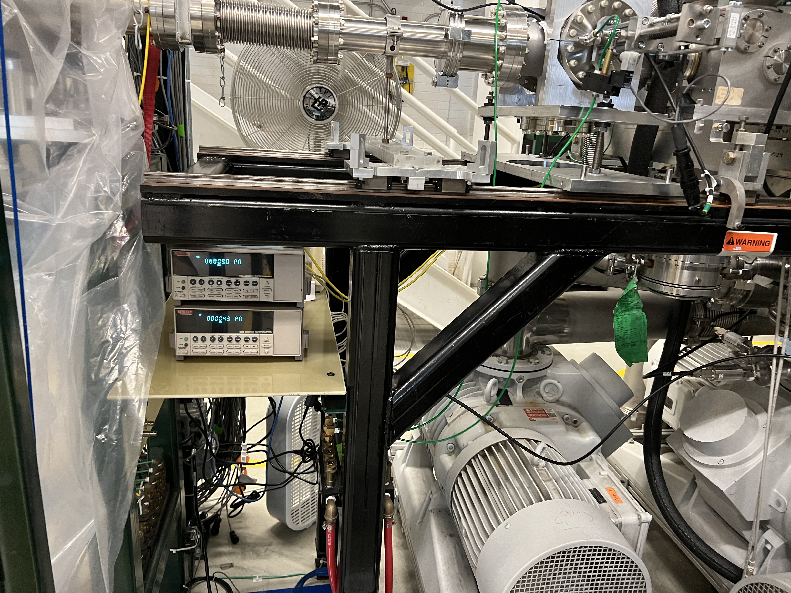
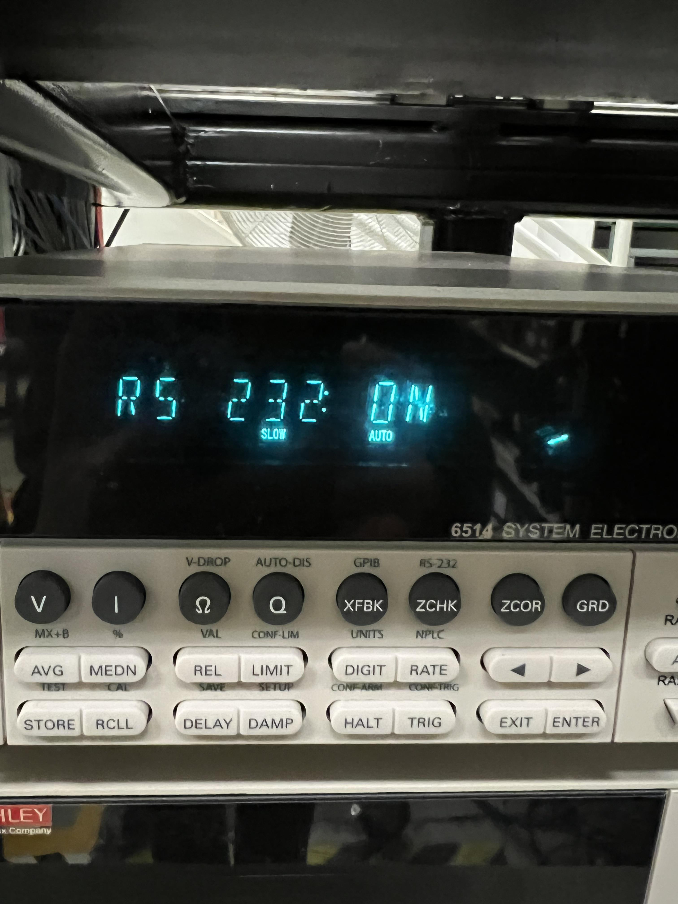
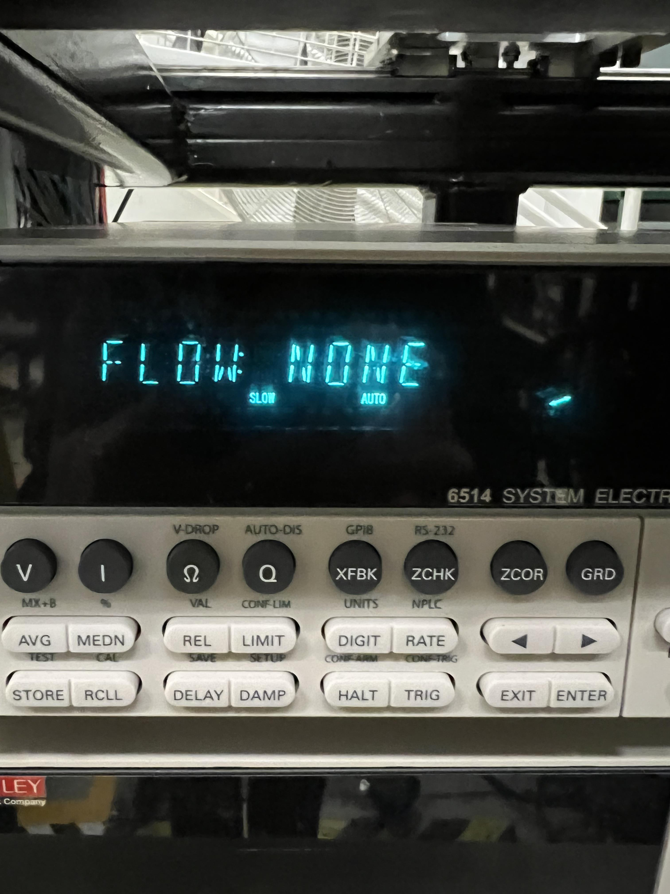
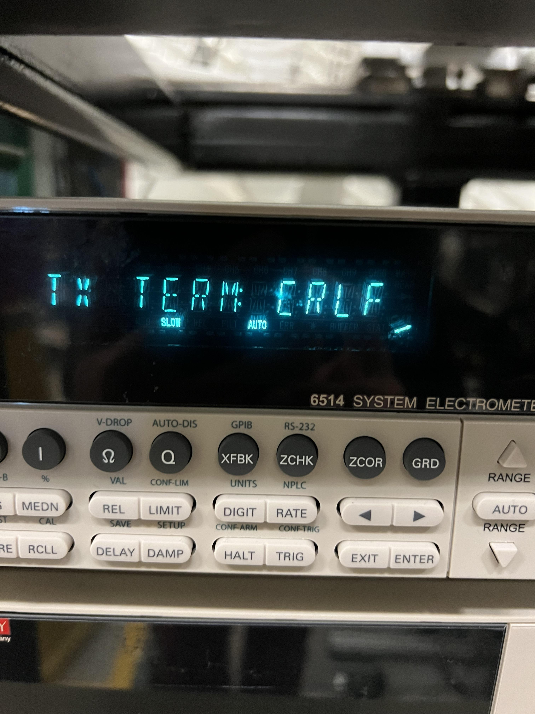
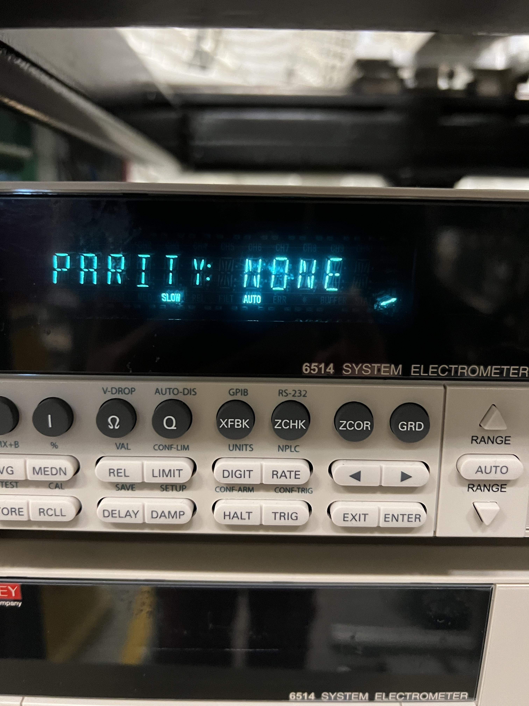
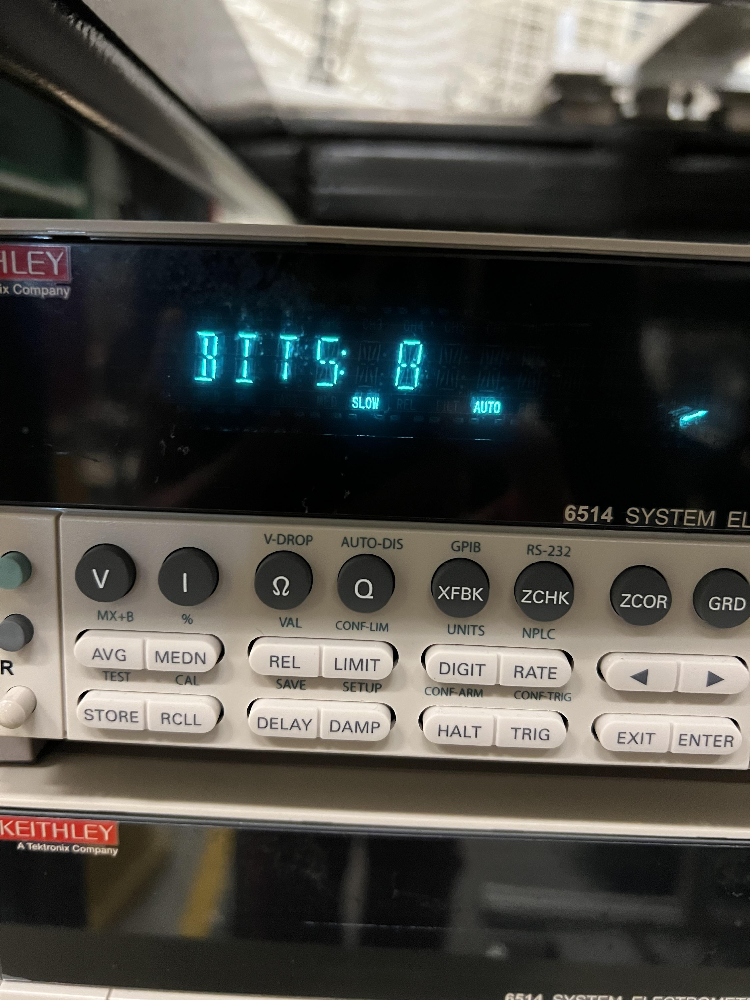
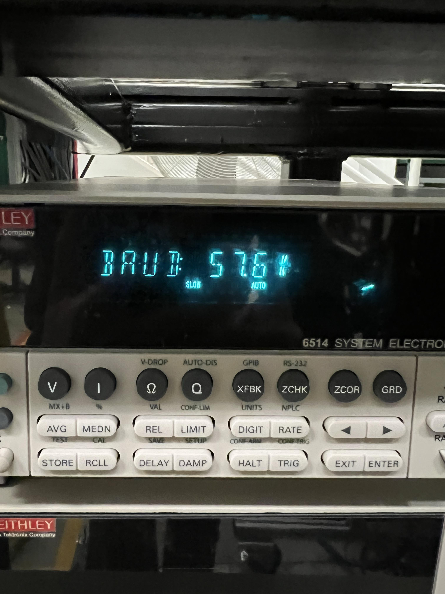
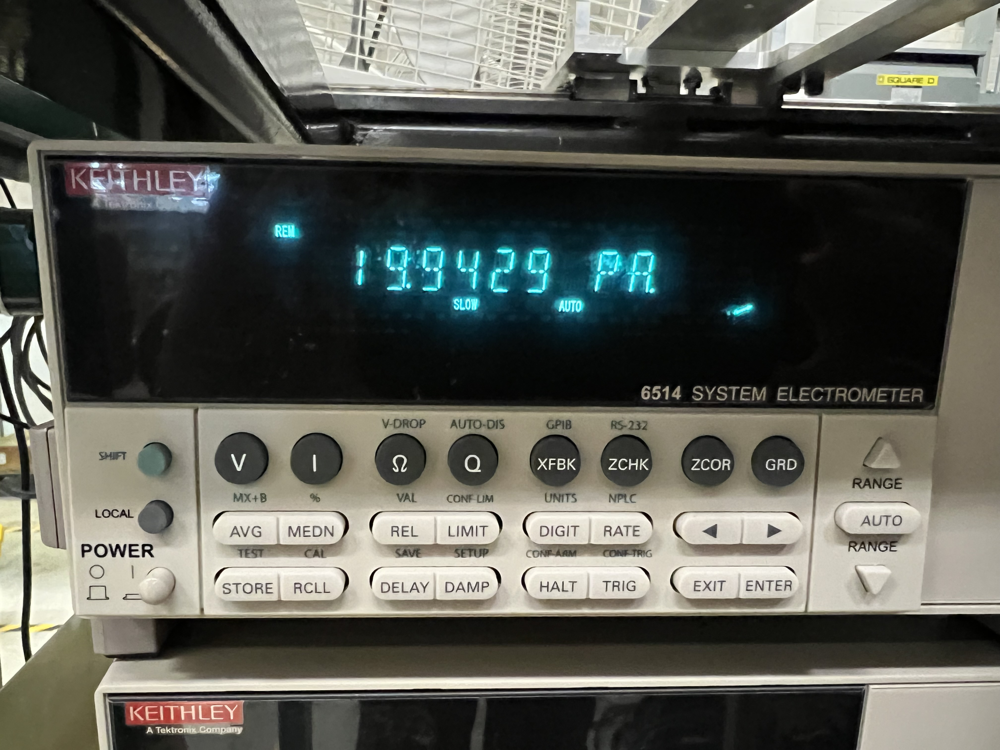
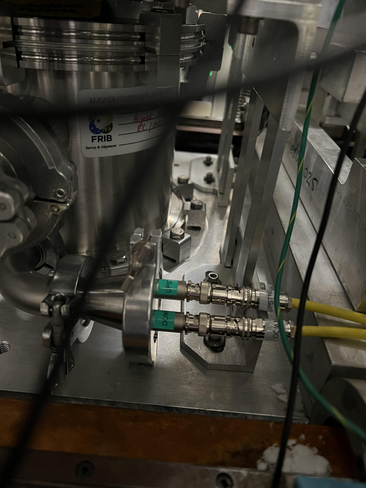
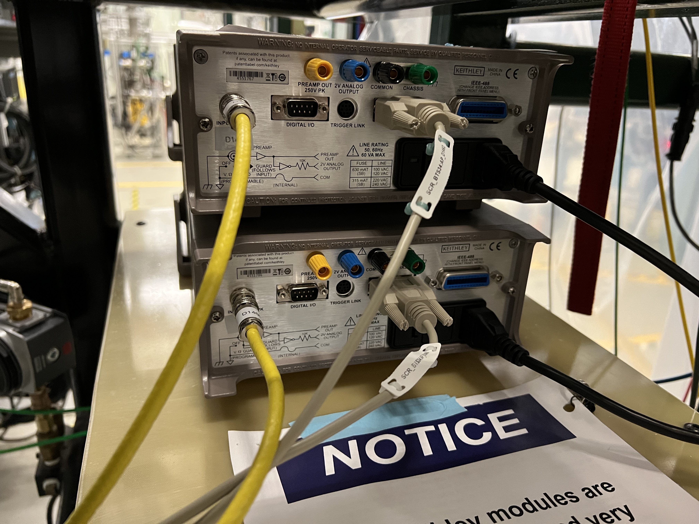

Keithley Modules
================

This chapter presents a summary of the setup and operation of the two Keithley modules used to read currents off of the two SECAR's extended gas target's apertures.

Introduction
------------

The two Keithley modules are of model 6514. They can be found on a G10 board near the last ReA gate valve located on the SECAR beamline (see :numref:`keithleys`) and they both belong to SECAR. I have connected them to the two apertures that are mounted on the SECAR extended gas target. These apertures are D1462 (upstream) and D1466 (downstream).

.. warning::
    The Keithley modules are very sensitive (and expensive) pieces of equipment. The picoameter could easily get damaged by negligance of the operator. Please ensure that:

    #. The modules are terminated when not in use (see :ref:`operation`).
    #. Triax cables are discharged before being attached to each module's input.
    #. Use proper triax cables and DO NOT force a BNC cable to the input of the Keithley electrometer. 

.. _keithleys:

   SECAR Keithley modules.

.. _operation:

Setting Up Keithley Modules for Remote Current Readout 
------------------------------------------------------

To set up the Keithley modules for remote operation, one has to follow the instructions provided below if they are brand new and have not been set up before. Fortunately, I have already set up the SECAR Keithley modules for remote operation. This means that even if they are powered down and entirely disconnected, they still "remember" their settings and you only need to do a few steps to measure current with them.

If you have a 6514 Keithley electrometer that has never been set up for remote control, do the following:

#. Make sure the Keithley module is disconnected from its corresponding Moxa module. A D9 cable connects each Keithley eletrometer to a MOXA module. Disconnect this cable.
#. Press on the green shift button, found on the Keithley module, together with the grey button called ZCHK, also found on the Keithley module.
#. At this point, you should see RS 232 OFF on the display.
#. Press on the right arrow until OFF is selected. Once that is selected, press the RANGE down button to change OFF to ON and then press ENTER. At this point, the dispay should look like :numref:`keithley_on`.
#. Press the RANGE down button to go over all the other selections one by one and make sure each selection shows what I have written below. To change the default values when necessary, follow step 5 mentioned above and change the default value: 
  
   #. FLOW: NONE (see :numref:`flow`)
   #. TX TERM: CRLF (you need to change the default value, which is CR, or carriage return, to CRLF, see :numref:`tx_term`)
   #. PARITY: NONE (see :numref:`parity`)
   #. BITS: 8 (see :numref:`bits`)
   #. BAUD: 57.6k (you need to change the default value for this option too, see :numref:`baud`).
#. Turn off the Keithley module and reconnect it to its associated MOXA module using the correct D9 cable.
#. Turn the Keithley module back ON. You will see ERROR on the display. This is normal.
#. Open the SECAR CS-Studio and use the probe to send the following commands in the order given:

    1. SCR_BTS34:AP_D1462:AUTORANGE_CMD should be set to 0.
    #. SCR_BTS34:AP_D1462:MODE_CSET should be set to 0. This sets the Keithley module for the upstream aperture (D1462) to current measurements.
    #. SCR_BTS34:AP_D1466:AUTORANGE_CMD should be set to 0. 
    #. SCR_BTS34:AP_D1466:MODE_CSET should be set to 0. This sets the Keithley module for the downstream aperture (D1466) to current measurements.
#. I have asked Dan Crisp to make a specific CS-Studio page for these Keithley modules. At the time of writing this instruction, such a page does not yet exist, so to read the current remotely, go to "Tuning 1" tab located in SECAR's CS-Studio Global Controls page. There, you can see Keithley 1 and Keithley 2 with their current readbacks. They should be reading currents in fraction of pA if there is no beam or if no current generator is attached to the units. 

As an example, one of the Keithley modules was connected to a current generator set to output 20 pA, and you can see on the display that the unit is reading the correct amount (see :numref:`reading`).

As I mentioned above, I have already set the Keithley electrometers up. So, if they are powered down and disconnected, one does not need to do all the above steps. They already remember their settings. In order to turn them ON and read the current remotely, do the following:

#. Connect their power cables.
#. Connect the BNC side of the yellow cable to the corresponding aperture feedthrough on the extended gas target (see :numref:`target`). If the cable does not mate easily, do not force it. You most likely have chosen the triax side. Only the BNC side should be connected to the aperture feedthrough.
#. Ensure beam is off, and no current generator or any other current source is attached to the cable to avoid charging up the cable prior to attaching it to the picoameter unit.
#. Discharge the center conductor of the cable on the free triax side using a metal screwdriver: connect the center pin of the cable to the ground using a metal screwdriver. Alternatively, you can take out the BNC to triax adaptor from the free side of the cable. Then, use a 75-Ohm BNC terminator to discharge the cable. Then, reconnect the BNC to traix adaptor immediately after discharging the cable, and within a minute, connect the triax side of the cable into the Keithley's input found at the back of the module (see :numref:`back`). 
#. Connect the Keithley module to the associated MOXA module via a designated D9 cable.
#. Turn the Keithley module back ON. You will see ERROR on the display. This is normal.
#. Open the SECAR CS-Studio and use the probe to send the following commands in the order given:

    1. SCR_BTS34:AP_D1462:AUTORANGE_CMD should be set to 0.
    #. SCR_BTS34:AP_D1462:MODE_CSET should be set to 0. This sets the Keithley module for the upstream aperture (D1462) to current measurements.
    #. SCR_BTS34:AP_D1466:AUTORANGE_CMD should be set to 0. 
    #. SCR_BTS34:AP_D1466:MODE_CSET should be set to 0. This sets the Keithley module for the downstream aperture (D1466) to current measurements.
#. I have asked Dan Crisp to make a specific CS-Studio page for these Keithley modules. At the time of writing this instruction, such a page does not yet exist, so to read the current remotely, go to "Tuning 1" tab located in SECAR's CS-Studio Global Controls page. There, you can see Keithley 1 and Keithley 2 with their current readbacks. They should be reading currents in fraction of pA if there is no beam or if no current generator is attached to the units. 

.. tip::

   **It is recommended that the units be left ON and connected to the apertures at all times.**

.. _keithley_on:

   RS 232 serial communication is turned ON.

.. _flow:

   Flow should be set to NONE, which is the default value.

.. _tx_term:

   Default setting for TX_TERM should be changed to CRLF.

.. _parity:

   Parity should be set to NONE, which is the default value.

.. _bits:

   Bits should be set to 8, which is the default value.

.. _baud:

   BAUD setting should be changed from the default setting to 57.6k.

.. _reading:

   Keithley module reading 20 pA current from a current generator set to output 20 pA.

.. _target:

   SECAR's extended gas target's apertures' feedthrough. The traix sides of these cables should be connected to the inputs of the Keithley modules (see :numref:`back`).

.. _back:

   The back of the Keithley modules: inputs should be connected to the triax side of the cables that are attached to the apertures (after the cables are discharged). The D9 cables are attached to the MOXA modules, and the black cables are power cables.

Shutting Keithley Modules Down
------------------------------

To shut them down, simply turn the units OFF. If they have to be disconnected from the apertures, do the following:

#. Ensure beam is off, and no current generator or any other current source is attached to the Keithley module. Ensure there is no current on the apertures of the extended gas target. If there is, take the current source away first to avoid charging up the cable prior to detaching it from the picoameter unit.
#. Disconnect the cable from the input of the Keithley module after making sure the cable is not charged.
#. Connect the provided triax terminator (found attached to the notice sign on the G10 board underneath the units) to the input of the Keithley module. This will esnure the unit is not damaged by static charge buildup.

