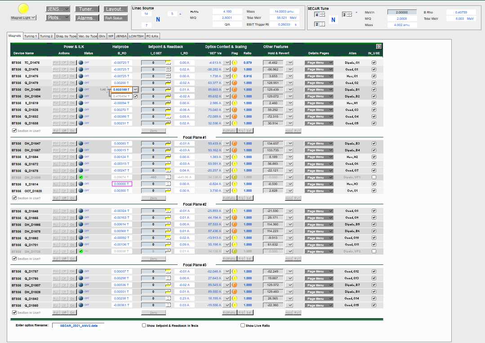
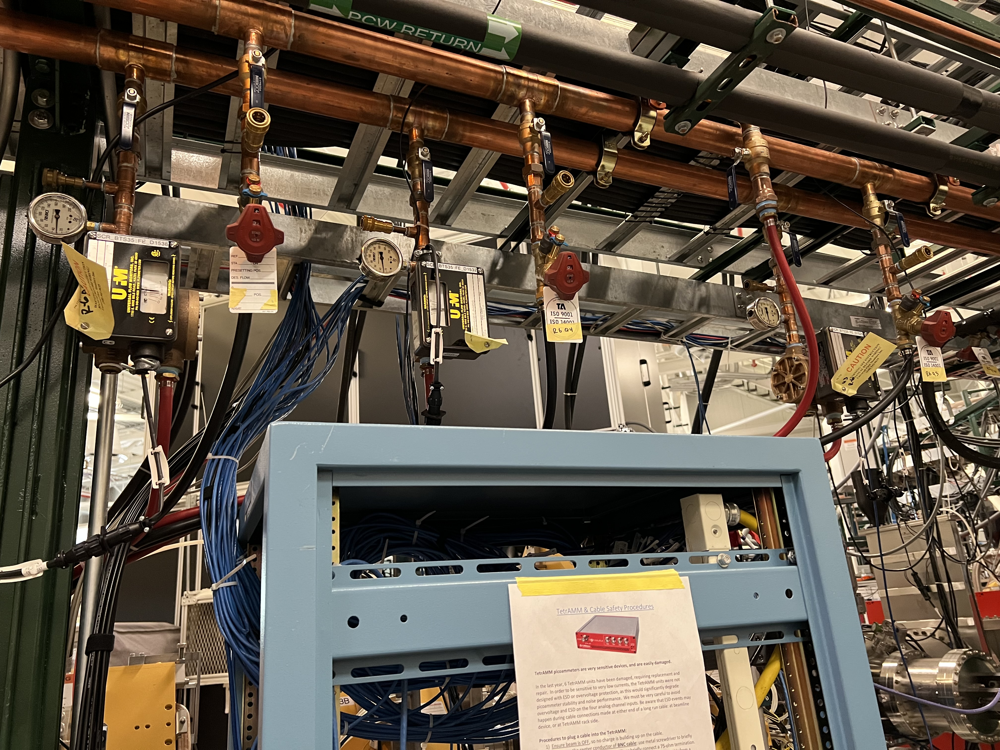
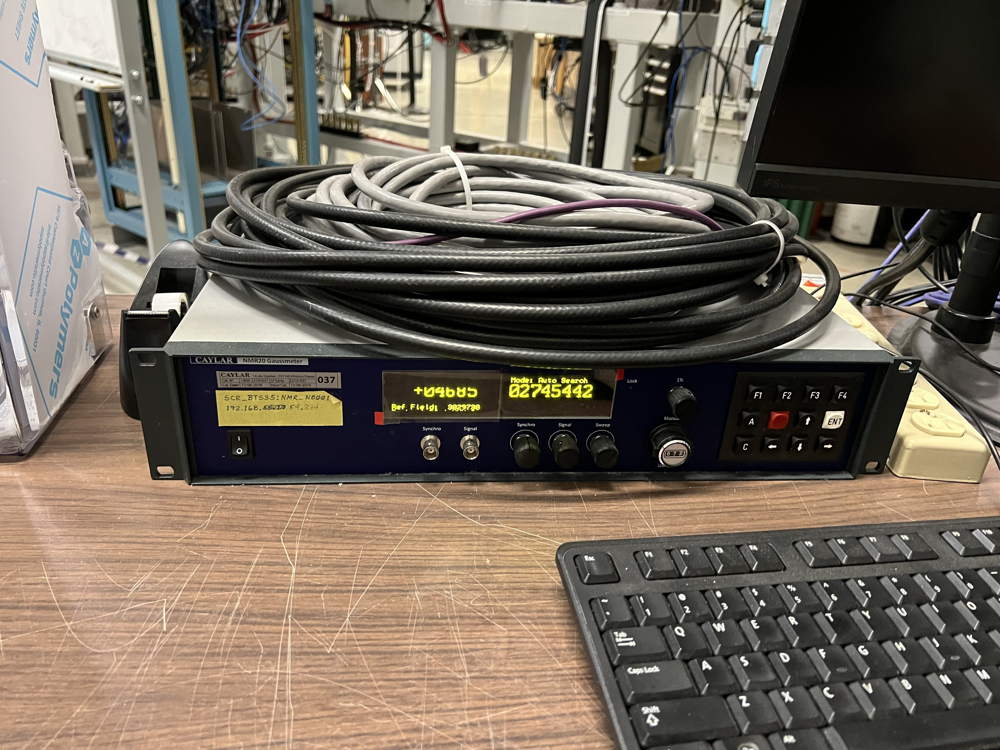
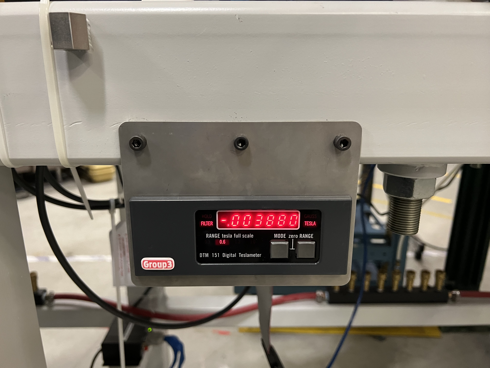
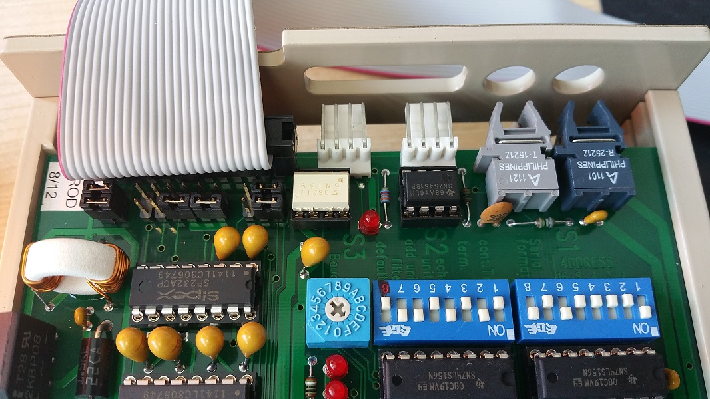

Magnets
=======

Note

Hydrogen operation is currently only allowed for the extended gas target.

The CS-Studio page for magnets is located under "SECAR Global Controls" page, "Magnets" tab, which is shown on :numref:`magnet_page`.

.. _magnet_page:

   The CS-Studio controls for all the magnets of SECAR.

The optics file can be loaded from the "Enter optics filename:" entry located at bottom left of this page. 

Magnets are devided into 4 sections since SECAR has 4 focal planes. If "Section in Use?" is not checked for these divisions, those magnets in the sections not in use will not be affected by the operation, which includes scaling, zeroing current, turning ON/OFF, reseting, freezing ratios, etc.

Prior to turning ON any of the SECAR magnets, you need to first turn ON the warning magnet light (yellow indicator on top left of this page). Once the warning light for existance of magnetic field near the SECAR magnets is turned ON, you can then turn ON individual magnets (On button on an individual magnet), or all magnets of a section via the On button visible at the end of each section. Similarly, magnets can be reset and turned OFF individually or combined in a section. The buttons that say "Zero", will turn the currents of all magnets of a section to zero. This is a useful feature to use at the end of an experiment to zero the currents of all magnets prior to turning them OFF section by section.

B1 and B2 have NMR probes. If the NMR signal is not locked, you will see an orange rectangle around the field readback. Once these magnets are turned ON and are set to some non-zero current and the NMR signal is locked on, the orange color disappears and the field remains constant unless the currents change. There is a toggle button near the field reading, with which one can change the range of the NMR probes: B1 high, B1 low, B2 high, and B2 low. The chosen range for these magnets is also indicated near the field readback.

In the "Setpoint & Readback" section, the yellow rectangles indicate that the limit of the associated power supply is reached. For example if a magnet's power supply is unipolar and positive, when the current is set to 0, you are already at the lower limit of this power supply. Therefore, if the current is zero, you will see a yellow rectange near the setpoint for current. If you set the current such that it reaches the maximum limit of the power supply for that particular magnet, you will again see this yellow rectange near the current setpoint.

"Hallprobe B_RD" is the magnetic field measured by the Hall probe; "I_CSET" is the setpoint for the current set by the user; "I_RD" is the current readback from the power supply; "SET Val" is the calculated current based on Danfysik field map for each magnet; the toggel button near "SET Val" allows the user to freeze the current; set the current or restore the setpoint; the round indicator next to this toggle switch called "Flag" that may be green with a check mark or yellow or orange with an ! mark warns you about the deviation of the most recent currently set value of the power supply current with respect to what is accepted; "Ratio" is the ratio between Brho scaled optics file value and the last frozen power supply value; "Hold & Revert" is the temporary stored current value which can be used by applying Revert button. Cycling the magnets, Hall probe details, and power supply and magnet details can be found in "Page Menu".

.. warning::

        **Please make sure WF1 and WF2 are not checked in the "In_USE" sections because if they are and you zero the currents or scale the system or turn OFF magnets of a section, you will cause a spark on their HV power supply if they are up and running by suddenly changing the magnetic fields in the Wien filters.**

Scaling SECAR Magnets
---------------------

The "SECAR Tune" found on the top of the "Magnets" tab can be used to scale all or some of the magnets of SECAR based on energy, magnetic rigidity, beam ion and its charge state. 

Once a pilot tune is reached and all magnets are set to a correct current/field such that the beam properties and positions at various locations are satisfactory, click on :code:`FRZ` buttons for all sections (or just the desired section). This will cause the "Flag" indicators of a particular section or all sections to turn green with a check mark telling you that the currents in each magnet are the accepted values. Then, to scale SECAR either fully (if all magnets have accepted currents frozen) or partially (if only those magnets of a particular section have their currents accepted and frozen) you would need to select the beam, its charge state, and energy from the "SECAR Tune" section on top of the "Magnets" tab. Once you enter the energy and hit return, you will notice that the "SET Val" values change according to the new "SECAR Tune", which causes the "Flag" indicators to change their color from green to yellow (if the difference between "SET Val" and the actual current readback ("I_RD") is not that much) or orange (if the difference between current readbacks shown in "I_RD" column and the new "SET Val" is a lot) and the check marks inside the "Flag" indicators turn into an ! mark. If the change is acceptable, click on :code:`Set` buttons if all magnets are to be changed or only the :code:`Set` button of the desired section. At this point, the "Flag" indicators turn green again indicating that the change was accepted. What is more important is this action actually changes the set currents for each magnets and now the magnets are set to a different current, and therefore a new magnetic field and the system has been scaled.

To reset the "Ratio" back to 1.0, click on :code:`RstRatio` button for the desired section.

The live ratios between the actual current readbacks and "SET Val" values can be shown if the "Show Live Ratio" found at the bottom of the "Magnets" tab is checked.

If you select "Show Setpoints & Readback in Tesla" found at the bottom of the "Magnets" tab, the current setpoints will be changed to the setpoints for magnetic field in Tesla.

.. note::

   At the time of writing this instructions, Daniel Crisp is still working on updating CS-Studio to enable us to scale both Wien filters using the same methode as scaling all other magnets. This process is not yet available right now, so I will not be able to write instructions for scaling Wien filters. Please make sure you follow up with Dan Crisp and get to know the system he will be implementing for scaling both Wien filters.

Note that the photo shown in :numref:`magnet-water` shows the flow of water for a few magnets. Such devices can be seen all around SECAR above the beamline. Make sure that the flow of water for each magnet is properly maintained. If not, please consult Bradley Powell.
        
.. _magnet-water:

   The devices shown on the top of the photo should be looked at periodically to ensure each magnet has a proper water flow for cooling.

Hall Probes
-----------

Except Hexapole 3, all other SECAR magnets have a Hall probe installed within them. B1 and B2 dipole magnets have NMR probes in addition to the Hall probes. :numref:`Teslameter` shows the Teslameters associated to Hall probes, and :numref:`NMR_probe` shows the NMR probe controller for B1 and B2 dipole magnets.

.. _NMR_probe:

   The NMR controller for the NMR probes installed inside of B1 and B2 dipole magnets.

.. _Teslameter:

   Each Teslameter of SECAR is connected to a Hall probe installed inside of a magnet.

To be able to read the Teslameters remotely, a DIP switch has to be set correctly inside each Teslameter. Otherwise, the Teslameter does not send its IP address to the PLC. I have already taken care of these for each and every Teslameter in SECAR. So, you do not need to do anything. But this is an important piece of information that one needs to have, so I will present it here. 

.. note::

   To set this DIP switch for proper remote operation of the Teslameters, open the Teslameters and set the switch like what is shown in :numref:`DIP_Switch` **except for the fact that the switch with label 1 should be down (not up as indicated on the figure).** 

.. _DIP_Switch:

   Inside each Teslameter, there is a DIP switch shown above. To be able to remotely read the field shown on the Teslameter, the switch has to be set like what is presented here **The switch labelled as 1 is wrong in this photo. It should actually be pointing down (not up as indicated on the figure).**

The range of the magnetic field measured by the Hall probe can be changed locally on the Teslameter by pressing on the "Range" button, or in CS-Studio by going to "SECAR Global Controls" page, "Magnets" tab, "Page Menu" for the Hall probe you would like to change the range, and finally "Hall Probe Details": "Decr. Range" and "Incr. Range" will decrement and increment the range, respectively. Ranges 0, 1, 2 and 3 measure up to 0.3 T, 0.6 T, 1.2 T, and 3 T, respectively.
