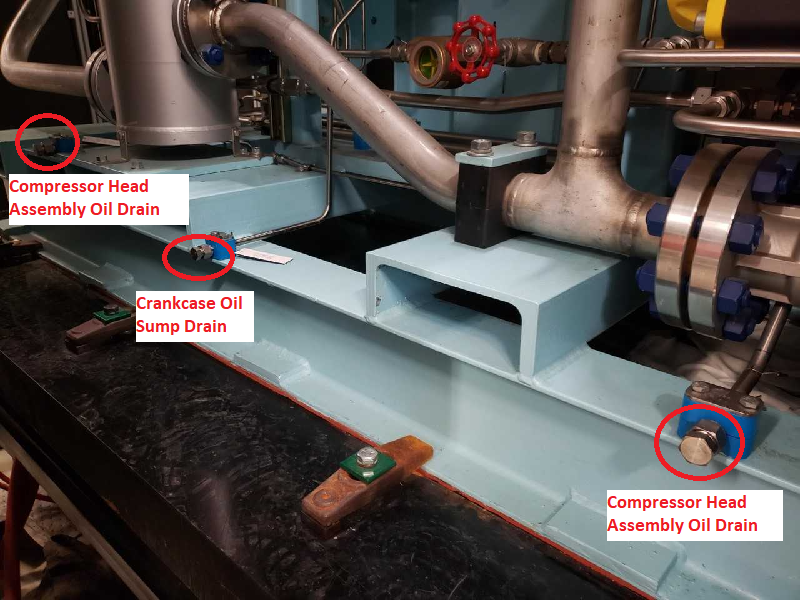
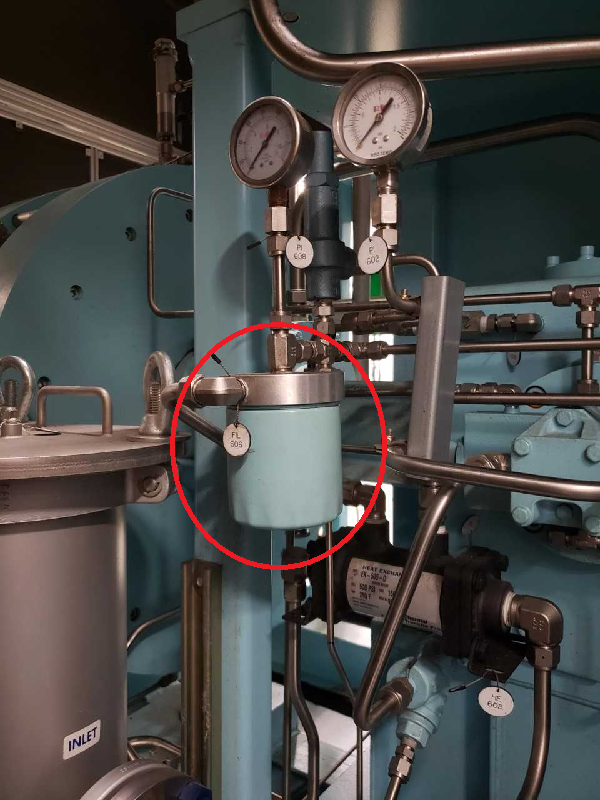
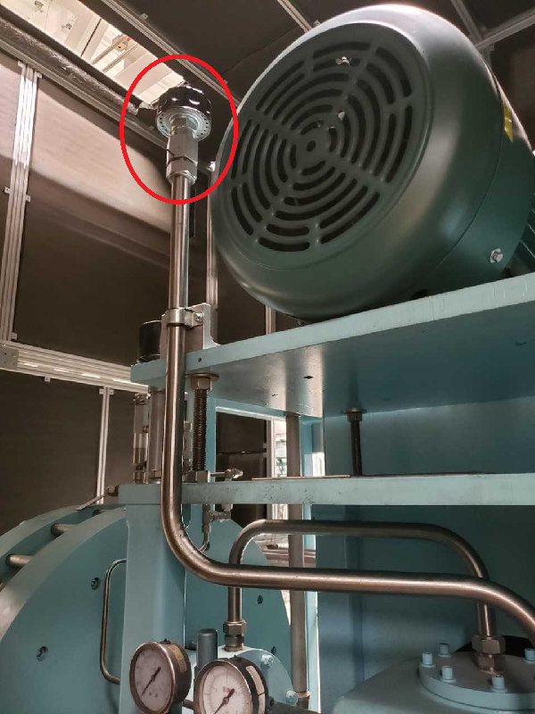
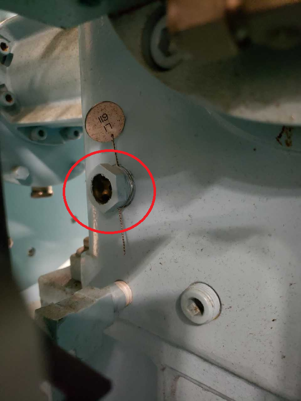

.. _maintenance:

Maintenance
===========

This chapter presents a summary of the required maintenance for SECAR. 

Turbo Pumps
-----------

Turbo pumps will basically have to be sent back to the manufacturing company for repair or any maintenance. According to Brandon Ewert, there is nothing anyone can do on site at FRIB to repair these kinds of pumps and they need to be sent back to where they were fabricated if there is any issue with these pumps. 

Therefore, there is no preventative measure other than operating them correctly: 

- Start the turbo pumps at 50 mTorr or less.
- Do not leave the JENSA turbo pumps OFF with cooled water still ON since the ball bearings grease will coagulate and this is not good.
- If a turbo pump that is not manufactured by Pfeiffer is going to be stored for 6 months or more, give it to the vacuum group so they can spin it up once every 6 months. The Pfeiffer pumps do not need to be spun up every 6 months.
- Do not vent the system when the turbo pumps are still rotating. Let them spin down propoerly and all the way to 0 Hz. 
- If you are turning a turbo pump ON after a long time, either turn it on using the soft start if that is available in CS-Studio (it is available only for Agilent pumps), or turn it on wait for 10 seconds, turn it off wait for 10 seconds, then turn it back on and wait for 15 seconds and turn it off and wait for 15 seconds, and then turn it on again and let it go to full speed.
- A new Agilent pump should always be turned ON using the soft start.

Roughing Pumps
--------------

- If the pump is always ON and has normal amount of load (the chamber is at high vacuum) and is not pumping on any particular gas all the time, take it to Mike Welton for service every 6-7 months. If there is usually too much load on the pump, or if the pump has to be turned ON and OFF regularly, and/or the pump is constantly pumping some kind of gas out of the system (like the isobutane pump or the JENSA scroll pump) then take this pump to Mike for service every 2-3 months so he can change the tip seal. 

The tip seal kits are about 500 dollars a piece, so it may be too costly to service these pumps too often. After changing the tip seal, the foreline pressure usually goes down to mTorr region easily. After a while, however, as the tip seal wears out, the foreline pressure starts to rise to 50 mTorr baseline. That is when the tip seal should be changed. SECAR does not have foreline pressure gauges, so the health of the foreline vacuum cannot easily be determined. Thus, after talking to various experts on site, I recommend that the tip seals of all scroll pumps be changed by Mike Welton once every year. Since the JENSA roughing pump falls into the category of those pumps with too much load that are regularly being turned ON/OFF and is constantly pumping gas out of the system, it has to be serviced every 4-6 months.

Table below shows the last time each of the scroll pumps was serviced:

+-------------+-----------------+-------------+----------------------+--------------------+
| Scroll Pump | Date of Service | Serviced by | Service Requested by | Service            |
+-------------+-----------------+-------------+----------------------+--------------------+
| D1509       | 08/24/2022      | M. Welton   | Kiana Setoodehnia    | Tip seal replaced  |
+-------------+-----------------+-------------+----------------------+--------------------+
| D1515       | 03/02/2023      | M. Welton   | Kiana Setoodehnia    | Tip seal replaced  |
| (This is a  |                 |             |                      |                    |
| spare IDP-15|                 |             |                      |                    |
| dry pump    |                 |             |                      |                    |
| now)        |                 |             |                      |                    |
+-------------+-----------------+-------------+----------------------+--------------------+
| D1552       | 06/30/2022      | M. Welton   | Kiana Setoodehnia    | Tip seal replaced  |
+-------------+-----------------+-------------+----------------------+--------------------+
| D1562       | 01/31/2023      | M. Welton   | Kiana Setoodehnia    | Paid exchanged     |
+-------------+-----------------+-------------+----------------------+--------------------+
| D1580       | 01/25/2023      | M. Welton   | Kiana Setoodehnia    | Tip seal replaced  |
| (cryopump   |                 |             |                      |                    |
| of WF1)     |                 |             |                      |                    |
+-------------+-----------------+-------------+----------------------+--------------------+
| D1612 - WF1 | 11/09/2022      | M. Welton   | Kiana Setoodehnia    | Tip seal replaced  |
+-------------+-----------------+-------------+----------------------+--------------------+
| D1658       | 07/21/2022      | M. Welton   | Kiana Setoodehnia    | Tip seal replaceed |
+-------------+-----------------+-------------+----------------------+--------------------+
| D1697       | 09/13/2022      | M. Welton   | Kiana Setoodehnia    | Tip seal replaced  |
+-------------+-----------------+-------------+----------------------+--------------------+
| D1709 - WF2 | 04/23/2022      | M. Welton   | Kiana Setoodehnia    | Tip seal and the   |
|             |                 |             |                      | exhaust valve      |
|             |                 |             |                      | replaced           |
+-------------+-----------------+-------------+----------------------+--------------------+
| D1773       | 08/04/2022      | M. Welton   | Kiana Setoodehnia    | Tip seal replaced  |
+-------------+-----------------+-------------+----------------------+--------------------+
| D1815       | 08/02/2022      | M. Welton   | Kiana Setoodehnia    | Tip seal replaced  |
+-------------+-----------------+-------------+----------------------+--------------------+
| D1856       | 11/10/2022      | M. Welton   | Kiana Setoodehnia    | Tip seal replaced  |
+-------------+-----------------+-------------+----------------------+--------------------+
| D1878       | 10/11/2022      | M. Welton   | Kiana Setoodehnia    | Tip seal replaced  |
+-------------+-----------------+-------------+----------------------+--------------------+
| JENSA       | 03/23/2022      | M. Welton   | Kiana Setoodehnia    | Tip seal and the   |
| scroll pump |                 |             |                      | exhaust valve      |
|             |                 |             |                      | replaced           |
+-------------+-----------------+-------------+----------------------+--------------------+
| Isobutane   | 03/17/2023      | M. Welton   | Kiana Setoodehnia    | Tip seal replaced. |
| scroll pump |                 |             |                      | A new balast valve |
|             |                 |             |                      | was added          |
+-------------+-----------------+-------------+----------------------+--------------------+
| Spare XDS   | 03/06/2023      | M. Welton   | Kiana Setoodehnia    | Tip seal replaced  |
| 35i Edwards |                 |             |                      |                    |
| pump        |                 |             |                      |                    |
+-------------+-----------------+-------------+----------------------+--------------------+

Note that the roughing pump that is used with regeneration of the cryopump of Wien filter 2 belongs to the vacuum group. It is a pump from Franklin Electronic and has not been serviced yet.

Roots Blowers
-------------

There is an oil level indicator on each of these pumps. Pay attention to the level of oil while the pumps are OFF, as well as the color of the oil. The darker it gets, the worse the performance will be. So, make sure the level of oil is not low (lower than the minimum indicator line) and the color is light brown and clear. If these are not the case, you need to talk to Mike Welton or Tim Embury so they can change and/or top the oil. Other than that, these pumps are sturdy and if they break down, one needs to service them but no maintenance other than oil monitoring is required. Also, make sure when they are running, they are not too hot and have fans ready to cool them down.

DV650 DryVac Screw Pumps
------------------------

There is an oil level indicator on each of these pumps. Pay attention to the level of oil while the pumps are OFF, as well as the color of the oil. The darker it gets, the worse the performance will be. So, make sure the level of oil is not low (lower than the indicated line) and the color is light brown and clear. If these are not the case, you need to talk to Mike Welton or Tim Embury so they can change and/or top the oil. Make sure they are cooled, while running, with chilled water as well as the fans in and around the compressor noise enclosure.

Vacuum Gauges
-------------

Cold cathode gauges require cleaning from time to time. Once they get dirty from ionization, they fluctuate a lot and that is the time to get them off the beamline and send them to Mike Welton for cleaning. The Pirani gauges are virtually maintenance free but they would need to be calibrated if they are reading a value that may be wrong. The Baratron gauges need to be zeroed (according to the instructions given in their manuals) when they are connected to high vacuum and only when the pressure is lower than the lowest value they can measure.

Make sure the cold cathode gauges are always turned OFF prior to venting and before the turbo pumps are turned OFF. Do not bias these gauges (by turning them ON) when pressure is above 1 mTorr.

JENSA Area
----------

Kelly Chipps mentioned that they used to grease the JENSA rails to prevent them from rusting specially during the summer months when there is too much condensation going on around the cooling lines.  Also, I have installed insulation around all the chilled water lines on the turbo pumps to prevent excessive water condensation and rusting. Please make sure those insulations are in place and changed if needed.

I have uploaded some tables and documents for JENSA maintenance inside a directory called maintenance on the same git repository where this document exists. Please follow the procedures presented here and on those documents. 

JENSA Compressor
----------------

The manufacturing company (PDC Machines) has sent me a quote to do a full maintenance of the JENSA compressor followed by an annual or bi-annual maintenance provided by their experts. For MSU to pay for such a service, MSU has to have the ownership of the JENSA compressor. While I was working at FRIB, the compressor still belonged to Colorado School of Mines and even though I provided everything they needed from MSU side to transfer the ownership to MSU, it did not happen.

The reality is there is no expert on site to do anything related to maintenance for JENSA compressor. Therefore, I would recommend to remind Professor Uwe Griefe to finish the process of transferring the owenership of the JENSA compressor to MSU, and then ask the PDC Machines to update the quote and take care of the maintenance.

The related documents for JENSA compressor can also be found in the maintenance folder inside the git repository where this document exists.

How to Drain the Existing Oil from JENSA Compressor
~~~~~~~~~~~~~~~~~~~~~~~~~~~~~~~~~~~~~~~~~~~~~~~~~~~

#. Place a pan/tray under the drain plug for the crankcase oil sump shown in :numref:`oil_sump`.

.. _oil_sump:

   Various oil drain plugs to remove the oil from JENSA compressor's crankcase.

2. Set out a bucket or jugs to collect used oil.
3. Remove drain plug and quickly attach PVC hose with 3/8-inch Swagelok fitting to crankcase sump connection, making sure other end of the hose is in used oil collection bucket/jug.
4. Allow oil to drain out, then replace 3/8-inch Swagelok drain plug.
5. Repeat steps 1 to 4 with oil in compressor head assemblies if needed – only difference is the 1/2-inch Swagelok fitting.
6. Dispose of the used hydraulic oil per MSU waste policies.

How to Inspect and Replace Filtration Devices
~~~~~~~~~~~~~~~~~~~~~~~~~~~~~~~~~~~~~~~~~~~~~

1. Remove the screen element from the strainer and inspect the device and clean it.
2. Remove the filter element from the oil filter assembly and replace.
    - Fill the filter element and housing with new oil during reassembly as shown in :numref:`oil_supply`.

.. _oil_supply:

   The oil reservoir for the JENSA compressor.

3. Remove and inspect the crankcase breather shown in :numref:`breather`.

.. _breather:

   The breather should be removed when the oil is being added to the crankcase of the JENSA compressor.

.. note::

   With the help of Samuel Nash, I changed the oil filter of the JENSA compressor for the first time ever in March of 2022. The new oil filter was bought from the compressor's manufacturing company. The product number was PDC P0070002 ($98.00). Monica Coleman (M.Coleman@pdcmachines.com) can process the purchase order.

.. _refill_oil:

Refill the Compressor Crankcase with New Oil
~~~~~~~~~~~~~~~~~~~~~~~~~~~~~~~~~~~~~~~~~~~~

1. Ensure all three drain plugs are in place.
2. Fill oil through crankcase breather tube using 5 gallon bucket pump.
3. Oil in the crankcase sight glass (see :numref:`sight_glass`) should be 1/2 to 3/4 full when the compressor is running.  Fill to this level initially (about 1.85 gallons) and then re-evaluate level after priming the compressor (see :numref:`priming`), as some oil will be consumed to fill the compressor head assembly.
4. Replace crankcase breather.

.. _sight_glass:

   The sight glass for the oil crankcase of the JENSA compressor.

.. note::

   According to Jarrod Eveland from the PDC Machines Inc., the preferred oil is Mobil DTE 10 Excel Series 68AW. The DTE 20 is also acceptable.

Coolant for the JENSA Compressor
~~~~~~~~~~~~~~~~~~~~~~~~~~~~~~~~

The coolant is added to the stainless steel reservoir, where there is a threaded fill cap on top of the reservoir. It should be propylene glycol (not ethylene). PDC Machines uses a brand called Protocol NT-50, which is :math:`50\%` propylene glycol and :math:`50\%` distilled water. I have bought a lot of this material and it can be found near the compressor on the floor.

Cryopumps and Their Compressor
------------------------------

The Wien filter cryopumps need to be regenerated every now and then. If the temperature is bottomed out at 17 - 21 K and If the cold head runs quietly at start up, but begins to make a ratcheting (or chirping) noise after the cryopump is cooled down, then contaminated helium is the most probable cause. This is when one needs to regenerate the cryopump. To avoid contamination of helium, make sure the adsorber of the compressor is changed regularly every 3 years. The instructions on how to do this and other required maintenance for the compressor is found on section 5 of the manual, which is found in the maintenance folder inside this git repository. Also, make sure the helium is charged at the correct pressure according to the manual (also found on section 5 of the manual). Make sure the purity of helium is correct. Do not use low purity helium to charge the compressor with. Consult the vacuum group and let them do this as they are the experts.
