Vacuum System
=============

There are 9 vacuum systems in the SECAR system (not including Wien Filters). Two of those systems are located at the final focal plane.

+------------------+-------------+------------+---------+-----------+--------------+
| Magnets included | Upstream    | Downstream | Turbo   | Pirani/   | Cold Cathode |
|                  | Gate Valve  | Gate Valve | Pump    | Baratron  | Gauges       |
|                  | (BGV_D)     | (BGV_D)    |         | Gauges    |              |
+------------------+-------------+------------+---------+-----------+--------------+
| B1-B2            | 1483        | 1515       | 1497    | CMG_D1509 | 1509         |
+------------------+-------------+------------+---------+-----------+--------------+
| B1-B2 (spare)    |             |            | 1498    |           |              |
+------------------+-------------+------------+---------+-----------+--------------+
| Hex1-Q3          | 1515        | 1529       | 1515    | CMG_D1515 | 1515         |
+------------------+-------------+------------+---------+-----------+--------------+
| Q4-Q6            | 1529        | 1575       | 1568    | CMG_D1562 | 1552 and 1562|
+------------------+-------------+------------+---------+-----------+--------------+
| Q7, WF1, Hex3    | 1575        | 1617       | 1612    | PG_D1612  | 1612         |
+------------------+-------------+------------+---------+-----------+--------------+
| Oct1-B6          | 1617        | 1685       | 1638    | PG_D1658  | 1658         |
+------------------+-------------+------------+---------+-----------+--------------+
| Q10-Q11          | 1515        | 1704       | 1688    | PG_D1697  | 1697         |
+------------------+-------------+------------+---------+-----------+--------------+
| WF2              | 1704        | 1741       |         | PG_D1741  | 1741         |
+------------------+-------------+------------+---------+-----------+--------------+
| DL29 (removable  | 1741        | 1781       | 1773    | PG_D1773  | 1773         |
| section)         |             |            |         |           |              |
+------------------+-------------+------------+---------+-----------+--------------+
| Q12-Q15          | 1781        | 1853       | 1836    | PG_D1815  | 1800         |
+------------------+-------------+------------+---------+-----------+--------------+
| Focal plane cross| 1853        | 1877       | 1859    | CMG_D1856 | 1856         |
+------------------+-------------+------------+---------+-----------+--------------+
| Focal plane box  | 1877        |            | 1878    | CMG_D878  | 1878         |
+------------------+-------------+------------+---------+-----------+--------------+

Foreline Vacumm Systems and Rough Pumps
---------------------------------------

.. note::

   - All of the scroll pumps of SECAR (except the one used by the gas target system) and their roughing valves are operated manually, and thus have no interlocks, which is very unfortunate. I asked the vacuum group to provide me a required budget to fix this issue but it would cost too much to correct this. 
   - The other unfortunate fact about SECAR's rough vacuum is that there is no pressure gauge on any of the roughing stations and the foreline vacuums anywhere except the target area and the two Wien filters. I have added pressure gauges to the Wien filters' rough vacuums although there is still no remote reading of these pressures and no interlocks on those manual valves.

Except the scroll pump of the target area, those of the two Wien filters, and the pump on the isobutane system of the ionization chamber, all other SECAR scroll pumps are Agilent IDP-15 dry oil free pumps. The scroll pumps of the target area and the two Wien filters are Edwards XDS35i dry pumps. The scroll pump for the isobutane system of the ionization chamber at focal plane 4 of SECAR is Edwards nXDS10i dry pump. All the scroll pumps require regular maintenance (change of their tip seal), which is described in :numref:`maintenance`. There is one other roughing pump (see :numref:`rough_pump`) that is attached to the Wien filter 2 cryopump, which is only used during regeneration of this cryopump. This pump belongs to the vauum group.

Figure :numref:`WF_rough` shows the foreline vacuum systems for one of the Wien filters. Their foreline vacuum systems are identical; however, Wien filter 2 seem to always have a worse foreline vacuum (7.5 mTorr) than that of Wien filter 1 (1.5 mTorr). The SEACR's gas target area has various pressure gauges which can be read remotely. The rough vacuum of all the other sections can only be read when that part of the beamline is not under high vacuum! This is because there are no foreline gauges. All foreline gauges are actually attached to the high vacuum section of the beamline instead of the foreline and are separated by a totally useless manual valve! Therefore, these gauges are useless when the high vacuum pumps are ON. The low vacuum gauges are mostly Barathron gauges up to Wien filter 1 and Pirani gauges after Wien filter 1. With the high vacuum pumps ON, these gauges are already below their threshold. With the high vacuum pumps OFF, because Barathron gauges were not picked properly either, they will mostly only show around a minimum of 0.1 Torr and even that may not be accurate, which makes it risky to pump down a beamline section properly. One would turn a turbo pump ON when the vacuum is 100 mTorr, which is too much, and that is really annoying.

.. warning::

   When the sections of beamline that have Barathron gauges are under high vacuum (pressure should be lower than :math:`10^{-5}` Torr), try to zero these gauges using a small screw on the gauge. Change the position of the screw anti clockwise until the gauge reads 0. 

.. _rough_pump:
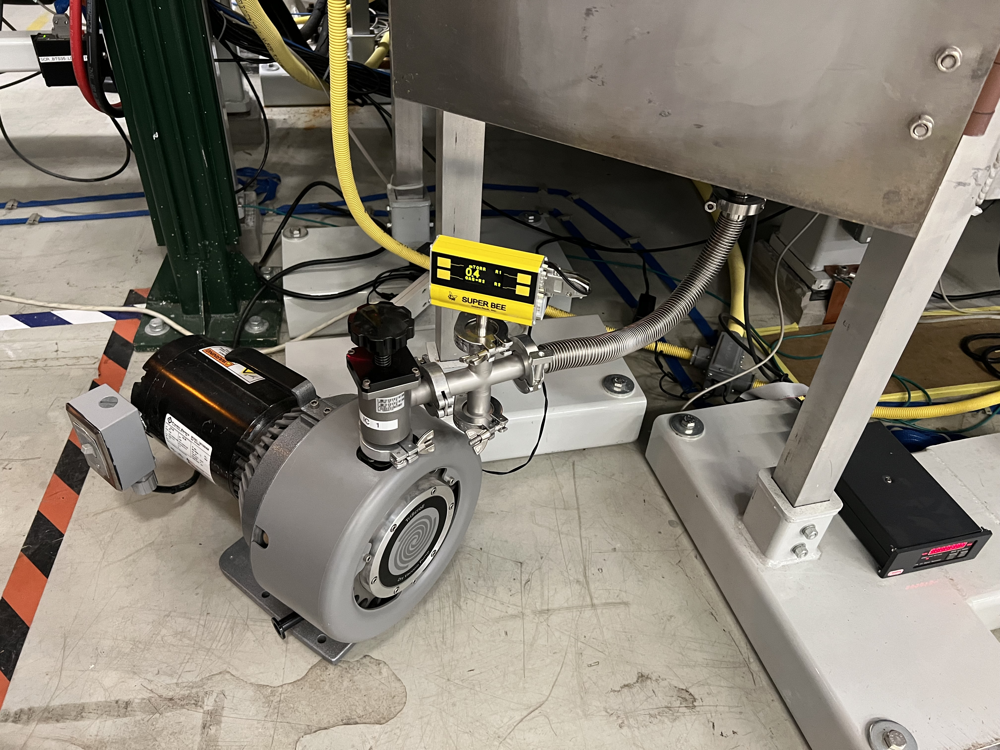

   This roughing pump belongs to the vacuum group and should only be used when the crypump of Wien filter 2 is being regenerated.

.. _WF_rough:
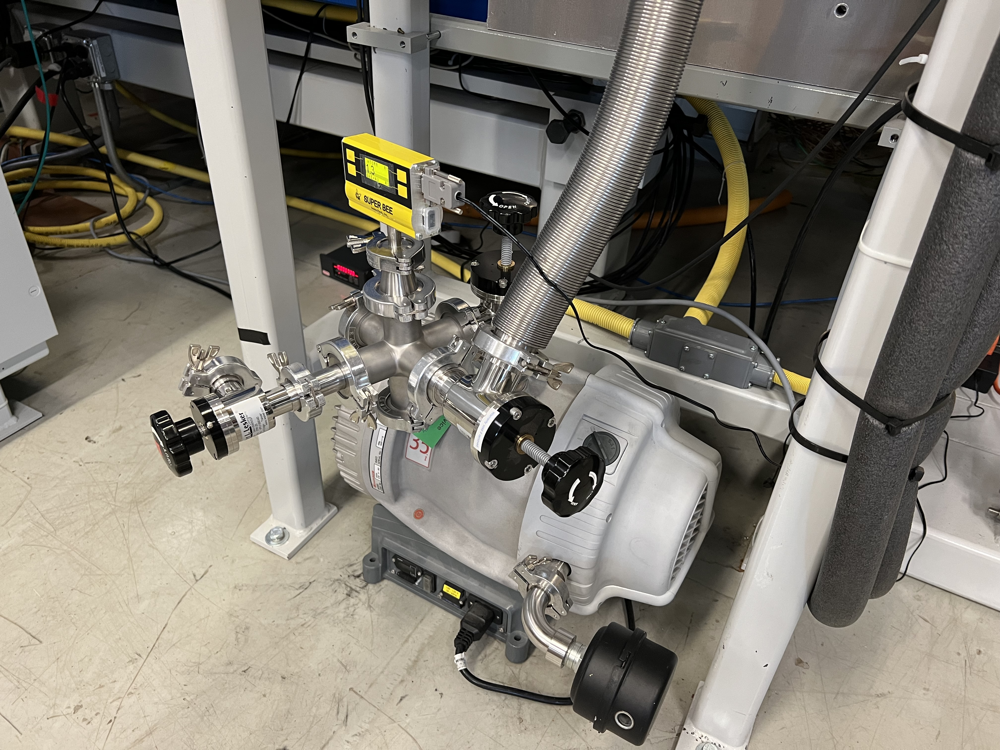

   The foreline vauum system of Wien filter 1 is shown here. Wien filter 2 foreline system is identical exept the foreline Pirani gauge does not have a digital readout. Instead, it has a small black controller nearby that displays the foreline pressure. One of the three manual valves is right on the scroll pump. The other is at the foreline of the turbo pump, and the third one is implemented for leak checking. The latter should only be opened when the leak checker is connected to this system and is already setup and running. In that case, before opening this valve, close the one that is right on the scroll pump, then slowly open the one that is attached to the leak checker. The former two valves can be used to quickly change the scroll pump (for maintenance) without turning the turbo pump OFF. The black device on the exhaust is an exhaust muffler. Wien filter 2 foreline pump does not have this either, which makes it sound very loud when the that chamber is being roughed out. 

High Vacuum Pumps
-----------------

SECAR's high vacuum is obtained by Agilent TV 1001 turbo pumps up to Wien filter 1, and Pfeiffer Hipace 80 and 300 H turbo pumps from Wien filter 1 up to the end. On each of the Wien filters, there is an Edwards STP-iX3006C turbo pump and an On-Board cryopump producing high vacuum. On the gas target section, we have 3 DRYVAC DV650 screw pumps, 4 WSU 2001, 1 WSU 501 and 2 WS 1001 Oerlikon Roots blower pumps, 6 TURBOVAC 1000 C and 1 TURBOVAC 600 C Leybold turbo pumps, as well as one Varian Turbo V-550 pump of model 969-9049.

Operation of the Cryo Pumps
---------------------------

The interlocks on the cryopumps have already been set and tested by Brandon Ewert, Ghulam Mujtaba and me. I will not explain how to change them. If you need to do that, please consult Brandon.

The On-Board cryopumps have one compressor that is shared by both pumps (see :numref:`on-board-compressor`), which is located in the ReA3 mezzanine area. The compressor has two buttons: main circuit power, and ON/OFF power (see :numref:`cryocompressor_on`).

Each cryopump has a controller (see :numref:`on-board`), on which there is a button called :code:`Control`. This together with the buttons called :code:`Relays` and :code:`Regen` do almost all of the controls. I will not explain the first two buttons (:code:`Controls` and :code:`Relays`) and their actions because everything that has to be set is already set and you do not need to do anything. Moreover, Brandon is the expert and the system owner for the SECAR vacuum system, so you should not do anything without his knowledge except regenerating these pumps when necessary.  

There are various EPICS channels and PVs already available to perform all cryopump controls remotely via CS-Studio for both cryopumps. But we have not tested these except the PVs that switch the cold heads ON/OFF. I have asked Dan Crisp to implement these PVs in CS-Studio. Once he does that, it would be nice if the full remote operation of these pumps is tested and performed.

.. _on-board-compressor:
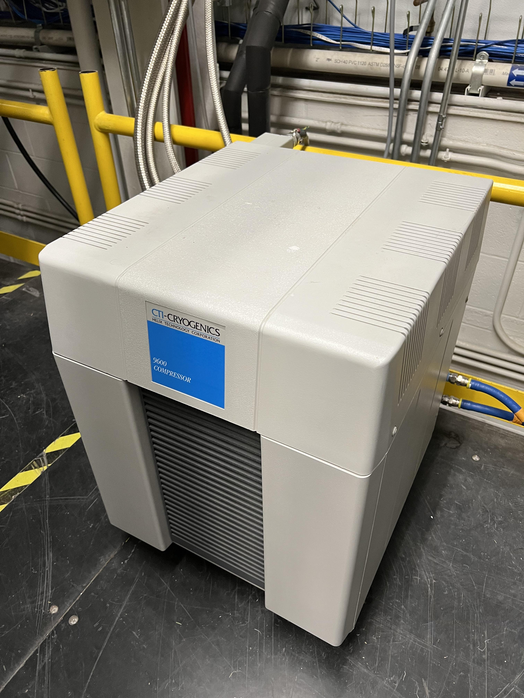

   This compressor is located in the mezzaine area of ReA3 high bay and is used with both cryopumps of the SECAR Wien filters.

.. _cryocompressor_on:
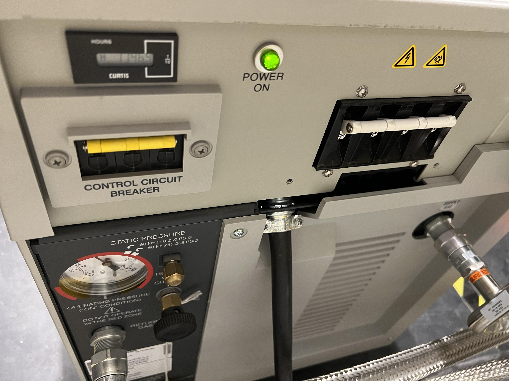

   At the back of the cryo compressor, there are two power switches: the one to the right side (looking at it from the front face of the compressor) is the main circuit breaker. The one to the left (when looking at the front of the compressor) is the ON/OFF button for the actual compressor.

.. _on-board:
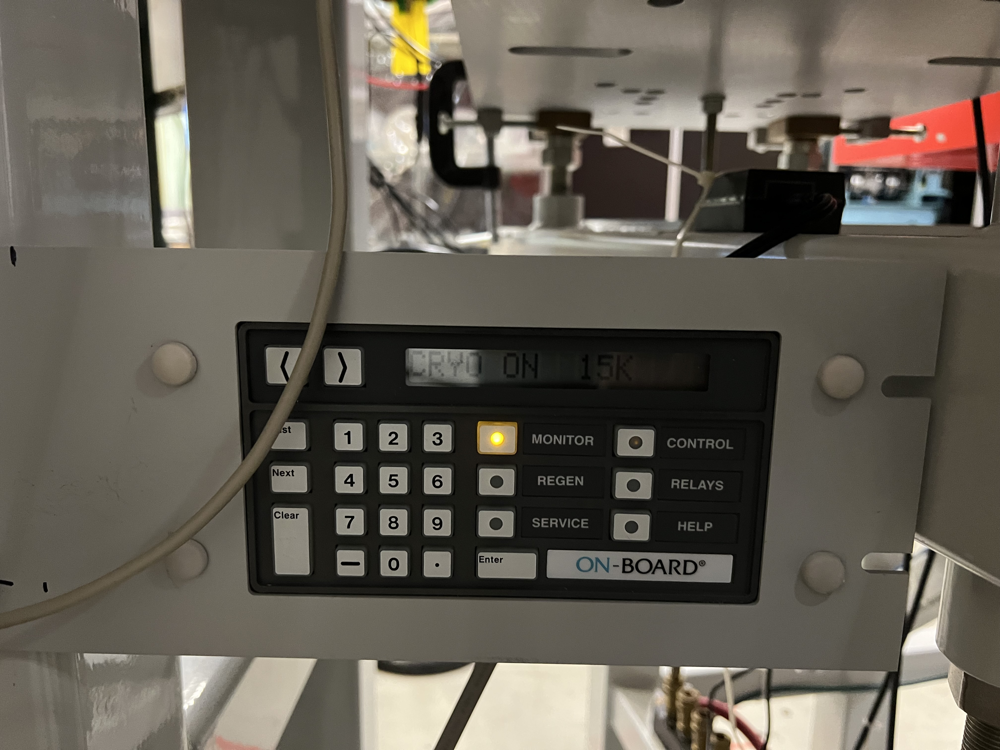

   The On-Board cryopump controller. Unless you are Brandon Ewert, or know how to operate these pumps, avoid using the :code:`Control` and :code:`Relays` buttons.

.. _regeneration:

When and How to Regenerate the Cryopumps
~~~~~~~~~~~~~~~~~~~~~~~~~~~~~~~~~~~~~~~~

Regenerate the crypumps when:

- When the cryopumps are ON, they should operate at 14 - 15 K. If this temperature gradually goes up to 17 - 21 K and the pumps start chirping loudly, that is when you need to regenerate the pumps. 
- After a long shutdown and before they can be restarted again, or everytime the pumps are warmed up for any reason.
- After a service is done on them and before operating the pump.

To regenerate the cryopumps:

- Close the cryo gate valves:

    - :code:`SCR_BTS35:GV_D1580` for Wien filter 1.
    - :code:`SCR_BTS35:GV_D1709` for Wien filter 2.
- Make sure there is a roughing pump attached to each of the solid stainless steel pipes that are behind the Wien filters sheilding doors.
- Make sure the roughing pumps are ON and the manual valves to them are fully open.
- Make sure the nitrogen lines going into the cryopumps are attached and the nitrogen is flowing in the lines (nitogen valves are already open): see :numref:`nitrogen_regulator_cryo`.
- Make sure the compressor is ON with both its power buttons ON.
- Make sure the static pressure (shown by a dial at the back of the compressor) is what it should be accoring to the cryocompressor instruction manual. If not, ask the vacuum group to charge it with high purity helium.
- Press the :code:`REGEN` button on the cryo controller (see :numref:`on-board`).
- Press 1, then press 2 to confirm a full regeneration (or press :code:`Monitor` button to cancle). At this point:

    - The pump starts to warm up to above 300 K.
    - Then, the controller opens a purge valve (that is attached to the cryopump) on its own and purges the cryopump with dry nitrogen that is hooked up to the pump.
    - Next, the controller closes the purge valve, opens the rough valve (that is also attached to the pump) so that the cryopump can be pumped on using the scroll pump that should be attached to the pump (make sure the manual valve on the pump is fully open).
    - The display only shows up to 999 microns of Hg. Once the pressure gets to 50 microns of Hg, the automatic rough valve on the cryopump is closed by the controller.
    - Then, a Rate Of Rise (ROR) test is being performed by the controller, where the pump is isolated and the pressure rise will be checked. 
      
        - If the rise in pressure is less than 10 microns of Hg in 1 minute, the ROR test passes and:
         
            - The cryopump starts to cool down
            - You will hear a chriping noise.
            - The needle on the dial that shows static pressure at the back of the compressor starts to move back and forth.
            - Once the temperature of the pump reaches 15 K, the regeneration is finished. The controller will display the message saying "regenration complete".
        - If the ROR test fails, the process is repeated for 20 times until either the test passes, or if it fails after 20 trials, the regeneration is aborted, in which ase, you need to talk to Brandon.
- Once the regeneration is successfully finished, please press the :code:`Monitor` button on the controller.
- If the vacuum in the Wien filter is good, open the cryo gate valve.
- The time it takes to regenerate the pumps varies between 1.5 hour to 3-4 hours.
 
.. important::

   Leave the On-Board controllers of both cryopumps (see :numref:`on-board`) in :code:`Monitor` status (by pressing the :code:`Monitor` buttons) to avoid accidentally pressing something that would cause an action by the controllers.

.. _nitrogen_regulator_cryo:
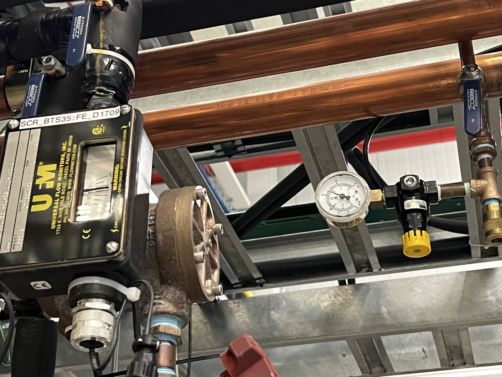

   The small regulator with a yellow handle is above the beamline near B6 dipole magnet of SECAR and the water line flow indicator (to the left of the photo). It shows the flow rate of nitrogen. Make sure the nitrogen valve (with blue handle near the yellow button) is open and nitrogen is flowing into the nitrogen tubes that are carried under the Wien filters shieldings into the cryopumps.

.. _shutdown_cryo:

How to Shut Down the Cryopumps
~~~~~~~~~~~~~~~~~~~~~~~~~~~~~~

If the pumps have to be shut down and warmed up (for example for Christmas break), do the following:

- Close the cryo gate valves:

    - :code:`SCR_BTS35:GV_D1580` for Wien filter 1.
    - :code:`SCR_BTS35:GV_D1709` for Wien filter 2.
- If you want to turn OFF the cold heads manually:

    - Press the :code:`Control` button found on the On-Board controller (see :numref:`on-board`).
    - Press :code:`Next` button until you see :code:`CRYO ON 14K`.
    - Now, press 0 to turn the cryopump OFF [1]_.
    - Verify that the cryopump is OFF from the display of the controller. It should also stop chirping.
    - Press the :code:`Monitor` button.
- The cold heads of the cryopumps can also be turned OFF remotely using these PVs:

    - Use :code:`SCR_BTS35:CP_D1580:ON_CSET` to command the cryohead to be ON (command :math:`=` 1) or OFF (command :math:`=` 0) for Wien filter 1.
    - Use :code:`SCR_BTS35:CP_D1709:ON_CSET` to command the cryohead to be ON (command :math:`=` 1) or OFF (command :math:`=` 0) for Wien filter 2.
    - After that, verify that the cryopump is OFF from the PVs below. It should also stop chirping:
        
        - Use :code:`SCR_BTS35:CP_D1580:ON_RSET` to read the cryohead status: ON (1) or OFF (0) for Wien filter 1.
        - Use :code:`SCR_BTS35:CP_D1709:ON_RSET` to read the cryohead status: ON (1) or OFF (0) for Wien filter 2.
- Only if you are turning both cryopumps OFF, do the following steps:

    - If both cryopumps are OFF, the needle showing the static pressure at the back of the cryo compressor should be staitionary. 
    - Turn OFF the right button shown in the :numref:`cryocompressor_on` to turn OFF the compressor.
    - Turn OFF the left button shown in the :numref:`cryocompressor_on` to turn OFF the circuit breaker.

SECAR Vacuum System
-------------------

SECAR's vacuum system has three CS-Studio pages:

- The :code:`SECAR_Layout.opi` page (see :numref:`layout`), which shows SECAR as a whole. If you turn ON the toggle button that is labelled as :code:`All` or :code:`Vacuum`, you can see the pressures along each section of the beamline.
- The :code:`Vac. by Type` page under "SECAR Global Controls" (see :numref:`css_vacuum`) shows all the gauges, status of turbo pumps (except the Wien filters turbos) and vacuum interlock status.
- The :code:`GVs` page under "SECAR Global Controls" (see :numref:`css_gvs`) shows the status and interlocks of all the gate valves.
- Dan Crisp is in the process of changing the last two pages, so by the time you read this manual, these pages may not exist anymore and they will look a whole lot more awesome than the clutter you see in :numref:`css_gvs` and :numref:`css_vacuum`.

.. _layout:
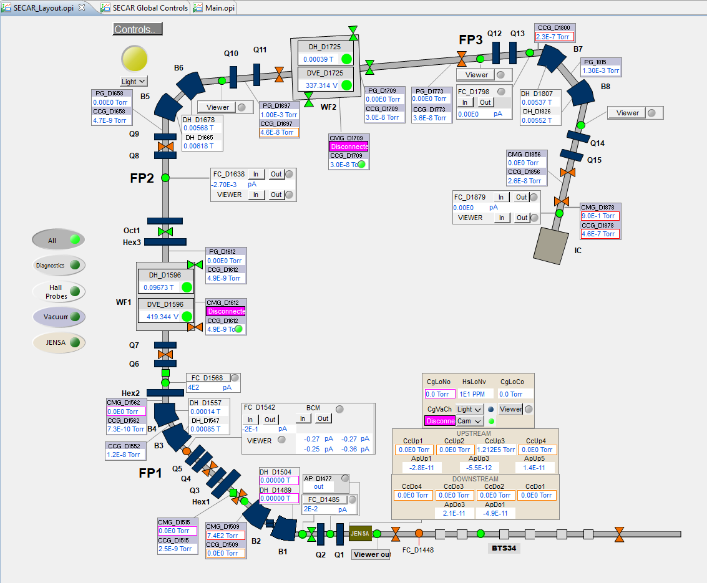

   This CS-Studio page shows the layout of SECAR, including the vacuum status along each section of SECAR.

.. _css_vacuum:
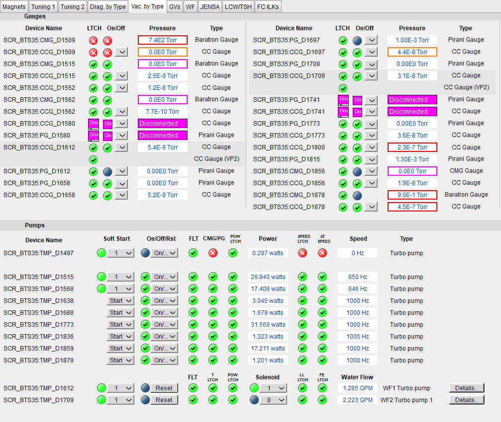

   This CS-Studio page shows the status of turbo pumps and gauges along the SECAR beamline.

.. _css_gvs:
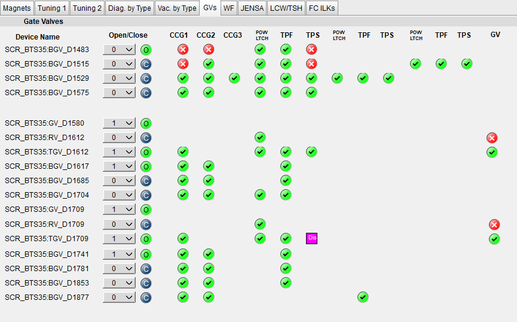

   This CS-Studio page shows the status of the gate valves and the vacuum interlocks on them.

Generally speaking:

- The beamline gate valves can be opened/closed from the :code:`GVs` page by clicking on Open/Close buttons. If a gate valve is closed, the indicator shows |GVclose| and if it is open, the indicator shows |GVopen|. If a gate valve cannot be opened, it is because there is some interlock that does not allow it to open: for example vacuum on one side is not good enough. Once, the condition that has tripped the interlock is satisfied (for example, by pumping down the section), you need to clear the PLC latch by resetting the corresponding gauge that has tripped the interlock.
- The gauges can be reset by clicking on the small toggle button near "LTCH" (latch) found in the :code:`Vac. by Type` page.
- The gauges can be turned ON/OFF by the same toggle button discussed above.
- The turbo pumps can be turned ON/OFF and be reset using the :code:`Vac. by Type` page.  
- The Wien filter vacuum system is described in :numref:`Wien_filters_vacuum`.
- :code:`CCG` is a cold cathode gauge.
- :code:`PG` is a Pirani gauge.
- :code:`BGV` is a beamline gate valve.
- :code:`TGV` is a turbo gate valve: there are only two of these in the entire SECAR and those are on the Wien filters.
- :code:`RV` is a roughing valve: there are also only two of these in the entire SECAR and those are on the Wien filters.
- Agilent turbo pumps have a feature that is called "soft start". This can be turned ON/OFF from the :code:`Vac. by Type` page. If it is turned ON, it takes a longer time to turn an Agilent turbo pump ON/OFF because the speed goes up/down in steps, and there is a certain amount of time spent in each step.   

Venting Beamline
~~~~~~~~~~~~~~~~

To vent the SECAR beamline sections:

- Make sure both beamline gate valves immediately up- and downstream the section to be vented are closed.
- If there are any detectors in this section, make sure they are debiased.
- Turn OFF the cold cathode gauge of this section. Some sections may have more than 1 cold cathode gauge. Make sure all of them are OFF.
- Turn OFF the turbo pump(s) of that section.
- Wait till they spin down to zero and their speed reduces to 0 Hz.
- Once the turbo pumps are at 0 Hz, close the manual roughing valve(s) to the scroll pump(s) for the section to be vented.
- The roughing pump(s) can be left ON.
- If dry nitrogen is available for that section (this is the case for a large portion of the SECAR beamline):
 
    - Hook up the regulator shown in :numref:`nitrogen_vent_line` to the laboratory dry nitrogen supply line. 
    - Remove the rubber cork attached to the vent valve of the beamline section that is going to be vented.
    - Hook up the other side of the nitrogen hose to the vent valve.
    - Open the valve on the laboratory supply of dry nitrogen.
    - Set the regulator to 5 - 10 psi (or 3 psi if there are fragile target foils in the section).
- If dry nitrogen is not available:
    
    - Remove the rubber cork attached to the vent valve of the beamline section that is going to be vented.
    - Hook up the air filter shown in :numref:`filter_for_vent` to the vent valve.
- Open the vent valve and monitor the pressure gauge (either Pirani or Barathron gauge). The gauges can be read from the :code:`Vac. by Type` page.
- Once the pressure reaches anywhere between 690 Torr (for the Wien filter chambers to 760 Torr), the beamline is vented.
- Close the vent valve.
- If dry nitrogen was used for venting:

    - Close the nitrogen supply valve on the main laboratory nitrogen supply line.
    - Disconnect the tubing.
- Put the robber cork back into the vent valve. This is to avoid leaks caused by the weak welded joints on the vent valves. Most of them leak because they have been over tightened too much.
- Cover the open areas to prevent dust and moisture accumulation in the beamline.

.. attention::

   The section of the beamline containing the MCP detectors **has to** be venten with dry nitrogen. Once the section is vented, keep flowing nitrogen to avoid exposing the MCP detectors to air. 

.. _nitrogen_vent_line:
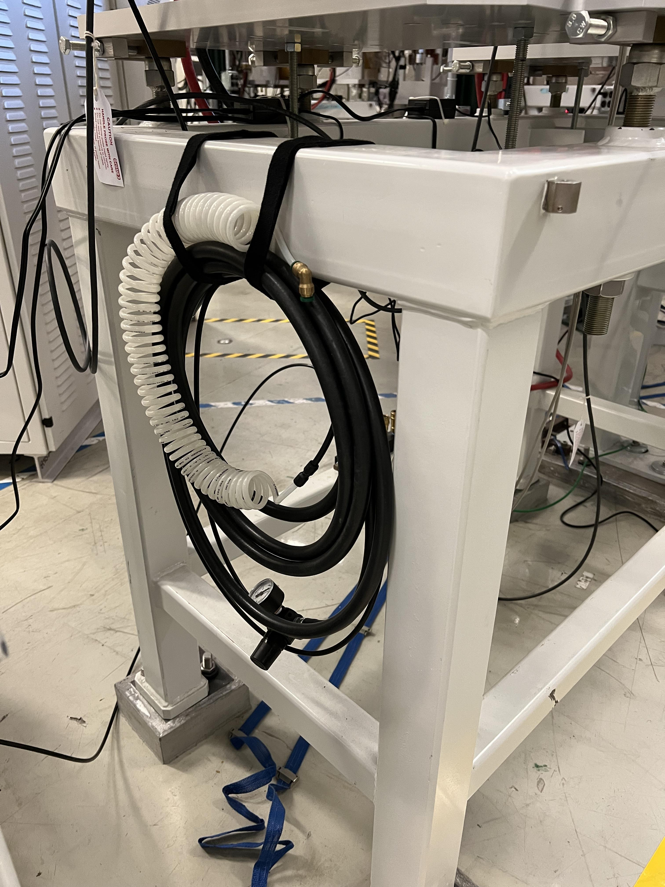

   Use this tube and its regulator (attached to the beamline stand upstream of the upstream MCP) for venting the SECAR beamline with the laboratory supply of dry nitrogen.

.. _filter_for_vent:
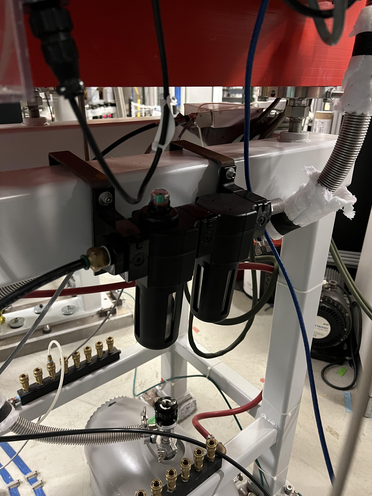

   Use this filter (attached to the beamline stand near the first dipole magnet) for venting those sections, where laboratory dry nitrogen supply line is missing (such as focal plane 2 area).

Venting the Focal Plane 4 Section with the Hybrid Detector Attached
^^^^^^^^^^^^^^^^^^^^^^^^^^^^^^^^^^^^^^^^^^^^^^^^^^^^^^^^^^^^^^^^^^^

To vent this section:

- Make sure the last beamline gate valve of SECAR (:code:`SCR_BTS35:BGV_D1877`) is closed.
- Make sure IC and DSSD detectors are debiased.
- Turn OFF the cold cathode gauge of this section (:code:`SCR_BTS35:CCG_D1878`).
- Leave the valve shown in :numref:`figure5` open.
- Make sure the valve shown in :numref:`figure6` and the other similar valve nearby (both have green handles and are near the beamline as opposed to on the isobutane gas handling system) are both open.
- Make sure the green valves labelled as To/From IC on the isobutane gas handling system are both closed.
- Turn OFF the turbo pump of this section (:code:`SCR_BTS35:TMP_D1878`).
- Wait till it spins down to zero Hz.
- Once the turbo pump is at 0 Hz, close the manual roughing valve to the scroll pump of this section.
- The roughing pump can be left ON.
- Hook up the regulator shown in :numref:`nitrogen_vent_line` to the laboratory dry nitrogen supply line. 
- Open the valve on the laboratory supply of dry nitrogen.
- Set the regulator to 3 psi.
- Remove the rubber cork attached to the vent valve of this beamline section.
- Hook up the other side of the nitrogen hose to the vent valve.
- Open the vent valve **very slowly** and monitor the pressure gauges upstream and downstream the IC detector (upstream gauge can be seen on the gauge controller near B8 dipole, downstream gauge can be read from the isobutane gas handling system, both these gauges are Barathron gauges).
- Once the pressure reaches 720 Torr, close the vent valve.
- Remove the nitrogen tubing and close the laboratory nitrogen supply valve.
- **Slowly** reopen the vent valve and let the beamline be vented slowly with air.
- Close the vent valve when the pressure gauges stop going up.
- Put the robber cork back into the vent valve. This is to avoid leaks caused by the weak welded joint on this vent valve.
- Cover the open areas to prevent dust and moisture accumulation in the beamline.

Pumping Down Beamline
~~~~~~~~~~~~~~~~~~~~~

To pump down the beamline section that is vented:

- Use a new copper gasket on all flanges that were opened.
- Close the open flanges and make sure their bolts are tightened down.
- Close the vent valve(s).
- Put the rubber corks that I have provided in the vent valve's hose.
- Make sure the roughing pump of the section is ON.
- Slowly open the manual roughing valve and listen for any abnormal sound from the scroll pump. If the pump is too loud for too long, you may have a large leak.
- Monitor the pressure gauge in the beamline:

    - If it is a Pirani gauge, wait until it comes down to 50 mTorr before starting the turbo pump.
    - If it is a Barathron gauge, wait until it showes 100 mTorr or 0 before starting the turbo pump.
- Turn ON the turbo pump from the :code:`Vac. by Type` page. 
- When the turbo pump's speed is around 100 to 200 Hz, turn ON the cold cathode gauge on that section.
- Once the turbo pump is at full speed (646 or 650 Hz for the Agilent pumps, 1000 Hz for the pfeiffer turbo pumps), reset the cold cathode gauge and the turbo pump using the :code:`Vac. by Type` page. 

.. warning::

   If the section you are pumping down on is at focal plane 4, where the hybrid detector is:
   
   - Make sure the valve shown in :numref:`figure5` is fully open.
   - Make sure the valve shown in :numref:`figure6` and the other similar valve nearby (both have green handles and are near the beamline as opposed to on the isobutane gas handling system) are both open.
   - Make sure the green valves labelled as To/From IC on the isobutane gas handling system are both closed.
   - Pump down the system from atmospheric pressure very slowly (very slowly open the manual roughing valve) to avoid breaking the ionization chamber's window (3 :math:`{\mu}m` thick Mylar). Once the pressure gets to 5 Torr, open the roughing valve all the way.

How to Change a Vacuum Interlock
~~~~~~~~~~~~~~~~~~~~~~~~~~~~~~~~

If you need to change the threshold set on a vacuum gauge that trips the vacuum interlock set by that gauge, do the following:

- Notify Brandon Ewert.
- Find the gauge controller associated with the desired gauge. Some are in the ReA3 mezzanine area. Some are found near B8 dipole magnet.
- On the correct gauge controller, use the up/down arrow buttons to select the desired gauge. Once the correct gauge is selected, a green LED will be lit for that gauge.
- Press on the :code:`Channel Setup` button.
- The display of the controller changes and will show you some options.
- Using the up/down and left/right buttons, select the relay that has the interlock which you are trying to change. If you do not know which relay this may be, either ask Brandon Ewert or Ghulam Mujtaba. Or, if there is only one relay that is "enabled", it is most likely that one.
- Using the arrow buttons, select the number under the :code:`SET SP` column and in the row with the correct relay number. Once this is selected, the number will be highlighted light blue.
- Press the :code:`Enter` button. This will change the highlight color to black.
- Use the up button to increase the setpoint and the down button to decrease the setpoint. While you are doing this, another column called :code:`Hyst` (hysteresis) will also change. This is normal.
- Once the desired value is reached, release the arrow button.
- Press the :code:`Enter` button again.
- The new interlock threshold is now set.
- Press the :code:`ESC` button.

.. _Wien_filters_vacuum:

Wien Filters Vacuum System
--------------------------

The Wien filters are sensitive equipment and to keep them conditioned for high voltages, one needs to ensure they are kept clean and moisture/dust free. To achieve this, they need to remain under high vacuum at all times. So, try to avoid turning their turbo pumps OFF and/or venting them. 

.. warning::
 
   - **Wien filter chambers should not be vented with air to avoid dust accumulation in the chamber, which will affect conditioning of the filter at HV. Use dry nitrogen to vent if necessary.**
   - If the filters have to be vented and opened, set up the clean room before their chambers are opened.

Venting Wien Filter Chambers
~~~~~~~~~~~~~~~~~~~~~~~~~~~~

To vent the Wien filter chambers:

- Close the up- and downstream beamline gate valves that separate the filter from the rest of the beamline.
- Turn OFF the high voltage on each electrode and both the high voltage power supplies (this assumes that you are a Wien filter operator, in which case, you should know how to do this). **If you are not a Wien filter operator, ask SECAR device physicist, Fernando Montes or Ken Schrock to do this step.**
- Turn OFF the dipole magnet if it is running (this assumes that you are a Wien filter operator, in which case, you should know how to do this). **If you are not a Wien filter operator, ask SECAR device physicist, Fernando Montes or Ken Schrock to do this step.**
- Close the cryo gate valve:

    - :code:`SCR_BTS35:GV_D1580` for Wien filter 1.
    - :code:`SCR_BTS35:GV_D1709` for Wien filter 2.
- Turn OFF the cold cathode gauge:
    
    - :code:`SCR_BTS35:CCG_D1612` for Wien filter 1.
    - :code:`SCR_BTS35:CCG_D1709` for Wien filter 2.
    - This action will close the turbo gate valves:
    
        - :code:`SCR_BTS35:TGV_D1612` for Wien filter 1.
        - :code:`SCR_BTS35:TGV_D1709` for Wien filter 2.
- To be on the safe side:
  
    - Shut down the cryopump (see :numref:`shutdown_cryo`).
    - Shut down the turbopump (see :numref:`shutdown_turbo`).
- If the turbo pump section does not need to be vented, leave the pneumatic roughing valve shown in :numref:`RV` closed. This can be confirmed from the :code:`GVs` CS-Studio page:
        
    - :code:`SCR_BTS35:RV_D1612` for Wien filter 1.
    - :code:`SCR_BTS35:RV_D1709` for Wien filter 2.
- If you have to vent the turbo pump section, once the turbo pump has fully spun down to 0 Hz:
 
    - Close the two already open roughing valves shown in :numref:`WF_rough`.
    - Make sure the third roughing valve shown in :numref:`WF_rough` which is used for leak checking is also closed.
    - Open the pneumatic valve shown in :numref:`RV`.
        
- If the filter has to be vented and opened for maintenance or for troubleshooting:
    
    - Make sure the cleanroom is properly set up and its fan is running for at least 1 day before opening the chambers.
- DO NOT USE AIR TO VENT.
- Use dry nitrogen for venting. The vacuum group can help you set this up. Connect dry nitrogen to the vent valve (see :numref:`WF_vent_valve`).
- Open the vent valve while monitoring the pressure gauge of the system:

    - :code:`SCR_BTS35:PG_D1612` for Wien filter 1.
    - :code:`SCR_BTS35:PG_D1709` for Wien filter 2.
- Once the pressure gauge reaches about 690 Torr, the chamber is vented.
- Close the pneumatic valve shown in :numref:`RV` if you had to open it.
- Close the vent valve (see :numref:`WF_vent_valve`) and insert its provided rubber cork into the vent valve's tube.

.. _RV:
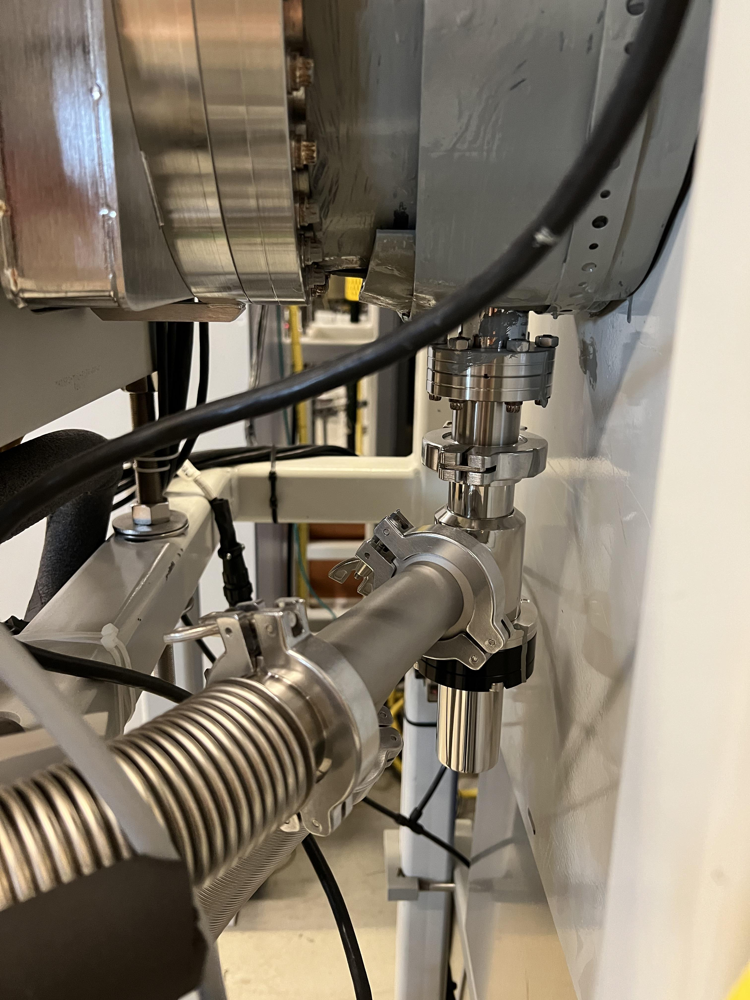

   This pneumatic valve upstream of each Wien filter's turbo pump should only be used when you are roughing out the Wien filter chamber.

.. _WF_vent_valve:
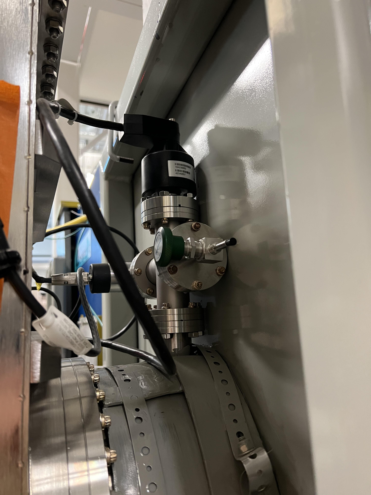

   The valve with a green handle and a rubber cork in it is the vent valve.

.. _shutdown_turbo:

How to Shut Down Wien Filter Turbo Pumps
~~~~~~~~~~~~~~~~~~~~~~~~~~~~~~~~~~~~~~~~

To turn OFF a Wien filter turbo pump:

- Make sure the Wien filter's high voltage is turned OFF. This assumes that you are a Wien filter operator, in which case, you should know how to do this. **If you are not a Wien filter operator, ask SECAR device physicist, Fernando Montes or Ken Schrock to do this step.**
- Make sure the turbo gate valve is closed:

    - :code:`SCR_BTS35:TGV_D1612` for Wien filter 1.
    - :code:`SCR_BTS35:TGV_D1709` for Wien filter 2.
- Turn OFF the cold cathode gauge only if the cryopump is not going to be pumping on the system. If this is not the case, you can leave the cryo gate valve open and leave the cold cathode gauge ON.
- The roughing pump of the Wien filter should be ON (see :numref:`WF_rough`). The operation of this pump is manual.
- The manual valve used for leak checking (the valve that is closed in :numref:`WF_rough`) should be closed while the other two valves shown in the aforementioned photo should be open.
- The pneumatic valve shown in :numref:`RV` should be closed:
    
    - :code:`SCR_BTS35:RV_D1612` for Wien filter 1.
    - :code:`SCR_BTS35:RV_D1709` for Wien filter 2.
- Open the following CS-Studio page:

    - Go to :code:`WF` tab under "SECAR Global Controls" page. 
    - Click on the :code:`Eswards Pumps` button.
    - If the desired turbo is for Wien filter 1, click on the :code:`SCR_BTS35:TMP_D1612` button (see :numref:`WF_turbo_css`).
    - If the desired turbo is for Wien filter 2, click on the :code:`SCR_BTS35:TMP_D1709` button.
- Click on the red :code:`STOP` button.
- Monitor the turbo pump's measured speed. When it is at 0 rpm, the turbo pump is fully OFF.
- Only then, you can close both manual valves that are displayed as open in :numref:`WF_rough`.
- Once the above step is done, turn the roughing pump, that is backing up the turbo pump, OFF if you need to.

.. warning::

   - I think it is best to not leave the turbo pump of a Wien filter OFF for a long time when only the cryopump is pumping on it. The cryopumps are rather small and the chambers may be too big for these pumps to pump alone.

.. _WF_turbo_css:
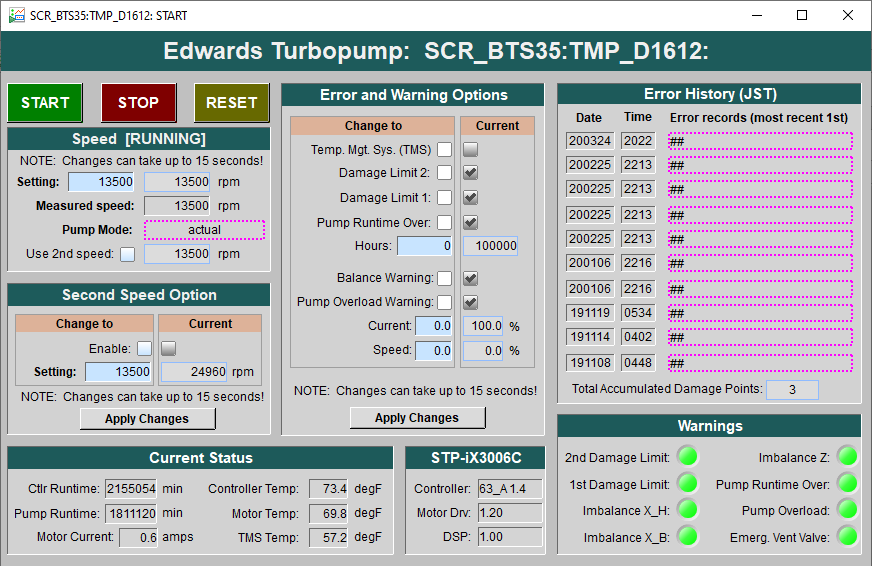

   This CS-Studio page lets you turn ON/OFF the Wien filters turbo pumps. All the warnings indicators will turn red if the pump's measured speed drops below about 12000 rpm or so.

Pumping Down Wien Filter Chambers
~~~~~~~~~~~~~~~~~~~~~~~~~~~~~~~~~

If a Wien filter chamber is vented and has to be pumped down, do the following:

- Make sure the cooling water for the Wien filter turbo pump is up and running and there are no faults there. This can be verified from the bottom of the :code:`Vac. by Type` tab on the "SECAR Global Controls Page" of CS-Studio shown in :numref:`WF-water`.
- Close the vent valve (see :numref:`WF_vent_valve`) and insert its provided rubber cork into the vent valve's tube.
- The turbo pump should be OFF and its gate valve should be closed.
- The cryopump may or may not be ON but its gate valve should be closed.
- Ensure the scroll pump is ON. The operation of this pump is manual.
- Open the two manual valves that are open in the :numref:`WF_rough` photo: open the one that is on the foreline of the turbo pump first, then slowly open the roughing valve right on the scroll pump. The manual valve used for leak checking has to be kept closed.
- Make sure the foreline pressure visible on the foreline gauge is going down.
- Using the :code:`GVs` tab on the CS-Studio "SECAR Global Controls" page, open the pneumatic valve upstream of the Wien filter's turbo pump shown in :numref:`RV`.
- You are now pumping on the chamber.
- Monitor the Pirani gauge and the foreline gauges (only accessible locally) and ensure the pressures in the chamber and the foreline are going down:
    
    - :code:`SCR_BTS35:PG_D1612` for Wien filter 1.
    - :code:`SCR_BTS35:PG_D1709` for Wien filter 2.
- Let the pressure shown by the Pirani gauge get to 40 - 45 mTorr.
- When the pressure in the chamber measured by the Pirani gauge is around 45 mTorr:

    - Close the pneumatic roughing valve shown in :numref:`RV`. Now, the chamber is isolated from all the pumps. Hopefully, the pressure rise is not going to be more than 5 mTorr before executing the next step, which should ideally take something like 10 minutes. If there is a leak and the pressure rose to above 50 mTorr, you cannot do the next step, so either open the pneumatic valve again and let the pressure go down even more before turning the turbo pump ON, or leak check the system and fix the issue. Make sure the pneumatic roughing valve is closed, before doing the next step.
    - Start the turbo pump of the Wien filter. To do this:

        - Open the :code:`WF` tab under "SECAR Global Controls" page. 
        - Click on the :code:`Eswards Pumps` button.
        - If the desired turbo is for Wien filter 1, click on the :code:`SCR_BTS35:TMP_D1612` button (see :numref:`WF_turbo_css`).
        - If the desired turbo is for Wien filter 2, click on the :code:`SCR_BTS35:TMP_D1709` button.
        - Click on the :code:`RESET` button.
        - Click on the green :code:`START` button.
        - Monitor the turbo pump's measured speed. When it is at 13500 rpm, the turbo pump is fully ON and at speed. The warning indicators will turn green (no fault) when the speed is around 12000 rpm or so.
- Once the turbo pump is up and running at full speed, then you can open the turbo gate valve (using the :code:`GVs` tab of the CS-Studio "SECAR Global Controls" page) only if:

    - The turbo pump has no fault.
    - The turbo pump has to be at its full speed.
    - The pneumatic rough valve shown in :numref:`RV` has to be closed.
    - The pressure in the Wien filter chamber read by the Pirani gauge should be 50 mTorr or below.
    - Using the probe functionality of the CS-Studio (maybe by the time you are reading this, Dan Crisp has implemented this already), send a new value of 1 to this PV: :code:`SCR_BTS35:TGV_D1612:BYP_CMD` (for Wien filter 1) and :code:`SCR_BTS35:TMP_D1709:BYP_CMD` (for Wien filter 2). This will bypass the interlock present on the cold cathode gauge of the Wien filter chamber momentarily (until you turn OFF the bypass) so that you can open the turbo gate valve.
- If all the above conditions are met, open the turbo gate valve by bypassing the interlock on the cold cathode gauge. 
- Once the turbo gate valve is open:

    - Reset the cold cathode gauge.
    - Turn ON the cold cathode gauge.
    - Turn off the turbo gate valve bypass by commanding a new value of 0 to this PV: :code:`SCR_BTS35:TGV_D1612:BYP_CMD` (for Wien filter 1) and :code:`SCR_BTS35:TMP_D1709:BYP_CMD` (for Wien filter 2), which ever is being done.
- Monitor the cold cathode gauge and ensure the pressure is coming down.
- If the cryopump is already ON:

    - Open the cryo gate valve, which can only be accomplished if:

        - The Pirani gauge on the Wien filter chamber is reading below 50 mTorr.
        - The cold cathode gauge on the Wien filter chamber is reading below :math:`1\times10^{-6}` Torr.
        - The cryo cold head is ON.
        - The pneumatic roughing valve shown in :numref:`RV` is closed.
- If the cryopump is OFF, regenerate the pump (see :numref:`regeneration`). Once the regeneration is complete and the cold head of the cryopump is ON and running at 14 - 15 K, open the cryo gate valve only if the 4 conditions mentioned above are met.

.. note::

   The vacuum of the Wien filters is a bit weird. Originally, it had a flaw and this flaw unfortunately remained to be the case even though neither Brandon and his team, nor me liked the way it was set up but we did not get the time to correct this. Maybe this improvment can be done in the future. In any case, the problem is, according to the current interlocks, the Wien filter's turbo pump has to be up and running at full speed and the pneumatic valve shown in :numref:`RV` has to be closed before one can open the turbo gate valve. This is the flaw of these systems because:

    - The chambers are huge and it is not a good practice to open the turbo gate valve to a huge chamber like this when the turbo is already at full speed. This increases the load on the turbo pump suddenly. A better alternative would be to enable the gate valve to the turbo pump to be opened when the turbo's speed is coming up gradually.
    - There is a short time between closing the pneumatic rough valve and turning ON the turbo pump when the chamber is isolated and not being pumped ON.

.. _WF-water:
.. figure:: Figures/WF-water.PNG
   :width: 80 %

   These controls are located in the buttom of the :code:`Vac. by Type` tab of the "SECAR Global Controls" page of CS-Studio. They let you turn ON/OFF and reset the water solenoid valves for the Wien filters turbo pumps. **The solenoid valve of Wien filter 2 is either wired backward or swapped in CS-Studio such that 0 means it is ON and 1 means it is OFF. The solenoid valves need to always be ON, which means Wien filter 1 solenoid should show 1 and Wien filter 2 solenoid should show 0.** I have asked Dan Crisp to take a look at this and correct it if it is a mistake in the EPICS or CS-Studio. The flow of the water has always been about 1.9 Gallons Per Minute (GPM) for Wien filter 1 and about 2.3 GPM for Wien filter 2. You can check the status of the solenoid valves and that of the water lines and their flow by looking at what is shown in :numref:`WF-waterline`, which are located near each Wien filter and above the beamline. While Wien filter 1 has cooling water for both the turbo pump and its Temperature Management System (TMS), the cooling water to the turbo pump (but not to TMS) of Wien filter 2 has been disconnected because of excessive condensation that has happened in the past, which was being problematic to its TMS. This is why, the motor temperature and the TMS temperature for Wien filter 2 are always higher than those in Wien filter 1.

.. _WF-waterline:
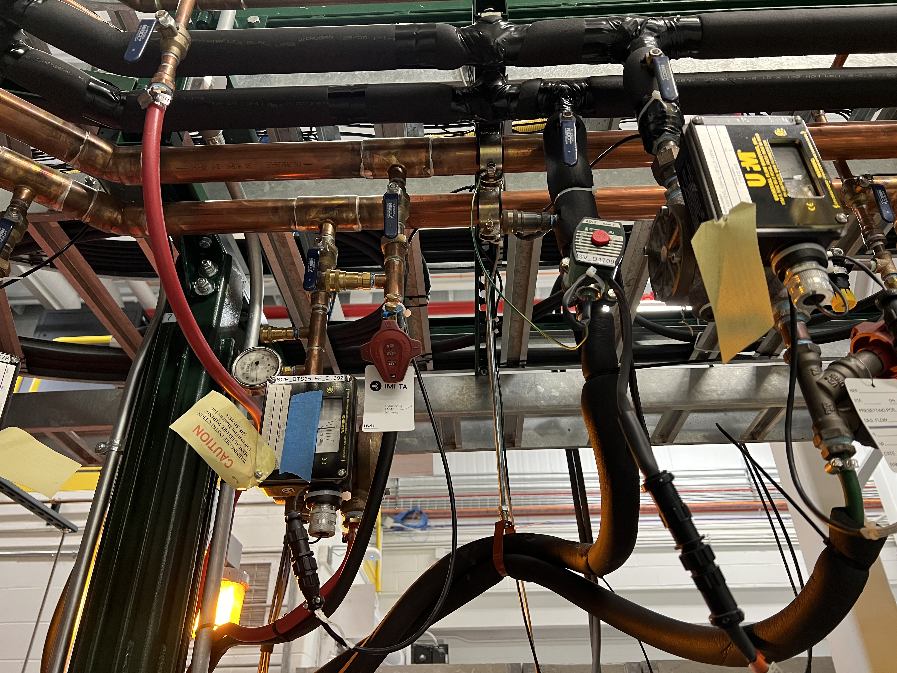

   The solenoid valve for the cooling water used with Wien filter turbo pumps is labelled as :code:`SV_D1709`. The other big monitors show the flow of the water. Those valves with blue handle should be open to let the water flow. 

.. _WF_interlocks:

Vacuum Interlocks for the Wien Filters
~~~~~~~~~~~~~~~~~~~~~~~~~~~~~~~~~~~~~~

The interlocks on the turbo pumps gate valves are as follows:

- To be able to open a Wien filter turbo gate valve:

    - Turbo pump should be ON AND running at full speed.
    - There should be no fault with the turbo pump (the faults are the warnings that may be ON visible from the CS-Studio page showing the Edwards turbo pumps for the Wien filters.
    - The pneumatic roughing valves to the chambers need to be closed (see :numref:`RV`).
    - The pressure shown by the Pirani gauges on the Wien filter chambers have to be at 50 mTorr or below.
    - The interlocks on the cold cathode gauges (set to :math:`1\times10^{-6}` Torr) have to be pypassed. To do this:

        - Send a 1 command to the following PVs to enable the bypass: :code:`SCR_BTS35:TGV_D1612:BYP_CMD` (for Wien filter 1) and :code:`SCR_BTS35:TMP_D1709:BYP_CMD` (for Wien filter 2),
        - **Please do not forget to send a 0 command to the above PVs to disable the bypass only after the turbo gate valve is opened AND the cold cathode gauges are turned ON AND if the pressure shown by the cold cathode gauge is below its interlock threshold.**

The interlocks on the cryopumps gate valves are as follows:

- To be able to open a cryo gate valve for a Wien filter:

    - The pressure measured by the Pirani gauge should be 50 mTorr or lower.
    - The high vauum pressure measured by the cold cathode gauge should be below the set points mentioned above.
    - The pneumatic roughing valves to the chambers need to be closed (see :numref:`RV`).
    - The cold heads have to be ON. This is indicated as :code:`CRYO ON 14 K` on the display of the cryopump's control (:numref:`on-board`). These interlock signals are set as follows in the PLC logic:

        - The cold head of the first Wien filter is wired to relay 2 of the On-Board system corresponding to Wien filter 1.
        - The cold head of the second Wien filter is wired to relay 1 of the On-Board system corresponding to Wien filter 2.

The interlocks on the high voltage:

- Before one can turn on the high voltage for each Wien filter, the following vacuum conditions have to be met, or else the HV will be interlocked and disabled:

    - The pressure in the chamber must be below :math:`1\times10^{-6}` Torr. If the pressure rises above this limit, the PLC will disable the HV 0.5 second after the pressure rises above the threshold.
    - If the pressure rises above :math:`5\times10^{-7}` Torr and stays like that for 3 seconds, then the HV will be also disablled. 
    - To enable the HV if these events occur:

        - Reset the cold cathode gauges of each Wien filter (:code:`SCR_BTS35:CCG_D1612` for Wien filter 1 and :code:`SCR_BTS35:CCG_D1709` for Wien filter 2) when the pressure in the chambers is below :math:`5\times10^{-7}` Torr. You should see the green indicators like what is shown in :numref:`WF_reset_CCGs`.

.. _WF_reset_CCGs:
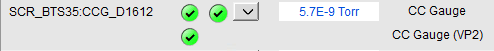

   The PVs shown in this image should be both green before one can enable the HV of Wien filter 1. Similar PVs exist for Wien filter 2. Reset the Wien filter cold cathode gauges when the pressure is below :math:`5\times10^{-7}` Torr to be able to apply HV to the Wien filters. The PV shown on the second line refers to whether or not the chamber pressure is below :math:`5\times10^{-7}` Torr. This PV also shows up on the :code:`SECAR_Layout.opi` page together with the readback of each cold cathode gauge on the Wien filters. 

.. [1] Note that if you have to turn it immediately back ON for whatever reason, you need to press 1 before the pump warms up. If it warms up above 65K, which is the temperature for the first stage, I would recommend to let it warm up all the way and then regenerate it (see :numref:`regeneration`) if you have to turn it back ON.
